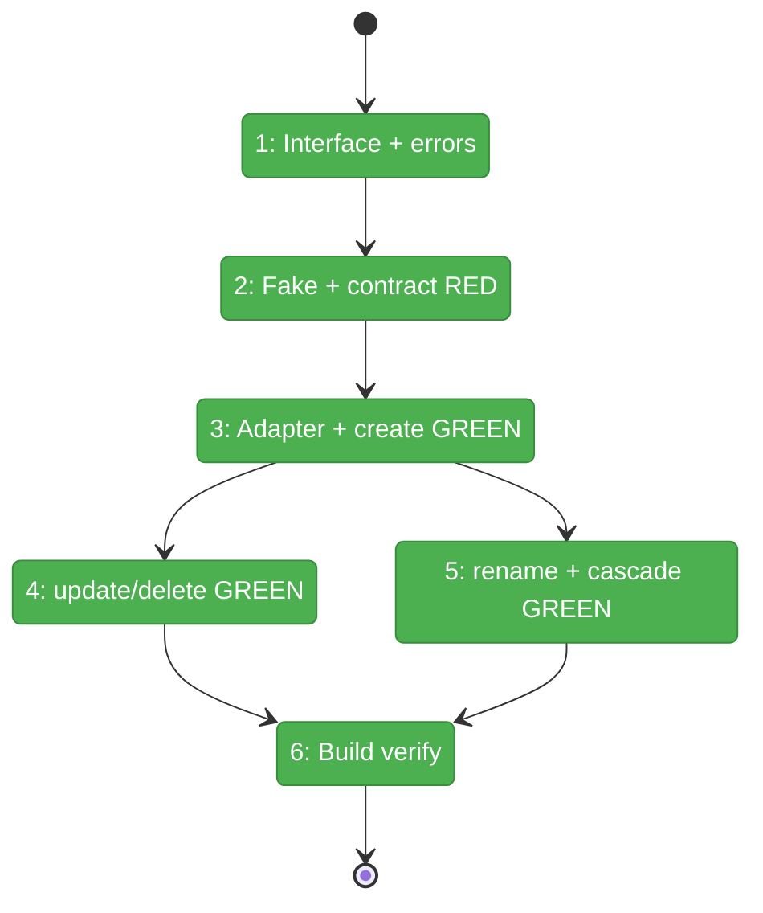
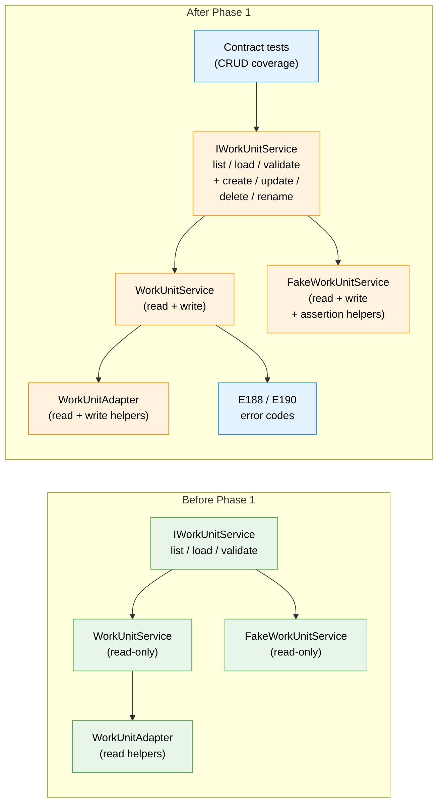

# Flight Plan: Phase 1 — Service Layer

**Plan**: [workunit-editor-plan.md](../../workunit-editor-plan.md)
**Phase**: Phase 1: Service Layer — Extend IWorkUnitService with CRUD
**Generated**: 2026-02-28
**Status**: Ready for takeoff

---

## Departure → Destination

**Where we are**: `IWorkUnitService` is read-only — it has `list()`, `load()`, `validate()` but no write operations. Work units can only be created via CLI (`cg unit create` using the deprecated workgraph package) or manual YAML editing. The `FakeWorkUnitService` and contract tests only cover read operations.

**Where we're going**: A developer can call `workUnitService.create()`, `.update()`, `.delete()`, and `.rename()` from any consumer (web, CLI, tests). The fake matches exactly. Contract tests prove parity. Rename cascades to update all `unit_slug` references in workflow node.yaml files. This unlocks Phase 2 (editor UI) and Phase 4 (server actions).

---

## Domain Context

### Domains We're Changing

| Domain | What Changes | Key Files |
|--------|-------------|-----------|
| `_platform/positional-graph` | Extend IWorkUnitService with 4 CRUD methods + result types + error codes. Update WorkUnitService, FakeWorkUnitService, WorkUnitAdapter. | `workunit-service.interface.ts`, `workunit.service.ts`, `fake-workunit.service.ts`, `workunit-errors.ts`, `workunit.adapter.ts` |

### Domains We Depend On (no changes)

| Domain | What We Consume | Contract |
|--------|----------------|----------|
| `_platform/file-ops` | Filesystem operations (read, write, mkdir, rmdir, rename) | `IFileSystem`, `IPathResolver` |

---

## Flight Status

<!-- Updated by /plan-6-v2: pending → active → done. -->

**Legend**: grey = pending | yellow = active | red = blocked/needs input | green = done

---

## Stages

<!-- Updated by /plan-6-v2 during implementation: [ ] → [~] → [x] -->

- [x] **Stage 1: Define the contract** — Extend interface with 4 method signatures + result types + error codes (`workunit-service.interface.ts`, `workunit-errors.ts`)
- [x] **Stage 2: Build the test scaffold** — Update fake with write ops + assertion helpers, write contract tests RED (`fake-workunit.service.ts`, `workunit-service.contract.ts`)
- [x] **Stage 3: Implement create** — Adapter write helpers + create() with boilerplate scaffolding (`workunit.adapter.ts`, `workunit.service.ts`)
- [x] **Stage 4: Implement update + delete** — Partial patch merge + hard delete (`workunit.service.ts`)
- [x] **Stage 5: Implement rename + cascade** — Directory rename + node.yaml rewrite across all workflows (`workunit.service.ts`)
- [x] **Stage 6: Build verification** — Full rebuild + test suite pass

---

## Architecture: Before & After

**Legend**: existing (green, unchanged) | changed (orange, modified) | new (blue, created)

---

## Acceptance Criteria

- [ ] AC-1: Create unit with type/slug/description
- [ ] AC-2: Scaffold with boilerplate content
- [ ] AC-3: Duplicate slug rejected
- [ ] AC-5: Edit description and version
- [ ] AC-10: Add/edit/reorder/remove inputs (service layer)
- [ ] AC-11: Add/edit/reorder/remove outputs (service layer)
- [ ] AC-12: Input name validation (service layer)
- [ ] AC-13: data_type conditional (service layer)
- [ ] AC-14: Reserved params handling (service layer)
- [ ] AC-15: At least one output enforced (service layer)
- [ ] AC-16: Delete unit
- [ ] AC-17: Deletion removes directory
- [ ] AC-18: Rename unit
- [ ] AC-19: Rename auto-updates node.yaml references
- [ ] AC-20: Rename shows affected workflows summary
- [ ] AC-27: All mutations through IWorkUnitService
- [ ] AC-28: FakeWorkUnitService updated
- [ ] AC-29: Contract tests pass

## Goals & Non-Goals

**Goals**: Extend IWorkUnitService with full CRUD, update fake, prove parity with contract tests.

**Non-Goals**: No UI, no server actions, no file watcher, no workgraph changes, no CLI changes.

---

## Checklist

- [x] T001: Extend IWorkUnitService interface with 4 method signatures + result types
- [x] T002: Add error codes E188, E190
- [x] T003: Update FakeWorkUnitService with write operations + assertion helpers
- [x] T004: Write contract tests for all CRUD operations (RED)
- [x] T005: Add write helpers to WorkUnitAdapter
- [x] T006: Implement create() (GREEN)
- [x] T007: Implement update() (GREEN)
- [x] T008: Implement delete() (GREEN)
- [x] T009: Implement rename() with cascade (GREEN)
- [x] T010: Build verification
