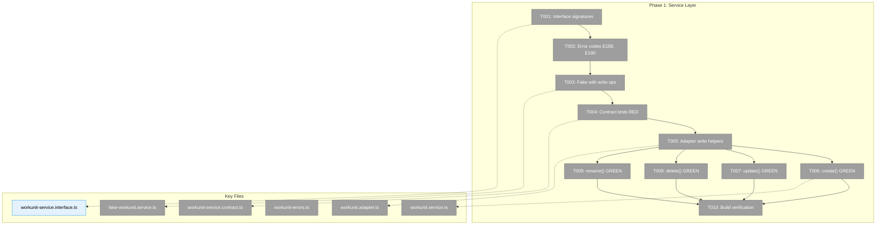
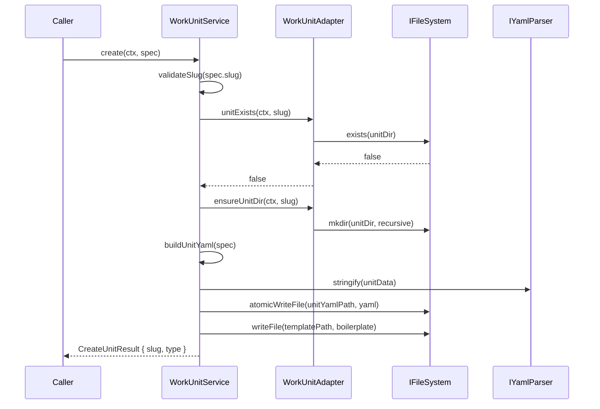
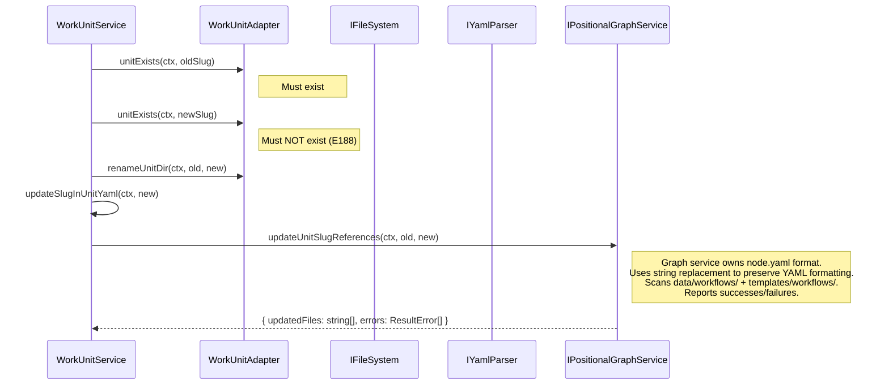

# Phase 1: Service Layer — Extend IWorkUnitService with CRUD

## Executive Briefing

**Purpose**: Extend the read-only `IWorkUnitService` with create, update, delete, and rename operations, following full TDD with contract tests ensuring fake/real parity. This is the foundation that all subsequent phases depend on.

**What We're Building**: Four new service methods (`create`, `update`, `delete`, `rename`) on the existing `IWorkUnitService` interface in the `_platform/positional-graph` domain. The fake and contract tests are built first (RED), then implementations go GREEN.

**Goals**:
- ✅ `IWorkUnitService.create()` scaffolds unit directory + unit.yaml + boilerplate template files
- ✅ `IWorkUnitService.update()` patches metadata, inputs, outputs, type-specific config
- ✅ `IWorkUnitService.delete()` removes unit directory (hard delete, idempotent)
- ✅ `IWorkUnitService.rename()` renames directory, updates slug, cascades to node.yaml files
- ✅ `FakeWorkUnitService` matches extended interface with call capture + assertion helpers
- ✅ Contract tests verify fake/real behavioral parity for all CRUD operations

**Non-Goals**:
- ❌ No UI work (Phase 2)
- ❌ No server actions (Phase 2)
- ❌ No file watcher / eventing (Phase 4)
- ❌ No changes to workgraph package (deprecated)
- ❌ No changes to CLI `cg unit` commands (separate migration)

---

## Pre-Implementation Check

| File | Exists? | Domain | Notes |
|------|---------|--------|-------|
| `packages/positional-graph/.../workunit-service.interface.ts` | ✅ (134 lines) | `_platform/positional-graph` | 3 read-only methods. Extend with 4 write methods + result types. |
| `packages/positional-graph/.../workunit.service.ts` | ✅ (192 lines) | `_platform/positional-graph` | Implements read-only. Add create/update/delete/rename. Has `loadInternal()` reusable for read-before-write. |
| `packages/positional-graph/.../fake-workunit.service.ts` | ✅ (351 lines) | `_platform/positional-graph` | Full test double. Has in-memory units map, call tracking, error injection. Extend with 4 write methods. |
| `packages/positional-graph/.../workunit-errors.ts` | ✅ (161 lines) | `_platform/positional-graph` | 8 error codes (E180-E187). Add E188 (slug exists), E190 (delete failed). |
| `packages/positional-graph/.../workunit.adapter.ts` | ✅ (174 lines) | `_platform/positional-graph` | Has getUnitDir, getUnitYamlPath, listUnitSlugs, unitExists, validateSlug. Add ensureUnitDir, removeUnitDir, renameUnitDir. |
| `packages/positional-graph/.../workunit.schema.ts` | ✅ (262 lines) | `_platform/positional-graph` | Zod source-of-truth (ADR-0003). WorkUnitSchema discriminated union. Read-only — no changes needed. |
| `packages/positional-graph/.../workunit.classes.ts` | ✅ (287 lines) | `_platform/positional-graph` | Rich domain instances with setPrompt/setScript. Read-only — no changes needed. |
| `test/contracts/workunit-service.contract.ts` | ✅ (178 lines) | test | ⚠️ **Drift detected**: Tests expect `create()` + error code `E120` (from workgraph era). Must update to current E180 codes + add new CRUD tests. |
| `test/unit/.../workunit.service.test.ts` | ✅ (large) | test | Existing read-only tests. Add new test suites for create/update/delete/rename. |

**Concept Search Results**:
- `create()` exists in workgraph only (deprecated). Reference `generateUnitYaml()` for scaffold logic. New implementation uses `CreateUnitSpec` object per W004.
- `update()`, `delete()`, `rename()` do NOT exist anywhere. Build from scratch per W004.
- Workshop W004 has complete API contract with signatures, merge semantics, error codes.

---

## Architecture Map



---

## Tasks

| Status | ID | Task | Domain | Path(s) | Done When | Notes |
|--------|-----|------|--------|---------|-----------|-------|
| [x] | T001 | **Extend IWorkUnitService interface** — Add `create(ctx, spec)`, `update(ctx, slug, patch)`, `delete(ctx, slug)`, `rename(ctx, oldSlug, newSlug)` method signatures. Add `CreateUnitSpec`, `UpdateUnitPatch`, `CreateUnitResult`, `UpdateUnitResult`, `DeleteUnitResult`, `RenameUnitResult` types. All types derive from Zod schemas per ADR-0003. | `_platform/positional-graph` | `packages/positional-graph/src/features/029-agentic-work-units/workunit-service.interface.ts` | Interface compiles. Existing `list/load/validate` callers unaffected. Types exported from index.ts. | W004 has complete signatures. `CreateUnitSpec = { slug, type, description?, version? }`. `UpdateUnitPatch` = typed partial per W004 Decision 4. |
| [x] | T002 | **Add error codes E188, E190** — E188: slug already exists (for create duplicate rejection). E190: delete failed. E189 reserved for future concurrency. Add factory functions following existing pattern. | `_platform/positional-graph` | `packages/positional-graph/src/features/029-agentic-work-units/workunit-errors.ts` | Error factories exported. Unit tests for each factory pass. | Follow existing pattern: `workunitSlugExistsError(slug)`, `workunitDeleteFailedError(slug, reason)`. |
| [x] | T003 | **Update FakeWorkUnitService** — Add `create()`, `update()`, `delete()`, `rename()` methods with in-memory storage. Add call tracking arrays (`createCalls`, `updateCalls`, `deleteCalls`, `renameCalls`). Add assertion helpers: `assertCreateCalled(slug?)`, `getCreateCallCount()`, etc. | `_platform/positional-graph` | `packages/positional-graph/src/features/029-agentic-work-units/fake-workunit.service.ts` | Fake implements full IWorkUnitService. All assertion helpers work. `create()` adds to in-memory map. `delete()` removes. `rename()` updates slug key. | Per constitution Principle 2: fake before real. Follow existing call-tracking pattern (line ~270 in current fake). |
| [x] | T004 | **Write contract tests for all CRUD operations (RED)** — Test create (3 types + duplicate rejection), update (metadata + inputs + outputs + type-config), delete (existing + idempotent), rename (dir rename + slug update). Fix existing contract test drift (E120→E180 error codes). Both real and fake must be parameterized. | test | `test/contracts/workunit-service.contract.ts` | Tests fail against current WorkUnitService (no write methods). Tests pass against FakeWorkUnitService. Error codes aligned to E180 series. | Per constitution Principle 3: RED first. Fix existing drift: contract tests expect E120, should be E180. |
| [x] | T005 | **Add write helpers to WorkUnitAdapter + atomicWriteFile** — `ensureUnitDir(ctx, slug)`: create `.chainglass/units/<slug>/` directory. `removeUnitDir(ctx, slug)`: rm -rf the unit directory. `renameUnitDir(ctx, oldSlug, newSlug)`: rename directory. Also: bring `atomicWriteFile` utility into positional-graph (copy from `packages/workgraph/src/services/atomic-file.ts` or add to `@chainglass/shared`). All use IFileSystem abstraction. | `_platform/positional-graph` | `packages/positional-graph/src/features/029-agentic-work-units/workunit.adapter.ts`, `packages/positional-graph/src/services/atomic-file.ts` (new) | Helpers tested with FakeFileSystem. ensureUnitDir creates nested dirs. removeUnitDir is idempotent. renameUnitDir validates both slugs. atomicWriteFile available for all write methods. | Per ADR-0008: extends WorkspaceDataAdapterBase. Per DYK #2: atomicWriteFile only exists in deprecated workgraph — must be brought over. |
| [x] | T006 | **Implement create() (GREEN)** — Validate slug format + uniqueness (E187/E188). Create directory via adapter. Generate `unit.yaml` from CreateUnitSpec using Zod schema. Scaffold type-specific boilerplate: agent→`prompts/main.md` with starter prompt, code→`scripts/main.sh` with shebang + comments, user-input→no template file. Write via `atomicWriteFile`. Return `CreateUnitResult`. | `_platform/positional-graph` | `packages/positional-graph/src/features/029-agentic-work-units/workunit.service.ts` | Contract tests pass for create(). All 3 unit types scaffold correctly. Duplicate slug returns E188. Invalid slug returns E187. | Reference workgraph `generateUnitYaml()` for scaffold logic (lines 299-371). Per clarification Q6: boilerplate content. Per W004 Decision 3. |
| [x] | T007 | **Implement update() (GREEN)** — Load existing unit via `loadInternal()`. Apply partial patch: scalars overwrite, arrays (inputs/outputs) replace wholesale, type-specific config shallow-merges. Re-validate against Zod schema after merge. Write updated unit.yaml via `atomicWriteFile`. Return `UpdateUnitResult`. | `_platform/positional-graph` | `packages/positional-graph/src/features/029-agentic-work-units/workunit.service.ts` | Contract tests pass for update(). Metadata updates persist. Input/output changes persist. Invalid patches rejected by Zod. | Per W004 Decision 4: partial patch semantics. `loadInternal()` (line ~120) provides read-before-write. |
| [x] | T008 | **Implement delete() (GREEN)** — Validate slug. Remove entire unit directory via adapter `removeUnitDir()`. Idempotent: deleting non-existent unit returns `{ deleted: true }` not an error. Return `DeleteUnitResult`. | `_platform/positional-graph` | `packages/positional-graph/src/features/029-agentic-work-units/workunit.service.ts` | Contract tests pass for delete(). Existing unit deleted. Non-existent unit returns success (idempotent). | Per W004 Decision 6: hard delete, idempotent. No cascade check — UI layer handles warnings. |
| [x] | T009 | **Implement rename() (GREEN)** — Validate both slugs. Check newSlug doesn't exist (E188). Rename directory via adapter. Update `slug` field in unit.yaml. **Delegate cascade** to `IPositionalGraphService.updateUnitSlugReferences(ctx, oldSlug, newSlug)` — the graph service owns node.yaml format and should handle rewriting `unit_slug` fields. Use targeted string replacement (not full YAML round-trip) to preserve formatting. The graph service method should report which files were updated and handle partial failure gracefully (report successes/failures in result). Return `RenameUnitResult` with list of affected files. | `_platform/positional-graph` | `packages/positional-graph/src/features/029-agentic-work-units/workunit.service.ts`, `packages/positional-graph/src/services/positional-graph.service.ts` | Contract tests pass for rename(). Directory renamed. unit.yaml slug updated. Cascade delegated to graph service. Affected file list returned. | Per DYK #1: cascade crosses domain boundary — delegate to graph service. Per DYK #4: report partial failures. Per DYK #5: use string replacement to preserve YAML formatting. **Most complex task** — test with doped workflows. |
| [x] | T010 | **Build verification** — Rebuild positional-graph package. Run full test suite. Verify no downstream breaks in web app or CLI. | `_platform/positional-graph` | N/A | `pnpm --filter @chainglass/positional-graph build` passes. `pnpm test` passes. No TypeScript errors in web or CLI. | Per finding 01: workgraph NOT updated (deprecated). |

---

## Context Brief

### Key Findings from Plan

- **Finding 01 (Critical)**: Two `IWorkUnitService` interfaces exist (workgraph + positional-graph). **Action**: Extend positional-graph only. Workgraph is deprecated.
- **Finding 05 (High)**: Rename cascade must scan `node.yaml` files in both `.chainglass/data/workflows/` AND `.chainglass/templates/workflows/`. `graph.yaml` and `state.json` do NOT store unit_slug.
- **Pre-impl drift**: Contract tests (workgraph era) expect `E120` error codes. Current system uses `E180` series. Fix in T004.

### Domain Dependencies

| Domain | Concept | Entry Point | What We Use |
|--------|---------|-------------|-------------|
| `_platform/positional-graph` | Work unit service | `IWorkUnitService` | Extend with CRUD methods |
| `_platform/positional-graph` | Work unit adapter | `WorkUnitAdapter` | Filesystem path resolution + new write helpers |
| `_platform/positional-graph` | Work unit schema | `WorkUnitSchema` (Zod) | Validation for create/update payloads |
| `_platform/file-ops` | Filesystem | `IFileSystem` | Read/write/mkdir/rmdir/rename operations |
| `_platform/file-ops` | Path resolver | `IPathResolver` | Path join/resolve for cascade scan |

### Domain Constraints

- **ADR-0003**: All types derive from Zod schemas via `z.infer<>`. Never define types separately.
- **ADR-0008**: `WorkUnitAdapter` extends `WorkspaceDataAdapterBase`. Overrides `getDomainPath()` for `.chainglass/units/` (not `.chainglass/data/units/`).
- **R-ARCH-001**: Services depend on interfaces, not concrete adapters. WorkUnitService depends on IFileSystem, IPathResolver, IYamlParser.
- **Constitution Principle 2**: Interface → Fake → Tests → Real (T001 → T003 → T004 → T005-T009).
- **Constitution Principle 3**: RED-GREEN-REFACTOR. Contract tests written RED (T004) before implementations go GREEN (T006-T009).

### Workshop Decisions Consumed

- **W004 Decision 1**: Extend IWorkUnitService in-place (not separate editor service)
- **W004 Decision 2**: 4 methods: create, update, delete, rename
- **W004 Decision 3**: `CreateUnitSpec = { slug, type, description?, version? }`
- **W004 Decision 4**: Partial patch — scalars overwrite, arrays replace, type-config shallow-merge
- **W004 Decision 5**: Template content stays on domain classes (setPrompt/setScript) — NOT on service
- **W004 Decision 6**: Hard delete, idempotent
- **W004 Decision 8**: Last-write-wins concurrency (no locking)

### Sequence: Create Operation



### Sequence: Rename Cascade



---

## Discoveries & Learnings

_From DYK session 2026-02-28 (pre-implementation). Updated during implementation by plan-6._

| Date | Task | Type | Discovery | Resolution | References |
|------|------|------|-----------|------------|------------|
| 2026-02-28 | T009 | architecture | **DYK #1**: Rename cascade crosses domain boundary — WorkUnitService shouldn't read/write workflow node.yaml files directly. | Delegate cascade to `IPositionalGraphService.updateUnitSlugReferences()` which owns the node schema. | R-ARCH-001, ADR-0008 |
| 2026-02-28 | T005-T009 | blocker | **DYK #2**: `atomicWriteFile` only exists in deprecated workgraph package. Positional-graph has no equivalent. | Add atomicWriteFile to positional-graph (or shared) as part of T005. | `packages/workgraph/src/services/atomic-file.ts` |
| 2026-02-28 | T009 | risk | **DYK #4**: Rename cascade has no transaction semantics. Partial failure (some node.yaml updated, some not) = inconsistent state. | Graph service method reports successes/failures. RenameUnitResult includes error list. | W004 |
| 2026-02-28 | T009 | risk | **DYK #5**: YAML round-trip may alter formatting (field order, indentation, comments). Silent data corruption for git diffs. | Use targeted string replacement (`unit_slug: old` → `unit_slug: new`) instead of full parse-modify-serialize. | — |

---

## Directory Layout

```
docs/plans/058-workunit-editor/
  ├── workunit-editor-plan.md
  ├── workunit-editor-spec.md
  ├── research-dossier.md
  ├── workshops/
  │   ├── 001-sync-model-and-out-of-sync-indicators.md
  │   ├── 002-editor-ux-flow-navigation.md
  │   ├── 003-code-prompt-editor-component-selection.md
  │   ├── 004-iworkunitservice-write-extension-design.md
  │   └── 005-inputs-outputs-configuration-ux.md
  └── tasks/phase-1-service-layer/
      ├── tasks.md
      ├── tasks.fltplan.md          # Flight plan
      └── execution.log.md          # Created by plan-6
```
