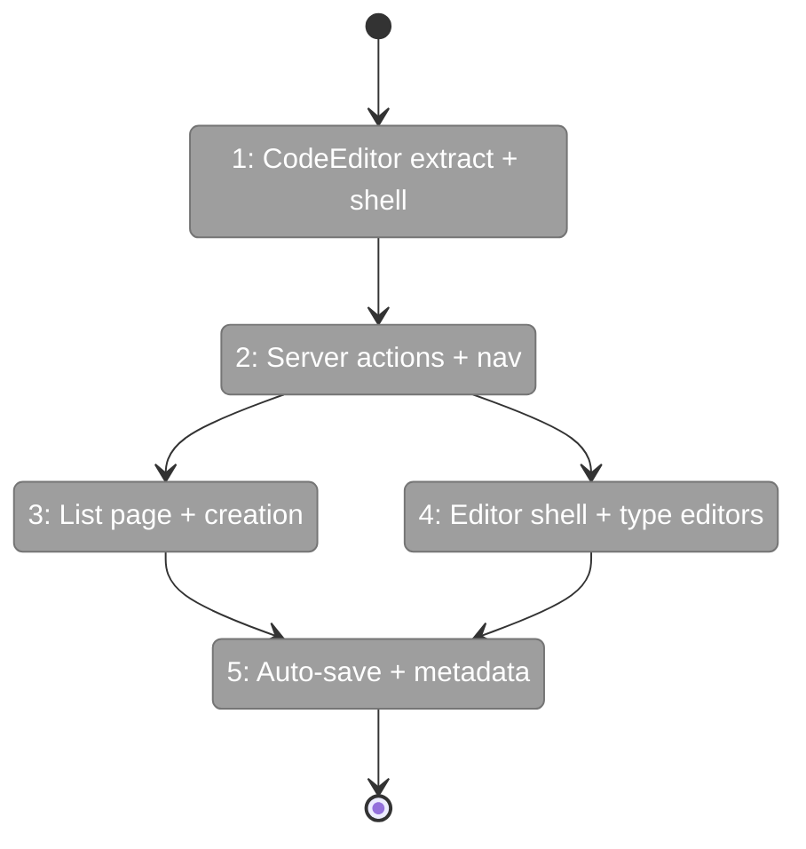
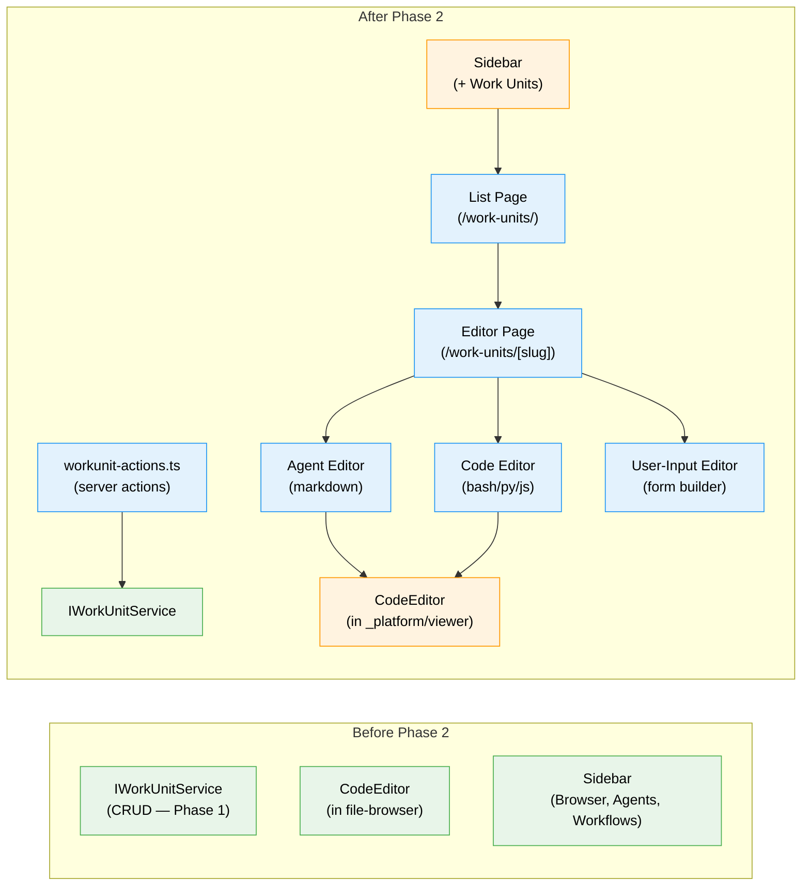

# Flight Plan: Phase 2 — Editor Page

**Plan**: [workunit-editor-plan.md](../../workunit-editor-plan.md)
**Phase**: Phase 2: Editor Page — Routes, Layout, Type-Specific Editors
**Generated**: 2026-02-28
**Status**: Ready for takeoff

---

## Departure → Destination

**Where we are**: Phase 1 delivered `IWorkUnitService` with full CRUD (create/update/delete/rename), 42 contract tests, and the fake. But there's no UI — no pages, no editor, no sidebar entry. Users can only interact with units via CLI or tests.

**Where we're going**: A user opens `/workspaces/[slug]/work-units/` from the sidebar, sees all units grouped by type, creates a new agent unit, and edits its prompt in a CodeMirror editor that auto-saves. They can also edit code scripts (with bash highlighting) and configure user-input questions. The feature is visible and functional.

---

## Domain Context

### Domains We're Changing

| Domain | What Changes | Key Files |
|--------|-------------|-----------|
| `_platform/viewer` | New: Extract CodeEditor from file-browser, add shell language support | `_platform/viewer/components/code-editor.tsx` |
| `file-browser` | Re-export CodeEditor from new location (backward compat) | `041-file-browser/components/code-editor.tsx` |
| `058-workunit-editor` | New: Feature folder with editor components, server actions, pages | `features/058-workunit-editor/`, `actions/workunit-actions.ts`, routes |
| cross-domain | Add "Work Units" to sidebar nav | `navigation-utils.ts` |

### Domains We Depend On (no changes)

| Domain | What We Consume | Contract |
|--------|----------------|----------|
| `_platform/positional-graph` | Work unit CRUD | `IWorkUnitService` (Phase 1) |
| `_platform/panel-layout` | Page layout | `PanelShell` |
| `_platform/workspace-url` | URL construction | `workspaceHref()` |

---

## Flight Status

<!-- Updated by /plan-6-v2: pending → active → done. -->

**Legend**: grey = pending | yellow = active | red = blocked/needs input | green = done

---

## Stages

- [ ] **Stage 1: Infrastructure** — Extract CodeEditor, install lang-shell, verify no breakage (`code-editor.tsx`, `package.json`)
- [ ] **Stage 2: Wiring** — Create server actions + sidebar navigation entry (`workunit-actions.ts`, `navigation-utils.ts`)
- [ ] **Stage 3: List page** — Unit catalog page + creation modal (`/work-units/page.tsx`, `unit-list.tsx`, `unit-creation-modal.tsx`)
- [ ] **Stage 4: Editor page** — Editor shell + 3 type-specific editors (`/work-units/[unitSlug]/page.tsx`, `agent-editor.tsx`, `code-unit-editor.tsx`, `user-input-editor.tsx`)
- [ ] **Stage 5: Polish** — Auto-save wiring, metadata panel, save indicators (`metadata-panel.tsx`)

---

## Architecture: Before & After

**Legend**: existing (green, unchanged) | changed (orange, modified) | new (blue, created)

---

## Acceptance Criteria

- [ ] AC-4: New unit appears in catalog without page refresh
- [ ] AC-6: Metadata auto-save to disk
- [ ] AC-7: Agent prompt editing with markdown highlighting
- [ ] AC-8: Code script editing with language detection
- [ ] AC-9: User-input configuration (question type, options)
- [ ] AC-21: Sidebar navigation entry (before Workflows)

## Goals & Non-Goals

**Goals**: Visible, functional editor UI. List + edit + create units. CodeMirror for agent/code. Form builder for user-input. Auto-save. Sidebar nav.

**Non-Goals**: No inputs/outputs UI (Phase 3). No file watcher/notifications (Phase 4). No "Edit Template" button (Phase 4).

---

## Checklist

- [ ] T001: Extract CodeEditor to _platform/viewer
- [ ] T002: Install @codemirror/lang-shell
- [ ] T003: Create server actions (workunit-actions.ts)
- [ ] T004: Add sidebar navigation
- [ ] T005: Create list page
- [ ] T006: Create editor page shell
- [ ] T007: Build agent editor (markdown)
- [ ] T008: Build code editor (language detection)
- [ ] T009: Build user-input editor (form)
- [ ] T010: Unit creation flow (modal)
- [ ] T011: Metadata editing panel
