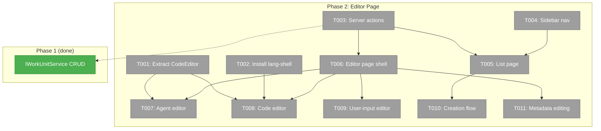
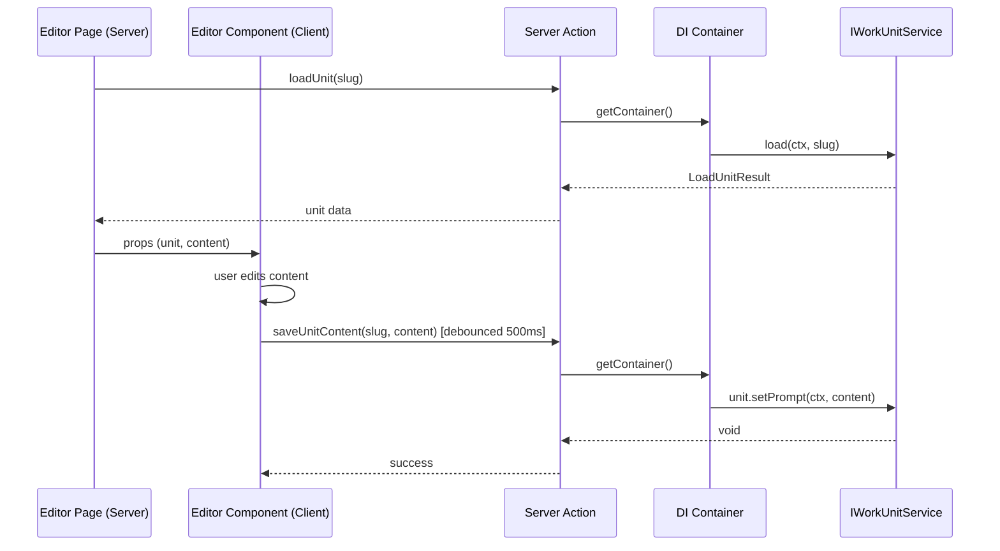

# Phase 2: Editor Page — Routes, Layout, Type-Specific Editors

## Executive Briefing

**Purpose**: Build the visible work unit editor UI — list page, editor page with type-specific content editors, server actions wiring Phase 1's service to the web app, and sidebar navigation. This is where the feature becomes usable.

**What We're Building**: Two new pages (`/work-units/` list + `/work-units/[unitSlug]/` editor), a feature folder (`058-workunit-editor/`), server actions calling `IWorkUnitService` CRUD methods, and a shared `CodeEditor` component extracted from file-browser. Agent units get a markdown prompt editor, code units get a script editor with language detection, user-input units get a form builder.

**Goals**:
- ✅ Users can browse all work units on a list page
- ✅ Users can create new units (type picker + naming modal)
- ✅ Users can edit agent prompts with CodeMirror (markdown)
- ✅ Users can edit code scripts with CodeMirror (language detection + bash support)
- ✅ Users can configure user-input questions (type, prompt, options)
- ✅ Changes auto-save to disk (500ms debounce for content, immediate for metadata)
- ✅ "Work Units" appears in workspace sidebar before "Workflows"

**Non-Goals**:
- ❌ No inputs/outputs configuration UI (Phase 3)
- ❌ No file watcher / change notifications (Phase 4)
- ❌ No "Edit Template" button on workflow canvas (Phase 4)
- ❌ No undo/redo for structural changes
- ❌ No cross-page drag-and-drop

---

## Prior Phase Context

### Phase 1: Service Layer (✅ Complete)

**A. Deliverables**: Extended `IWorkUnitService` with `create()`, `update()`, `delete()`, `rename()`. Updated `FakeWorkUnitService`, `WorkUnitAdapter` write helpers, error codes E188/E190. 42 contract tests passing.

**B. Dependencies Exported**: `IWorkUnitService` full CRUD interface, `CreateUnitSpec`, `UpdateUnitPatch`, `CreateUnitResult`, `UpdateUnitResult`, `DeleteUnitResult`, `RenameUnitResult`, `WorkUnitSummary`, `LoadUnitResult`. All exported from `@chainglass/positional-graph`.

**C. Gotchas & Debt**: Rename cascade implemented inline (not delegated to graph service per DYK #1). Partial failure on rename returns errors but no rollback. Type-specific boilerplate hardcoded in service.

**D. Incomplete Items**: None — all 10 tasks complete.

**E. Patterns to Follow**: DI resolution via `getContainer().resolve()`. Server actions pattern from `workflow-actions.ts`. TDD with fakes. Zod-first types (ADR-0003). Auto-save via `atomicWriteFile`. String replacement for YAML (DYK #5).

---

## Pre-Implementation Check

| File | Exists? | Domain | Notes |
|------|---------|--------|-------|
| `apps/web/src/features/041-file-browser/components/code-editor.tsx` | ✅ | `file-browser` | Thin CodeMirror wrapper. Safe to extract — minimal coupling. |
| `apps/web/src/features/_platform/viewer/` | ❌ Create | `_platform/viewer` | Directory doesn't exist. Create for shared CodeEditor. |
| `apps/web/app/actions/workunit-actions.ts` | ❌ Create | `058-workunit-editor` | New file. Follow workflow-actions.ts DI pattern. |
| `apps/web/app/(dashboard)/workspaces/[slug]/work-units/page.tsx` | ❌ Create | `058-workunit-editor` | New route. Server Component. |
| `apps/web/app/(dashboard)/workspaces/[slug]/work-units/[unitSlug]/page.tsx` | ❌ Create | `058-workunit-editor` | New route. Server Component. |
| `apps/web/src/features/058-workunit-editor/` | ❌ Create | `058-workunit-editor` | New feature folder. |
| `apps/web/src/lib/navigation-utils.ts` | ✅ | cross-domain | Has `WORKSPACE_NAV_ITEMS`: Browser, Agents, Workflows. Add "Work Units" before Workflows. |
| `@uiw/react-codemirror` | ✅ v4.25.4 | — | Already installed. |
| `@codemirror/lang-shell` | ❌ Install | — | Need to install for bash highlighting. |
| `PanelShell` | ✅ | `_platform/panel-layout` | Props: explorer, left, main, autoSaveId. Available. |

---

## Architecture Map



---

## Tasks

| Status | ID | Task | Domain | Path(s) | Done When | Notes |
|--------|-----|------|--------|---------|-----------|-------|
| [x] | T001 | **Extract CodeEditor to _platform/viewer** — Move `code-editor.tsx` AND `code-editor.test.tsx` from file-browser to `_platform/viewer/components/`. Update file-browser to re-export from new location. Ensure both consumers compile. | `_platform/viewer` + `file-browser` | `apps/web/src/features/_platform/viewer/components/code-editor.tsx`, `apps/web/src/features/_platform/viewer/components/code-editor.test.tsx`, `apps/web/src/features/041-file-browser/components/code-editor.tsx` | CodeEditor importable from `@/features/_platform/viewer`. File-browser still works (re-export). Tests pass from new location. Build passes. | Per finding 03: thin wrapper, minimal coupling. Create `_platform/viewer/components/` dir + `index.ts` barrel. **DYK #4**: Test file must co-locate with component — update imports in test to canonical path. |
| [x] | T002 | **Install @codemirror/lang-shell** — Add bash/shell language support to CodeEditor's language detection map. Verify no peer dep conflicts. | `_platform/viewer` | `apps/web/package.json`, `apps/web/src/features/_platform/viewer/components/code-editor.tsx` | `import { shell } from '@codemirror/lang-shell'` works. CodeEditor renders `.sh` files with syntax highlighting. | Per finding 06: fallback to plain text if incompatible. Workshop 003 identified this gap. |
| [x] | T003 | **Create server actions** — New `workunit-actions.ts` with: `listUnits`, `loadUnit`, `createUnit`, `updateUnit`, `deleteUnit`, `renameUnit`, `loadUnitContent`, `saveUnitContent`. **Unified save path**: `saveUnitContent(slug, unitType, payload)` routes internally — agent→`setPrompt()`, code→`setScript()`, user-input→`update(type_config)`. Similarly `loadUnitContent` returns unified shape regardless of storage. Follow workflow-actions.ts DI pattern. | `058-workunit-editor` | `apps/web/app/actions/workunit-actions.ts` | All server actions callable from client components. DI resolves IWorkUnitService from container. Type-safe results returned. All 3 unit types use same `saveUnitContent` action. | Use `'use server'` directive. Resolve workspace context same as workflow-actions.ts lines 35-50. **DYK #2**: User-input has no content file — config lives in unit.yaml type_config. Server action abstracts this so editors don't care about storage mechanics. |
| [x] | T004 | **Add sidebar navigation** — Add "Work Units" entry to `WORKSPACE_NAV_ITEMS` in `navigation-utils.ts`. Position before "Workflows". Use appropriate icon. | cross-domain | `apps/web/src/lib/navigation-utils.ts` | "Work Units" appears in workspace sidebar between Agents and Workflows. Links to `/work-units`. | Per clarification Q8 + finding 04. Current order: Browser, Agents, Workflows. New: Browser, Agents, **Work Units**, Workflows. |
| [x] | T005 | **Create list page** — Server Component at `/workspaces/[slug]/work-units/page.tsx`. Calls `listUnits` server action. Renders unit cards grouped by type (agent/code/user-input). Includes "Create Unit" button. Shows unit slug, type, version, description. Click navigates to editor. | `058-workunit-editor` | `apps/web/app/(dashboard)/workspaces/[slug]/work-units/page.tsx`, `apps/web/src/features/058-workunit-editor/components/unit-list.tsx` | Page renders at `/workspaces/[slug]/work-units/`. Units listed. Create button present. Click navigates to `/work-units/[unitSlug]`. | Server Component loads data → passes to Client Component list. Follow workflow list page pattern. |
| [x] | T006 | **Create editor page shell** — Server Component at `/workspaces/[slug]/work-units/[unitSlug]/page.tsx`. Loads unit via `loadUnit` server action. Renders 3-column layout using custom `WorkUnitEditorLayout`: left catalog sidebar, main editor area (type-dispatched), right metadata panel. | `058-workunit-editor` | `apps/web/app/(dashboard)/workspaces/[slug]/work-units/[unitSlug]/page.tsx`, `apps/web/src/features/058-workunit-editor/components/workunit-editor.tsx`, `apps/web/src/features/058-workunit-editor/components/workunit-editor-layout.tsx` | Page renders at `/work-units/[unitSlug]`. Shows unit content in main area. Type-specific editor dispatched. Left sidebar shows unit catalog. Right panel shows metadata. | **DYK #1**: PanelShell has no right panel — create custom `WorkUnitEditorLayout` (follow WorkflowEditorLayout pattern: left sidebar + main flex-1 + right 260px resizable). Server Component loads → Client Component renders editor. |
| [x] | T007 | **Build agent editor + useAutoSave hook** — First build reusable `useAutoSave(saveFn, delay)` hook in `_platform/hooks/` returning `{ status: 'idle'|'saving'|'saved'|'error', error }`. Then build agent editor client component using CodeEditor with `language="markdown"`. Loads content via `loadUnitContent`. Auto-saves via `saveUnitContent` with 500ms debounce. Shows save indicator + persistent inline error banner on failure. | `058-workunit-editor` + `_platform` | `apps/web/src/features/_platform/hooks/use-auto-save.ts`, `apps/web/src/features/058-workunit-editor/components/agent-editor.tsx` | Agent units show markdown editor. Content loads from disk. Edits auto-save after 500ms. Save indicator shows saving/saved/error states. Error shows inline banner (not toast). | **DYK #3**: No auto-save hook exists — build reusable one first. Shared by T008, T009, T011, and Phase 3. **DYK #5**: Save failure shows persistent inline banner, not toast (avoids toast storm on repeated failures). Per W003: reuse CodeEditor. |
| [x] | T008 | **Build code editor** — Client component for editing code scripts. Uses CodeEditor with language detected from script filename (`.sh`→bash, `.py`→python, `.js`→javascript). Uses `useAutoSave` from T007. Same unified `saveUnitContent` action. | `058-workunit-editor` | `apps/web/src/features/058-workunit-editor/components/code-unit-editor.tsx` | Code units show script editor with detected language. Bash gets syntax highlighting (via lang-shell). Auto-save works with save indicator + error banner. | Per W003. Language detection from `code.script` filename extension. Reuses `useAutoSave` hook from T007. |
| [x] | T009 | **Build user-input editor** — Client component with form controls: question_type dropdown (text/single/multi/confirm), prompt textarea, options list builder (for single/multi — min 2 items with key/label/description fields), default value field. Uses `useAutoSave` from T007 with unified `saveUnitContent` action. Mirrors Plan 054 HumanInputModal config structure (same Zod schema: `UserInputConfigSchema` with `.refine()` cross-field validation). | `058-workunit-editor` | `apps/web/src/features/058-workunit-editor/components/user-input-editor.tsx` | User-input units show form builder. Question type selector works. Options section shows/hides based on type. Options list enforces min 2 for single/multi (each with key/label/description). Changes auto-save via unified path. | **DYK #2**: Uses same `saveUnitContent` as agent/code — server action routes to `update(type_config)` internally. Per W002: form controls. Per spec AC-9. Refer to Plan 054 `HumanInputModal` for question type UX patterns. |
| [x] | T010 | **Unit creation flow** — Modal with type picker (agent/code/user-input cards), slug input with kebab-case validation, optional description. Calls `createUnit` server action. On success, navigates to editor page. Accessible from list page "Create" button. | `058-workunit-editor` | `apps/web/src/features/058-workunit-editor/components/unit-creation-modal.tsx` | Create modal opens from list page. Type selection works. Slug validates kebab-case. Duplicate rejected with error. Success navigates to editor. New unit appears in list without page refresh. | Per W002 + clarification Q6 (boilerplate). Follow NamingModal pattern from workflow-ui. |
| [x] | T011 | **Metadata editing** — Right panel section in `WorkUnitEditorLayout` with description textarea and version input. Uses `useAutoSave` from T007 with immediate save (0ms debounce). Shows save indicator + error banner. | `058-workunit-editor` | `apps/web/src/features/058-workunit-editor/components/metadata-panel.tsx` | Description and version editable. Changes persist via updateUnit. Save indicator shows status. Reflected on list page after refresh. | Per spec AC-5, AC-6. Reuses `useAutoSave(saveFn, 0)` for immediate saves. |

---

## Context Brief

### Key Findings from Plan

- **Finding 03 (High)**: CodeEditor in file-browser is a thin standalone wrapper — ready for extraction. No refactoring needed.
- **Finding 04 (High)**: Sidebar navigation in `navigation-utils.ts` via `WORKSPACE_NAV_ITEMS` array. Simple addition.
- **Finding 06 (Medium)**: `@codemirror/lang-shell` needed for bash. Must verify peer dep compatibility with `@uiw/react-codemirror@^4.25.4`.

### Domain Dependencies

| Domain | Concept | Entry Point | What We Use |
|--------|---------|-------------|-------------|
| `_platform/positional-graph` | Work unit CRUD | `IWorkUnitService` (via DI) | create, update, delete, rename, list, load |
| `_platform/positional-graph` | Domain instances | `AgenticWorkUnitInstance.getPrompt()`, `CodeUnitInstance.getScript()` | Load/save template content |
| `_platform/panel-layout` | PanelShell | `PanelShell` component | Editor page 3-panel layout |
| `_platform/workspace-url` | URL helpers | `workspaceHref()` | Navigation between pages |
| `_platform/viewer` | CodeEditor | `CodeEditor` (after extraction) | Prompt + script editing |

### Domain Constraints

- Server actions must use `'use server'` directive and resolve DI via `getContainer()`
- CodeEditor must be a Client Component (`'use client'`)
- Page routes are Server Components — pass data as props to Client Components
- No direct filesystem calls from web — everything through server actions → service layer
- Import from `@chainglass/positional-graph` (not workgraph) for all unit service types

### Reusable from Phase 1

- `IWorkUnitService` with full CRUD — all server actions delegate to this
- `CreateUnitSpec`, `UpdateUnitPatch` types — use directly in server action params
- `FakeWorkUnitService` — for component tests if needed
- Error codes E180 (not found), E188 (slug exists) — map to UI error messages
- Contract test patterns — reference for any new test structure

### Sequence: Load + Edit + Save



---

## Discoveries & Learnings

_Populated during implementation by plan-6._

| Date | Task | Type | Discovery | Resolution | References |
|------|------|------|-----------|------------|------------|
| 2026-02-28 | T006 | decision | PanelShell has no right panel — only explorer + left + main | Custom `WorkUnitEditorLayout` (follows WorkflowEditorLayout pattern) | DYK #1 |
| 2026-02-28 | T003 | decision | User-input units have no content file — config lives in unit.yaml type_config, unlike agent (prompt file) and code (script file) | Unified `saveUnitContent` server action routes internally: agent→setPrompt, code→setScript, user-input→update(type_config) | DYK #2, Plan 054 |
| 2026-02-28 | T007 | insight | Zero auto-save implementations exist in codebase — file browser uses manual Ctrl+S, workflow uses optimistic mutations | Build reusable `useAutoSave` hook in `_platform/hooks/` returning status + error state | DYK #3 |
| 2026-02-28 | T001 | gotcha | `code-editor.test.tsx` must move with component — imports break after extraction | Co-locate test with component in `_platform/viewer/components/` | DYK #4 |
| 2026-02-28 | T007 | decision | Auto-save failure UX undefined — toast storm risk on repeated failures | Persistent inline error banner (not toast), clears on next successful save | DYK #5 |
| 2026-02-28 | T002 | gotcha | `@codemirror/lang-shell` doesn't exist in npm registry | Used `@codemirror/legacy-modes` with `StreamLanguage.define(shell)` instead | Finding 06 fallback |
| 2026-02-28 | T001 | insight | `code-editor.test.tsx` does not exist — DYK #4 was a false alarm | No test to move; only component file extracted | — |
| 2026-02-28 | T003 | gotcha | TypeScript `never` exhaustive check triggers on unreachable code after discriminated union checks | Use `const _exhaustive: never = x` pattern for compile-time exhaustiveness | — |

---

## Directory Layout

```
docs/plans/058-workunit-editor/
  ├── workunit-editor-plan.md
  ├── workunit-editor-spec.md
  ├── research-dossier.md
  ├── workshops/ (5 files)
  ├── reviews/ (3 files)
  ├── tasks/phase-1-service-layer/ (complete)
  │   ├── tasks.md
  │   ├── tasks.fltplan.md
  │   └── execution.log.md
  └── tasks/phase-2-editor-page/
      ├── tasks.md          ← this file
      ├── tasks.fltplan.md
      └── execution.log.md  # created by plan-6
```
