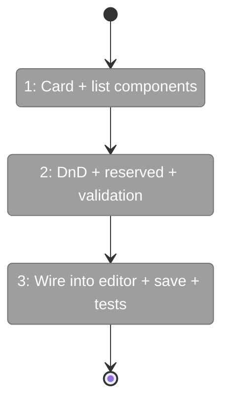
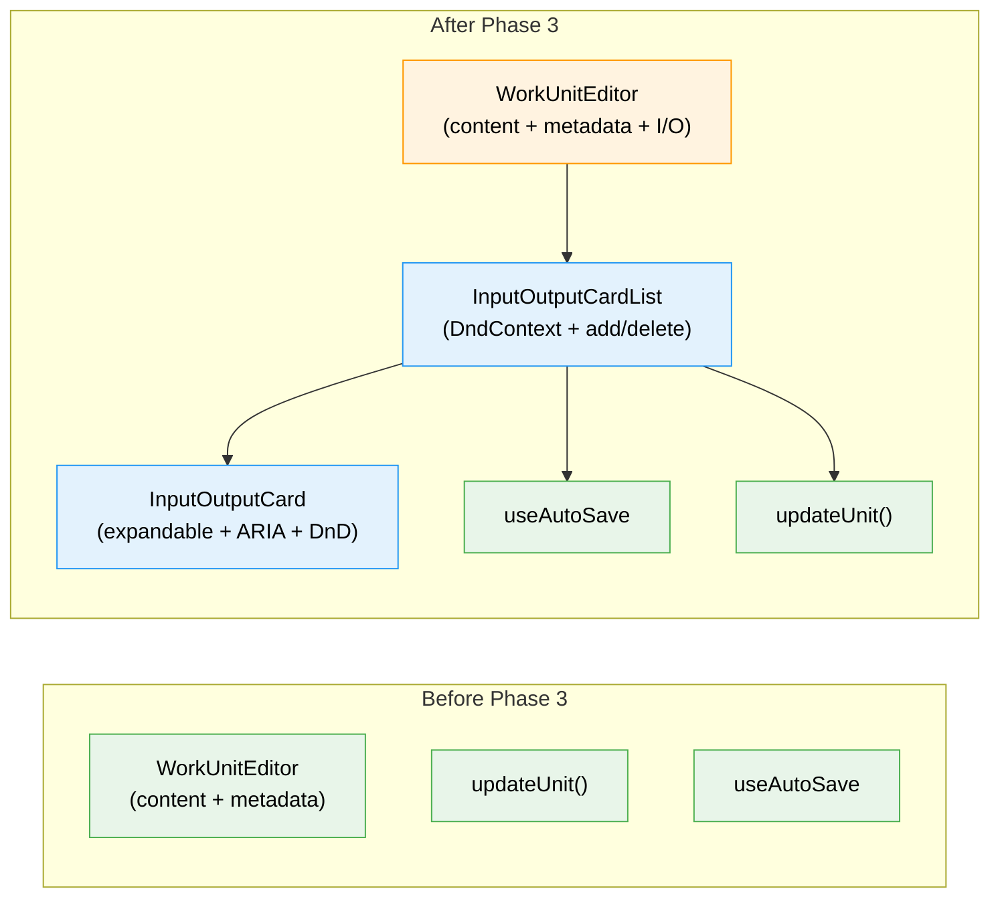

# Flight Plan: Phase 3 — Inputs/Outputs Configuration

**Plan**: [workunit-editor-plan.md](../../workunit-editor-plan.md)
**Phase**: Phase 3: Inputs/Outputs Configuration
**Generated**: 2026-02-28
**Status**: Ready for takeoff

---

## Departure → Destination

**Where we are**: Phase 2 delivered the editor page with type-specific content editors (agent prompt, code script, user-input form), auto-save, sidebar navigation, creation flow, and metadata panel. But there's no UI for configuring a unit's inputs and outputs — the data ports that wire units together in workflows. The service layer (Phase 1) already supports `update(slug, { inputs, outputs })` with wholesale array replacement.

**Where we're going**: A user opens any work unit editor, scrolls below the content editor, and sees expandable card lists for Inputs and Outputs. They can add new ports with sensible defaults, drag to reorder via grip handles, edit field properties (name, type, data_type, required, description), delete ports with safeguards, and see reserved params (`main-prompt`, `main-script`) as locked read-only cards. Changes auto-save with status feedback.

---

## Domain Context

### Domains We're Changing

| Domain | What Changes | Key Files |
|--------|-------------|-----------|
| `058-workunit-editor` | New: InputOutputCard, InputOutputCardList. Modified: WorkUnitEditor + editor page to pass I/O data | `input-output-card.tsx`, `input-output-card-list.tsx`, `workunit-editor.tsx`, `page.tsx` |

### Domains We Depend On (no changes)

| Domain | What We Consume | Contract |
|--------|----------------|----------|
| `_platform/positional-graph` | `UpdateUnitPatch.inputs/outputs` | Arrays replace wholesale via `IWorkUnitService.update()` |
| `_platform/hooks` | `useAutoSave(saveFn, { delay })` | Debounced save + status tracking |
| `058-workunit-editor` | `updateUnit()` server action, `SaveIndicator` | DI-wired persistence + inline status |

---

## Flight Status

<!-- Updated by /plan-6-v2: pending → active → done. Use blocked for problems/input needed. -->

**Legend**: grey = pending | yellow = active | red = blocked/needs input | green = done

---

## Stages

- [ ] **Stage 1: Card + list components** — Build InputOutputCard (expandable, ARIA) and InputOutputCardList (DndContext, add/delete) (`input-output-card.tsx`, `input-output-card-list.tsx` — new files)
- [ ] **Stage 2: DnD + reserved + validation** — Wire useSortable drag reorder, reserved param locking, real-time name/type validation (`input-output-card.tsx`, `input-output-card-list.tsx`)
- [ ] **Stage 3: Wire into editor + save + tests** — Integrate into WorkUnitEditor, wire dual auto-save (0ms structural, 500ms fields), pass data from server, add tests (`workunit-editor.tsx`, `page.tsx`, test file)

---

## Architecture: Before & After

**Legend**: existing (green, unchanged) | changed (orange, modified) | new (blue, created)

---

## Acceptance Criteria

- [ ] AC-10: Add, edit, reorder, remove inputs
- [ ] AC-11: Add, edit, reorder, remove outputs
- [ ] AC-12: Name validation with real-time feedback
- [ ] AC-13: data_type conditional on type
- [ ] AC-14: Reserved params read-only
- [ ] AC-15: At least one output enforced

## Goals & Non-Goals

**Goals**: Expandable card list for inputs/outputs. Drag reorder. Real-time validation. Reserved param locking. Auto-save with status indicator.

**Non-Goals**: No file watcher (Phase 4). No "Edit Template" button (Phase 4). No undo/redo.

---

## Checklist

- [ ] T001: Build InputOutputCard (expandable, form fields, ARIA)
- [ ] T002: Build InputOutputCardList (DndContext, add/delete)
- [ ] T003: Drag reorder (useSortable, arrayMove, grip handle)
- [ ] T004: Reserved params (locked, non-editable, non-draggable)
- [ ] T005: Real-time validation (name regex, data_type conditional, uniqueness)
- [ ] T006: Wire into WorkUnitEditor + editor page
- [ ] T007: Auto-save (dual delay) + tests
