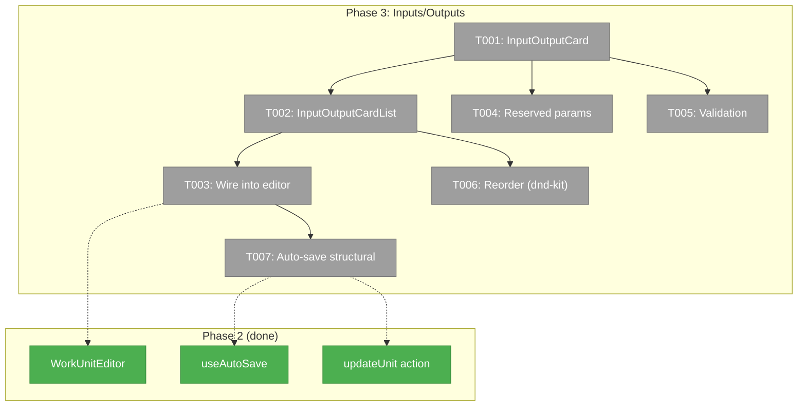
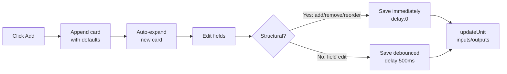
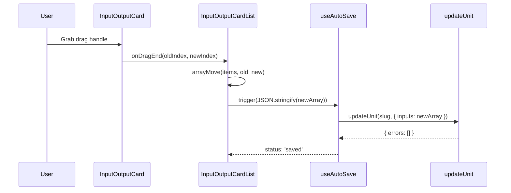

# Phase 3: Inputs/Outputs Configuration — Tasks & Context Brief

## Executive Briefing

**Purpose**: Build the input/output configuration form that lets users define, edit, reorder, and remove the data ports that wire work units together in workflows. This phase delivers the UI that Phase 1's service layer already supports at the API level.

**What We're Building**: An expandable card list component for inputs and outputs, integrated into the editor page's main panel. Each card shows a collapsed summary or expanded form with name, type, data_type, required, and description fields. Cards are reorderable via drag handles (`@dnd-kit/sortable`), with reserved params shown as locked. Real-time Zod validation with inline errors. Structural changes (add/remove/reorder) save immediately; field edits save on blur.

**Goals**:
- ✅ Users can add, edit, reorder, and remove input definitions
- ✅ Users can add, edit, reorder, and remove output definitions
- ✅ Input names validate against `/^[a-z][a-z0-9_]*$/` with real-time feedback
- ✅ data_type shown/hidden based on type (data vs file)
- ✅ Reserved params (`main-prompt`, `main-script`) shown as locked, non-editable
- ✅ At least one output enforced by validation
- ✅ Changes persist via `updateUnit()` server action

**Non-Goals**:
- ❌ No file watcher / change notifications (Phase 4)
- ❌ No "Edit Template" button from workflow canvas (Phase 4)
- ❌ No undo/redo for structural changes
- ❌ No cross-unit input/output wiring visualization

---

## Prior Phase Context

### Phase 1: Service Layer (✅ Complete)

**A. Deliverables**: Extended `IWorkUnitService` with `create()`, `update()`, `delete()`, `rename()`. Contract tests, fake service, error codes E188/E190.

**B. Dependencies Exported**: `UpdateUnitPatch.inputs` and `UpdateUnitPatch.outputs` — arrays replace wholesale on update. `FakeWorkUnitService` with call tracking for testing.

**C. Gotchas & Debt**: Rename cascade inline (not delegated). Partial patch semantics: arrays replace wholesale, not merge.

**D. Incomplete Items**: None.

**E. Patterns to Follow**: Partial patch → arrays replace wholesale (not append/merge). Zod-first types. Fakes with call tracking.

### Phase 2: Editor Page (✅ Complete)

**A. Deliverables**: 
- Server actions at `apps/web/app/actions/workunit-actions.ts` (8 actions incl. `updateUnit`, `saveUnitContent`)
- `useAutoSave` hook at `apps/web/src/features/_platform/hooks/use-auto-save.ts`
- `SaveIndicator` at `apps/web/src/features/058-workunit-editor/components/save-indicator.tsx`
- `WorkUnitEditorLayout` (3-panel: left + main + right)
- `WorkUnitEditor` dispatches to type-specific editors
- `MetadataPanel` in right panel

**B. Dependencies Exported**: `updateUnit(workspaceSlug, unitSlug, patch)` server action. `useAutoSave(saveFn, { delay })` hook. `SaveIndicator` component.

**C. Gotchas & Debt**: User-input config stored in `unit.yaml` (not file). PanelShell has no right panel (custom layout). Import paths need exact `../` counting.

**D. Incomplete Items**: None.

**E. Patterns to Follow**: `useAutoSave` with `delay: 0` for structural changes. `SaveIndicator` inline banner for errors. Server actions via relative import `../../../../app/actions/workunit-actions`. Biome auto-fix for import ordering. a11y: `htmlFor`/`id` on all labels.

---

## Pre-Implementation Check

| File | Exists? | Domain | Notes |
|------|---------|--------|-------|
| `apps/web/src/features/058-workunit-editor/components/input-output-card-list.tsx` | ❌ Create | `058-workunit-editor` | New component. Container with DndContext + SortableContext. |
| `apps/web/src/features/058-workunit-editor/components/input-output-card.tsx` | ❌ Create | `058-workunit-editor` | New component. Expandable card with form fields. |
| `apps/web/src/features/058-workunit-editor/components/workunit-editor.tsx` | ✅ Modify | `058-workunit-editor` | Add inputs/outputs section to editor layout. |
| `@dnd-kit/sortable` | ✅ Installed | — | v10.0.0 already in package.json. |
| `@dnd-kit/core` | ✅ Installed | — | v6.3.1 already in package.json. |
| `test/fakes/dnd-test-wrapper.tsx` | ✅ Exists | test | Reusable DndContext wrapper for tests. |
| Existing patterns: `KanbanCard` (useSortable), `ToolCallCard` (expand/collapse ARIA) | ✅ | — | Adapt patterns, don't import directly. |

---

## Architecture Map



---

## Tasks

| Status | ID | Task | Domain | Path(s) | Done When | Notes |
|--------|-----|------|--------|---------|-----------|-------|
| [ ] | T001 | **Build InputOutputCard** — Expandable card component with collapsed summary (name, type badge, required indicator) and expanded form (name input, type select, data_type select, required toggle, description textarea). Expand/collapse with ChevronRight rotation + ARIA (`aria-expanded`, `aria-controls`). | `058-workunit-editor` | `/Users/jordanknight/substrate/058-workunit-editor/apps/web/src/features/058-workunit-editor/components/input-output-card.tsx` | Card renders collapsed summary. Click expands to show form. All fields editable. ARIA attributes present. | Per W005. Adapt expand/collapse pattern from `ToolCallCard` (`useId()` for ARIA IDs, ChevronRight rotation). data_type select shown only when `type='data'` (AC-13). |
| [ ] | T002 | **Build InputOutputCardList** — Container component wrapping cards in `DndContext` + `SortableContext` with `verticalListSortingStrategy`. Add button appends card with defaults (`type:'data'`, `data_type:'text'`, `required:true`). Delete button on cards with confirmation. Prevent deleting last output (AC-15). | `058-workunit-editor` | `/Users/jordanknight/substrate/058-workunit-editor/apps/web/src/features/058-workunit-editor/components/input-output-card-list.tsx` | Cards render in order. Add appends new card (auto-expanded). Delete removes card (blocked if last output). DndContext wraps list. | Per W005. Adapt DndContext + sensor pattern from `KanbanContent` (PointerSensor distance:8, KeyboardSensor). Use `arrayMove` from `@dnd-kit/sortable` for reorder. |
| [ ] | T003 | **Wire into WorkUnitEditor** — Add Inputs and Outputs sections to the editor page main area, below the type-specific content editor. Pass current inputs/outputs from loaded unit. Wire onChange to persist. | `058-workunit-editor` | `/Users/jordanknight/substrate/058-workunit-editor/apps/web/src/features/058-workunit-editor/components/workunit-editor.tsx`, `/Users/jordanknight/substrate/058-workunit-editor/apps/web/app/(dashboard)/workspaces/[slug]/work-units/[unitSlug]/page.tsx` | Inputs and Outputs sections visible on editor page. Data loads from unit. Changes round-trip through server action. | Load `unit.inputs` and `unit.outputs` from `LoadUnitResult`. Pass as props to `InputOutputCardList`. |
| [ ] | T004 | **Reserved params** — Show `main-prompt` (agent) and `main-script` (code) as locked, non-editable, non-deletable, non-draggable cards at the top of the inputs list. Visual lock indicator. | `058-workunit-editor` | `/Users/jordanknight/substrate/058-workunit-editor/apps/web/src/features/058-workunit-editor/components/input-output-card.tsx` | Reserved params render with lock icon. Form fields disabled. No delete button. No drag handle. Cannot be reordered below user params. | Per AC-14. Reserved param names: `main-prompt` (agent units), `main-script` (code units). User-input units have no reserved params. |
| [ ] | T005 | **Real-time validation** — Validate input name against `/^[a-z][a-z0-9_]*$/` with inline error. Validate required fields. Show red border + message on invalid. data_type required when type='data'. | `058-workunit-editor` | `/Users/jordanknight/substrate/058-workunit-editor/apps/web/src/features/058-workunit-editor/components/input-output-card.tsx` | Invalid names show red border + error text. data_type required when type='data'. Missing required fields flagged. | Per AC-12. Two-tier validation per W005: immediate UI feedback + Zod re-validation on save. |
| [ ] | T006 | **Drag reorder** — Wire `useSortable` on each card with drag handle. On `dragEnd`, reorder array via `arrayMove` and trigger save. Visual feedback during drag (opacity, shadow). | `058-workunit-editor` | `/Users/jordanknight/substrate/058-workunit-editor/apps/web/src/features/058-workunit-editor/components/input-output-card.tsx`, `/Users/jordanknight/substrate/058-workunit-editor/apps/web/src/features/058-workunit-editor/components/input-output-card-list.tsx` | Cards reorder via drag. Order persists after save. Reserved params not draggable. Smooth drag animation. | Adapt `useSortable` pattern from `KanbanCard`. Use `CSS.Transform.toString()`. Memoize card IDs for SortableContext. |
| [ ] | T007 | **Auto-save structural changes** — Immediate save (delay: 0) on add/remove/reorder. Debounced save (delay: 500) on field edits within cards. Use `useAutoSave` from Phase 2. Show SaveIndicator. | `058-workunit-editor` | `/Users/jordanknight/substrate/058-workunit-editor/apps/web/src/features/058-workunit-editor/components/input-output-card-list.tsx` | Add/remove/reorder saves immediately. Field edits save after 500ms. SaveIndicator shows status. Errors show inline banner. | Reuse `useAutoSave` from `_platform/hooks`. Two instances: one with delay:0 for structural, one with delay:500 for fields. Save via `updateUnit(slug, { inputs: [...] })` — arrays replace wholesale (Phase 1 semantics). |

---

## Context Brief

### Key Findings from Plan

- **Finding 05 (High)**: Rename cascade must update `unit_slug` in all node.yaml files — already handled in Phase 1, not relevant to Phase 3.
- **Phase 1 semantics**: `UpdateUnitPatch.inputs` and `.outputs` replace arrays wholesale (not merge). Phase 3 must send the entire array on each save.

### Domain Dependencies

| Domain | Concept | Entry Point | What We Use |
|--------|---------|-------------|-------------|
| `_platform/positional-graph` | UpdateUnitPatch | `IWorkUnitService.update()` | Persist inputs/outputs arrays |
| `_platform/hooks` | Auto-save | `useAutoSave(saveFn, { delay })` | Debounced persistence + status |
| `058-workunit-editor` | Server actions | `updateUnit()` | DI-wired persistence |
| `058-workunit-editor` | SaveIndicator | `<SaveIndicator status error />` | Inline save status display |

### Domain Constraints

- Inputs/outputs are arrays that replace wholesale — no partial array merge
- Reserved params are determined by unit type, not stored as a separate concept
- `@dnd-kit` sensors need 8px activation distance to avoid accidental drags
- Biome enforces `htmlFor`/`id` on all `<label>` elements

### Reusable from Prior Phases

- `useAutoSave` hook — for both structural (delay:0) and field (delay:500) saves
- `SaveIndicator` — inline status + persistent error banner
- `updateUnit()` server action — DI-wired persistence
- `DndTestWrapper` from `test/fakes/` — for component test setup
- Expand/collapse ARIA pattern from `ToolCallCard` — `useId()`, `aria-expanded`, `ChevronRight` rotation
- `useSortable` + `SortableContext` pattern from `KanbanCard`/`KanbanColumn`

### Flow: Add → Edit → Reorder → Save



### Sequence: Reorder via Drag



---

## Discoveries & Learnings

_Populated during implementation by plan-6._

| Date | Task | Type | Discovery | Resolution | References |
|------|------|------|-----------|------------|------------|

---

## Directory Layout

```
docs/plans/058-workunit-editor/
  ├── workunit-editor-plan.md
  ├── workunit-editor-spec.md
  ├── research-dossier.md
  ├── workshops/ (5 files)
  ├── reviews/ (3 files)
  ├── tasks/phase-1-service-layer/ (complete)
  ├── tasks/phase-2-editor-page/ (complete)
  └── tasks/phase-3-inputs-outputs-configuration/
      ├── tasks.md          ← this file
      ├── tasks.fltplan.md
      └── execution.log.md  # created by plan-6
```
