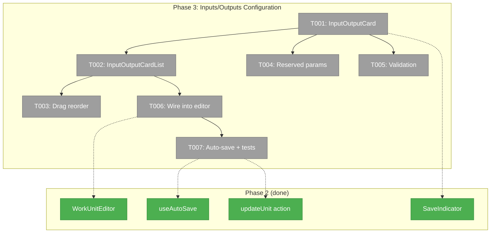
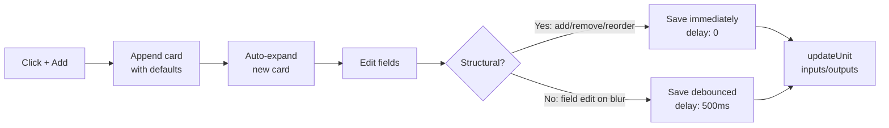
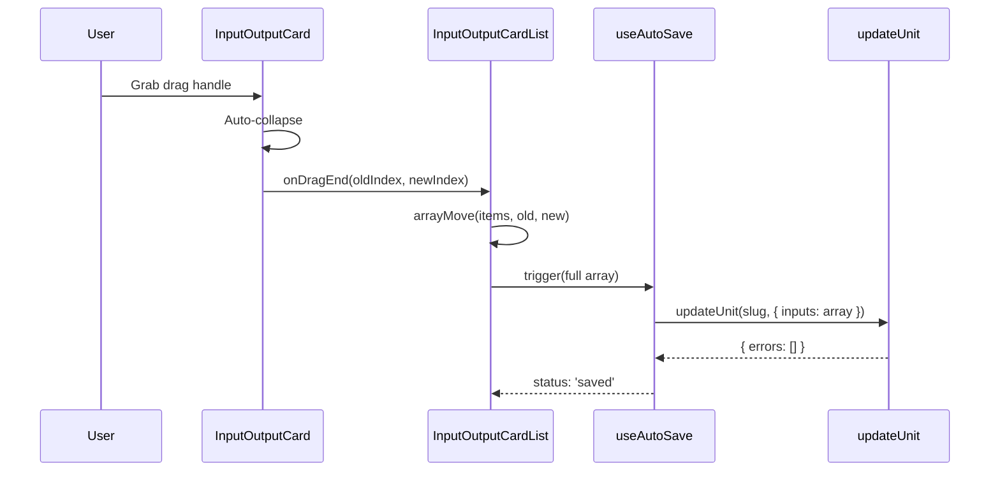

# Phase 3: Inputs/Outputs Configuration — Tasks & Context Brief

## Executive Briefing

**Purpose**: Build the input/output configuration UI that lets users define, edit, reorder, and remove the data ports wiring work units together in workflows. Phase 1 already supports `update(slug, { inputs, outputs })` at the service layer — this phase delivers the visual form.

**What We're Building**: Two new components — `InputOutputCard` (expandable card with form fields, ARIA accessibility, validation) and `InputOutputCardList` (DnD container with `@dnd-kit/sortable`, add/delete, reserved param locking). These integrate into the existing editor page below the type-specific content editor. Structural changes (add/remove/reorder) save immediately; field edits save on blur.

**Goals**:
- ✅ Users can add, edit, reorder, and remove input definitions
- ✅ Users can add, edit, reorder, and remove output definitions
- ✅ Input names validate against `/^[a-z][a-z0-9_]*$/` with real-time feedback
- ✅ `data_type` shown when `type='data'`, hidden when `type='file'`
- ✅ Reserved params (`main-prompt`, `main-script`) shown as locked, non-editable cards
- ✅ At least one output enforced by validation
- ✅ Changes persist via `updateUnit()` — arrays replace wholesale

**Non-Goals**:
- ❌ No file watcher / change notifications (Phase 4)
- ❌ No "Edit Template" button from workflow canvas (Phase 4)
- ❌ No undo/redo for structural changes
- ❌ No cross-unit input/output wiring visualization

---

## Prior Phase Context

### Phase 1: Service Layer (✅ Complete)

**A. Deliverables**: Extended `IWorkUnitService` with `create()`, `update()`, `delete()`, `rename()` + result types + error codes E188/E190. FakeWorkUnitService with call tracking. 40 contract tests.

**B. Dependencies Exported**: `UpdateUnitPatch.inputs` and `UpdateUnitPatch.outputs` — arrays of `{ name, type: 'data'|'file', data_type?: 'text'|'number'|'boolean'|'json', required: boolean, description?: string }`. Arrays replace wholesale on update (not merge).

**C. Gotchas & Debt**: Rename cascade inline (not delegated). Partial patch: arrays replace wholesale (W004 Decision 4) — Phase 3 must send the full array on every save.

**D. Incomplete Items**: None.

**E. Patterns to Follow**: Zod-first types. Fakes with call tracking. Idempotent delete. IFileSystem abstraction for all FS ops.

### Phase 2: Editor Page (✅ Complete)

**A. Deliverables**: Server actions (`workunit-actions.ts`), `useAutoSave` hook, `SaveIndicator`, `WorkUnitEditorLayout` (3-panel), `WorkUnitEditor` (type-dispatched), list page, editor page, creation modal, metadata panel.

**B. Dependencies Exported**: `updateUnit(workspaceSlug, unitSlug, patch)` server action. `useAutoSave(saveFn, { delay })` hook returning `{ status, error, trigger, flush }`. `SaveIndicator` component. `WorkUnitEditor` with props for `allUnits`, `content`, `description`, `version`.

**C. Gotchas & Debt**: User-input config in `unit.yaml` type_config (no file). PanelShell has no right panel (custom layout). Import viewer from barrel `@/features/_platform/viewer`. Biome enforces `htmlFor`/`id` on labels. Import ordering auto-fixed by `biome check --fix --unsafe`.

**D. Incomplete Items**: None.

**E. Patterns to Follow**: `useAutoSave(saveFn, 0)` for immediate saves (metadata). `useAutoSave(saveFn, 500)` for debounced content. Persistent inline error banner via `SaveIndicator`. Server actions via relative import. `safeParseUserInputConfig()` pattern for guarded JSON parsing. TypeScript `never` exhaustive checks.

---

## Pre-Implementation Check

| File | Exists? | Domain | Notes |
|------|---------|--------|-------|
| `/Users/jordanknight/substrate/058-workunit-editor/apps/web/src/features/058-workunit-editor/components/input-output-card.tsx` | ❌ Create | `058-workunit-editor` | New. Expandable card with form fields. Adapt ARIA from ToolCallCard. |
| `/Users/jordanknight/substrate/058-workunit-editor/apps/web/src/features/058-workunit-editor/components/input-output-card-list.tsx` | ❌ Create | `058-workunit-editor` | New. DndContext + SortableContext container. Adapt pattern from KanbanColumn. |
| `/Users/jordanknight/substrate/058-workunit-editor/apps/web/src/features/058-workunit-editor/components/workunit-editor.tsx` | ✅ Modify | `058-workunit-editor` | Add inputs/outputs sections below content editor. |
| `/Users/jordanknight/substrate/058-workunit-editor/apps/web/app/(dashboard)/workspaces/[slug]/work-units/[unitSlug]/page.tsx` | ✅ Modify | `058-workunit-editor` | Pass `unit.inputs` and `unit.outputs` as props. |
| `@dnd-kit/sortable` v10.0.0 | ✅ Installed | — | Ready. Also `@dnd-kit/core` v6.3.1. |
| `/Users/jordanknight/substrate/058-workunit-editor/test/fakes/dnd-test-wrapper.tsx` | ✅ Exists | test | Reusable DndContext test wrapper. |
| `/Users/jordanknight/substrate/058-workunit-editor/apps/web/src/components/kanban/kanban-card.tsx` | ✅ Reference | — | `useSortable` pattern to adapt. |
| `/Users/jordanknight/substrate/058-workunit-editor/apps/web/src/components/agents/tool-call-card.tsx` | ✅ Reference | — | Expand/collapse ARIA pattern to adapt. |

---

## Architecture Map



---

## Tasks

| Status | ID | Task | Domain | Path(s) | Done When | Notes |
|--------|-----|------|--------|---------|-----------|-------|
| [ ] | T001 | **Build InputOutputCard** — Expandable card component. **Collapsed**: shows name, type badge (`data`/`file`), required indicator, drag handle (grip icon), hover-reveal delete button. **Expanded**: form with name input (`htmlFor`/`id`), type select, data_type select (shown only when `type='data'`, hidden when `type='file'`), required checkbox, description input. Expand/collapse with `ChevronRight` rotation + `aria-expanded` + `aria-controls` (adapt from ToolCallCard). Uses `useId()` for ARIA IDs. | `058-workunit-editor` | `/Users/jordanknight/substrate/058-workunit-editor/apps/web/src/features/058-workunit-editor/components/input-output-card.tsx` | Card renders collapsed summary. Click expands form. All fields editable. ARIA attributes present. data_type conditional on type. `htmlFor`/`id` on all labels. | Per W005 Decisions 1, 3, 7. Adapt ToolCallCard ARIA pattern (`aria-expanded`, `aria-controls`, ChevronRight `rotate-90`). |
| [ ] | T002 | **Build InputOutputCardList** — Container wrapping cards in `DndContext` + `SortableContext` with `verticalListSortingStrategy`. Sensors: `PointerSensor` (distance: 8) + `KeyboardSensor` (sortableKeyboardCoordinates). Add button appends card with defaults (`type:'data'`, `data_type:'text'`, `required:true`, name: `''`) and auto-expands. Delete button on cards — blocked if last output (AC-15). Section header ("Inputs" / "Outputs") with count badge. | `058-workunit-editor` | `/Users/jordanknight/substrate/058-workunit-editor/apps/web/src/features/058-workunit-editor/components/input-output-card-list.tsx` | Cards render in order. Add appends + auto-expands new card. Delete removes card (blocked for last output). DndContext wraps list. Sensors configured. | Per W005 Decisions 2, 4, 5. Adapt DndContext + sensor pattern from KanbanContent. Use `arrayMove` from `@dnd-kit/sortable`. Memoize card IDs for SortableContext. |
| [ ] | T003 | **Drag reorder** — Wire `useSortable` on each InputOutputCard with drag handle (grip icon, not whole card). On `dragEnd`, reorder array via `arrayMove` and trigger immediate save. Visual feedback: reduced opacity + shadow during drag. Auto-collapse card when drag starts. Keyboard: Space to grab, arrows to move, Space to drop. | `058-workunit-editor` | `/Users/jordanknight/substrate/058-workunit-editor/apps/web/src/features/058-workunit-editor/components/input-output-card.tsx`, `/Users/jordanknight/substrate/058-workunit-editor/apps/web/src/features/058-workunit-editor/components/input-output-card-list.tsx` | Cards reorder via drag handle. Order persists after save. Reserved params not draggable. Smooth animation via `CSS.Transform.toString()`. | Per W005 Decision 4. Adapt `useSortable` pattern from KanbanCard (lines 40-64). |
| [ ] | T004 | **Reserved params** — Show `main-prompt` (agent units) and `main-script` (code units) as locked cards at top of inputs list. Muted/dimmed styling. No drag handle, no delete button, not draggable. Fields disabled. User-input units have no reserved params. | `058-workunit-editor` | `/Users/jordanknight/substrate/058-workunit-editor/apps/web/src/features/058-workunit-editor/components/input-output-card.tsx`, `/Users/jordanknight/substrate/058-workunit-editor/apps/web/src/features/058-workunit-editor/components/input-output-card-list.tsx` | Reserved params render with lock icon. Form fields disabled. No delete. No drag handle. Cannot reorder below user params. | Per AC-14, W005 Decision 8. Reserved names: `main-prompt` (agent), `main-script` (code). |
| [ ] | T005 | **Real-time validation** — Name: required + regex `/^[a-z][a-z0-9_]*$/` + unique within list + not a reserved name. data_type: required when `type='data'`. At least one output enforced (AC-15). Show red border + inline error text on invalid fields. Two-tier: immediate UI feedback + Zod re-validation on server via `updateUnit`. | `058-workunit-editor` | `/Users/jordanknight/substrate/058-workunit-editor/apps/web/src/features/058-workunit-editor/components/input-output-card.tsx` | Invalid names show red border + error text. Duplicate names flagged. data_type required when type='data'. Missing required fields flagged. | Per AC-12, W005 Decision 6. Name regex matches service-layer validation. |
| [ ] | T006 | **Wire into WorkUnitEditor** — Add Inputs and Outputs `InputOutputCardList` sections to editor page main area, below the type-specific content editor. Pass `unit.inputs` and `unit.outputs` from loaded unit. Update editor page to pass these arrays as props. Wire `onChange` to `updateUnit`. | `058-workunit-editor` | `/Users/jordanknight/substrate/058-workunit-editor/apps/web/src/features/058-workunit-editor/components/workunit-editor.tsx`, `/Users/jordanknight/substrate/058-workunit-editor/apps/web/app/(dashboard)/workspaces/[slug]/work-units/[unitSlug]/page.tsx` | Inputs and Outputs sections visible below content editor on editor page. Data loads from unit. Changes round-trip through server action. | Load `unit.inputs` and `unit.outputs` from `LoadUnitResult.unit`. Add props to `WorkUnitEditor`. |
| [ ] | T007 | **Auto-save + tests** — Immediate save (delay: 0) on structural changes (add/remove/reorder). Debounced save (delay: 500) on field edits within cards (on blur). Use `useAutoSave` from Phase 2. Show `SaveIndicator`. Write tests for InputOutputCardList (add, remove, reorder, validation, reserved params). Use `DndTestWrapper` from `test/fakes/`. | `058-workunit-editor` | `/Users/jordanknight/substrate/058-workunit-editor/apps/web/src/features/058-workunit-editor/components/input-output-card-list.tsx`, `/Users/jordanknight/substrate/058-workunit-editor/test/unit/web/features/058-workunit-editor/input-output-card-list.test.tsx` | Structural changes save immediately. Field edits save debounced. SaveIndicator shows status. Tests cover add/remove/validation/reserved. | Two `useAutoSave` instances: structural (delay:0), field edits (delay:500). Save via `updateUnit(slug, { inputs: [...] })` — arrays replace wholesale (Phase 1 semantics). Use `DndTestWrapper` for test setup. |

---

## Context Brief

### Key Findings from Plan

- **Phase 1 semantics**: `UpdateUnitPatch.inputs` and `.outputs` replace arrays wholesale (not merge). Phase 3 must always send the full array.
- **W005**: Expandable card list with single-expand, drag handle (not whole card), auto-collapse on drag, inline add/delete, two-tier validation.
- **Existing patterns**: KanbanCard (`useSortable`), ToolCallCard (expand/collapse ARIA), `DndTestWrapper` (test utility).

### Domain Dependencies

| Domain | Concept | Entry Point | What We Use |
|--------|---------|-------------|-------------|
| `_platform/positional-graph` | UpdateUnitPatch | `IWorkUnitService.update()` | Persist inputs/outputs arrays (wholesale replace) |
| `_platform/hooks` | Auto-save | `useAutoSave(saveFn, { delay })` | Debounced persistence + status tracking |
| `058-workunit-editor` | Server actions | `updateUnit()` | DI-wired persistence to IWorkUnitService |
| `058-workunit-editor` | SaveIndicator | `<SaveIndicator status error />` | Inline save status + error banner |

### Domain Constraints

- Inputs/outputs arrays replace wholesale — no partial array merge
- Reserved params determined by unit type (agent→`main-prompt`, code→`main-script`), not separate concept
- `@dnd-kit` sensors need 8px activation distance to avoid accidental drags
- Biome enforces `htmlFor`/`id` on all `<label>` elements (a11y)
- Import viewer from barrel `@/features/_platform/viewer` (not internal path)

### Reusable from Prior Phases

- `useAutoSave` hook — for both structural (delay:0) and field edit (delay:500) saves
- `SaveIndicator` — inline status + persistent error banner
- `updateUnit()` server action — DI-wired persistence
- `DndTestWrapper` from `test/fakes/dnd-test-wrapper.tsx` — for component test DnD setup
- `useSortable` pattern from KanbanCard — transform, listeners, isDragging
- `aria-expanded`/`aria-controls`/ChevronRight rotation from ToolCallCard

### Flow: Add → Edit → Reorder → Save



### Sequence: Drag Reorder



---

## Discoveries & Learnings

_Populated during implementation by plan-6._

| Date | Task | Type | Discovery | Resolution | References |
|------|------|------|-----------|------------|------------|

---

## Directory Layout

```
docs/plans/058-workunit-editor/
  ├── workunit-editor-plan.md
  ├── workunit-editor-spec.md
  ├── research-dossier.md
  ├── workshops/ (5 files)
  ├── reviews/ (4 files)
  ├── tasks/phase-1-service-layer/ (complete)
  ├── tasks/phase-2-editor-page/ (complete)
  └── tasks/phase-3-inputs-outputs-configuration/
      ├── tasks.md          ← this file
      ├── tasks.fltplan.md
      └── execution.log.md  # created by plan-6
```
