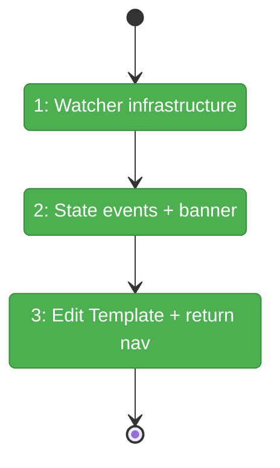
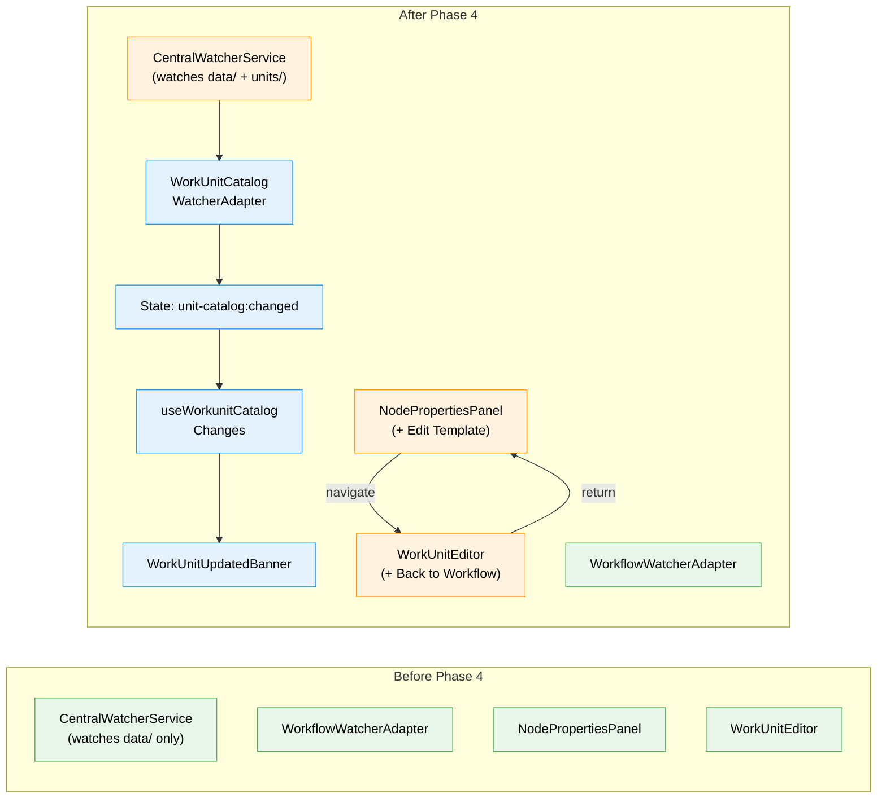

# Flight Plan: Phase 4 — Change Notifications & Workflow Integration

**Plan**: [workunit-editor-plan.md](../../workunit-editor-plan.md)
**Phase**: Phase 4: Change Notifications & Workflow Integration
**Generated**: 2026-03-01
**Status**: Landed

---

## Departure → Destination

**Where we are**: Phases 1-3 delivered the work unit CRUD service, a full editor UI with type-specific editing, and inputs/outputs configuration. But the workflow page has no awareness of unit changes — edits are invisible until the page is manually reloaded. And there's no way to jump from a workflow node to the unit editor.

**Where we're going**: A developer editing a work unit template triggers a file watcher event that flows through the state system to a dismissible banner on the workflow page: "Work unit templates have been updated — Refresh". From the workflow canvas, clicking "Edit Template" on any unit-backed node navigates to the editor with a "Back to Workflow" breadcrumb for seamless return.

---

## Domain Context

### Domains We're Changing

| Domain | What Changes | Key Files |
|--------|-------------|-----------|
| `_platform/events` | New watcher adapter for `.chainglass/units/`; possibly extend watched paths | `workunit-catalog-watcher.adapter.ts`, `central-watcher.service.ts` |
| `_platform/state` | New state path `unit-catalog:changed` | (wired in start-central-notifications) |
| `workflow-ui` | "Edit Template" button on node properties panel | `node-properties-panel.tsx` |
| `058-workunit-editor` | Banner component, catalog changes hook, return navigation | `workunit-updated-banner.tsx`, `use-workunit-catalog-changes.ts`, `workunit-editor.tsx` |

### Domains We Depend On (no changes)

| Domain | What We Consume | Contract |
|--------|----------------|----------|
| `_platform/workspace-url` | URL construction | `workspaceHref()` |
| `_platform/hooks` | React patterns | Standard Next.js hooks |

---

## Flight Status

<!-- Updated by /plan-6-v2: pending → active → done. Use blocked for problems/input needed. -->

**Legend**: grey = pending | yellow = active | red = blocked/needs input | green = done

---

## Stages

- [ ] **Stage 1: Watcher infrastructure** — Verify/extend CentralWatcherService paths, create WorkUnitCatalogWatcherAdapter, register in DI (`central-watcher.service.ts`, `workunit-catalog-watcher.adapter.ts`, `start-central-notifications.ts`)
- [x] **Stage 2: State events + banner** — Publish state event, create hook, build dismissible banner on workflow page (`use-workunit-catalog-changes.ts`, `workunit-updated-banner.tsx`)
- [x] **Stage 3: Edit Template + return nav** — Add button on NodePropertiesPanel, add return breadcrumb on editor page (`node-properties-panel.tsx`, `workunit-editor.tsx`, `page.tsx`)

---

## Architecture: Before & After

**Legend**: existing (green, unchanged) | changed (orange, modified) | new (blue, created)

---

## Acceptance Criteria

- [x] AC-22: "Edit Template" on workflow node properties panel
- [x] AC-23: Return context preserved (back to workflow)
- [x] AC-24: Banner appears on unit file change
- [x] AC-25: Banner dismissible, re-appears on next change
- [x] AC-26: Refresh picks up all unit changes

## Goals & Non-Goals

**Goals**: File watcher for units, state system integration, dismissible banner, "Edit Template" button, return navigation.

**Non-Goals**: No per-node sync indicators, no auto-refresh, no undo/redo for template edits.

---

## Checklist

- [x] T001: Verify/extend CentralWatcherService paths
- [x] T002: Create WorkUnitCatalogWatcherAdapter
- [x] T003: Publish state event + create hook
- [x] T004: Build WorkUnitUpdatedBanner
- [x] T005: Add "Edit Template" button on NodePropertiesPanel
- [x] T006: Return navigation from editor
- [x] T007: Register adapter in DI + start-central-notifications
