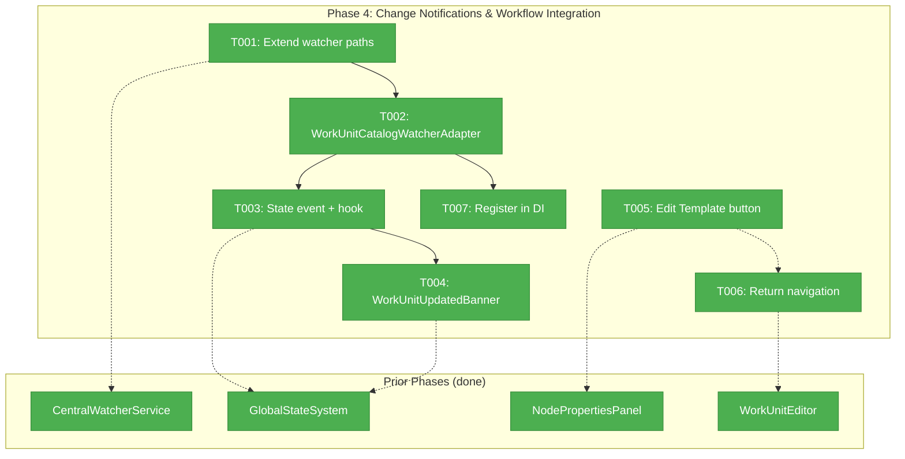
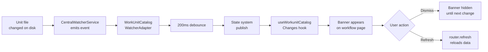
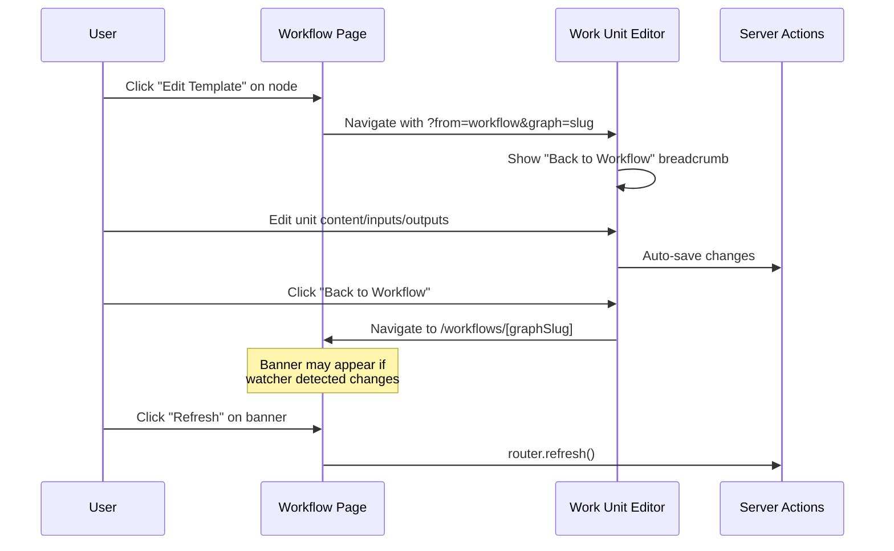

# Phase 4: Change Notifications & Workflow Integration — Tasks & Context Brief

<!--
DYK Findings Applied (2026-03-01):
#1: Source watcher may already cover units/ — verify before extending, avoid duplicate events
#2: User's own edits trigger banner on return — use neutral wording
#3: Verify unit_slug is in NodePropertiesPanel props — may need plumbing
#4: Place banner at page layout level, not inside WorkflowEditor (avoids toast conflict)
#5: Place adapter in 023-central-watcher-notifications/ alongside existing adapters
-->

## Executive Briefing

**Purpose**: Wire up file change detection for the work unit catalog so the workflow page alerts users when units are modified, and add the "Edit Template" button that bridges the workflow canvas with the work unit editor.

**What We're Building**: A `WorkUnitCatalogWatcherAdapter` that monitors `.chainglass/units/` for file changes, publishes events through the state system, and triggers a dismissible banner on the workflow page. Plus bidirectional navigation: "Edit Template" button on workflow nodes → editor, and "Back to Workflow" link on the editor → workflow.

**Goals**:
- ✅ File changes in `.chainglass/units/` detected and published via state system
- ✅ Workflow page shows dismissible banner when units change, with "Refresh" button
- ✅ "Edit Template" button on workflow node properties panel
- ✅ Return navigation preserves context (back to correct workflow)
- ✅ Banner re-appears on subsequent changes after dismissal

**Non-Goals**:
- ❌ No real-time per-node "out of sync" indicators (simplified model per user decision)
- ❌ No auto-refresh (user must click "Refresh")
- ❌ No undo/redo for template edits from workflow context
- ❌ No doping script updates (Phase 5)

---

## Prior Phase Context

### Phase 1: Service Layer (✅ Complete)

**A. Deliverables**: Extended `IWorkUnitService` with `create()`, `update()`, `delete()`, `rename()` + result types + E188/E190 error codes. FakeWorkUnitService with call tracking. 40 contract tests.

**B. Dependencies Exported**: `IWorkUnitService.update(ctx, slug, patch)` — arrays replace wholesale. `RenameUnitResult.updatedFiles[]` for cascade tracking.

**C. Gotchas & Debt**: Rename cascade inline in WorkUnitService (not delegated). Partial patch: arrays replace wholesale.

**D. Incomplete Items**: None.

**E. Patterns to Follow**: Zod-first types. Fakes with call tracking. Idempotent delete. IFileSystem abstraction.

### Phase 2: Editor Page (✅ Complete)

**A. Deliverables**: Server actions (`workunit-actions.ts`), `useAutoSave` hook, `SaveIndicator`, `WorkUnitEditorLayout` (3-panel), type-specific editors, list page, editor page, creation modal, metadata panel. "Work Units" nav entry.

**B. Dependencies Exported**: `updateUnit(workspaceSlug, unitSlug, patch)` server action. `useAutoSave(saveFn, { delay })` hook. `SaveIndicator` component. Editor page at `/workspaces/[slug]/work-units/[unitSlug]/`.

**C. Gotchas & Debt**: User-input config in type_config (no file). PanelShell has no right panel (custom layout). Import viewer from barrel. Biome enforces `htmlFor`/`id`.

**D. Incomplete Items**: None.

**E. Patterns to Follow**: Unified `saveUnitContent` routing. DI in server actions. `useAutoSave` for debounced persistence. Type-dispatched components.

### Phase 3: Inputs/Outputs Configuration (✅ Complete)

**A. Deliverables**: `InputOutputCard`, `InputOutputCardList` (DnD + validation), reserved params as locked cards, dual auto-save (structural vs field), delete confirmation, 17 tests.

**B. Dependencies Exported**: `hydrateClientIds()`, `stripClientIds()`, `validateItems()`. `InputOutputCardList` component with `onStructuralChange`/`onFieldChange` callbacks.

**C. Gotchas & Debt**: `crypto.randomUUID()` needs fallback for HTTP dev. Can't import value from positional-graph in client components (pulls Node.js fs). iOS needs `autoCapitalize="none"` on name inputs.

**D. Incomplete Items**: None.

**E. Patterns to Follow**: Single auto-save instance per list. `setActivatorNodeRef` for drag handles. Synthetic `_clientId` for SortableContext. Reserved params injected as virtual locked cards.

---

## Pre-Implementation Check

| File | Exists? | Domain | Notes |
|------|---------|--------|-------|
| `/Users/jordanknight/substrate/058-workunit-editor/packages/workflow/src/features/023-central-watcher-notifications/workunit-catalog-watcher.adapter.ts` | ❌ Create | `_platform/events` | New. Follow WorkflowWatcherAdapter pattern. Place alongside existing adapters (DYK #5). |
| `/Users/jordanknight/substrate/058-workunit-editor/apps/web/src/features/058-workunit-editor/components/workunit-updated-banner.tsx` | ❌ Create | `058-workunit-editor` | New. Dismissible banner with Refresh button. |
| `/Users/jordanknight/substrate/058-workunit-editor/apps/web/src/features/058-workunit-editor/hooks/use-workunit-catalog-changes.ts` | ❌ Create | `058-workunit-editor` | New. Hook wrapping useGlobalState subscription. |
| `/Users/jordanknight/substrate/058-workunit-editor/apps/web/src/features/050-workflow-page/components/node-properties-panel.tsx` | ✅ Modify | `workflow-ui` | Add "Edit Template" button in actions section. |
| `/Users/jordanknight/substrate/058-workunit-editor/apps/web/src/features/027-central-notify-events/start-central-notifications.ts` | ✅ Modify | `_platform/events` | Register new adapter. |
| `/Users/jordanknight/substrate/058-workunit-editor/apps/web/src/features/058-workunit-editor/components/workunit-editor.tsx` | ✅ Modify | `058-workunit-editor` | Add "Back to Workflow" breadcrumb from query param. |
| `/Users/jordanknight/substrate/058-workunit-editor/apps/web/app/(dashboard)/workspaces/[slug]/work-units/[unitSlug]/page.tsx` | ✅ Modify | `058-workunit-editor` | Pass `searchParams` (from, graph) as props. |
| `/Users/jordanknight/substrate/058-workunit-editor/packages/workflow/src/features/023-central-watcher-notifications/central-watcher.service.ts` | ✅ Check | `_platform/events` | Verify it watches `.chainglass/units/` (may need extension). |

---

## Architecture Map



---

## Tasks

| Status | ID | Task | Domain | Path(s) | Done When | Notes |
|--------|-----|------|--------|---------|-----------|-------|
| [x] | T001 | **Verify/extend CentralWatcherService paths** — Confirm `.chainglass/units/` is watched. The source watcher watches the entire worktree root, so events for units/ may already flow — verify first and skip extension if covered. If not, add it to the watched directories alongside `.chainglass/data/`. Guard against duplicate events if adding a new path. | `_platform/events` | `/Users/jordanknight/substrate/058-workunit-editor/packages/workflow/src/features/023-central-watcher-notifications/central-watcher.service.ts` | Units dir changes trigger watcher events. | Per plan finding 02. **DYK #1**: Source watcher may already cover units/ — check before extending; avoid duplicate events. |
| [x] | T002 | **Create WorkUnitCatalogWatcherAdapter** — Filter events matching `units/*/unit.yaml` and `units/*/templates/*`. 200ms debounce. Emit typed events: `onUnitChanged(callback)` returning unsubscribe. Follow `WorkflowWatcherAdapter` pattern: self-filter by regex, subscriber dispatch loop, error isolation. | `_platform/events` | `/Users/jordanknight/substrate/058-workunit-editor/packages/workflow/src/features/023-central-watcher-notifications/workunit-catalog-watcher.adapter.ts` | Adapter fires on unit file create/modify/delete. Events debounced at 200ms. | Follow `WorkflowWatcherAdapter` pattern exactly. Regex: `/units\/[^/]+\/(unit\.yaml|templates\/.+)$/`. **DYK #5**: Place alongside existing adapters in `023-central-watcher-notifications/`, not a new feature folder. |
| [x] | T003 | **Publish state event + create hook** — On adapter `onUnitChanged`, publish to state system at path `unit-catalog:changed` with timestamp value. Create `useWorkunitCatalogChanges()` hook wrapping `useGlobalState('unit-catalog', 'changed')` that returns `{ changed: boolean, dismiss: () => void, lastChanged: number }`. | `058-workunit-editor` | `/Users/jordanknight/substrate/058-workunit-editor/apps/web/src/features/058-workunit-editor/hooks/use-workunit-catalog-changes.ts` | `useGlobalState('unit-catalog', 'changed')` receives events. Hook exposes changed/dismiss/lastChanged. | Per W001 simplified sync model. |
| [x] | T004 | **Build WorkUnitUpdatedBanner** — Dismissible banner at top of workflow page. Shows "Work unit templates have changed. Refresh to load latest." with "Refresh" button calling `router.refresh()`. Uses `useWorkunitCatalogChanges()` hook. Dismissible (hides until next change event). Styled consistently with existing toast/banner patterns. Neutral tone covers both external edits and user's own edits returning from editor. **Place at page layout level** (workflow page Server Component or direct child), not inside WorkflowEditor — avoids coupling with workflow's own toast-based external change handling. | `058-workunit-editor` | `/Users/jordanknight/substrate/058-workunit-editor/apps/web/src/features/058-workunit-editor/components/workunit-updated-banner.tsx` | Banner appears on unit change. Dismiss hides it. Re-appears on next change. Refresh reloads page data. | Per AC-24/25/26. **DYK #2**: User's own edits also trigger banner on return — neutral wording avoids confusion. **DYK #4**: Place at page layout level to avoid conflicting with WorkflowEditor's own toast system. |
| [x] | T005 | **Add "Edit Template" button on NodePropertiesPanel** — Add button in the actions section (alongside "Provide Input" / "Edit Properties"). Navigates to `/workspaces/[slug]/work-units/[unitSlug]?from=workflow&graph=[graphSlug]`. Only shown for nodes that have a `unit_slug`. Use `workspaceHref` for URL construction. **Start by reading NodePropertiesPanel's prop types and tracing how node data flows from selection → panel to confirm `unit_slug` is accessible.** If not in props, add plumbing. | `workflow-ui` | `/Users/jordanknight/substrate/058-workunit-editor/apps/web/src/features/050-workflow-page/components/node-properties-panel.tsx` | Button visible on unit-backed nodes. Navigates to editor with return context query params. | Per AC-22. **DYK #3**: Verify `unit_slug` is in panel props — may be under `node.config` or require service call. Trace data flow first. |
| [x] | T006 | **Return navigation from editor** — Read `from` and `graph` searchParams in editor page. When `from=workflow`, show a "Back to Workflow" link/breadcrumb above the editor. Navigates to `/workspaces/[slug]/workflows/[graphSlug]`. Pass searchParams through Server Component to Client Component props. | `058-workunit-editor` | `/Users/jordanknight/substrate/058-workunit-editor/apps/web/app/(dashboard)/workspaces/[slug]/work-units/[unitSlug]/page.tsx`, `/Users/jordanknight/substrate/058-workunit-editor/apps/web/src/features/058-workunit-editor/components/workunit-editor.tsx` | "Back to Workflow" link appears when `from=workflow` query param present. Link navigates to correct workflow. | Per AC-23. Async searchParams pattern (Next.js 16). |
| [x] | T007 | **Register adapter in DI + start-central-notifications** — Create and register `WorkUnitCatalogWatcherAdapter` in `start-central-notifications.ts`. Subscribe adapter events to state system publish. Ensure idempotent (globalThis guard). | cross-domain | `/Users/jordanknight/substrate/058-workunit-editor/apps/web/src/features/027-central-notify-events/start-central-notifications.ts`, `/Users/jordanknight/substrate/058-workunit-editor/apps/web/src/lib/di-container.ts` | Watcher active when dev server runs. Unit file changes trigger banner on workflow page. | Follow existing WorkflowWatcherAdapter registration pattern. |

---

## Context Brief

### Key Findings from Plan

- **Finding 02 (Critical)**: File watcher infrastructure watches `.chainglass/data/` only. Units at `.chainglass/units/` are outside the watched path. Must extend CentralWatcherService.
- **W001 (Workshop)**: Simplified sync model — banner notification only, no per-node indicators. User must click "Refresh" to see changes.
- **W002 (Workshop)**: Editor page preserves return context via query params (`?from=workflow&graph=[graphSlug]`).

### Domain Dependencies

| Domain | Concept | Entry Point | What We Use |
|--------|---------|-------------|-------------|
| `_platform/events` | Central file watcher | `CentralWatcherService` | Register adapter, receive file change events |
| `_platform/events` | Watcher adapter pattern | `WorkflowWatcherAdapter` | Pattern to follow for new adapter |
| `_platform/state` | Global state system | `useGlobalState(path, key)` | Publish/subscribe unit catalog change events |
| `workflow-ui` | Node properties panel | `NodePropertiesPanel` | Add "Edit Template" action button |
| `058-workunit-editor` | Editor page | `WorkUnitEditor` | Add return navigation breadcrumb |

### Domain Constraints

- `_platform/events` adapter must self-filter events — CentralWatcherService dispatches all events to all adapters
- `workflow-ui` modifications must be minimal — only add the button, don't restructure
- Cross-domain wiring in `start-central-notifications.ts` must be idempotent (globalThis guard)
- Query params in Next.js 16 are async Promises in Server Components

### Reusable from Prior Phases

- `WorkflowWatcherAdapter` — pattern for adapter creation, regex filtering, debounce, subscriber dispatch
- `useGlobalState` hook — state system subscription in React components
- `toast.info('Workflow changed externally')` — existing external change notification pattern
- `workspaceHref()` — URL construction utility
- Async params pattern from editor page — `const { slug } = await params`

### Flow: File Change → Banner → Refresh



### Sequence: Edit Template → Edit → Return



---

## Discoveries & Learnings

_Populated during implementation by plan-6._

| Date | Task | Type | Discovery | Resolution | References |
|------|------|------|-----------|------------|------------|
| 2026-03-01 | T001 | insight | CentralWatcherService source watcher may already cover units/ — could get duplicate events if adding separate path | Verify first, skip extension if covered | DYK #1 |
| 2026-03-01 | T004 | insight | User's own edits trigger banner on return from editor — technically correct but needs neutral wording | Use "Work unit templates have changed. Refresh to load latest." | DYK #2 |
| 2026-03-01 | T005 | gotcha | unit_slug may not be directly available in NodePropertiesPanel props — need to trace data flow | Verify prop types and plumb if needed | DYK #3 |
| 2026-03-01 | T004 | decision | Banner placement: workflow editor has its own toast for workflow changes, adding unit banner inside would couple two systems | Place banner at page layout level, not inside WorkflowEditor | DYK #4 |
| 2026-03-01 | T002 | decision | Adapter domain placement: plan had 058-workunit-editor folder in workflow package, but adapters belong with CentralWatcherService | Place in 023-central-watcher-notifications/ alongside WorkflowWatcherAdapter | DYK #5 |
| 2026-03-01 | T003 | discovery | GlobalStateSystem requires domain registration + React context; SSE is the established server→client event pattern | Switched hook from useGlobalState to EventSource SSE subscription | Implementation |
| 2026-03-01 | T005 | insight | unitSlug is on NodeStatusResultBase — available directly in NodePropertiesPanel props, no plumbing needed | Used `node.unitSlug` directly | DYK #3 confirmed |

---

## Directory Layout

```
docs/plans/058-workunit-editor/
  ├── workunit-editor-plan.md
  ├── workunit-editor-spec.md
  ├── research-dossier.md
  ├── workshops/ (5 files)
  ├── reviews/ (6 files)
  ├── tasks/phase-1-service-layer/ (complete)
  ├── tasks/phase-2-editor-page/ (complete)
  ├── tasks/phase-3-inputs-outputs-configuration/ (complete)
  └── tasks/phase-4-change-notifications-workflow-integration/
      ├── tasks.md          ← this file
      ├── tasks.fltplan.md
      └── execution.log.md  # created by plan-6
```
