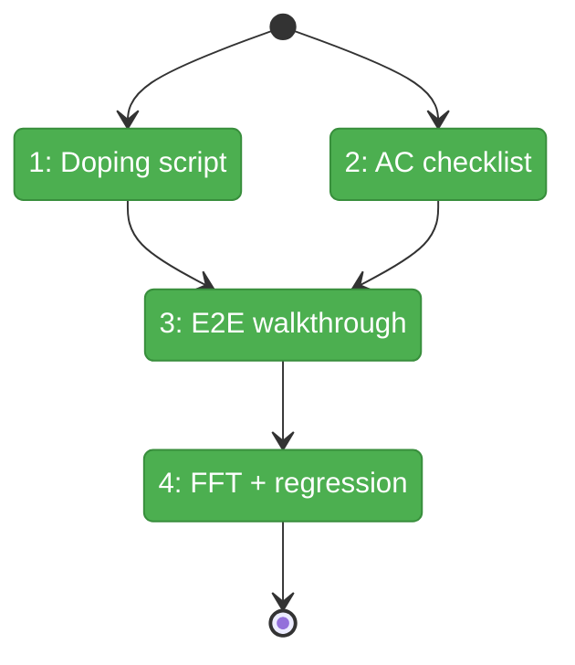
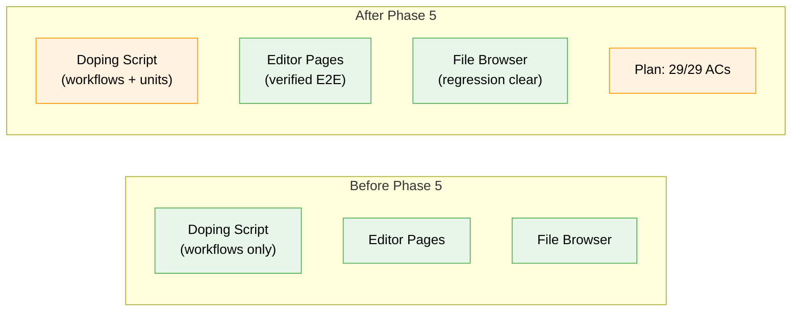

# Flight Plan: Phase 5 — Polish & End-to-End Verification

**Plan**: [workunit-editor-plan.md](../../workunit-editor-plan.md)
**Phase**: Phase 5: Polish & End-to-End Verification
**Generated**: 2026-03-01
**Status**: Landed

---

## Departure → Destination

**Where we are**: Phases 1-4 are complete — IWorkUnitService CRUD, editor pages with type-specific editors, inputs/outputs configuration with drag-reorder, file change notifications with SSE banner, "Edit Template" button with return navigation. 4749 tests passing, `just fft` clean. The doping script creates demo workflows but does not exercise work unit CRUD.

**Where we're going**: A developer can run `just dope` and get demo work units (all 3 types) alongside demo workflows. All 29 acceptance criteria are verified and checked off. File-browser confirmed no regression from CodeEditor extraction.

---

## Domain Context

### Domains We're Changing

| Domain | What Changes | Key Files |
|--------|-------------|-----------|
| test | Extend doping script with work unit CRUD scenarios | `scripts/dope-workflows.ts` |
| plan | Mark all 29 ACs complete | `docs/plans/058-workunit-editor/workunit-editor-plan.md` |

### Domains We Depend On (no changes)

| Domain | What We Consume | Contract |
|--------|----------------|----------|
| `_platform/positional-graph` | Work unit CRUD | `IWorkUnitService.create()`, `update()` |
| `058-workunit-editor` | Editor pages | `/work-units/`, `/work-units/[unitSlug]/` |
| `file-browser` | CodeEditor re-export | `code-editor.tsx` (backward compat) |

---

## Flight Status

<!-- Updated by /plan-6-v2: pending → active → done. Use blocked for problems/input needed. -->

**Legend**: grey = pending | yellow = active | red = blocked/needs input | green = done

---

## Stages

<!-- Updated by /plan-6-v2 during implementation: [ ] → [~] → [x] -->

- [x] **Stage 1: Extend doping script** — Add work unit CRUD scenarios (3 unit types with inputs/outputs) (`scripts/dope-workflows.ts`)
- [x] **Stage 2: Update AC checklist** — Mark Phase 3+4 ACs complete in plan (`workunit-editor-plan.md`)
- [x] **Stage 3: End-to-end walkthrough** — Verify full lifecycle via browser/MCP
- [x] **Stage 4: Final verification** — `just fft` + file-browser regression check

---

## Architecture: Before & After

**Legend**: existing (green, unchanged) | changed (orange, modified) | new (blue, created)

---

## Acceptance Criteria

- [x] All 29 acceptance criteria from spec verified and checked in plan
- [x] `just fft` passes with zero failures
- [x] File-browser renders code with syntax highlighting (no regression)
- [x] `just dope` creates demo work units covering all 3 types

## Goals & Non-Goals

**Goals**:
- Doping script exercises work unit CRUD (all 3 types)
- Full lifecycle verified end-to-end
- All ACs marked complete
- No regressions

**Non-Goals**:
- No new features or UI changes
- No new Playwright browser tests
- No new unit tests

---

## Checklist

- [x] T001: Extend doping script with work unit CRUD scenarios
- [x] T002: Mark Phase 3+4 ACs complete in plan
- [x] T003: End-to-end walkthrough
- [x] T004: Run `just fft` — zero failures
- [x] T005: File-browser CodeEditor regression check
