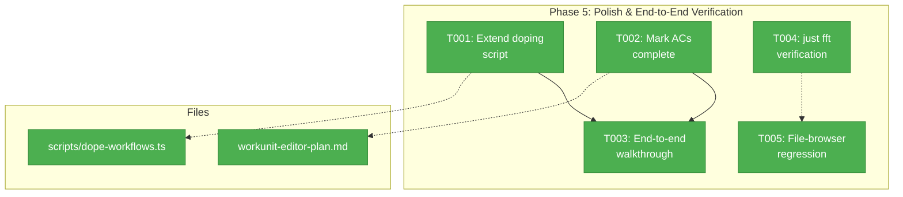
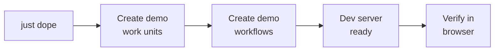
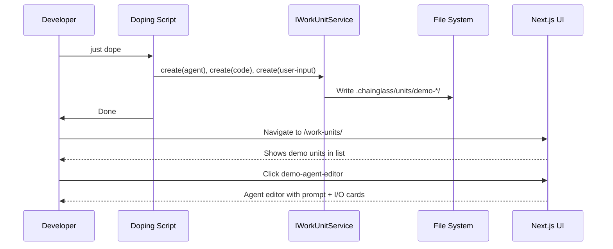

# Phase 5: Polish & End-to-End Verification — Tasks

## Executive Briefing

- **Purpose**: Final verification and polish for Plan 058. Extends the doping script with work unit editor scenarios, performs a full lifecycle walkthrough, confirms all 29 acceptance criteria, and verifies no regressions from CodeEditor extraction.
- **What We're Building**: Doping script scenarios that exercise work unit CRUD (create all 3 types, edit, use in workflow), plus verification that all prior phases work together end-to-end.
- **Goals**: ✅ Doping script covers work unit create/edit/delete lifecycle  ✅ Full end-to-end lifecycle verified (create → edit → use in workflow → rename → delete)  ✅ `just fft` passes clean  ✅ File-browser CodeEditor regression confirmed clear  ✅ All 29 ACs marked complete in plan
- **Non-Goals**: ❌ No new features or UI changes  ❌ No Playwright browser tests (already done in Phase 3/4)  ❌ No new unit tests (all critical paths covered in Phases 1-4)

---

## Prior Phase Context

### Phase 1: Service Layer

**Deliverables**: Extended `IWorkUnitService` with 4 CRUD methods (create, update, delete, rename). 6 result types, E188/E190 error codes, FakeWorkUnitService with call tracking, 40 contract tests.

**Dependencies Exported**: `IWorkUnitService` full CRUD interface, `CreateUnitSpec`, `UpdateUnitPatch`, error factories — all from `@chainglass/positional-graph`.

**Gotchas & Debt**: Rename cascade implemented inline in WorkUnitService (not delegated to IPositionalGraphService). Partial rename failure has no rollback. Type-specific boilerplate hardcoded.

**Incomplete Items**: None.

**Patterns**: TDD cycle (Interface → Fake → RED → GREEN). Zod-first types. String replacement for YAML formatting. Call tracking in fakes.

### Phase 2: Editor Page

**Deliverables**: List page at `/work-units/`, editor page at `/work-units/[unitSlug]/`, 8 server actions, CodeEditor extracted to `_platform/viewer`, 3 type-specific editors, `useAutoSave` hook, `SaveIndicator`, custom `WorkUnitEditorLayout`, sidebar nav entry.

**Dependencies Exported**: CodeEditor component (shared), `useAutoSave` hook, `saveUnitContent` unified routing, domain registered as `058-workunit-editor`.

**Gotchas & Debt**: PanelShell lacks right panel (custom layout needed). `@codemirror/lang-shell` doesn't exist in npm (use legacy-modes). TypeScript `never` exhaustive checks needed for discriminated unions.

**Incomplete Items**: None.

**Patterns**: Unified save abstraction. Server Component → Client Component data flow. Persistent inline error banner for auto-save failures.

### Phase 3: Inputs/Outputs Configuration

**Deliverables**: `InputOutputCard` (expandable, ARIA, form fields), `InputOutputCardList` (DndContext + SortableContext), dual auto-save (structural=immediate, field=debounced), reserved params as virtual locked cards, iOS input fixes, delete confirmation, 17 tests.

**Dependencies Exported**: `hydrateClientIds()`, `stripClientIds()`, `validateItems()` utilities.

**Gotchas & Debt**: `crypto.randomUUID()` requires HTTPS — fallback using `Date.now() + Math.random()`. Importing values from `@chainglass/positional-graph` in client pulls Node.js `fs` into bundle (type-only imports are safe). iOS needs `autoCapitalize="none"`.

**Incomplete Items**: None.

**Patterns**: Single auto-save instance per list. `setActivatorNodeRef` for drag handles (dnd-kit v10). Synthetic `_clientId` for SortableContext, strip before save.

### Phase 4: Change Notifications & Workflow Integration

**Deliverables**: `WorkUnitCatalogWatcherAdapter` (regex filter, 200ms debounce), `useWorkunitCatalogChanges` SSE hook, `WorkUnitUpdatedBanner` (dismissible, page-level), "Edit Template" button on NodePropertiesPanel, "Back to Workflow" breadcrumb with return context, UnitCatalog domain event adapter.

**Dependencies Exported**: `useWorkunitCatalogChanges()` hook, `WorkUnitCatalogWatcherAdapter`.

**Gotchas & Debt**: `.chainglass` in IGNORED_SEGMENTS — must use explicit data watcher path for units/. Switched from GlobalStateSystem to SSE (simpler, established pattern). Banner at page layout level, not inside WorkflowEditor.

**Incomplete Items**: None.

**Patterns**: Adapter pattern (self-filter, debounce, subscriber dispatch). SSE hook pattern (state + dismiss). Bidirectional navigation with query params.

---

## Pre-Implementation Check

| File | Exists? | Domain Check | Notes |
|------|---------|-------------|-------|
| `scripts/dope-workflows.ts` | ✅ Yes | test | Modify — add work unit scenarios to existing SCENARIOS array |
| `docs/plans/058-workunit-editor/workunit-editor-plan.md` | ✅ Yes | plan | Update — mark Phase 3+4 ACs complete, final Phase 5 status |
| `apps/web/src/features/041-file-browser/components/code-editor.tsx` | ✅ Yes | `file-browser` | Verify — re-export from `_platform/viewer` still works |

No new files created. No concept search needed — this phase is verification only.

---

## Architecture Map



---

## Tasks

| Status | ID | Task | Domain | Path(s) | Done When | Notes |
|--------|-----|------|--------|---------|-----------|-------|
| [x] | T001 | Extend doping script with work unit CRUD scenarios: create a demo agent unit, demo code unit, demo user-input unit via IWorkUnitService. Add inputs/outputs to demo units. Verify `just dope` runs clean. | test | `/Users/jordanknight/substrate/058-workunit-editor/scripts/dope-workflows.ts` | `just dope` creates 3 demo work units (one per type) with inputs/outputs; `just dope clean` removes them | Pattern: follow existing SCENARIOS array structure. Use `IWorkUnitService.create()` + `update()`. Units created in `.chainglass/units/demo-*`. CS-2. |
| [x] | T002 | Update plan AC checklist: mark Phase 3 ACs (AC-10 to AC-15) and Phase 4 ACs (AC-22 to AC-26) as complete. Verify all 29 ACs are checked. | plan | `/Users/jordanknight/substrate/058-workunit-editor/docs/plans/058-workunit-editor/workunit-editor-plan.md` | All 29 ACs show `[x]` in the Acceptance Criteria section | Phase 3 and 4 were completed but ACs weren't checked off in the plan. CS-1. |
| [x] | T003 | End-to-end walkthrough: run `just dope` to create demo units, verify list page shows them, verify editor page loads for each type, verify inputs/outputs section renders, verify file-browser page still shows code with syntax highlighting. | all | Manual verification | Walkthrough documented in execution log with evidence | Depends on T001. Use Next.js MCP or Playwright for verification. CS-2. |
| [x] | T004 | Run `just fft` — lint, format, typecheck, test. Confirm zero failures. | all | N/A (command only) | `just fft` passes with 0 failures | Gate before final commit. CS-1. |
| [x] | T005 | Verify file-browser CodeEditor extraction regression: navigate to a file in the file browser, confirm CodeMirror renders with syntax highlighting. | `file-browser` | `/Users/jordanknight/substrate/058-workunit-editor/apps/web/src/features/041-file-browser/components/code-editor.tsx` | File browser renders code files with syntax highlighting (no blank/broken editor) | Re-export confirmed in code; runtime verification needed. CS-1. |

---

## Context Brief

**Key findings from plan**:
- Finding 03: CodeEditor in file-browser is thin wrapper — extracted in Phase 2, backward-compat re-export in place. T005 verifies runtime.
- Finding 06: `@codemirror/lang-shell` doesn't exist — resolved with legacy-modes. Verify bash files render correctly.

**Domain dependencies** (concepts and contracts this phase consumes):
- `_platform/positional-graph`: Work unit CRUD (`IWorkUnitService.create()`, `update()`) — doping script creates demo units
- `058-workunit-editor`: Editor pages (`/work-units/`, `/work-units/[unitSlug]/`) — walkthrough targets
- `file-browser`: CodeEditor re-export (`code-editor.tsx`) — regression check target

**Domain constraints**:
- Doping script uses `@chainglass/positional-graph` directly (not server actions) — follows existing pattern
- No production code changes in this phase — test/verification only

**Reusable from prior phases**:
- Doping script helper functions: `createScriptServices()`, `createCtx()`, `injectState()`
- Existing sample units: `sample-coder` (agent), `sample-pr-creator` (code), `sample-input` (user-input)
- `just dope clean` removes demo-* workflows (need similar for demo-* units)

**System flow**:


**Verification sequence**:


---

## Discoveries & Learnings

_Populated during implementation by plan-6._

| Date | Task | Type | Discovery | Resolution | References |
|------|------|------|-----------|------------|------------|
| 2026-03-01 | T001 | gotcha | Input/output name validation requires underscores not hyphens (`input-file` fails, `input_file` works) | Fixed all demo unit names to use underscores | `InputNameSchema` regex in `workunit.schema.ts` |
| 2026-03-01 | T001 | gotcha | Changed "Dope Workflows" → "Dope" in output broke integration test that asserts on the string | Reverted to "Dope Workflows" prefix | `test/integration/dope-workflows.test.ts:515` |
| 2026-03-01 | T003 | insight | Workspace "chainglass" resolves to main workspace path, not current worktree. Doping script writes to ROOT which is the worktree, not the workspace. | By design — doping script works correctly from main workspace dir | `~/.config/chainglass/workspaces.json` |

---

## Directory Layout

```
docs/plans/058-workunit-editor/
  ├── workunit-editor-plan.md
  └── tasks/phase-5-polish-end-to-end-verification/
      ├── tasks.md                  ← this file
      ├── tasks.fltplan.md          ← flight plan (next)
      └── execution.log.md          ← created by plan-6
```
