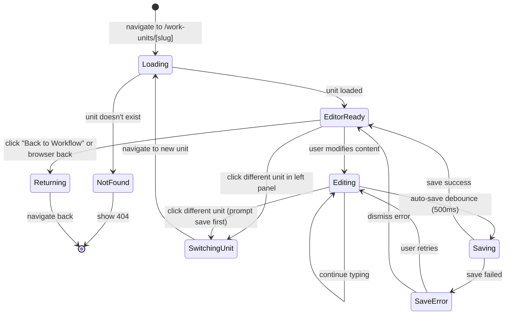

# Workshop: Editor UX Flow & Navigation

**Type**: CLI Flow (UX Flow)
**Plan**: 058-workunit-editor
**Spec**: (pending — see research-dossier.md)
**Created**: 2026-02-28
**Status**: Draft

**Related Documents**:
- [Research Dossier](../research-dossier.md) — Full codebase analysis
- [workflow-ui domain](../../../domains/workflow-ui/domain.md) — Current workflow editor patterns
- [panel-layout domain](../../../domains/_platform/panel-layout/domain.md) — Reusable panel system

**Domain Context**:
- **Primary Domain**: `workflow-ui` (consumer of editor) + new `058-workunit-editor` feature
- **Related Domains**: `_platform/positional-graph` (IWorkUnitService), `_platform/panel-layout` (layout primitives), `_platform/events` (SSE updates)

---

## Purpose

Clarify the **complete navigation and interaction model** for the work unit editor: where it lives, how users get there, what they see, how they navigate within it, and how they return to the workflow canvas. This workshop drives the page/route structure, component layout decisions, and inter-page navigation patterns.

## Key Questions Addressed

- Where does the work unit editor live in the navigation hierarchy?
- How does the user get to the editor — and back?
- What is the editor page layout?
- How do different unit types surface different editor experiences?
- How does the editor relate to the workflow canvas toolbox?
- Should there be a top-level "Work Units" sidebar entry?
- How do breadcrumbs and browser navigation work?

---

## Decision: Dual-Access Architecture

After analyzing the codebase patterns, the research context ("you can click the edit template button and it will pop over"), and the fact that work units are **workspace-level templates, not workflow-scoped**, the design is:

**Work Units get their own top-level page AND a quick-access panel from the workflow canvas.**

| Access Mode | Route | UX Pattern | When |
|-------------|-------|------------|------|
| **Direct navigation** | `/workspaces/[slug]/work-units/` | Full page — sidebar nav | Managing the unit catalog |
| **Direct edit** | `/workspaces/[slug]/work-units/[unitSlug]` | Full page — editor | Creating/editing a specific unit |
| **From workflow** | `/workspaces/[slug]/work-units/[unitSlug]?from=workflow&graph=[graphSlug]` | Full page + return context | "Edit Template" button on node |

**Why not a modal/popover from the canvas?**
- Work units are workspace-level, not workflow-scoped — they deserve a real page
- The user quote says "pop over and allow you to edit" — but editing a prompt template or script needs real screen space
- Modal/popover approach would fight the existing `NodeEditModal`, `QAModal`, `HumanInputModal` layering
- A page navigation with return context gives clean browser history and deep linking
- The PanelShell layout system exists for exactly this kind of multi-panel workspace page

**Why this format**: The workflow editor uses a custom standalone layout (no PanelShell). The file browser uses PanelShell. The work unit editor is closer to the file browser in complexity — it has a catalog to browse (left panel), content to edit (main panel), and metadata to configure (right panel). **PanelShell is the right choice here.**

---

## Navigation Hierarchy

```
Dashboard
├── Workspaces
│   └── [workspace-slug]
│       ├── Browser          ← existing (uses PanelShell)
│       ├── Agents           ← existing
│       ├── Workflows        ← existing (custom layout)
│       │   └── [graphSlug]  ← workflow editor (canvas + toolbox)
│       ├── Work Units       ← NEW top-level entry
│       │   └── [unitSlug]   ← unit editor (PanelShell)
│       └── Settings         ← existing
```

### Sidebar Update

Current `WORKSPACE_NAV_ITEMS` in `dashboard-sidebar.tsx`:

```
Browser     → FolderOpen icon
Agents      → Bot icon
Workflows   → ListChecks icon
```

After change:

```
Browser     → FolderOpen icon
Agents      → Bot icon
Workflows   → ListChecks icon
Work Units  → Blocks icon        ← NEW
```

**Why "Work Units" not "Templates"**: The research dossier establishes that work units are the canonical name. "Templates" is overloaded (workflow templates exist separately via ITemplateService).

---

## Flow 1: Direct Navigation (Catalog Browsing)

```
┌──────────────────────────────────────────────────────────────────────┐
│ USER clicks "Work Units" in sidebar                                  │
└──────────────────────────────────────────────────────────────────────┘
                              │
                              ▼
┌──────────────────────────────────────────────────────────────────────┐
│ /workspaces/[slug]/work-units/                                       │
│                                                                      │
│ ┌─────────────────────────────────────────────────────────────────┐  │
│ │ WORK UNIT LIST PAGE                                             │  │
│ │                                                                 │  │
│ │ ┌────────────────┐  ┌──────────────────────────────────────┐    │  │
│ │ │ Header         │  │ Search / Filter                       │    │  │
│ │ │ "Work Units"   │  │ [🔍 Filter units...]  [+ New Unit ▾] │    │  │
│ │ └────────────────┘  └──────────────────────────────────────┘    │  │
│ │                                                                 │  │
│ │ ┌──────────────────────────────────────────────────────────┐    │  │
│ │ │ 🤖 Agents                                          3 units│    │  │
│ │ ├──────────────────────────────────────────────────────────┤    │  │
│ │ │  sample-coder       v1.0.0  "Code review agent"         │    │  │
│ │ │  sample-reviewer    v1.0.0  "PR review agent"            │    │  │
│ │ │  my-custom-agent    v2.1.0  "Custom analysis"            │    │  │
│ │ ├──────────────────────────────────────────────────────────┤    │  │
│ │ │ 💻 Code                                            2 units│    │  │
│ │ ├──────────────────────────────────────────────────────────┤    │  │
│ │ │  sample-script      v1.0.0  "Build runner"               │    │  │
│ │ │  deploy-script      v1.0.0  "Deployment script"          │    │  │
│ │ ├──────────────────────────────────────────────────────────┤    │  │
│ │ │ 👤 Human Input                                     1 unit │    │  │
│ │ ├──────────────────────────────────────────────────────────┤    │  │
│ │ │  sample-input       v1.0.0  "Deployment target"          │    │  │
│ │ └──────────────────────────────────────────────────────────┘    │  │
│ └─────────────────────────────────────────────────────────────────┘  │
└──────────────────────────────────────────────────────────────────────┘
                              │
                         click unit
                              │
                              ▼
┌──────────────────────────────────────────────────────────────────────┐
│ /workspaces/[slug]/work-units/[unitSlug]                             │
│                                                                      │
│ (Editor page — see "Editor Layout" section below)                    │
└──────────────────────────────────────────────────────────────────────┘
```

### Work Unit List Page — Component Structure

```tsx
// apps/web/app/(dashboard)/workspaces/[slug]/work-units/page.tsx
// Server Component — loads units, renders client
export default async function WorkUnitsPage({ params }) {
  const { slug } = await params;
  const units = await listWorkUnits(slug);
  return <WorkUnitListClient slug={slug} units={units} />;
}
```

Pattern follows `workflows/page.tsx` exactly: server component fetches data, passes to client component.

### List Page Actions

| Action | Trigger | Result |
|--------|---------|--------|
| Click unit row | Navigate | → `/work-units/[unitSlug]` |
| "+ New Unit" button | NamingModal opens | Dropdown: Agent / Code / Human Input |
| Search/filter | Local filter | Filters visible units by slug/description |
| Group collapse | Toggle | Collapse/expand type groups |

---

## Flow 2: From Workflow Canvas ("Edit Template")

This is the primary flow described in the user story: "click the edit template button and it will pop over."

```
┌──────────────────────────────────────────────────────────────────────┐
│ USER is on workflow editor canvas                                    │
│ /workspaces/[slug]/workflows/[graphSlug]                             │
│                                                                      │
│ ┌──────────────────────────────┐ ┌────────────────────────────────┐  │
│ │         CANVAS               │ │  NODE PROPERTIES PANEL (260px) │  │
│ │                              │ │                                │  │
│ │   ┌─────────┐               │ │  ← Back                       │  │
│ │   │ node-1  │ ← selected    │ │  Properties                   │  │
│ │   └─────────┘               │ │                                │  │
│ │                              │ │  🤖 sample-coder  (agent)     │  │
│ │   ┌─────────┐               │ │  Status: pending               │  │
│ │   │ node-2  │               │ │  Context: green ●              │  │
│ │   └─────────┘               │ │                                │  │
│ │                              │ │  ─────────────────             │  │
│ │                              │ │  Inputs (2)                   │  │
│ │                              │ │   source_code ← node-0.output │  │
│ │                              │ │   context ← (unwired)         │  │
│ │                              │ │                                │  │
│ │                              │ │  ─────────────────             │  │
│ │                              │ │  [ Edit Properties... ]        │  │
│ │                              │ │  [ ✏️ Edit Template   ]  ← NEW │  │
│ │                              │ │                                │  │
│ └──────────────────────────────┘ └────────────────────────────────┘  │
└──────────────────────────────────────────────────────────────────────┘
                              │
                   click "Edit Template"
                              │
                              ▼
┌──────────────────────────────────────────────────────────────────────┐
│ Browser navigates to:                                                │
│ /workspaces/[slug]/work-units/sample-coder?from=workflow&graph=my-wf │
│                                                                      │
│ ┌────────────────────────────────────────────────────────────────┐   │
│ │ ← Back to Workflow: my-wf                                      │   │
│ │ ─────────────────────────────────────────────────────────────── │   │
│ │                                                                │   │
│ │  (Full editor layout — see "Editor Layout" section below)      │   │
│ │                                                                │   │
│ └────────────────────────────────────────────────────────────────┘   │
└──────────────────────────────────────────────────────────────────────┘
```

### Return Navigation

When the user navigates to the editor **from a workflow**, the `?from=workflow&graph=my-wf` query params tell the editor to show a contextual return bar:

```
┌──────────────────────────────────────────────────────────────────┐
│ ← Back to Workflow: my-wf    │   Work Units / sample-coder      │
│ (clickable link)              │   (breadcrumb)                    │
└──────────────────────────────────────────────────────────────────┘
```

- Clicking "Back to Workflow" navigates to `/workspaces/[slug]/workflows/my-wf`
- Browser back button also works (standard navigation)
- If user arrived directly (no `?from`), no return bar is shown — standard breadcrumbs only

**Why query params, not state**: URL query params survive page refresh, bookmarking, and sharing. React state would lose the return context.

### "Edit Template" vs "Edit Properties"

The existing `NodeEditModal` edits **node-level overrides** (description, orchestratorSettings, input wiring). "Edit Template" edits the **underlying work unit template** that the node references. These are different operations:

| Button | What It Edits | Scope | Existing? |
|--------|--------------|-------|-----------|
| Edit Properties | Node description, settings, input wiring | This node only | ✅ NodeEditModal |
| Edit Template | Unit slug, prompt/script/config, inputs/outputs | Global unit catalog | ❌ NEW |

**Important UX note**: Editing a template affects ALL workflows that reference this unit (since graph nodes resolve units by slug at runtime). The editor must show a warning:

```
┌──────────────────────────────────────────────────────────────┐
│ ⚠️  This unit is referenced by 3 workflows.                  │
│     Changes will affect: my-workflow, deploy-pipeline, test   │
└──────────────────────────────────────────────────────────────┘
```

---

## Flow 3: Creating a New Work Unit

Two entry points, same destination:

### From Work Units list page

```
User clicks [+ New Unit ▾]
         │
         ▼
┌──────────────────────────┐
│ Select unit type:         │
│  🤖 Agent                │
│  💻 Code                 │
│  👤 Human Input          │
└──────────────────────────┘
         │
    selects type
         │
         ▼
┌──────────────────────────┐
│ NamingModal               │
│                           │
│ Name: [my-new-agent    ]  │
│ (kebab-case validated)    │
│                           │
│     [Cancel]  [Create]    │
└──────────────────────────┘
         │
       Create
         │
         ▼
Navigate to /work-units/my-new-agent
(editor opens with scaffold)
```

### From Workflow Toolbox (future enhancement)

```
Toolbox panel shows:
  [+ Create New Unit]  ← at bottom of unit list
         │
    Same flow as above, but with ?from=workflow&graph=... params
```

### Scaffold Content

When a new unit is created, the server action:
1. Creates `.chainglass/units/<slug>/unit.yaml` with type-appropriate defaults
2. Creates template file (agent: `prompts/main.md`, code: `scripts/main.sh`)
3. Navigates to the editor

Default `unit.yaml` (agent):
```yaml
slug: my-new-agent
type: agent
version: "1.0.0"
description: ""
agent:
  prompt_template: prompts/main.md
  system_prompt: ""
  supported_agents:
    - claude-code
inputs: []
outputs: []
```

---

## Editor Layout (The Core)

The editor page uses `PanelShell` from `_platform/panel-layout` — same system as the file browser.

```
┌─────────────────────────────────────────────────────────────────────────┐
│ EXPLORER PANEL (top bar)                                                │
│                                                                         │
│ ← Back to Workflow: my-wf  │  Work Units / sample-coder  │  v1.0.0    │
│ (conditional return link)     (breadcrumb path)              (version)  │
└─────────────────────────────────────────────────────────────────────────┘
┌──────────────┬──────────────────────────────────────┬───────────────────┐
│ LEFT PANEL   │ MAIN PANEL                           │ RIGHT PANEL       │
│ (280px)      │ (flex-1)                             │ (300px)           │
│              │                                      │                   │
│ Unit Catalog │ Type-Specific Editor                  │ Configuration     │
│              │                                      │                   │
│ ┌──────────┐ │ ┌──────────────────────────────────┐ │ ┌───────────────┐ │
│ │ 🔍 Search│ │ │ [Prompt] [Preview]               │ │ │ Metadata      │ │
│ └──────────┘ │ │ ─────────────────                 │ │ │               │ │
│              │ │                                    │ │ │ Slug:         │ │
│ ▸ Agents (3) │ │  # System Prompt                   │ │ │ sample-coder  │ │
│   ● sample-  │ │                                    │ │ │               │ │
│     coder ← │ │  You are a code review assistant.  │ │ │ Type:         │ │
│   ○ sample-  │ │  Review the provided source code   │ │ │ 🤖 Agent     │ │
│     reviewer │ │  and provide feedback on:           │ │ │               │ │
│   ○ my-agent │ │  - Code quality                    │ │ │ Version:      │ │
│              │ │  - Security issues                 │ │ │ [1.0.0     ]  │ │
│ ▸ Code (2)   │ │  - Performance                     │ │ │               │ │
│   ○ sample-  │ │                                    │ │ │ Description:  │ │
│     script   │ │  ## Template Variables              │ │ │ [Code review ]│ │
│   ○ deploy   │ │                                    │ │ │ [agent       ]│ │
│              │ │  {{source_code}}                   │ │ │               │ │
│ ▸ Human (1)  │ │                                    │ │ ├───────────────┤ │
│   ○ sample-  │ │                                    │ │ │ Inputs        │ │
│     input    │ │                                    │ │ │               │ │
│              │ │                                    │ │ │ + Add Input   │ │
│              │ │                                    │ │ │               │ │
│              │ │                                    │ │ │ ┌───────────┐ │ │
│              │ │                                    │ │ │ │source_code│ │ │
│              │ │                                    │ │ │ │type: data │ │ │
│              │ │                                    │ │ │ │req: true  │ │ │
│              │ │                                    │ │ │ └───────────┘ │ │
│              │ │                                    │ │ │               │ │
│              │ │                                    │ │ ├───────────────┤ │
│              │ │                                    │ │ │ Outputs       │ │
│              │ │                                    │ │ │               │ │
│              │ │                                    │ │ │ + Add Output  │ │
│              │ │                                    │ │ │               │ │
│              │ │                                    │ │ │ ┌───────────┐ │ │
│              │ │                                    │ │ │ │review_    │ │ │
│              │ │                                    │ │ │ │ result    │ │ │
│              │ │                                    │ │ │ │type: data │ │ │
│              │ │                                    │ │ │ └───────────┘ │ │
│              │ │                                    │ │ │               │ │
│              │ │                                    │ │ ├───────────────┤ │
│              │ │                                    │ │ │ ⚠️ Used in:   │ │
│              │ │                                    │ │ │  my-workflow  │ │
│              │ │                                    │ │ │  deploy-pipe  │ │
│              │ │                                    │ │ └───────────────┘ │
│              │                                      │                   │
└──────────────┴──────────────────────────────────────┴───────────────────┘
```

### Panel Responsibilities

| Panel | Content | Behavior |
|-------|---------|----------|
| **Explorer (top)** | Return link (conditional), breadcrumb, version badge | Always visible |
| **Left** | Unit catalog (grouped, searchable) | Active unit highlighted (●), click to switch. Reuses PanelShell LeftPanel |
| **Main** | Type-specific editor (prompt, script, form builder) | Content changes per unit type. Tabs for edit/preview |
| **Right** | Metadata + Inputs + Outputs + Usage warnings | Always visible, scrollable sections |

### Layout Implementation

```tsx
// apps/web/app/(dashboard)/workspaces/[slug]/work-units/[unitSlug]/page.tsx

import { PanelShell } from '@/features/_platform/panel-layout';

export default async function WorkUnitEditorPage({ params, searchParams }) {
  const { slug, unitSlug } = await params;
  const { from, graph } = await searchParams;
  
  const unit = await loadWorkUnit(slug, unitSlug);
  const allUnits = await listWorkUnits(slug);
  
  return (
    <WorkUnitEditorClient
      slug={slug}
      unit={unit}
      allUnits={allUnits}
      returnContext={from === 'workflow' ? { type: 'workflow', graphSlug: graph } : null}
    />
  );
}
```

**Why PanelShell**: The file browser already uses it. The left panel catalog + main editor + right config mirrors the file browser's tree + viewer + (future) properties pattern. Reusing PanelShell maintains UX consistency.

**Why a right panel (not just left + main)**: The inputs/outputs configuration is always relevant while editing. Having it visible alongside the editor prevents modal fatigue and lets users see how their prompt template references input variables.

---

## Type-Specific Editor Views

The main panel content changes based on unit type. Each type has distinct editing needs (per PL-06: "Agent units need `getPrompt()`/`setPrompt()`, code units need `getScript()`/`setScript()`").

### Agent Unit Editor

```
┌──────────────────────────────────────────────────────────────────┐
│  [Prompt ✏️]  [System Prompt]  [Agent Config]                    │
│  ─────────────────────────────────────────────────────────────── │
│                                                                  │
│  # Prompt Template                                               │
│  ─────────────────                                               │
│                                                                  │
│  ┌────────────────────────────────────────────────────────────┐  │
│  │ (Textarea or code editor — markdown mode)                  │  │
│  │                                                            │  │
│  │ You are a code review assistant.                           │  │
│  │ Review the provided source code and provide feedback on:   │  │
│  │ - Code quality                                             │  │
│  │ - Security issues                                          │  │
│  │ - Performance                                              │  │
│  │                                                            │  │
│  │ ## Source Code                                              │  │
│  │                                                            │  │
│  │ {{source_code}}                                            │  │
│  │                                                            │  │
│  └────────────────────────────────────────────────────────────┘  │
│                                                                  │
│  Available template variables: {{source_code}}, {{main-prompt}}  │
│  ─────────────────────────────────────────────────────────────── │
│  Auto-saved ✓  Last saved: 2 seconds ago                         │
└──────────────────────────────────────────────────────────────────┘
```

**Tabs**:
- **Prompt** — Edit `prompts/main.md` (the prompt template file)
- **System Prompt** — Edit `agent.system_prompt` field in unit.yaml
- **Agent Config** — Edit `agent.supported_agents[]` list

### Code Unit Editor

```
┌──────────────────────────────────────────────────────────────────┐
│  [Script ✏️]  [Config]                                           │
│  ─────────────────────────────────────────────────────────────── │
│                                                                  │
│  # Script: scripts/main.sh                                       │
│  ─────────────────                                               │
│                                                                  │
│  ┌────────────────────────────────────────────────────────────┐  │
│  │ (Code editor — bash/python/js mode based on extension)     │  │
│  │                                                            │  │
│  │ #!/bin/bash                                                │  │
│  │ set -euo pipefail                                          │  │
│  │                                                            │  │
│  │ echo "Building project..."                                 │  │
│  │ npm run build                                              │  │
│  │                                                            │  │
│  │ echo "Running tests..."                                    │  │
│  │ npm test                                                   │  │
│  │                                                            │  │
│  └────────────────────────────────────────────────────────────┘  │
│                                                                  │
│  ─────────────────────────────────────────────────────────────── │
│  Auto-saved ✓  Timeout: 300s                                     │
└──────────────────────────────────────────────────────────────────┘
```

**Tabs**:
- **Script** — Edit the script file (`scripts/main.sh`)
- **Config** — Edit `code.timeout`, `code.script` path

### Human Input Unit Editor

```
┌──────────────────────────────────────────────────────────────────┐
│  [Form Builder ✏️]  [Preview]                                    │
│  ─────────────────────────────────────────────────────────────── │
│                                                                  │
│  Question Type: [single ▾]                                       │
│                                                                  │
│  Prompt:                                                         │
│  ┌────────────────────────────────────────────────────────────┐  │
│  │ Choose a deployment target                                 │  │
│  └────────────────────────────────────────────────────────────┘  │
│                                                                  │
│  Options:                                                        │
│  ┌────────────────────────────────────────────────────────────┐  │
│  │ ┌─────────────────────────────────────────────────────┐    │  │
│  │ │ Key: staging                                         │    │  │
│  │ │ Label: Staging                                       │    │  │
│  │ │ Description: Deploy to staging environment           │    │  │
│  │ │                                          [🗑️ Remove] │    │  │
│  │ └─────────────────────────────────────────────────────┘    │  │
│  │ ┌─────────────────────────────────────────────────────┐    │  │
│  │ │ Key: production                                      │    │  │
│  │ │ Label: Production                                    │    │  │
│  │ │ Description: Deploy to production environment        │    │  │
│  │ │                                          [🗑️ Remove] │    │  │
│  │ └─────────────────────────────────────────────────────┘    │  │
│  │                                                            │  │
│  │ [+ Add Option]                                             │  │
│  └────────────────────────────────────────────────────────────┘  │
│                                                                  │
│  Auto-saved ✓                                                    │
└──────────────────────────────────────────────────────────────────┘
```

**Tabs**:
- **Form Builder** — Visual editor for question config
- **Preview** — Live preview of how the question renders (matches HumanInputModal)

### Tab Component Pattern

Use existing `shadcn/ui` Tabs (already installed at `apps/web/src/components/ui/tabs.tsx`):

```tsx
import { Tabs, TabsList, TabsTrigger, TabsContent } from '@/components/ui/tabs';

function AgentEditor({ unit }: { unit: AgentWorkUnit }) {
  return (
    <Tabs defaultValue="prompt" className="flex flex-col h-full">
      <TabsList className="shrink-0">
        <TabsTrigger value="prompt">Prompt</TabsTrigger>
        <TabsTrigger value="system">System Prompt</TabsTrigger>
        <TabsTrigger value="config">Agent Config</TabsTrigger>
      </TabsList>
      <TabsContent value="prompt" className="flex-1 overflow-hidden">
        <PromptEditor unit={unit} />
      </TabsContent>
      {/* ... */}
    </Tabs>
  );
}
```

---

## Right Panel: Configuration Sidebar

The right panel is consistent across all unit types. It's a scrollable stack of configuration sections.

```
┌───────────────────────────────┐
│ METADATA                      │
│                               │
│ Slug                          │
│ ┌─────────────────────────┐   │
│ │ sample-coder            │   │ ← Read-only after creation (PL-15: kebab-case)
│ └─────────────────────────┘   │
│                               │
│ Type                          │
│ 🤖 Agent                     │ ← Read-only badge (type is immutable)
│                               │
│ Version                       │
│ ┌─────────────────────────┐   │
│ │ 1.0.0                   │   │ ← Editable semver
│ └─────────────────────────┘   │
│                               │
│ Description                   │
│ ┌─────────────────────────┐   │
│ │ Code review agent that  │   │ ← Textarea
│ │ analyzes source code    │   │
│ └─────────────────────────┘   │
│                               │
├───────────────────────────────┤
│ INPUTS                    [+] │
│                               │
│ ┌─────────────────────────┐   │
│ │ source_code          ✕  │   │
│ │ type: data │ text        │   │
│ │ required: ✅             │   │
│ │ "The code to review"    │   │
│ └─────────────────────────┘   │
│                               │
│ ┌─────────────────────────┐   │
│ │ context              ✕  │   │
│ │ type: data │ text        │   │
│ │ required: ☐              │   │
│ │ "Additional context"    │   │
│ └─────────────────────────┘   │
│                               │
├───────────────────────────────┤
│ OUTPUTS                   [+] │
│                               │
│ ┌─────────────────────────┐   │
│ │ review_result        ✕  │   │
│ │ type: data │ text        │   │
│ │ required: ✅             │   │
│ │ "The review output"     │   │
│ └─────────────────────────┘   │
│                               │
├───────────────────────────────┤
│ USAGE                         │
│                               │
│ ⚠️ Referenced by 2 workflows: │
│   • my-workflow (3 nodes)     │
│   • deploy-pipeline (1 node)  │
│                               │
│ Changes affect all references │
├───────────────────────────────┤
│ ACTIONS                       │
│                               │
│ [Duplicate Unit]              │
│ [🗑️ Delete Unit]  ← danger   │
└───────────────────────────────┘
```

### Input/Output Editor Interaction

Adding a new input:

```
Click [+] next to "INPUTS"
         │
         ▼
┌──────────────────────────┐
│ New Input                 │
│                           │
│ Name: [              ]    │  ← kebab-case validated (PL-15)
│ Type: [data ▾]            │  ← data | file
│ Data Type: [text ▾]       │  ← text | json | binary (when type=data)
│ Required: [✅]            │
│ Description: [          ] │
│                           │
│     [Cancel]  [Add]       │
└──────────────────────────┘
```

**Validation rules** (from research):
- Input names must be unique within the unit
- Names with hyphens are reserved (`main-prompt`, `main-script`) — user inputs use underscores
- Names validated: `/^[a-z][a-z0-9_]*$/` (underscores for user inputs, per reserved-params.ts)

---

## State Diagram: Editor Page States



### Auto-Save Behavior

The editor uses **debounced auto-save** (not explicit Save button):

| Event | Debounce | Action |
|-------|----------|--------|
| Text change in prompt/script editor | 500ms | `updateWorkUnit(slug, changes)` server action |
| Metadata field blur | Immediate | `updateWorkUnit(slug, changes)` server action |
| Input/output add/remove | Immediate | `updateWorkUnit(slug, changes)` server action |
| Tab switch | Flush pending | Save any pending changes before tab switch |
| Unit switch (left panel) | Flush pending | Save, then navigate |
| Page leave | Flush pending | `beforeunload` handler if unsaved changes |

**Save indicator** (bottom of main panel):
```
Auto-saved ✓  Last saved: 2 seconds ago          ← success (fades after 3s)
Saving...                                          ← during save
⚠️ Save failed. Retrying...                        ← error with auto-retry
```

**Why auto-save not explicit save**: 
1. The filesystem is the source of truth (per research: "every mutation persists atomically")
2. The existing workflow canvas saves all mutations immediately (no save button)
3. Reduces cognitive load — user focuses on editing, not saving
4. Uses `atomicWriteFile()` per PL-07 for crash safety

---

## Navigation State & URL Design

### URL Structure

```
/workspaces/[slug]/work-units                              → list page
/workspaces/[slug]/work-units/[unitSlug]                   → editor (direct)
/workspaces/[slug]/work-units/[unitSlug]?from=workflow&graph=my-wf  → editor (from workflow)
/workspaces/[slug]/work-units/[unitSlug]?tab=system        → editor with tab pre-selected
```

### Query Parameters

| Param | Values | Purpose |
|-------|--------|---------|
| `from` | `workflow` | Return context type |
| `graph` | `[graphSlug]` | Which workflow to return to |
| `tab` | `prompt`, `system`, `config`, `script`, `builder`, `preview` | Pre-select editor tab |

### Breadcrumb Structure

**Direct access:**
```
Workspace: my-workspace  ›  Work Units  ›  sample-coder
```

**From workflow:**
```
← Back to Workflow: my-wf  │  Work Units  ›  sample-coder
```

Using existing `Breadcrumb` components from `apps/web/src/components/ui/breadcrumb.tsx`:

```tsx
<Breadcrumb>
  <BreadcrumbList>
    {returnContext && (
      <>
        <BreadcrumbItem>
          <BreadcrumbLink href={`/workspaces/${slug}/workflows/${returnContext.graphSlug}`}>
            ← Back to Workflow: {returnContext.graphSlug}
          </BreadcrumbLink>
        </BreadcrumbItem>
        <BreadcrumbSeparator />
      </>
    )}
    <BreadcrumbItem>
      <BreadcrumbLink href={`/workspaces/${slug}/work-units`}>
        Work Units
      </BreadcrumbLink>
    </BreadcrumbItem>
    <BreadcrumbSeparator />
    <BreadcrumbItem>
      <BreadcrumbPage>{unitSlug}</BreadcrumbPage>
    </BreadcrumbItem>
  </BreadcrumbList>
</Breadcrumb>
```

---

## Integration with Workflow Canvas Toolbox

The existing `WorkUnitToolbox` (right sidebar of workflow editor) lists units for drag-and-drop. The work unit editor creates a **round-trip** with the toolbox:

```
┌─────────────┐     drag & drop      ┌──────────────────┐
│  Toolbox    │ ──────────────────▸  │  Workflow Canvas  │
│  (unit list)│                      │  (nodes on lines) │
│             │ ◂──── "Edit Template" │                  │
│             │       (navigate out)  │  (via properties │
│             │                      │   panel button)   │
└──────┬──────┘                      └──────────────────┘
       │
       │  Toolbox unit list should show
       │  "Edit" action (pencil icon)
       │  on hover/context menu
       │
       ▼
┌──────────────────────────────────────────────────────────────┐
│ /workspaces/[slug]/work-units/[unitSlug]?from=workflow&...   │
│ (Work Unit Editor page)                                      │
└──────────────────────────────────────────────────────────────┘
```

### Toolbox Enhancement (Minimal)

Add an edit icon to toolbox unit items:

```
┌────────────────────────────┐
│ 🤖 Agents                  │
│ ┌────────────────────────┐ │
│ │ sample-coder      [✏️] │ │  ← pencil icon → navigate to editor
│ │ sample-reviewer   [✏️] │ │
│ └────────────────────────┘ │
│                            │
│ 💻 Code                    │
│ ┌────────────────────────┐ │
│ │ sample-script     [✏️] │ │
│ └────────────────────────┘ │
└────────────────────────────┘
```

The pencil icon is a `<Link>` to `/work-units/[unitSlug]?from=workflow&graph=[currentGraph]`.

---

## Responsive Behavior

### Desktop (≥768px)
Full three-panel layout as shown above.

### Tablet / Narrow (< 768px)
- Left panel collapses to icon-only sidebar (unit type icons)
- Right panel moves to bottom sheet or collapsible drawer
- Main panel gets full width

### Mobile (bottom tab bar mode)
- Single column: catalog → editor → config as stacked sections
- "Work Units" appears in bottom tab bar (matches existing BottomTabBar pattern)
- Tab layout scrolls vertically

**Implementation note**: The existing `NavigationWrapper` already switches between `DashboardShell` (desktop sidebar) and `BottomTabBar` (mobile). Adding "Work Units" to `WORKSPACE_NAV_ITEMS` automatically handles both.

---

## File Structure

```
apps/web/
├── app/(dashboard)/workspaces/[slug]/
│   └── work-units/
│       ├── page.tsx                          ← List page (server component)
│       └── [unitSlug]/
│           └── page.tsx                      ← Editor page (server component)
│
├── src/features/058-workunit-editor/
│   ├── index.ts                             ← Barrel export
│   ├── types.ts                             ← WorkUnitEditorState, ReturnContext
│   │
│   ├── components/
│   │   ├── work-unit-list-client.tsx         ← List page client component
│   │   ├── work-unit-editor-client.tsx       ← Editor page client component
│   │   ├── unit-catalog-panel.tsx            ← Left panel: unit list with search
│   │   ├── unit-metadata-panel.tsx           ← Right panel: metadata + inputs/outputs
│   │   ├── agent-editor.tsx                  ← Main panel: agent prompt/config editor
│   │   ├── code-editor.tsx                   ← Main panel: script editor
│   │   ├── human-input-editor.tsx            ← Main panel: form builder
│   │   ├── input-output-editor.tsx           ← Shared: input/output CRUD
│   │   ├── unit-usage-warning.tsx            ← "Referenced by N workflows" warning
│   │   └── create-unit-modal.tsx             ← Type picker + NamingModal
│   │
│   ├── hooks/
│   │   ├── use-unit-auto-save.ts             ← Debounced auto-save logic
│   │   └── use-unit-editor-state.ts          ← Editor state management
│   │
│   └── lib/
│       └── editor-utils.ts                   ← Type-specific editor dispatch, validation
│
├── app/actions/
│   └── workunit-actions.ts                   ← Server actions (separate from workflow-actions)
```

**Why separate `workunit-actions.ts`**: The existing `workflow-actions.ts` has 28 actions. Work unit CRUD is a distinct concern. Separation keeps files manageable and supports independent evolution (per research recommendation).

---

## Error States

| Error | User Sees | Recovery |
|-------|-----------|----------|
| Unit not found (404) | "Work unit not found" + link to catalog | Navigate to list |
| Save failed (disk error) | "⚠️ Save failed. Retrying..." toast | Auto-retry (3x), then manual retry button |
| Unit deleted while editing | "This unit was deleted" warning bar | Navigate to list |
| Validation error (bad input name) | Inline error on field | Fix the field |
| Concurrent edit (SSE update) | "Updated externally" toast + content refresh | Editor content updates (no conflict resolution for v1) |
| Network error | "Connection lost" banner | Auto-reconnect SSE |

### SSE Integration

Following the pattern of `WorkflowWatcherAdapter` (per Critical Finding 03 — no catalog change eventing exists yet):

```
.chainglass/units/<slug>/    ← fs.watch or chokidar
         │
         ▼
WorkUnitCatalogWatcher       ← 200ms debounce
         │
         ▼
SSE channel: 'work-units'   ← push to browser
         │
         ▼
useWorkUnitSSE hook          ← React hook in editor
         │
         ▼
Refresh unit data            ← re-fetch from server
```

---

## Open Questions

### Q1: Should the left panel catalog support drag-and-drop to workflows?

**OPEN**: If a user is in the work unit editor and wants to add a unit to a workflow, can they drag from the catalog? This would require cross-page communication or opening the workflow in a split view. **Recommendation**: Not for v1. Keep the toolbox on the workflow page as the drag source.

### Q2: Code editor component choice?

**OPEN**: Agent prompts and code scripts need a code editor. Options:
- **Option A**: Simple `<textarea>` — zero bundle cost, good enough for v1
- **Option B**: CodeMirror 6 — lightweight, React-friendly, good markdown support
- **Option C**: Monaco Editor — powerful, heavy (~2MB), VSCode-like

**Recommendation**: Start with `<textarea>` for v1 (matches the existing `NodeEditModal` pattern which uses plain inputs). Upgrade to CodeMirror 6 in a follow-up phase. See Research Opportunity 1 in the dossier.

### Q3: Should the left panel persist across unit navigation?

**RESOLVED**: Yes. When clicking a different unit in the left catalog, the URL changes to `/work-units/[newSlug]` but the three-panel layout persists. The left panel stays scrolled to the same position. This matches the file browser behavior where clicking a file in the tree changes the main panel without resetting the sidebar.

### Q4: Undo/redo in the editor?

**OPEN**: The workflow canvas has an undo system (`UndoRedoManager`). Should the work unit editor have undo too?
- **Option A**: Browser-native undo (Cmd+Z in textarea/inputs) — free, covers text editing
- **Option B**: Custom undo stack for structural changes (add/remove inputs/outputs)

**Recommendation**: Browser-native undo for v1 (text content). Structural undo (input/output changes) deferred — auto-save makes accidental deletions recoverable via git.

### Q5: How does the "New Unit" action from the toolbox integrate?

**RESOLVED**: The toolbox shows a "+ Create New Unit" link at the bottom. Clicking it navigates to `/work-units/?action=create&from=workflow&graph=[graphSlug]`. The list page detects the `action=create` param and opens the create modal immediately. After creation, the user is in the editor with workflow return context preserved.

---

## Quick Reference

### Route Map
```
/workspaces/[slug]/work-units                  → WorkUnitListPage
/workspaces/[slug]/work-units/[unitSlug]       → WorkUnitEditorPage
```

### New Components
```
WorkUnitListClient          → List page with grouped units
WorkUnitEditorClient        → PanelShell with catalog + editor + config
UnitCatalogPanel            → Left panel: searchable unit list
UnitMetadataPanel           → Right panel: metadata + I/O + usage
AgentEditor                 → Prompt + system prompt + agent config tabs
CodeEditor                  → Script + config tabs
HumanInputEditor            → Form builder + preview tabs
InputOutputEditor           → Shared input/output CRUD cards
CreateUnitModal             → Type picker + naming
UnitUsageWarning            → "Referenced by N workflows" banner
```

### Navigation Items Update
```tsx
// apps/web/src/lib/navigation-utils.ts
{ label: 'Work Units', href: '/work-units', icon: Blocks }
```

### Server Actions (new file)
```
createWorkUnit(slug, type, name)    → creates scaffold on disk
loadWorkUnit(slug, unitSlug)        → reads unit.yaml + template content
updateWorkUnit(slug, unitSlug, changes) → atomic write to disk
deleteWorkUnit(slug, unitSlug)      → removes unit directory
listWorkUnitUsage(slug, unitSlug)   → scans graphs for unit_slug references
```

### Key Patterns to Follow
```
Server Component → Client Component    (workflow-actions.ts pattern)
Auto-save with atomicWriteFile()        (PL-07)
Kebab-case validation on slug           (PL-15)
Type-specific dispatch by unit.type     (PL-06)
SSE for live updates                    (workflow-watcher.adapter.ts pattern)
```
