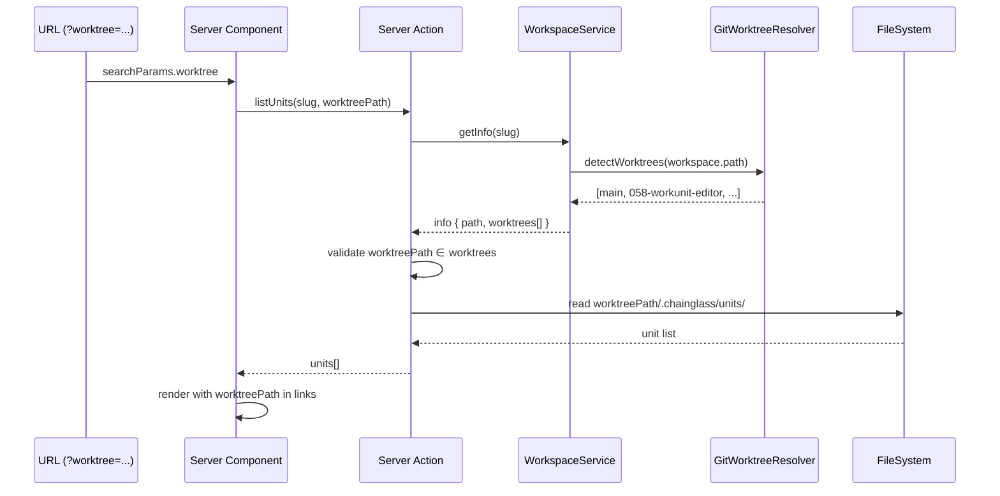

# Workshop: Work Unit Worktree Resolution

**Type**: Integration Pattern
**Plan**: 058-workunit-editor
**Spec**: [workunit-editor-spec.md](../workunit-editor-spec.md)
**Created**: 2026-03-01
**Status**: Draft

**Related Documents**:
- [002-editor-ux-flow-navigation.md](./002-editor-ux-flow-navigation.md) — Editor navigation flows (return context)
- [001-sync-model-and-out-of-sync-indicators.md](./001-sync-model-and-out-of-sync-indicators.md) — Change notifications (SSE watcher also worktree-scoped)

**Domain Context**:
- **Primary Domain**: `058-workunit-editor` — server actions, pages, components
- **Related Domains**: `_platform/workspace-url` (navigation), `_platform/events` (watcher paths)

---

## Purpose

Work unit pages (`/work-units/`, `/work-units/[unitSlug]/`) currently hardcode `worktreePath: info.path` (always the main workspace root), ignoring git worktrees entirely. Every other worktree-aware feature (workflows, file browser, samples) correctly threads `?worktree=` through URLs and resolves it against detected git worktrees. This workshop designs the fix to make work units worktree-aware, following the established patterns.

## Key Questions Addressed

- Q1: What is the canonical worktree resolution pattern in this codebase?
- Q2: Which files need changes and what does each change look like?
- Q3: How does worktree context flow through navigation, pages, actions, and components?
- Q4: What about the "Edit Template" round-trip from workflows?
- Q5: Does the doping script need changes?
- Q6: How does the file watcher (CentralWatcherService) handle worktree paths?

---

## Overview

Git worktrees allow multiple checked-out branches from a single repo. The workspace registry stores the main workspace path, but the dev server may run from a worktree branch (e.g., `/substrate/058-workunit-editor` instead of `/substrate/chainglass`). The system detects worktrees via `git worktree list --porcelain` and threads the active worktree path through the URL as `?worktree=/absolute/path`.

### Current State

```
┌──────────────────────────────────────────────────────────┐
│ URL: /workspaces/chainglass/work-units                   │
│                                                          │
│  workunit-actions.ts                                     │
│    resolveWorkspaceContext("chainglass")                  │
│      → info.path = /substrate/chainglass    ← ALWAYS     │
│      → worktreePath = info.path             ← HARDCODED  │
│                                                          │
│  Result: reads from /substrate/chainglass/.chainglass/    │
│  Expected: reads from /substrate/058-workunit-editor/    │
│            .chainglass/ (the active worktree)             │
└──────────────────────────────────────────────────────────┘
```

### Target State

```
┌──────────────────────────────────────────────────────────┐
│ URL: /workspaces/chainglass/work-units                   │
│      ?worktree=/substrate/058-workunit-editor             │
│                                                          │
│  workunit-actions.ts                                     │
│    resolveWorkspaceContext("chainglass",                  │
│      "/substrate/058-workunit-editor")                   │
│      → info.path = /substrate/chainglass                 │
│      → validated against info.worktrees[]                │
│      → worktreePath = /substrate/058-workunit-editor ✅  │
│                                                          │
│  Result: reads from active worktree's .chainglass/       │
└──────────────────────────────────────────────────────────┘
```

---

## The Canonical Pattern: How Workflows Do It

Workflows already solve this problem. The pattern has three layers:

### Layer 1: Page reads `searchParams.worktree`

```typescript
// apps/web/app/(dashboard)/workspaces/[slug]/workflows/page.tsx
export default async function WorkflowListPage({ params, searchParams }: PageProps) {
  const { slug } = await params;
  const sp = await searchParams;
  const worktreePath = typeof sp.worktree === 'string' ? sp.worktree : undefined;
  const result = await listWorkflows(slug, worktreePath);
  //                                        ^^^^^^^^^^^^^ threaded
```

### Layer 2: Server action accepts `worktreePath?` and validates

```typescript
// apps/web/app/actions/workflow-actions.ts
async function resolveWorkspaceContext(
  slug: string,
  worktreePath?: string              // ← Optional worktree param
): Promise<WorkspaceContext | null> {
  const container = getContainer();
  const workspaceService = container.resolve<IWorkspaceService>(
    WORKSPACE_DI_TOKENS.WORKSPACE_SERVICE
  );
  const info = await workspaceService.getInfo(slug);
  if (!info) return null;

  // Validate worktreePath against known worktrees (trusted roots only)
  const resolvedWorktreePath = worktreePath
    ? (info.worktrees.find((w) => w.path === worktreePath)?.path ?? info.path)
    : info.path;
  const wt = info.worktrees.find((w) => w.path === resolvedWorktreePath);

  return {
    workspaceSlug: slug,
    workspaceName: info.name,
    workspacePath: info.path,
    worktreePath: resolvedWorktreePath,      // ← Resolved, not hardcoded
    worktreeBranch: wt?.branch ?? null,
    isMainWorktree: resolvedWorktreePath === info.path,
    hasGit: info.hasGit,
  };
}
```

### Layer 3: Links preserve `?worktree=`

```typescript
// In list page links
<Link href={`/workspaces/${slug}/workflows/${wf.slug}${
  worktreePath ? `?worktree=${encodeURIComponent(worktreePath)}` : ''
}`}>
```

---

## Detailed Change Design

### Change 1: `workunit-actions.ts` — Add worktree parameter

**Before** (broken):
```typescript
async function resolveWorkspaceContext(slug: string): Promise<WorkspaceContext | null> {
  // ...
  return {
    worktreePath: info.path,        // ← Always main
    worktreeBranch: null,
    isMainWorktree: true,
    // ...
  };
}

export async function listUnits(workspaceSlug: string) { ... }
export async function loadUnit(workspaceSlug: string, unitSlug: string) { ... }
```

**After** (fixed):
```typescript
async function resolveWorkspaceContext(
  slug: string,
  worktreePath?: string                          // ← NEW
): Promise<WorkspaceContext | null> {
  const container = getContainer();
  const workspaceService = container.resolve<IWorkspaceService>(
    WORKSPACE_DI_TOKENS.WORKSPACE_SERVICE
  );
  const info = await workspaceService.getInfo(slug);
  if (!info) return null;

  const resolvedWorktreePath = worktreePath
    ? (info.worktrees.find((w) => w.path === worktreePath)?.path ?? info.path)
    : info.path;
  const wt = info.worktrees.find((w) => w.path === resolvedWorktreePath);

  return {
    workspaceSlug: slug,
    workspaceName: info.name,
    workspacePath: info.path,
    worktreePath: resolvedWorktreePath,          // ← RESOLVED
    worktreeBranch: wt?.branch ?? null,          // ← RESOLVED
    isMainWorktree: resolvedWorktreePath === info.path,  // ← COMPUTED
    hasGit: info.hasGit,
  };
}

// Every action gains optional worktreePath:
export async function listUnits(workspaceSlug: string, worktreePath?: string) {
  const ctx = await resolveWorkspaceContext(workspaceSlug, worktreePath);
  // ...
}
export async function loadUnit(workspaceSlug: string, unitSlug: string, worktreePath?: string) {
  const ctx = await resolveWorkspaceContext(workspaceSlug, worktreePath);
  // ...
}
// ... same for loadUnitContent, createUnit, updateUnit, deleteUnit, renameUnit, saveUnitContent
```

**Affected actions** (8 total):
| Action | Signature Change |
|--------|-----------------|
| `listUnits` | `(slug)` → `(slug, worktreePath?)` |
| `loadUnit` | `(slug, unitSlug)` → `(slug, unitSlug, worktreePath?)` |
| `loadUnitContent` | `(slug, unitSlug)` → `(slug, unitSlug, worktreePath?)` |
| `createUnit` | `(slug, spec)` → `(slug, spec, worktreePath?)` |
| `updateUnit` | `(slug, unitSlug, patch)` → `(slug, unitSlug, patch, worktreePath?)` |
| `deleteUnit` | `(slug, unitSlug)` → `(slug, unitSlug, worktreePath?)` |
| `renameUnit` | `(slug, oldSlug, newSlug)` → `(slug, oldSlug, newSlug, worktreePath?)` |
| `saveUnitContent` | `(slug, unitSlug, content)` → `(slug, unitSlug, content, worktreePath?)` |

---

### Change 2: Work Units List Page — Read `searchParams.worktree`

**Before**:
```typescript
export default async function WorkUnitsPage({ params }: PageProps) {
  const { slug } = await params;
  const result = await listUnits(slug);
```

**After**:
```typescript
export default async function WorkUnitsPage({ params, searchParams }: PageProps) {
  const { slug } = await params;
  const sp = await searchParams;
  const worktreePath = typeof sp.worktree === 'string' ? sp.worktree : undefined;
  const result = await listUnits(slug, worktreePath);
  // ... pass worktreePath to UnitList for link threading
```

---

### Change 3: Work Unit Editor Page — Thread worktree to all actions

**Before** (partial — reads worktree but only for return-link):
```typescript
const returnWorktree = typeof sp.worktree === 'string' ? sp.worktree : undefined;

const [unitResult, contentResult, unitsResult] = await Promise.all([
  loadUnit(slug, unitSlug),           // ← No worktree
  loadUnitContent(slug, unitSlug),    // ← No worktree
  listUnits(slug),                    // ← No worktree
]);
```

**After**:
```typescript
const worktreePath = typeof sp.worktree === 'string' ? sp.worktree : undefined;

const [unitResult, contentResult, unitsResult] = await Promise.all([
  loadUnit(slug, unitSlug, worktreePath),           // ← Threaded
  loadUnitContent(slug, unitSlug, worktreePath),    // ← Threaded
  listUnits(slug, worktreePath),                    // ← Threaded
]);
// Pass worktreePath to WorkUnitEditor for client-side action calls
```

---

### Change 4: UnitList Component — Preserve worktree in links

**Before**:
```typescript
<Link href={`/workspaces/${workspaceSlug}/work-units/${unit.slug}`}>
```

**After**:
```typescript
<Link href={`/workspaces/${workspaceSlug}/work-units/${unit.slug}${
  worktreePath ? `?worktree=${encodeURIComponent(worktreePath)}` : ''
}`}>
```

Requires adding `worktreePath?: string` to `UnitListProps`.

---

### Change 5: WorkUnitEditor — Thread worktree to save actions

**New prop**: `worktreePath?: string`

All `useCallback` save functions must thread `worktreePath`:

```typescript
const inputSaveFn = useCallback(
  (value: string) => {
    const items = JSON.parse(value) as WorkUnitInput[];
    return updateUnit(workspaceSlug, unitSlug, { inputs: items }, worktreePath);
    //                                                             ^^^^^^^^^^^
  },
  [workspaceSlug, unitSlug, worktreePath]
);
```

Same for: content save, metadata save, output save.

---

### Change 6: Unit Catalog Sidebar — Preserve worktree in links

The sidebar navigation within the editor (left panel) also renders links to other units. These must include `?worktree=`.

---

### Change 7: UnitCreationModal — Pass worktree to createUnit

```typescript
// Before
await createUnit(workspaceSlug, spec);

// After
await createUnit(workspaceSlug, spec, worktreePath);
```

---

### Change 8: Navigation Utils — Worktree preservation

<!-- NOTE: Navigation items are defined as static constants with relative hrefs.
     The worktree param is typically appended by the layout or navigation component
     that renders these items, not in the NavItem definition itself.
     Verify how the sidebar/nav component constructs full URLs before changing this. -->

The sidebar nav component that renders `WORKSPACE_NAV_ITEMS` should append `?worktree=` when constructing links. Check how other nav items (Workflows, Browser) handle this — the pattern may already exist in the nav renderer.

---

## Data Flow Diagram



---

## The "Edit Template" Round-Trip

Phase 4 added bidirectional navigation: workflow → editor → workflow. The worktree must survive this round-trip.

### Current flow (already partially working):

```
Workflow page (?worktree=X)
  → Click "Edit Template"
  → /work-units/[slug]?from=workflow&graph=G&worktree=X
  → Editor reads worktree for return link ✅
  → Editor does NOT use worktree for data loading ❌
  → Click "Back to Workflow"
  → /workflows/G?worktree=X ✅
```

### Fixed flow:

```
Workflow page (?worktree=X)
  → Click "Edit Template"
  → /work-units/[slug]?from=workflow&graph=G&worktree=X
  → Editor reads worktree for return link ✅
  → Editor uses worktree for data loading ✅  ← FIX
  → All saves use worktree context ✅          ← FIX
  → Click "Back to Workflow"
  → /workflows/G?worktree=X ✅
```

No new URL parameters needed — `?worktree=` is already present in the "Edit Template" link (Phase 4 wired this). The fix is purely about using the param for data operations, not just return navigation.

---

## File Watcher Consideration

The `CentralWatcherService` watches `<worktreePath>/.chainglass/data/` and `<worktreePath>/.chainglass/units/`. It creates watchers per worktree via `createWatcherForWorktree()`. The watcher paths are already worktree-scoped, so the SSE change notification system should work correctly once the editor page reads from the right worktree.

No watcher changes needed — the infrastructure is already worktree-aware.

---

## Doping Script

The doping script writes to `ROOT/.chainglass/units/` where ROOT is the process working directory. This is correct — when run from a worktree, it writes to that worktree's `.chainglass/`. The issue was only that the web UI wasn't reading from the worktree.

Once the fix is applied, `just dope` (run from the worktree) will create units visible in the web UI (when `?worktree=` points to that worktree).

No doping script changes needed.

---

## Scope Summary

| # | File | Change | Complexity |
|---|------|--------|-----------|
| 1 | `apps/web/app/actions/workunit-actions.ts` | Add `worktreePath?` to resolver + all 8 actions | Medium |
| 2 | `apps/web/app/(dashboard)/.../work-units/page.tsx` | Read `searchParams.worktree`, pass to action + component | Small |
| 3 | `apps/web/app/(dashboard)/.../work-units/[unitSlug]/page.tsx` | Use existing `worktree` param for data loading (not just return) | Small |
| 4 | `apps/web/src/features/058-workunit-editor/components/unit-list.tsx` | Add `worktreePath?` prop, append to links | Small |
| 5 | `apps/web/src/features/058-workunit-editor/components/workunit-editor.tsx` | Add `worktreePath?` prop, thread to save callbacks | Medium |
| 6 | `apps/web/src/features/058-workunit-editor/components/unit-creation-modal.tsx` | Pass `worktreePath?` to `createUnit` | Small |
| 7 | `apps/web/src/features/058-workunit-editor/components/metadata-panel.tsx` | Pass `worktreePath?` to save callbacks | Small |
| 8 | Sidebar catalog (left panel in editor) | Append `?worktree=` to unit links | Small |
| 9 | Navigation renderer (if needed) | Append worktree param to nav links | Check first |

**Estimated effort**: ~1 phase (CS-2), mostly mechanical prop-threading following the workflow pattern.

---

## Open Questions

### Q1: Should we use `resolveContextFromParams()` or the inline pattern?

**RESOLVED**: Use the inline pattern from `workflow-actions.ts`. It's simpler (direct `info.worktrees.find()`), avoids an extra service call, and is the established pattern in this codebase. `resolveContextFromParams()` is the canonical service method but does the same thing with more ceremony.

### Q2: What happens if `?worktree=` is missing from the URL?

**RESOLVED**: Falls back to `info.path` (main workspace), same as current behavior. The fix is backward-compatible — existing URLs without `?worktree=` continue to work identically.

### Q3: Does the file watcher need changes?

**RESOLVED**: No. `CentralWatcherService` already watches per-worktree paths. The SSE events and `WorkUnitCatalogWatcherAdapter` are worktree-scoped. No changes needed.

### Q4: What about the doping script?

**RESOLVED**: No changes needed. The script writes to ROOT (process CWD), which is the correct worktree path when run from a worktree. The web UI fix will make these units visible.

### Q5: Does the `?worktree=` param need URL-encoding?

**RESOLVED**: Yes. Worktree paths are absolute filesystem paths containing `/`. Always use `encodeURIComponent()` when constructing URLs and read via `searchParams` (which auto-decodes).

---

## Quick Reference

```typescript
// Pattern: Read worktree from searchParams in a page
const sp = await searchParams;
const worktreePath = typeof sp.worktree === 'string' ? sp.worktree : undefined;

// Pattern: Thread worktree to server action
const result = await listUnits(slug, worktreePath);

// Pattern: Validate worktree in server action
const resolvedWorktreePath = worktreePath
  ? (info.worktrees.find((w) => w.path === worktreePath)?.path ?? info.path)
  : info.path;

// Pattern: Preserve worktree in links
const wtParam = worktreePath ? `?worktree=${encodeURIComponent(worktreePath)}` : '';
<Link href={`/workspaces/${slug}/work-units/${unit.slug}${wtParam}`}>
```
