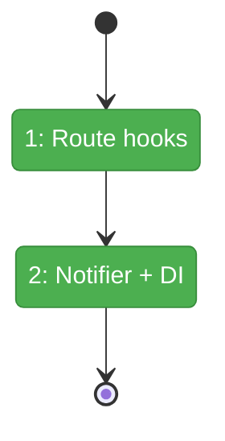
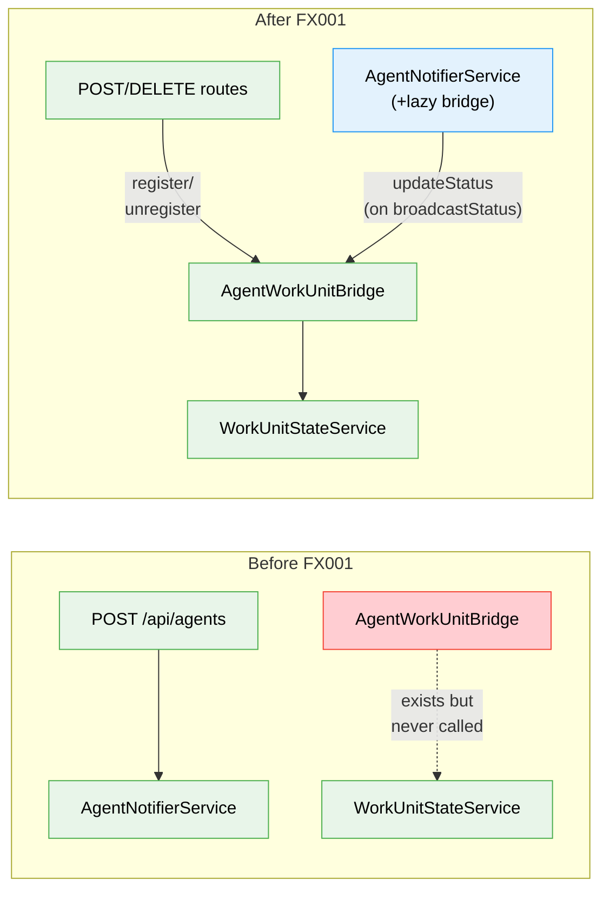

# Flight Plan: Fix FX001 — Wire Agent Lifecycle into WorkUnitStateService

**Fix**: [FX001-wire-agent-workunit-registration.md](FX001-wire-agent-workunit-registration.md)
**Status**: Landed

---

## Departure → Destination

**Where we are**: AgentWorkUnitBridge exists in DI but nothing calls it. Agents created via the UI never appear in `work-unit-state.json`. Sidebar badges, top bar chips, and cross-worktree activity indicators are all empty.

**Where we're going**: Creating an agent writes an entry to `work-unit-state.json`. Running it updates status to `working`. Deleting it removes the entry. Sidebar badges light up for other worktrees with active agents.

---

## Domain Context

| Domain | Relationship | What Changes |
|--------|-------------|-------------|
| agents | modify | POST/DELETE routes + notifier gain bridge calls |
| work-unit-state | consume | Bridge writes to WorkUnitStateService (no interface changes) |

---

## Flight Status

**Legend**: grey = pending | yellow = active | red = blocked/needs input | green = done

---

## Stages

- [x] **Stage 1: Route hooks** — POST bridge.registerAgent() + DELETE bridge.unregisterAgent() (FX001-1, FX001-2)
- [x] **Stage 2: Notifier + DI** — Lazy bridge in notifier broadcastStatus() + DI factory wiring (FX001-3, FX001-4)

---

## Architecture: Before & After

**Legend**: existing (green) | broken/unused (red) | new/modified (blue)

---

## DYK Findings

| # | Finding | Action |
|---|---------|--------|
| DYK-FX001-01 | DI registration order risk — bridge registered after notifier | Use lazy resolver `() => bridge` instead of direct injection |
| DYK-FX001-02 | `broadcastIntent` lacks status param, high-frequency | Skip intent wiring — only wire broadcastStatus |
| DYK-FX001-03 | Register/unregister stay in routes, not notifier | Document the split in comments |
| DYK-FX001-04 | Pre-existing agents won't show until recreated | Acceptable trade-off |
| DYK-FX001-05 | Test container uses `useValue` fake, not factory | Don't modify test notifier; add integration test |

---

## Acceptance

- [ ] Agent creation → entry in work-unit-state.json
- [ ] Agent run → status `working` in work-unit-state.json
- [ ] Agent stop → status `idle` in work-unit-state.json
- [ ] Agent deletion → entry removed from work-unit-state.json
- [ ] Existing tests pass (no regressions)

---

## Checklist

- [x] FX001-1: POST route bridge.registerAgent()
- [x] FX001-2: DELETE route bridge.unregisterAgent()
- [x] FX001-3: Notifier broadcastStatus() → lazy bridge.updateAgentStatus()
- [x] FX001-4: DI factory passes lazy bridge resolver to notifier
