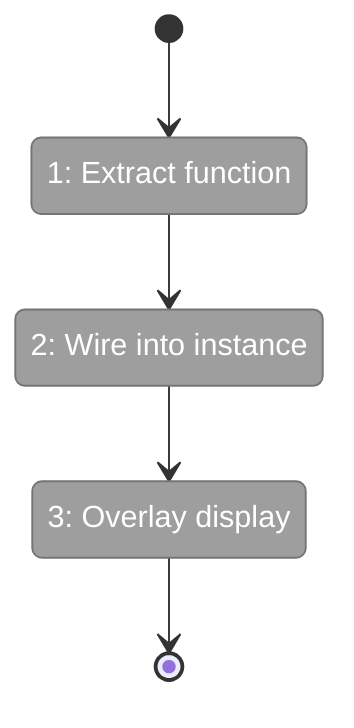
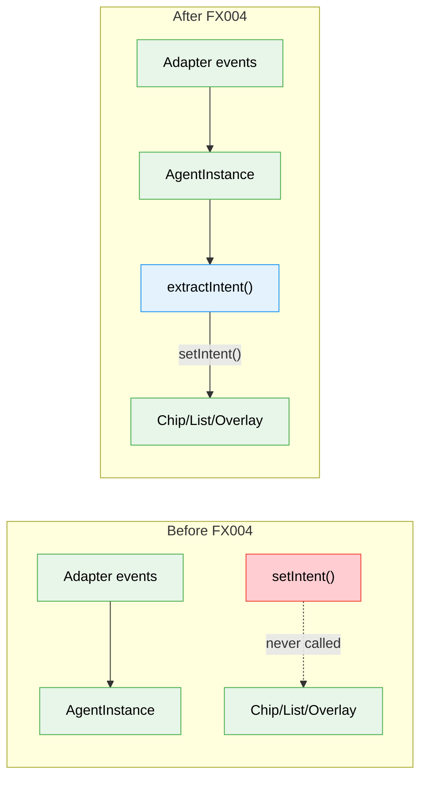

# Flight Plan: Fix FX004 — Extract and Display Agent Intents

**Fix**: [FX004-extract-display-agent-intents.md](FX004-extract-display-agent-intents.md)
**Status**: Ready

---

## Departure → Destination

**Where we are**: Agent intent field exists on all UI surfaces (chips, list, overlay) but is always stale — adapters never call `setIntent()` during runs.

**Where we're going**: Running an agent shows live intent updates everywhere — "Reading auth.ts", "Using Bash", "Thinking: analyzing the..." — automatically extracted from the event stream.

---

## Domain Context

| Domain | Relationship | What Changes |
|--------|-------------|-------------|
| agents | modify | New intent-extractor.ts, wire into AgentInstance, overlay header |

---

## Flight Status

**Legend**: grey = pending | yellow = active | red = blocked/needs input | green = done

---

## Stages

- [ ] **Stage 1: Extract function** — `extractIntent()` pure function + unit tests (FX004-1)
- [ ] **Stage 2: Wire into instance** — Call in AgentInstance event loop (FX004-2)
- [ ] **Stage 3: Overlay display** — Intent subtitle in overlay header (FX004-3)

---

## Architecture: Before & After

---

## Acceptance

- [ ] Running agent shows live intent in chip bar
- [ ] Intent persists after agent stops
- [ ] Overlay header shows intent subtitle
- [ ] Existing tests pass

---

## Checklist

- [ ] FX004-1: extractIntent() function + tests
- [ ] FX004-2: Wire into AgentInstance event loop
- [ ] FX004-3: Overlay panel intent subtitle
