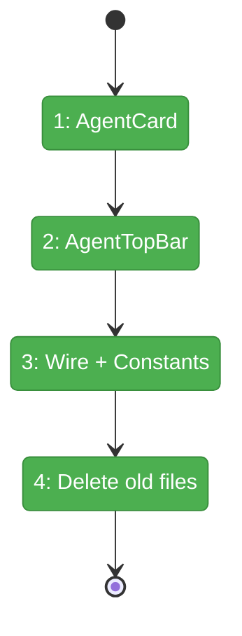
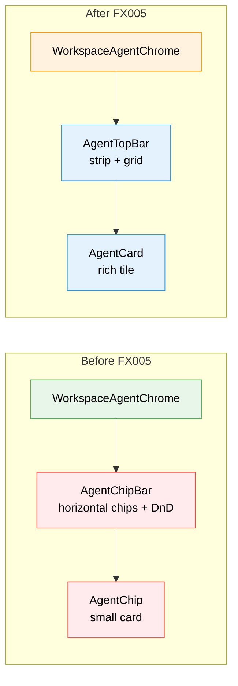

# Flight Plan: Fix FX005 — Agent Top Bar Redesign

**Fix**: [FX005-agent-topbar-redesign.md](FX005-agent-topbar-redesign.md)
**Status**: Landed

## What → Why

**Problem**: Current chip bar is a horizontal row of cards with drag-to-reorder — takes too much space, no aggregate view, styling is rough after 3 iterations.

**Fix**: Replace with two-mode AgentTopBar: slim summary strip (28px, default) showing status counts, expandable to tiled grid with rich agent cards sorted by urgency.

## Domain Context

| Domain | Relationship | What Changes |
|--------|-------------|-------------|
| agents | primary | Create `agent-top-bar.tsx`, `agent-card.tsx`; delete `agent-chip-bar.tsx`, `agent-chip.tsx` |
| agents | primary | Update `workspace-agent-chrome.tsx` import, `constants.ts` storage keys |

## Flight Status

**Legend**: grey = pending | yellow = active | red = blocked/needs input | green = done

## Stages

- [x] **Stage 1: Create AgentCard** — Rich tile component with status, name, type, intent/last-action, time (`agent-card.tsx` — new file)
- [x] **Stage 2: Create AgentTopBar** — Summary strip + expandable grid using AgentCard (`agent-top-bar.tsx` — new file)
- [x] **Stage 3: Wire in + update constants** — Swap import in workspace-agent-chrome, update storage keys (`workspace-agent-chrome.tsx`, `constants.ts`)
- [x] **Stage 4: Delete old files** — Remove `agent-chip-bar.tsx` + `agent-chip.tsx`, verify no stale imports

## Architecture: Before & After

**Legend**: green = unchanged | orange = modified | blue = created | red = removed

## Acceptance

- [ ] Summary strip visible at ~28px, hidden when 0 agents
- [ ] Strip shows status breakdown with colored dots + background tint
- [ ] Click strip expands to tiled grid with rich cards
- [ ] Cards show status, name, type, intent/last-action, time
- [ ] Grid sorts by urgency then recency
- [ ] Click card opens overlay
- [ ] Expand/collapse persists in localStorage
- [ ] No @dnd-kit in top bar code
- [ ] Old files deleted, no stale imports
- [ ] All existing tests pass

## Checklist

- [x] FX005-1: Create AgentCard component
- [x] FX005-2: Create AgentTopBar component
- [x] FX005-3: Update WorkspaceAgentChrome imports
- [x] FX005-4: Update constants.ts storage keys
- [x] FX005-5: Delete old chip files, verify no stale imports
