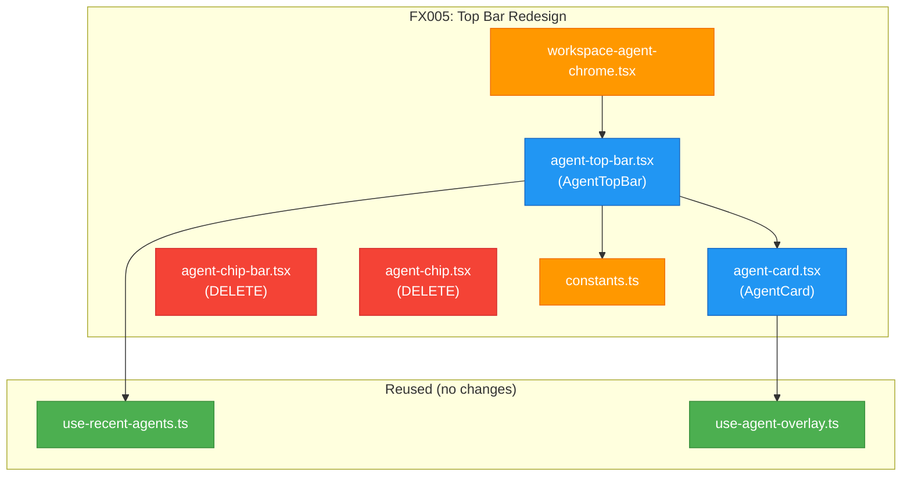

# Fix FX005: Agent Top Bar Redesign — Summary Strip + Expandable Grid

**Created**: 2026-03-04
**Status**: Proposed
**Plan**: [fix-agents-plan.md](../fix-agents-plan.md)
**Source**: User: chip bar looks atrocious, needs summary strip + expandable grid (Workshop 009)
**Domain(s)**: agents (UI)

---

## Problem

The current agent chip bar is a horizontal row of individual chips with drag-to-reorder. It consumes too much vertical space, provides no aggregate "glance" view, and the card styling (3 iterations) still looks rough. Users need to answer "do I need to look at my agents?" in <1 second without expanding anything — then drill into a rich grid when they want details.

## Proposed Fix

Replace `AgentChipBar` + `AgentChip` with a two-mode `AgentTopBar`:

1. **Summary strip (collapsed, default)**: ~28px slim line showing `🤖 3 agents ● 1 working ◐ 1 waiting ○ 1 idle ▼`. Background tints by dominant status. Click anywhere to expand.
2. **Expanded grid**: CSS Grid `repeat(auto-fill, minmax(220px, 1fr))` with rich `AgentCard` tiles (~100-120px tall). Cards show name, type, intent vs last-action (separate display), relative time.
3. **Sort by urgency**: waiting_input → error → working → idle, then by recency.
4. **Remove @dnd-kit from this component**: No more drag-to-reorder — urgency sort is more useful.

## Domain Impact

| Domain | Relationship | What Changes |
|--------|-------------|-------------|
| agents | primary | Rewrite `agent-chip-bar.tsx` → `agent-top-bar.tsx`, rewrite `agent-chip.tsx` → `agent-card.tsx` |
| agents | primary | Update `workspace-agent-chrome.tsx` imports to new component names |
| agents | internal | `constants.ts` — add `topBarExpanded` storage key, remove `chipOrder` key |

## Workshops Consumed

- [Workshop 009: Agent Top Bar Redesign](../workshops/009-agent-topbar-redesign.md) — full design spec

## Pre-Implementation Check

| File | Exists? | Domain Check | Notes |
|------|---------|-------------|-------|
| `apps/web/src/components/agents/agent-top-bar.tsx` | No → create | agents ✓ | Replaces `agent-chip-bar.tsx` |
| `apps/web/src/components/agents/agent-card.tsx` | No → create | agents ✓ | Replaces `agent-chip.tsx` |
| `apps/web/src/components/agents/agent-chip-bar.tsx` | Yes → delete | agents ✓ | Replaced by `agent-top-bar.tsx` |
| `apps/web/src/components/agents/agent-chip.tsx` | Yes → delete | agents ✓ | Replaced by `agent-card.tsx` |
| `apps/web/src/components/agents/workspace-agent-chrome.tsx` | Yes → modify | agents ✓ | Update import from AgentChipBar → AgentTopBar |
| `apps/web/src/lib/agents/constants.ts` | Yes → modify | agents ✓ | Swap `chipOrder` → `topBarExpanded` storage key |
| `apps/web/src/hooks/use-recent-agents.ts` | Yes → keep | agents ✓ | Already has priority sort — reuse as-is |

## Architecture Map

**Legend**: 🔵 create | 🟠 modify | 🔴 delete | 🟢 keep

## Tasks

| Status | ID | Task | Domain | Path(s) | Done When | Notes |
|--------|-----|------|--------|---------|-----------|-------|
| [ ] | FX005-1 | Create `AgentCard` component — rich tile with status dot, name, type, intent/last-action split, relative time | agents | `apps/web/src/components/agents/agent-card.tsx` | Card renders all status states; working shows live intent (blue); idle/stopped shows "Last: ..." (muted); waiting shows amber + question text; ~100-120px height; click triggers `toggleAgent()` | Workshop 009 card anatomy |
| [ ] | FX005-2 | Create `AgentTopBar` component — summary strip + expandable grid | agents | `apps/web/src/components/agents/agent-top-bar.tsx` | Strip shows `🤖 N agents ● working ◐ waiting ○ idle` at ~28px height; background tints by status; click expands to CSS Grid of AgentCards; collapse/expand persists in localStorage; hidden when 0 agents | Workshop 009 two-mode design |
| [ ] | FX005-3 | Update `WorkspaceAgentChrome` — swap `AgentChipBar` → `AgentTopBar` | agents | `apps/web/src/components/agents/workspace-agent-chrome.tsx` | Import updated; renders `AgentTopBar` instead of `AgentChipBar`; no other changes | Simple import swap |
| [ ] | FX005-4 | Update `constants.ts` — replace `chipOrder` storage key with `topBarExpanded` | agents | `apps/web/src/lib/agents/constants.ts` | `chipOrder` key removed; `topBarExpanded` key added; `chipBarExpanded` key still works (backwards compat) | Remove unused DnD storage |
| [ ] | FX005-5 | Delete old files `agent-chip-bar.tsx` + `agent-chip.tsx`; verify no other imports | agents | `apps/web/src/components/agents/agent-chip-bar.tsx`, `apps/web/src/components/agents/agent-chip.tsx` | Files deleted; `grep -r "agent-chip-bar\|agent-chip\|AgentChipBar\|AgentChip" apps/web/src/` returns 0 matches (excluding test files) | Check for stale imports |

## Acceptance

- [ ] Summary strip visible at ~28px when agents exist, hidden when 0 agents
- [ ] Strip shows correct count and status breakdown with colored dots
- [ ] Strip background tints: amber (waiting), red (error), blue (working), muted (all idle)
- [ ] Click strip expands to tiled grid with rich cards
- [ ] Cards show: status dot + name, type label, intent OR last-action (separate display), relative time
- [ ] Grid sorts by urgency: waiting_input → error → working → idle, then recency
- [ ] Click card opens agent overlay (existing behavior preserved)
- [ ] Expand/collapse state persists across page navigations
- [ ] No @dnd-kit imports remaining in agent top bar code
- [ ] Old chip files deleted, no stale imports
- [ ] All existing agent tests pass

## Discoveries & Learnings

| Date | Task | Type | Discovery | Resolution |
|------|------|------|-----------|------------|
| 2026-03-04 | Pre-impl | DYK-FX005-01 | 1-agent shortcut: Workshop 009 suggests clicking strip opens overlay directly for 1 agent | **Rejected** — always expand grid for consistent behavior |
| 2026-03-04 | FX005-5 | DYK-FX005-02 | @dnd-kit may be the sole consumer in agent top bar; if so, removable from package.json | **Accepted** — grep after deletion, remove dependency if zero remaining imports |
| 2026-03-04 | FX005-4 | DYK-FX005-03 | `chipBarExpanded` storage key already exists; creating `topBarExpanded` would reset user pref | **Accepted** — reuse existing key, only remove unused `chipOrder` key |
| 2026-03-04 | FX005-1 | DYK-FX005-04 | Cards need "2m ago" / "just now" display but no relative time utility exists in codebase | **Accepted** — write ~20-line `formatRelativeTime()` helper inline, no new dependency |
| 2026-03-04 | FX005-1 | DYK-FX005-05 | `updatedAt` only reflects status changes, not per-event activity — misleading for working agents | **Accepted** — show "Active" for working agents, relative time only for idle/stopped/error |
