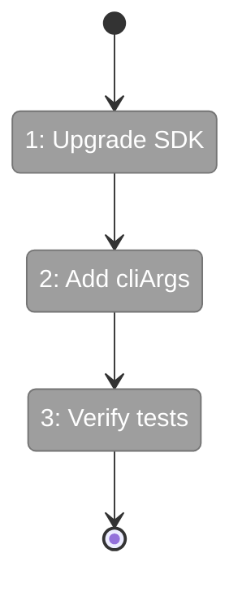

# Flight Plan: Fix FX006 — Copilot SDK Permissions + Upgrade

**Fix**: [FX006-copilot-sdk-permissions.md](FX006-copilot-sdk-permissions.md)
**Status**: Ready

## What → Why

**Problem**: CopilotClient constructed with no args — SDK blocks bash/file tool execution without `--allow-all-tools --allow-all-paths` flags.

**Fix**: Pass permission cliArgs to CopilotClient constructor + bump SDK from 0.1.26 → 0.1.30.

## Domain Context

| Domain | Relationship | What Changes |
|--------|-------------|-------------|
| agents | primary | DI container CopilotClient construction, SDK version bump |

## Flight Status

## Stages

- [ ] **Stage 1: Upgrade SDK** — Bump `@github/copilot-sdk` to `^0.1.30` (`packages/shared/package.json`)
- [ ] **Stage 2: Add cliArgs** — Pass `--allow-all-tools --allow-all-paths` to CopilotClient (`di-container.ts`)
- [ ] **Stage 3: Verify** — `just fft` passes

## Acceptance

- [ ] SDK upgraded to 0.1.30
- [ ] CopilotClient has permission flags
- [ ] All tests pass

## Checklist

- [ ] FX006-1: Upgrade SDK version
- [ ] FX006-2: Add cliArgs to CopilotClient
- [ ] FX006-3: Verify tests pass
