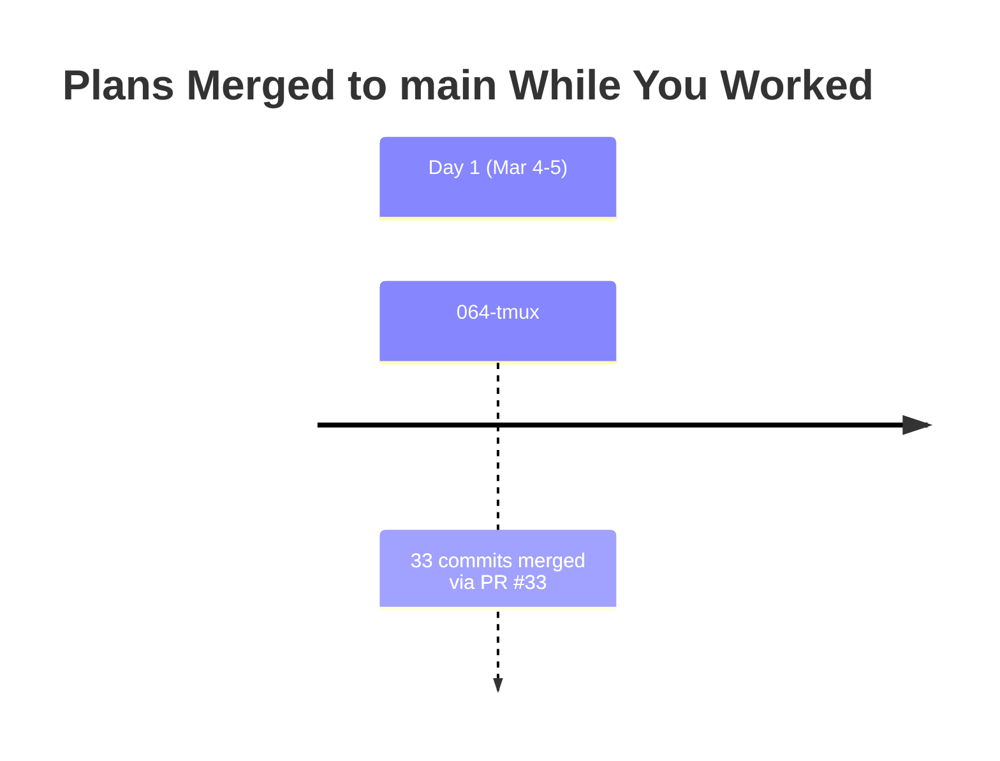

# Merge Plan: Integrating Upstream Changes

**Generated**: 2026-03-05T03:33Z
**Your Branch**: 059-fix-agents @ c53a390
**Merging From**: origin/main @ 08fc051
**Common Ancestor**: 29b80fa @ 2026-03-04 11:35:15 +1100

---

## Executive Summary

### What Happened While You Worked

You branched from main **1 day ago**. Since then, **1 plan** landed in main:

| Plan | Merged | Purpose | Risk to You | Domains Affected |
|------|--------|---------|-------------|------------------|
| 064-tmux | ~1 day ago | Terminal integration via tmux — sidecar WebSocket server, xterm.js view, overlay panel, PWA, auth | Medium | terminal (new), panel-layout, sdk, events, workspace-url |

### Conflict Summary

- **Direct Conflicts**: 4 files (manual resolution needed)
- **Auto-Merged**: 3 files (workspace-nav.tsx, justfile, pnpm-lock.yaml)
- **Semantic Conflicts**: 0 (orthogonal feature sets)
- **Regression Risks**: Low

### Recommended Approach

Single merge of origin/main, resolve 4 conflicts manually (all are additive/complementary), run `just fft`.

---

## Timeline



---

## Upstream Plan Analysis

### Plan 064-tmux: Terminal Integration via tmux

**Purpose**: Full terminal integration — sidecar WebSocket server using node-pty + tmux, xterm.js TerminalView component, overlay panel with Ctrl+backtick toggle, PWA support for iPad, JWT authentication for terminal sessions.

| Attribute | Value |
|-----------|-------|
| Merged | ~1 day ago (PR #33) |
| Files Changed | 99 |
| Commits | 33 |
| Domains Affected | terminal (new), panel-layout, events, sdk, workspace-url |

**Key Changes**:
- New sidecar WebSocket server (`apps/web/src/features/064-terminal/server/`)
- xterm.js TerminalView component with theme sync, resize handling
- Terminal overlay panel with sidebar toggle, Ctrl+backtick shortcut
- PWA manifest + iPad standalone mode support
- JWT-based terminal session authentication
- `justfile` `dev` command now starts both Next.js + terminal sidecar via concurrently
- `node-pty` added as dependency, spawn-helper chmod in install
- New domain registered: `terminal`

**Potential Conflicts with Your Work**:
- `layout.tsx`: Both wrap `{children}` — you added `WorkspaceAgentChrome`, they added `TerminalOverlayWrapper`
- `next.config.mjs`: Both add to `serverExternalPackages` — you added copilot SDK, they added node-pty
- `domain-map.md` and `registry.md`: Both add new domain rows at same insertion point

---

## Conflict Analysis

### Conflict 1: `apps/web/app/(dashboard)/workspaces/[slug]/layout.tsx`

**Conflict Type**: Complementary (both wrap children with different wrappers)

**Your Change** (adds WorkspaceAgentChrome):
```tsx
<WorkspaceAttentionWrapper>
  <WorkspaceAgentChrome slug={slug} workspacePath={ws?.path}>
    {children}
  </WorkspaceAgentChrome>
</WorkspaceAttentionWrapper>
```

**Upstream Change** (adds TerminalOverlayWrapper + variables):
```tsx
const defaultWorktreePath = ws?.toJSON().path ?? '';
const defaultBranch = defaultWorktreePath.split('/').pop() ?? slug;
// ...
<WorkspaceAttentionWrapper>
  <TerminalOverlayWrapper defaultSessionName={defaultBranch} defaultCwd={defaultWorktreePath}>
    {children}
  </TerminalOverlayWrapper>
</WorkspaceAttentionWrapper>
```

**Resolution**: Keep BOTH wrappers — nest them. Agent chrome wraps terminal overlay which wraps children. Also keep both imports and the upstream variables.

```tsx
import { WorkspaceAgentChrome } from '../../../../src/components/agents/workspace-agent-chrome';
// ... existing imports ...
import { TerminalOverlayWrapper } from './terminal-overlay-wrapper';

// ... in component body:
const defaultWorktreePath = ws?.toJSON().path ?? '';
const defaultBranch = defaultWorktreePath.split('/').pop() ?? slug;

// ... in JSX:
<WorkspaceAttentionWrapper>
  <WorkspaceAgentChrome slug={slug} workspacePath={ws?.path}>
    <TerminalOverlayWrapper defaultSessionName={defaultBranch} defaultCwd={defaultWorktreePath}>
      {children}
    </TerminalOverlayWrapper>
  </WorkspaceAgentChrome>
</WorkspaceAttentionWrapper>
```

**Verification**:
- [ ] Agent top bar renders above content
- [ ] Terminal overlay toggles with Ctrl+backtick
- [ ] Both wrappers receive correct props

---

### Conflict 2: `apps/web/next.config.mjs`

**Conflict Type**: Complementary (both add entries to same array)

**Your Change**: Added `'@github/copilot-sdk'` and `'@github/copilot'` to `serverExternalPackages`
**Upstream Change**: Added `'node-pty'` to `serverExternalPackages`

**Resolution**: Keep all three entries:
```js
'@shikijs/engine-oniguruma',
'@github/copilot-sdk',
'@github/copilot',
'node-pty',
'next-auth',
```

**Verification**:
- [ ] Dev server starts without bundling errors

---

### Conflict 3: `docs/domains/domain-map.md`

**Conflict Type**: Complementary (both add domain nodes + edges at different diagram sections)

**Your Change**: Added `agents`, `workUnitState`, `wfEvents` nodes + 10 new edges, `:::new` class, updated `state` label
**Upstream Change**: Added `terminal` node + 4 edges, 1 contract table row

**Resolution**: Keep ALL additions from both sides. Both add nodes and edges to different sections of the mermaid diagram. The terminal domain and agents/workUnitState/wfEvents domains are independent.

**Verification**:
- [ ] Mermaid diagram renders in MarkdownViewer
- [ ] All new domains visible with correct connections

---

### Conflict 4: `docs/domains/registry.md`

**Conflict Type**: Complementary (both add rows at same table position)

**Your Change**: Added 3 rows (Agents, Work Unit State, Workflow Events) after Work Unit Editor
**Upstream Change**: Added 1 row (Terminal) after Work Unit Editor

**Resolution**: Keep all 4 new rows:
```
| Work Unit Editor | 058-workunit-editor | business | — | Plan 058 | active |
| Agents | agents | business | — | Plan 059 — Fix Agents (extracted) | active |
| Work Unit State | work-unit-state | business | — | Plan 059 — Fix Agents (new) | active |
| Workflow Events | workflow-events | business | — | Plan 061 — WorkflowEvents (new) | active |
| Terminal | terminal | business | — | Plan 064 | active |
| Auth | _platform/auth | infrastructure | _platform | Plan 063-login | active |
```

**Verification**:
- [ ] Registry table renders correctly
- [ ] No duplicate rows

---

### Auto-Merged Files (No Action Needed)

| File | Your Change | Upstream Change | Result |
|------|-------------|-----------------|--------|
| `workspace-nav.tsx` | +40 lines (activity badges) | +3 lines (default to browser subpath) | Auto-merged OK |
| `justfile` | +4 lines (session-watch recipe) | +21 lines (dev command rewrite, dev-terminal, dev-https) | Auto-merged OK |
| `pnpm-lock.yaml` | copilot SDK update | node-pty + concurrently | Auto-merged OK |

---

## Regression Risk Analysis

| Risk | Direction | Details | Likelihood | Verification |
|------|-----------|---------|------------|--------------|
| Wrapper nesting order | Merge→You | Agent chrome + terminal overlay might interact | Low | Visual test: both render |
| pnpm-lock.yaml merge | Both | Lockfile auto-merge may produce invalid state | Low | `pnpm install` after merge |
| `just dev` command change | Upstream→You | Dev now runs concurrently with terminal sidecar | Info | Note: PORT=3001 may need to be set |

---

## Merge Execution Plan

### Phase 1: Merge with conflict resolution

```bash
# Merge (will produce 4 conflicts)
git merge origin/main --no-ff -m "Merge main (064-tmux) into 059-fix-agents"

# Resolve each conflict manually (see resolutions above)
# Then:
git add -A
git commit
```

### Phase 2: Post-merge validation

```bash
# Reinstall deps (pnpm-lock.yaml changed)
pnpm install

# Full quality gate
just fft
```

### Phase 3: Verify dev server

```bash
# Start dev and verify both agent + terminal features work
PORT=3001 just dev
```

---

## Rollback Procedure

```bash
git reset --hard backup-20260305-before-merge
```
