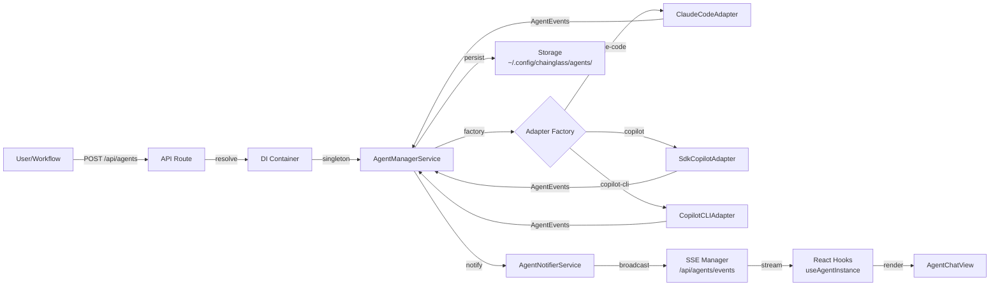

# Research Report: Fix Agents in Web

**Generated**: 2026-02-28T05:48:00Z
**Research Query**: "Fix Agents in web — agent chat broken, sessions not working, need state integration, top bar UX, copilot CLI support"
**Mode**: Plan-Associated (059-fix-agents)
**Location**: docs/plans/059-fix-agents/research-dossier.md
**FlowSpace**: Available
**Findings**: 68 total (IA:10, DC:10, PS:10, QT:10, IC:10, DE:10, PL:19, DB:8)

## Executive Summary

### What It Does
The agent system provides multi-adapter agent execution (Claude Code CLI, GitHub Copilot SDK, Copilot CLI via tmux) with a unified manager service, SSE-based real-time events, persistent session storage, and a web UI for agent chat and management. Agents are created per-workspace, executed via adapter factory, and observed through SSE event streaming.

### Business Purpose
Chainglass is a workflow orchestration system where agent nodes execute in graphs. The web agent UI enables users to observe, interact with, and manage teams of agents — both programmatic (workflow-driven) and human-in-the-loop (terminal-attached). The stated vibe: "The whole reason this system exists is to manage teams of agents."

### Key Insights
1. **Agent UI is structurally sound but has data flow gaps** — API serialization omits events, SSE broadcasting isn't wired into creation routes, and type mismatches between API responses and hook expectations cause "nothing showing up"
2. **State system integration (Plan 053) is ready but not wired** — the worktree exemplar provides the exact pattern for agent state publishing; no architectural changes needed
3. **Three adapter types exist** — ClaudeCodeAdapter, SdkCopilotAdapter (default), CopilotCLIAdapter (Plan 057, needs sessionId + tmux window/pane)
4. **The system evolved through 7 plans (012→057)** with strong headless/CLI foundations but incomplete web UI wiring

### Quick Stats
- **Components**: 14 agent UI components, 4 API routes, 3 adapters, 1 manager service
- **Dependencies**: @chainglass/shared (interfaces), @github/copilot-sdk, claude CLI, tmux
- **Test Coverage**: 45+ test files (contracts, integration, unit, component)
- **Complexity**: High — touches DI, SSE, state system, multiple adapters, UI
- **Prior Learnings**: 19 relevant discoveries from Plans 012-057
- **Domains**: No agent domain registered yet; ready for formalization

## How It Currently Works

### Entry Points

| Entry Point | Type | Location | Purpose |
|------------|------|----------|---------|
| GET /api/agents | API | apps/web/app/api/agents/route.ts | List agents (filterable by workspace) |
| POST /api/agents | API | apps/web/app/api/agents/route.ts | Create new agent |
| GET /api/agents/[id] | API | apps/web/app/api/agents/[id]/route.ts | Fetch single agent + events |
| DELETE /api/agents/[id] | API | apps/web/app/api/agents/[id]/route.ts | Terminate agent |
| POST /api/agents/[id]/run | API | apps/web/app/api/agents/[id]/run/route.ts | Execute prompt (409 if already running) |
| GET /api/agents/events | SSE | apps/web/app/api/agents/events/route.ts | Real-time event stream |
| /workspaces/[slug]/agents | Page | apps/web/app/(dashboard)/workspaces/[slug]/agents/page.tsx | Agent list page |
| /workspaces/[slug]/agents/[id] | Page | apps/web/app/(dashboard)/workspaces/[slug]/agents/[id]/page.tsx | Agent detail/chat page |

### Core Execution Flow

1. **Bootstrap**: `getContainer()` lazy-loads DI container via `globalThis` singleton (survives HMR). All API routes call `ensureInitialized()` which resolves `AgentManagerService` singleton and calls `.initialize()` once.

2. **Create Agent**: POST /api/agents → validates {name, type, workspace} → `agentManager.createAgent()` → generates UUID → creates in-memory `AgentInstance` → persists to `~/.config/chainglass/agents/` → broadcasts `agent_created` SSE event → returns serialized agent JSON → client redirects to detail page.

3. **Run Agent**: POST /api/agents/[id]/run → checks agent exists (404) → checks not already working (409 double-run guard) → `agentInstance.run({ prompt, onEvent })` → adapter factory selects ClaudeCodeAdapter/SdkCopilotAdapter/CopilotCLIAdapter → adapter streams AgentEvents → events stored as NDJSON → SSE broadcasts each event → returns AgentResult.

4. **View Chat**: Server component loads agent + events via DI → passes to `<AgentChatView>` client component → `useAgentInstance(agentId)` fetches via React Query + subscribes to SSE → `transformAgentEventsToLogEntries()` renders events in server array order → streaming content overlaid via `onAgentEvent` callback.

5. **SSE Broadcasting**: Single 'agents' channel → `AgentNotifierService.broadcastEvent()` → `SSEManagerBroadcaster.broadcast()` → `SSEManager.broadcast('agents', type, data)` → encodes to all connected controllers → clients filter by `agentId` (per ADR-0007).

### Data Flow


### State Management
- **Server-side**: `AgentManagerService` maintains `Map<agentId, IAgentInstance>` in memory (singleton). Persisted to disk via `IAgentStorageAdapter` at `~/.config/chainglass/agents/`.
- **Client-side**: React Query for data fetching + SSE for real-time updates. `useAgentManager` for list, `useAgentInstance` for individual agent.
- **Events**: Stored as NDJSON per agent. Server array order is canonical — no client-side sorting.
- **NOT YET**: No integration with Plan 053 GlobalStateSystem. Agent state is not published to the state system.

## Architecture & Design

### Component Map

#### Core Components
- **AgentManagerService** (singleton): Central registry, CRUD, adapter coordination — `packages/shared/src/features/019-agent-manager-refactor/`
- **AgentInstance** (per-agent): Self-contained state + execution — `packages/shared/src/features/034-agentic-cli/`
- **IAgentAdapter** (per-type): Execution interface — `packages/shared/src/interfaces/agent-adapter.interface.ts`
- **ClaudeCodeAdapter**: Claude Code CLI via ProcessManager — `packages/shared/src/adapters/claude-code.adapter.ts`
- **SdkCopilotAdapter**: @github/copilot-sdk wrapper — `packages/shared/src/adapters/sdk-copilot-adapter.ts`
- **CopilotCLIAdapter**: tmux + events.jsonl tailing — `packages/shared/src/adapters/copilot-cli.adapter.ts`
- **AgentNotifierService**: SSE broadcast bridge — `apps/web/src/features/019-agent-manager-refactor/agent-notifier.service.ts`
- **SSEManager**: Connection pool + message encoding — `apps/web/src/lib/sse-manager.ts`

#### UI Components (apps/web/src/components/agents/)
- **AgentChatView**: Main chat UI with streaming + event rendering
- **AgentChatInput**: Prompt input with submit handling
- **AgentListLive**: Live agent table with SSE updates
- **CreateSessionForm**: Agent creation form (Plan 019, active)
- **AgentCreationForm**: Legacy creation form (Plan 012, unused)
- **AgentSessionDialog**: Dialog wrapper for agent sessions
- **AgentStatusIndicator**: Status badge component
- **ContextWindowDisplay**: Token usage display
- **LogEntry**: Individual chat message renderer
- **ThinkingBlock**: Claude thinking block renderer
- **ToolCallCard**: Tool invocation card
- **SessionDeleteButton**: Delete with confirmation
- **DeleteSessionDialog**: Delete confirmation dialog

### Design Patterns Identified
1. **Adapter Pattern**: IAgentAdapter with 3 implementations — enables swappable agent runtimes
2. **Factory Pattern**: DI-registered adapter factory selects adapter by type string
3. **Singleton Manager**: AgentManagerService via globalThis survives HMR
4. **Observer/SSE**: Real-time events via Server-Sent Events with client-side filtering
5. **React Query + SSE Dual-Layer**: Eventual consistency (queries) + real-time deltas (streams)
6. **Single-Authoritative-List**: Server event array is canonical; no client-side timestamp sorting
7. **Notification-Fetch Pattern**: SSE as cache invalidation hint, not data source (PL-10)

### System Boundaries
- **Internal**: Agent manager, adapters, storage, notifier — all within DI container
- **External**: Claude Code CLI (spawn), Copilot SDK (API), tmux (send-keys), filesystem (events.jsonl)
- **Integration**: SSE for web UI, state system (planned), workflow orchestrator (IODS)

## Dependencies & Integration

### What This Depends On

#### Internal Dependencies
| Dependency | Type | Purpose | Risk if Changed |
|------------|------|---------|-----------------|
| @chainglass/shared | Required | Interfaces, types, DI tokens | High — all agent contracts |
| _platform/events (SSE) | Required | Event transport | Medium — transport layer |
| _platform/sdk | Required | CopilotClient singleton | Medium — SDK adapter |
| DI Container (tsyringe) | Required | Service resolution | High — all wiring |
| ProcessManager | Required | CLI process spawning | Medium — Claude adapter |

#### External Dependencies
| Service/Library | Version | Purpose | Criticality |
|-----------------|---------|---------|-------------|
| @github/copilot-sdk | Latest | Copilot agent execution | High |
| Claude Code CLI | Latest | Claude agent execution | High |
| tmux | System | CopilotCLI adapter input injection | High (for copilot-cli type) |
| React Query | v5 | Data fetching + cache | High |

### What Depends on This

#### Direct Consumers
- **Web UI**: Agent pages, hooks, components — full CRUD + chat
- **Workflow Orchestrator (IODS)**: Creates agents for agentic work nodes (Plan 030)
- **Kanban board**: `RunKanbanCard` has agent dialog integration

## Quality & Testing

### Current Test Coverage
- **Contract tests**: 8 contract test pairs (adapter, instance, manager, storage, notifier, event adapter, session adapter, tool events)
- **Integration tests**: 8 files covering API, persistence, streaming, orchestration
- **Unit tests**: 30+ files for components, services, hooks
- **Web component tests**: 7 files for agent UI components
- **Pattern**: Fakes over mocks — FakeAgentAdapter, FakeAgentManagerService, FakeBroadcaster

### Known Issues & Technical Debt

| Issue | Severity | Location | Impact |
|-------|----------|----------|--------|
| API serialization omits events in list endpoint | Critical | api/agents/route.ts:68-78 | Agent list appears empty |
| SSE broadcasting not wired into creation routes | High | api/agents/route.ts POST handler | Real-time updates don't work |
| Type mismatch between API response and hook types | High | useAgentManager.ts vs route.ts | Client expects data API doesn't provide |
| Duplicate creation forms (legacy + new) | Medium | agent-creation-form.tsx + create-session-form.tsx | Maintenance burden |
| No state system integration | High | N/A | Can't show agents in top bar or cross-worktree |
| CopilotCLI adapter not in web DI factory | Medium | di-container.ts adapter factory | copilot-cli type throws "unknown" |
| No "copilot" as default agent type | Medium | create-session-form.tsx | Defaults unclear |

## Modification Considerations

### Safe to Modify
1. **Agent creation form**: Well-isolated, has tests, clear data flow
2. **API route serialization**: Fix event inclusion — straightforward
3. **Agent type defaults**: Change default from claude-code to copilot

### Modify with Caution
1. **DI container agent wiring**: Singleton pattern is fragile — test thoroughly
2. **SSE event types**: Adding new types requires 3-layer atomicity (PL-02)
3. **useAgentInstance hook**: Many consumers, complex SSE subscription logic

### Danger Zones
1. **AgentManagerService internals**: Singleton with in-memory state — bugs affect all routes
2. **Adapter factory**: Must handle all types — missing type = runtime crash
3. **Event storage format**: NDJSON — format changes break all sessions

## Prior Learnings (From Previous Implementations)

### PL-01: Storage-First Event Persistence (Plan 015)
**Source**: docs/plans/015-better-agents/
**Type**: architecture
**Action**: Always `storage.append(event)` BEFORE `sseManager.broadcast()` — storage is source of truth, SSE is hint.

### PL-02: Three-Layer Schema Atomicity (Plan 015)
**Source**: docs/plans/015-better-agents/
**Type**: architecture
**Action**: Define Zod schemas first, derive types via `z.infer<>`, add to discriminated union atomically. No partial rollouts.

### PL-07: Silent Skip for Malformed NDJSON (Plan 015)
**Source**: docs/plans/015-better-agents/
**Type**: resilience
**Action**: `getAll()` and `getSince()` silently skip unparseable lines. Corruption doesn't fail session.

### PL-09: Path Traversal Prevention (Plan 015/018)
**Source**: docs/plans/018-agents-workspace-data-model/
**Type**: security
**Action**: Validate sessionId against `..`, `/`, `\`, whitespace at EVERY method entry point.

### PL-10: SSE Notification-Fetch Pattern (Plan 015)
**Source**: docs/plans/015-better-agents/
**Type**: architecture
**Action**: SSE broadcasts lightweight hints; clients fetch fresh data via REST API. React Query handles dedup.

### PL-12: Event Handler Registration Timing (Plan 006)
**Source**: docs/plans/006-copilot-sdk/
**Type**: gotcha
**Action**: Register ALL listeners BEFORE triggering actions. Anti-pattern: `await send()` then `on()`.

### PL-15: Workspace-Scoped Storage (Plan 018)
**Source**: docs/plans/018-agents-workspace-data-model/
**Type**: architecture
**Action**: Agent sessions stored per-worktree at `<worktree>/.chainglass/data/agents/`.

### PL-16: AbortController Gotcha (Plan 057)
**Source**: docs/plans/057-copilot-cli-adapter/
**Type**: gotcha
**Action**: Use flag guards + stored resolve callback instead of AbortController alone for cleanup.

### PL-19: Path-Based State Addressing (Plan 053)
**Source**: docs/plans/053-global-state-system/
**Type**: architecture
**Action**: 2-3 segment colon-delimited paths. Agent paths: `agent:{agentId}:status`, `agent:{agentId}:intent`.

### Prior Learnings Summary

| ID | Type | Source Plan | Key Insight | Action |
|----|------|-------------|-------------|--------|
| PL-01 | architecture | 015 | Storage before SSE broadcast | Implement in all event flows |
| PL-02 | architecture | 015 | Schema atomicity (Zod→TS→union) | Follow for new event types |
| PL-07 | resilience | 015 | Skip malformed NDJSON lines | Already implemented |
| PL-09 | security | 018 | Validate session IDs | Verify all entry points |
| PL-10 | architecture | 015 | SSE = hint, REST = data | Already the pattern |
| PL-12 | gotcha | 006 | Register listeners before send | Follow in adapters |
| PL-15 | architecture | 018 | Per-worktree session storage | Core requirement |
| PL-16 | gotcha | 057 | AbortController flag guards | Reference for new adapters |
| PL-19 | architecture | 053 | Colon-delimited state paths | Follow for state integration |

## Domain Context

### Existing Domains Relevant to This Research

| Domain | Relationship | Relevant Contracts | Key Components |
|--------|-------------|-------------------|----------------|
| _platform/state | Directly relevant | IStateService, useGlobalState, useGlobalStateList, registerDomain | GlobalStateSystem, GlobalStateConnector, WorktreeStatePublisher (exemplar) |
| _platform/events | Directly relevant | ISSEBroadcaster, useSSE, useWorkspaceSSE | SSEManager, AgentNotifierService |
| _platform/sdk | Tangential | CopilotClient (singleton) | SdkCopilotAdapter consumer |
| _platform/panel-layout | Tangential | Panel layout hooks | Top bar integration target |
| workflow-ui | Tangential | Workflow page components | Agent dialogs in kanban |

### Domain Map Position
Agents would sit as a **business domain** consuming `_platform/state` (publish execution state), `_platform/events` (SSE transport), and `_platform/sdk` (Copilot client). The workflow-ui domain would consume agent state via `useGlobalState` for dashboard views. No circular dependencies.

### Potential Domain Actions
- **Extract new domain**: `agents` — formalize the boundary around AgentManagerService, adapters, session lifecycle, state publishing
- **Create `docs/domains/agents/domain.md`** with contracts, composition, boundaries
- **Register in `docs/domains/registry.md`** as business domain

### Proposed Agent State Paths (Following Plan 053 Pattern)

| Path | Type | Consumer | Purpose |
|------|------|----------|---------|
| `agent:{agentId}:status` | `'idle' \| 'working' \| 'stopped' \| 'error'` | Top bar, agent list | Current status |
| `agent:{agentId}:intent` | `string` | Top bar tooltip | Current intent/task |
| `agent:{agentId}:type` | `AgentType` | Top bar icon | Adapter type |
| `agent:{agentId}:workspace` | `string` | Left menu filtering | Which worktree |
| `agent:{agentId}:has-question` | `boolean` | Screen flash, top bar badge | Waiting for user input |

### State Publisher Pattern (From WorktreeStatePublisher Exemplar)
```tsx
function AgentStatePublisher({ agentId }: { agentId: string }) {
  const state = useStateSystem();
  const { agent } = useAgentInstance(agentId);
  useEffect(() => {
    if (!agent) return;
    state.publish(`agent:${agentId}:status`, agent.status);
    state.publish(`agent:${agentId}:intent`, agent.intent ?? '');
    state.publish(`agent:${agentId}:type`, agent.type);
    state.publish(`agent:${agentId}:workspace`, agent.workspace);
  }, [state, agentId, agent?.status, agent?.intent, agent?.type]);
  return null;
}
```

## Critical Discoveries

### Critical Finding 01: Agent List Shows Nothing
**Impact**: Critical
**Source**: QT-03, QT-05, QT-07
**What**: The GET /api/agents endpoint serializes agents but the response format doesn't include all data the hooks expect. SSE broadcasting isn't wired into creation routes, so real-time updates don't flow. Combined, this causes "agents in web are broken, nothing showing up."
**Required Action**: Fix API serialization, wire SSE broadcasting, align types between API and hooks.

### Critical Finding 02: No State System Integration
**Impact**: Critical (for top bar / cross-worktree features)
**Source**: DB-03, DB-04, DB-05
**What**: Agents are not publishing to the Plan 053 GlobalStateSystem. This blocks: (a) top bar agent visibility, (b) cross-worktree alerts in left menu, (c) screen flash on agent question.
**Required Action**: Create AgentStatePublisher following WorktreeStatePublisher pattern. Register agent domain with state system. Wire into GlobalStateConnector.

### Critical Finding 03: CopilotCLI Adapter Not in Web Factory
**Impact**: High
**Source**: IA-09, DC-01
**What**: The DI container adapter factory only handles `claude-code` and `copilot` types. The Plan 057 `CopilotCLIAdapter` (type: `copilot-cli`) is not registered in the web container. Creating a copilot-cli agent throws "Unknown agent type."
**Required Action**: Add `copilot-cli` case to adapter factory. Requires sessionId, tmux window name, pane index as creation params.

### Critical Finding 04: Default Agent Type Should Be Copilot
**Impact**: Medium
**Source**: User requirement "Default to copilot agents (not copilot cli)"
**What**: Current forms default to claude-code or have no default. User wants copilot (SDK) as default with copilot-cli as special option.
**Required Action**: Set copilot as default in CreateSessionForm. Add copilot-cli as third option with additional fields for sessionId/tmux info.

## External Research Opportunities

### Research Opportunity 1: Top Bar Agent UX Patterns

**Why Needed**: No established pattern for persistent agent status bars in web apps. Need to research how similar tools (Cursor, Windsurf, Replit) show running agents/tasks.
**Impact on Plan**: Affects Phase C (top bar UX) design decisions.
**Source Findings**: DB-06, user requirements

**Ready-to-use prompt:**
```
/deepresearch "Research UX patterns for showing running AI agent status in web applications.
Context: Building a workflow orchestration tool where multiple AI agents run simultaneously.
Need a persistent top bar showing: agent name, status (running/stopped/error/waiting), intent.
Agents wrap to multiple rows if many. Clicking opens popover with chat.
Research: How do Cursor, Windsurf, Replit Agent, GitHub Copilot Workspace show running tasks?
What are best practices for persistent status bars with many items?
How to handle ordering (drag? priority? recency?) without visual thrashing?"
```

### Research Opportunity 2: Agent Question/Interrupt UX

**Why Needed**: User wants screen border flash green + big ? icon when agent asks question. Need to research attention-grabbing but non-intrusive notification patterns.
**Impact on Plan**: Affects Phase C (events/alerts) design.
**Source Findings**: User requirements, DB-06

**Ready-to-use prompt:**
```
/deepresearch "Research UX patterns for AI agent interruption/attention-seeking notifications.
Context: AI agents run in background. When they stop and ask a question, need to alert user.
Current idea: screen border flashes green for 10s, big ? icon appears in top-left.
Research: How do collaborative tools handle attention requests? (Slack, Teams, Discord bots)
What notification patterns work for 'background task needs attention' in dashboard UIs?
How to balance urgency (agent is blocked) vs non-intrusiveness (user is focused)?
How to handle multiple simultaneous attention requests?"
```

## Recommendations

### Phased Approach (Per User Request)

**Phase A: Get Regular Agent Chat Working**
1. Fix API serialization — ensure GET /api/agents returns complete data
2. Wire SSE broadcasting into agent creation/modification routes
3. Align types between API responses and hook expectations
4. Default to copilot agent type
5. Add copilot-cli as agent type option (with sessionId, tmux fields)
6. Verify agent list page and chat page render correctly

**Phase B: Wire Agents into State System (Plan 053)**
1. Register agent domain with GlobalStateSystem
2. Create AgentStatePublisher component
3. Wire into GlobalStateConnector
4. Publish agent status, intent, type, workspace, has-question paths
5. Write contract tests for agent state publishing

**Phase C: Top Bar Agent Visibility + Popover**
1. Create persistent agent top bar component
2. Subscribe to `agent:*:status` via useGlobalStateList
3. Render agent chips (name, status indicator, intent)
4. Click to open popover with embedded AgentChatView
5. Handle wrapping for many agents
6. Workshop: ordering strategy (drag, priority, recency)

**Phase D: Events for Left Menu + Cross-Worktree Alerts**
1. Subscribe to agent state filtered by workspace
2. Show activity indicator in left menu for other worktrees' agents
3. Workshop: when to surface cross-worktree alerts
4. Workshop: screen flash + ? icon for agent questions

### Workshop Opportunities Identified
1. **Top bar ordering**: How to order agents without visual thrashing? Drag? Priority? Recency? Fixed position once placed?
2. **"Running agent" definition**: Stopped doesn't mean done — could be waiting for user. What statuses show in top bar?
3. **Cross-worktree alerts**: When should agents from other worktrees appear in left menu? Only on questions? On errors? Always?
4. **Screen flash UX**: Green border flash + ? icon — is this the right attention pattern? How to handle multiple simultaneous questions?
5. **Agent creator tracking**: User wants to know what created an agent (user, workflow, pod). How to model this?

## Appendix: File Inventory

### Core Files
| File | Purpose | Lines |
|------|---------|-------|
| apps/web/app/api/agents/route.ts | List/create agents API | ~160 |
| apps/web/app/api/agents/[id]/route.ts | Single agent CRUD | ~143 |
| apps/web/app/api/agents/[id]/run/route.ts | Execute agent | ~138 |
| apps/web/app/api/agents/events/route.ts | SSE event stream | ~97 |
| apps/web/app/(dashboard)/workspaces/[slug]/agents/page.tsx | Agent list page | ~69 |
| apps/web/app/(dashboard)/workspaces/[slug]/agents/[id]/page.tsx | Agent detail page | ~177 |
| apps/web/src/components/agents/ | 14 UI components | ~1500 |
| apps/web/src/features/019-agent-manager-refactor/ | Hooks, notifier, transformers | ~800 |
| apps/web/src/lib/di-container.ts | DI wiring (agent section) | ~600 |
| apps/web/src/lib/sse-manager.ts | SSE connection management | ~146 |
| apps/web/src/lib/state/ | GlobalStateSystem + hooks | ~500 |
| packages/shared/src/interfaces/agent-adapter.interface.ts | IAgentAdapter | ~30 |
| packages/shared/src/interfaces/agent-types.ts | AgentEvent union, AgentResult, etc. | ~211 |
| packages/shared/src/features/019-agent-manager-refactor/ | AgentManagerService, interfaces | ~400 |
| packages/shared/src/features/034-agentic-cli/ | AgentInstance, interfaces | ~300 |
| packages/shared/src/adapters/ | 3 adapter implementations | ~800 |

### Test Files
| Directory | Count | Coverage |
|-----------|-------|----------|
| test/contracts/agent-* | 8 pairs | Adapter, instance, manager, storage, notifier |
| test/integration/agent-* | 8 files | API, persistence, streaming |
| test/unit/web/components/agents/ | 7 files | Component rendering |
| test/unit/shared/adapters/ | 3+ files | Adapter unit tests |

## Next Steps

1. **Workshop needed**: Before Phase C, run `/plan-2c-workshop` on:
   - Top bar agent UX (ordering, running vs stopped display, popover behavior)
   - "Running agent" definition (what statuses to show)
   - Screen flash / attention-seeking UX for agent questions
   - Cross-worktree alert rules for left menu

2. **Proceed to specification**: Run `/plan-1b-specify` with the phased approach (A→B→C→D)

3. **Optional external research**: Run `/deepresearch` prompts above for UX pattern research

---

**Research Complete**: 2026-02-28T05:48:00Z
**Report Location**: docs/plans/059-fix-agents/research-dossier.md
