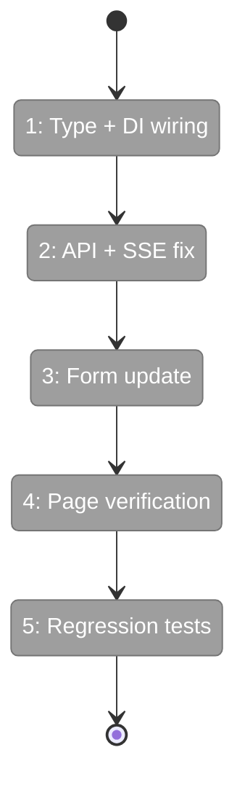
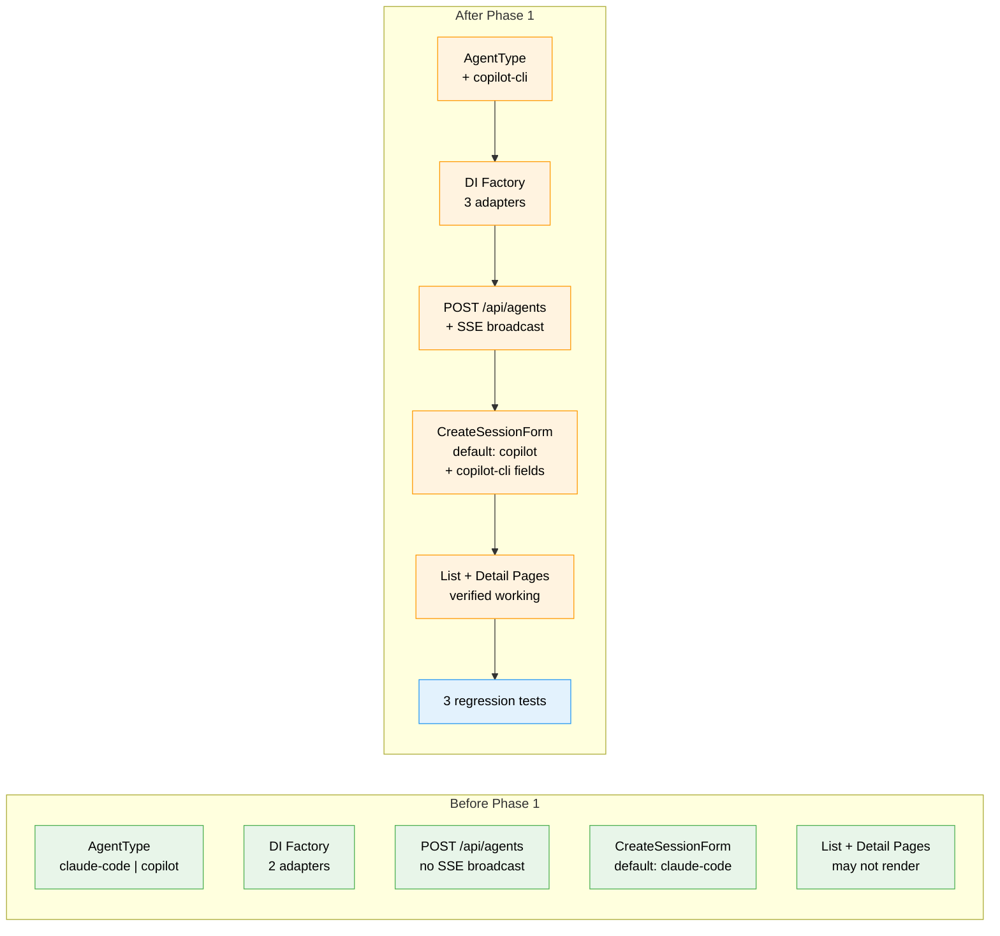

# Flight Plan: Phase 1 — Fix Agent Foundation

**Plan**: [fix-agents-plan.md](../../fix-agents-plan.md) (Phase A)
**Phase**: Phase 1: Fix Agent Foundation
**Generated**: 2026-02-28
**Status**: Ready for takeoff

---

## Departure → Destination

**Where we are**: The web agent system exists structurally (3 adapters, DI container, SSE transport, 45+ tests, React Query hooks) but has critical wiring bugs: POST doesn't broadcast SSE, `copilot-cli` type is rejected everywhere in the web app, and the creation form defaults to `claude-code` instead of `copilot`. The agent list and detail pages may or may not render depending on serialization alignment.

**Where we're going**: A developer can create agents of all three types (copilot default, claude-code, copilot-cli), see them in the agent list, open their chat, see streaming events, and return after a server restart to find sessions intact. Three targeted regression tests guard the wiring fixes.

---

## Domain Context

### Domains We're Changing

| Domain | What Changes | Key Files |
|--------|-------------|-----------|
| agents | Add copilot-cli to AgentType union, DI factory, POST validation; wire SSE broadcast; update form default | `agent-instance.interface.ts`, `di-container.ts`, `route.ts`, `create-session-form.tsx` |

### Domains We Depend On (no changes)

| Domain | What We Consume | Contract |
|--------|----------------|----------|
| _platform/events | SSE broadcasting | ISSEBroadcaster via AgentNotifierService |
| _platform/sdk | Copilot client singleton | CopilotClient for SdkCopilotAdapter |

---

## Flight Status

<!-- Updated by /plan-6-v2: pending → active → done. Use blocked for problems/input needed. -->

**Legend**: grey = pending | yellow = active | red = blocked/needs input | green = done

---

## Stages

<!-- Updated by /plan-6-v2 during implementation: [ ] → [~] → [x] -->

- [ ] **Stage 1: Type + DI wiring** — Add copilot-cli to AgentType union and DI adapter factory (`agent-instance.interface.ts`, `di-container.ts`)
- [ ] **Stage 2: API + SSE fix** — Accept copilot-cli in POST validation and wire SSE broadcast after creation (`route.ts`)
- [ ] **Stage 3: Form update** — Default to copilot, add copilot-cli option with sessionId/tmux fields (`create-session-form.tsx`)
- [ ] **Stage 4: Page verification** — Verify list page, detail page, streaming, and persistence work end-to-end
- [ ] **Stage 5: Regression tests** — Add 3 targeted test files for serialization, SSE broadcast, DI factory

---

## Architecture: Before & After

**Legend**: existing (green, unchanged) | changed (orange, modified) | new (blue, created)

---

## Acceptance Criteria

- [ ] AC-01: GET /api/agents returns data useAgentManager can consume — list page renders
- [ ] AC-02: POST /api/agents creates with `copilot` default; `copilot-cli` and `claude-code` supported
- [ ] AC-03: copilot-cli agent accepts sessionId, tmuxWindow, tmuxPane
- [ ] AC-04: DI factory handles all three agent types
- [ ] AC-05: SSE broadcasts agent_created, agent_status, agent_terminated
- [ ] AC-06: Agent detail page renders chat history + streams new events
- [ ] AC-07: POST /api/agents/[id]/run returns 409 if working, streams via SSE, stores NDJSON
- [ ] AC-08: Sessions persist across server restarts

## Goals & Non-Goals

**Goals**: Fix all wiring bugs so agents work end-to-end; default to copilot; support copilot-cli; verify pages render; guard fixes with tests.

**Non-Goals**: WorkUnit State integration; top bar UI; overlay panel; cross-worktree alerts; refactoring architecture.

---

## Checklist

- [ ] T001: Add copilot-cli to AgentType union in 019 interface
- [ ] T002: Add copilot-cli case to DI adapter factory
- [ ] T003: Fix POST validation + wire SSE broadcast
- [ ] T004: Update create-session-form default + copilot-cli fields
- [ ] T005: Verify GET serialization + list page rendering
- [ ] T006: Verify detail page chat + streaming
- [ ] T007: Verify session persistence across restart
- [ ] T008: Add targeted regression tests
