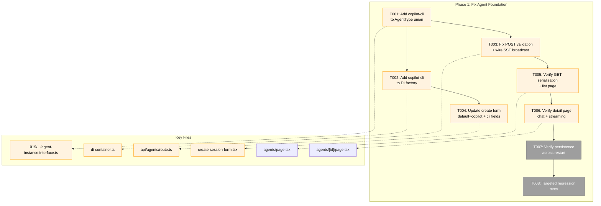
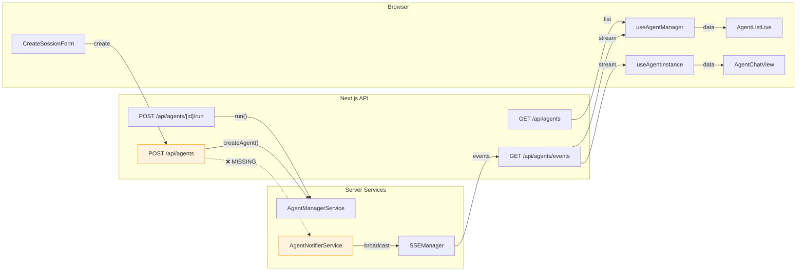
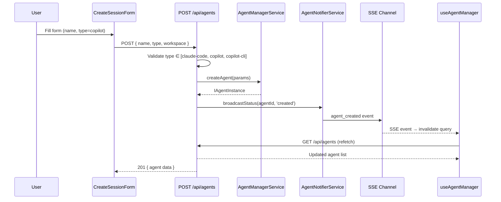

# Phase 1: Fix Agent Foundation — Tasks

**Plan**: [fix-agents-plan.md](../../fix-agents-plan.md) (Phase A)
**Created**: 2026-02-28
**Status**: Pending
**Complexity**: CS-2

---

## Executive Briefing

**Purpose**: Make the broken web agent system functional — agents can be listed, created, chatted with, and streamed in the web UI. This phase fixes data flow wiring issues; the architecture is sound.

**What We're Building**: Four targeted fixes: (1) POST route broadcasts SSE on agent creation, (2) `AgentType` union and DI factory include `copilot-cli`, (3) API POST validation accepts all three agent types, (4) creation form defaults to `copilot` with `copilot-cli` fields. Plus verification that list/detail pages render correctly and sessions persist.

**Goals**:
- ✅ Agent list page renders agents for current workspace
- ✅ Agent creation works for all 3 types (copilot default, claude-code, copilot-cli)
- ✅ SSE broadcasts agent_created on POST
- ✅ Agent detail page shows chat history + streaming
- ✅ Sessions survive server restart
- ✅ Targeted regression tests for the wiring fixes

**Non-Goals**:
- ❌ WorkUnit State integration (Phase 2)
- ❌ Top bar, overlay, attention system (Phase 3)
- ❌ Cross-worktree badges (Phase 4)
- ❌ Refactoring agent architecture — fix wiring only

---

## Prior Phase Context

_Phase 1 — no prior phases._

---

## Pre-Implementation Check

| File | Exists? | Domain Check | Notes |
|------|---------|-------------|-------|
| `apps/web/app/api/agents/route.ts` | ✅ | agents ✅ | POST validates only claude-code/copilot (line 122); no SSE broadcast |
| `apps/web/app/api/agents/[id]/route.ts` | ✅ | agents ✅ | GET returns agent + events; looks correct |
| `apps/web/app/api/agents/[id]/run/route.ts` | ✅ | agents ✅ | 409 guard works; verify NDJSON storage |
| `apps/web/src/lib/di-container.ts` | ✅ | cross-domain ✅ | Adapter factory handles only claude-code + copilot; no copilot-cli case |
| `apps/web/src/features/019-agent-manager-refactor/useAgentManager.ts` | ✅ | agents ✅ | Expects: id, name, type, workspace, status, intent, sessionId, createdAt, updatedAt |
| `apps/web/src/features/019-agent-manager-refactor/useAgentInstance.ts` | ✅ | agents ✅ | Expects same + events array; SSE subscription works |
| `apps/web/src/components/agents/create-session-form.tsx` | ✅ | agents ✅ | Only claude-code + copilot; default is claude-code |
| `apps/web/app/(dashboard)/workspaces/[slug]/agents/page.tsx` | ✅ | agents ✅ | Server component → AgentListLive client |
| `apps/web/app/(dashboard)/workspaces/[slug]/agents/[id]/page.tsx` | ✅ | agents ✅ | Server component → AgentChatView client |
| `packages/shared/src/features/019-agent-manager-refactor/agent-instance.interface.ts` | ✅ | agents ✅ | `AgentType = 'claude-code' \| 'copilot'` — missing copilot-cli! |
| `packages/shared/src/features/034-agentic-cli/types.ts` | ✅ | agents ✅ | `AgentType = 'claude-code' \| 'copilot' \| 'copilot-cli'` — has it |
| `packages/shared/src/adapters/copilot-cli.adapter.ts` | ✅ | agents ✅ | CopilotCLIAdapter implementation exists and is complete |
| `apps/web/src/features/019-agent-manager-refactor/agent-notifier.service.ts` | ✅ | agents ✅ | broadcastStatus, broadcastIntent, broadcastEvent — ready to use |
| `test/unit/web/agents/` | ❌ | — | Will create for regression tests |

**Critical discovery**: Two `AgentType` definitions exist in packages/shared:
- `019-agent-manager-refactor/agent-instance.interface.ts:19` → `'claude-code' | 'copilot'` (used by web)
- `034-agentic-cli/types.ts:17` → `'claude-code' | 'copilot' | 'copilot-cli'` (used by CLI)

The web app imports from 019, which is why `copilot-cli` is rejected. Fix must update the 019 definition.

---

## Architecture Map



---

## Tasks

**Updated 2026-02-28** — Reordered after Workshop 004 root cause analysis. RC1 (serverExternalPackages) is the true critical blocker.

| Status | ID | Task | Domain | Path(s) | Done When | Notes |
|--------|-----|------|--------|---------|-----------|-------|
| [ ] | T000 | Add `@github/copilot-sdk` + `@github/copilot` to `serverExternalPackages` in next.config.mjs | agents | `/apps/web/next.config.mjs` | copilot agent creation succeeds via curl; no `__TURBOPACK__import$2e$meta__` error | Workshop 004 RC1; CRITICAL blocker |
| [ ] | T001 | Add `copilot-cli` to AgentType union in 019 agent-instance.interface.ts | agents | `/packages/shared/src/features/019-agent-manager-refactor/agent-instance.interface.ts` | AgentType is `'claude-code' \| 'copilot' \| 'copilot-cli'` — matches 034 definition; tsc compiles | Finding 02; unify type defs |
| [ ] | T002 | Add `copilot-cli` case to DI adapter factory in di-container.ts | agents | `/apps/web/src/lib/di-container.ts` | Factory returns CopilotCLIAdapter for type `'copilot-cli'`; import CopilotCLIAdapter from shared | Finding 02; AC-04 |
| [ ] | T003 | Fix POST /api/agents — accept copilot-cli in validation + wire SSE broadcast after createAgent() | agents | `/apps/web/app/api/agents/route.ts` | POST accepts all 3 types; after createAgent(), calls notifier.broadcastStatus(agentId, 'created') or equivalent; SSE event fires | Finding 01, 02; AC-02, AC-05 |
| [ ] | T004 | Update create-session-form — default to `copilot`, add `copilot-cli` option with sessionId/tmux fields | agents | `/apps/web/src/components/agents/create-session-form.tsx` | Form default is 'copilot'; 'copilot-cli' option shows sessionId, tmuxWindow, tmuxPane fields; submit sends correct payload | AC-02, AC-03 |
| [ ] | T005 | Verify GET /api/agents + agent list page rendering | agents | `/apps/web/app/api/agents/route.ts`, `/apps/web/app/(dashboard)/workspaces/[slug]/agents/page.tsx` | GET returns all fields useAgentManager expects; AgentListLive renders agent rows | Workshop 004 confirmed GET is NOT broken — verification only |
| [ ] | T006 | Verify agent detail page — chat history + SSE streaming | agents | `/apps/web/app/(dashboard)/workspaces/[slug]/agents/[id]/page.tsx`, `/apps/web/src/features/019-agent-manager-refactor/useAgentInstance.ts` | Navigating to agent detail shows chat history from stored events; running agent streams events in real-time; fix if needed | AC-06, AC-07 |
| [ ] | T007 | Verify session persistence across server restart | agents | — (manual verification) | Stop dev server, restart, navigate to agent page — stored agents visible with their events | AC-08 |
| [ ] | T008 | Add targeted regression tests for wiring fixes | agents | `/test/unit/web/agents/api-serialization.test.ts`, `/test/unit/web/agents/sse-broadcast.test.ts`, `/test/unit/web/agents/di-factory.test.ts` | 3 test files: (1) GET serialization returns all fields hooks expect, (2) POST triggers SSE broadcast, (3) DI factory resolves all 3 adapter types. `pnpm test` passes (baseline: 333 passed, 4694 tests) | Quality gate |

### Task Details

#### T000: Add @github/copilot-sdk to serverExternalPackages

**This is the critical blocker.** `@github/copilot-sdk` uses `import.meta.resolve()` (a Node.js API) to locate the bundled CLI. Turbopack rewrites this to `__TURBOPACK__import$2e$meta__.resolve` which doesn't exist, crashing CopilotClient construction.

**Action**: Add 2 packages to `serverExternalPackages` in `apps/web/next.config.mjs`:
```javascript
serverExternalPackages: [
    'shiki',
    'vscode-oniguruma',
    '@shikijs/core',
    '@shikijs/engine-oniguruma',
    '@github/copilot-sdk',   // uses import.meta.resolve
    '@github/copilot',       // resolved by copilot-sdk
],
```

**Verify**: `curl -s -X POST http://localhost:3000/api/agents -H 'Content-Type: application/json' -d '{"name":"Test","type":"copilot","workspace":"chainglass"}'` returns 201 (not 500).

See [Workshop 004](../../workshops/004-agent-creation-failure-root-cause.md) for full root cause chain.

#### T001: Add copilot-cli to AgentType

The 019 module's `AgentType = 'claude-code' | 'copilot'` is the root cause — web imports this, so `copilot-cli` is unknown at the type level. The 034 module already has the correct 3-member union. Update 019 to match.

**Action**: Change line 19 in `agent-instance.interface.ts` from:
```typescript
export type AgentType = 'claude-code' | 'copilot';
```
to:
```typescript
export type AgentType = 'claude-code' | 'copilot' | 'copilot-cli';
```

Verify no type errors cascade (e.g., exhaustive switches).

#### T002: Add copilot-cli to DI adapter factory

The DI container's adapter factory (in `di-container.ts`) has a switch/if-else for agent type that only handles `claude-code` and `copilot`. Add a `copilot-cli` case that returns `CopilotCLIAdapter`.

**Important**: CopilotCLIAdapter is already implemented in `packages/shared/src/adapters/copilot-cli.adapter.ts`. It takes constructor args for tmux configuration. Check what the constructor expects and wire appropriately.

#### T003: Fix POST route — validation + SSE broadcast

Two issues in `apps/web/app/api/agents/route.ts`:
1. **Line 122**: Hardcodes `body.type !== 'claude-code' && body.type !== 'copilot'` — add `copilot-cli` to the validation
2. **After createAgent()**: No SSE broadcast call. The `AgentNotifierService` has `broadcastStatus(agentId, status)` — call it after successful creation with the new agent's ID

The notifier is already available through DI (SHARED_DI_TOKENS.AGENT_NOTIFIER). The SSE event type should be `agent_created` per the events route which already handles it.

#### T004: Update creation form

`create-session-form.tsx` defaults to `claude-code`. Change default to `copilot`. Add `copilot-cli` as a third option. When `copilot-cli` is selected, show:
- `sessionId` (text input, required)
- `tmuxWindow` (text input, optional — defaults)
- `tmuxPane` (text input, optional — defaults)

These additional fields should be sent in the POST payload. The `CreateAgentParams` type in shared may need extending to include these optional fields.

#### T005: Verify GET serialization + list page

The hook `useAgentManager` expects: `id, name, type, workspace, status, intent, sessionId, createdAt, updatedAt`. The GET route already returns these fields. Verify by:
1. Reading GET response shape carefully
2. Comparing with hook's type expectation
3. If mismatch found, fix the API response to include all expected fields
4. Navigate to agents page in browser to verify rendering

#### T006: Verify detail page + streaming

1. Navigate to `/workspaces/[slug]/agents/[id]` for an existing agent
2. Verify chat history renders from stored events
3. Run an agent and verify SSE streaming works (events appear in real-time)
4. Fix any issues found

#### T007: Verify persistence

1. Create an agent, run a prompt
2. Stop dev server (`Ctrl+C`)
3. Restart dev server (`pnpm dev`)
4. Navigate to agent page — agent should still be there with events

#### T008: Regression tests

Three targeted test files in `test/unit/web/agents/`:

1. **api-serialization.test.ts**: Test GET /api/agents returns the exact shape useAgentManager expects. Use FakeAgentManagerService.
2. **sse-broadcast.test.ts**: Test POST /api/agents calls the notifier after creation. Use FakeSSEBroadcaster.
3. **di-factory.test.ts**: Test DI factory resolves all 3 adapter types. Verify no throw for copilot-cli.

---

## Context Brief

### Key findings from plan

- **Finding 01** (Critical): Agent POST route never calls SSE broadcast after creation — `agent_created` event never fires → T003
- **Finding 02** (Critical): API POST validation hardcodes `'claude-code' | 'copilot'` — rejects `copilot-cli`. DI factory also missing case → T001, T002, T003
- **Finding 03** (High): API GET serialization may omit fields hooks expect — type mismatch → T005

### Domain dependencies

- `agents`: All tasks operate within the agents domain boundary
- `_platform/events`: ISSEBroadcaster consumed by AgentNotifierService (already wired) — T003 just needs to call the notifier

### Domain constraints

- Agent interfaces live in `packages/shared/src/features/019-agent-manager-refactor/` — the web imports from here
- CopilotCLIAdapter lives in `packages/shared/src/adapters/` — already cross-package accessible
- DI container at `apps/web/src/lib/di-container.ts` is cross-domain (bridges shared interfaces to web implementations)
- No new domain contracts are created in Phase 1 — we only fix existing wiring

### Reusable from prior phases

_None — Phase 1 is the first phase._

### Existing test infrastructure

- 42 agent-related test files exist (8 contract, 4 adapter unit, 11 service/feature unit, 7 web component, 7 integration, 5 special)
- Baseline: 333 files passed, 4694 tests passed, 0 failures
- FakeAgentAdapter, FakeAgentManagerService, FakeSSEBroadcaster all available
- Contract test pattern established at `test/contracts/agent-*.contract.ts`

### Data flow diagram



### Sequence diagram — agent creation (fixed)



---

## Discoveries & Learnings

_Populated during implementation by plan-6._

| Date | Task | Type | Discovery | Resolution | References |
|------|------|------|-----------|------------|------------|

**Types**: `gotcha` | `research-needed` | `unexpected-behavior` | `workaround` | `decision` | `debt` | `insight`

---

## Directory Layout

```
docs/plans/059-fix-agents/
  ├── fix-agents-plan.md
  ├── fix-agents-spec.md
  ├── research-dossier.md
  ├── workshops/
  │   ├── 001-top-bar-agent-ux.md
  │   ├── 002-agent-connect-disconnect-ux.md
  │   └── 003-work-unit-state-system.md
  └── tasks/phase-1-fix-agent-foundation/
      ├── tasks.md               ← this file
      ├── tasks.fltplan.md       ← flight plan (generated next)
      └── execution.log.md       ← created by plan-6
```
