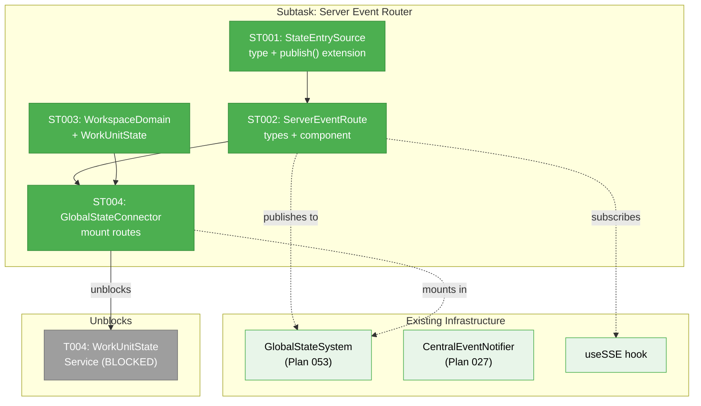
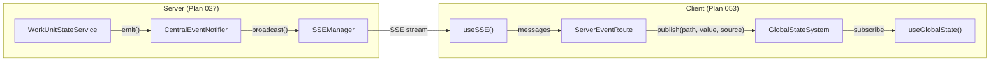

# Subtask 001: Server Event Router — Central Events → GlobalStateSystem Bridge

**Parent Phase**: Phase 2: WorkUnit State System
**Parent Task**: T004 (WorkUnitStateService needs to publish to GlobalStateSystem, but can't — server/client boundary)
**Plan**: [fix-agents-plan.md](../../fix-agents-plan.md)
**Workshop**: [005-server-event-router.md](../../workshops/005-server-event-router.md)
**Created**: 2026-03-01
**Status**: Complete
**Complexity**: CS-2

---

## Parent Context

Phase 2 T004 says "WorkUnitStateService publishes `work-unit:{id}:*` paths to GlobalStateSystem." But WorkUnitStateService is a server-side DI singleton and GlobalStateSystem is client-side React Context — they can't communicate directly. This subtask builds the missing bridge: a generic `ServerEventRouter` that takes central events (Plan 027 SSE) and publishes them into GlobalStateSystem (Plan 053).

This is extracted as a subtask because it's reusable infrastructure (`_platform/events` + `_platform/state`), not specific to work-unit-state. Once built, any future domain gets server→client state publishing for free.

---

## Executive Briefing

**Purpose**: Build a generic, reusable bridge from server-side central events (Plan 027) to client-side GlobalStateSystem (Plan 053). Each domain provides a route descriptor mapping SSE event types to state path updates. The router handles SSE subscription, event mapping, and state publishing with server-origin tagging for debugging.

**What We're Building**:
- `ServerEventRouteDescriptor` type — config mapping SSE events to state paths
- `ServerEventRoute` component — invisible React component that subscribes SSE → publishes state
- `StateEntrySource` type — origin metadata (`server`/`client`) for debugging
- Extended `GlobalStateSystem.publish()` with optional source parameter
- Extended `StateChange` with source metadata for StateChangeLog (Plan 056 devtools)
- Extended `GlobalStateConnector` to mount route instances

**Goals**:
- ✅ Generic ServerEventRoute component that any domain can use
- ✅ Server-origin tagging on state entries for Plan 056 devtools
- ✅ WorkspaceDomain extended with `WorkUnitState` channel
- ✅ Plugged into GlobalStateConnector alongside existing WorktreeStatePublisher

**Non-Goals**:
- ❌ The work-unit-state route descriptor itself (that's T004's job, using this infrastructure)
- ❌ Migrating existing FileChange publisher to this pattern (future work)
- ❌ Event replay or history (fire-and-forget per ADR-0007)

---

## Pre-Implementation Check

| File | Exists? | Domain Check | Notes |
|------|---------|-------------|-------|
| `apps/web/src/lib/state/server-event-router.ts` | ❌ | _platform/state ✅ | NEW — types: ServerEventRouteDescriptor, StateUpdate, ServerEvent |
| `apps/web/src/lib/state/server-event-route.tsx` | ❌ | _platform/state ✅ | NEW — React component: SSE→state bridge |
| `packages/shared/src/state/types.ts` | ✅ | _platform/state ✅ | MODIFY — add StateEntrySource to StateEntry + StateChange |
| `packages/shared/src/interfaces/state.interface.ts` | ✅ | _platform/state ✅ | MODIFY — add optional source param to publish() |
| `apps/web/src/lib/state/global-state-system.ts` | ✅ | _platform/state ✅ | MODIFY — pass source through to StateEntry + StateChange |
| `apps/web/src/lib/state/state-connector.tsx` | ✅ | _platform/state ✅ | MODIFY — mount ServerEventRoute instances |
| `packages/shared/src/features/027-central-notify-events/workspace-domain.ts` | ✅ | _platform/events ✅ | MODIFY — add WorkUnitState channel |
| `apps/web/src/hooks/useSSE.ts` | ✅ | _platform/events ✅ | READ ONLY — consumed by ServerEventRoute |

**Concept search**: No existing "event router" or "SSE→state bridge" pattern found. `WorktreeStatePublisher` is the closest but is domain-specific, not generic.

---

## Architecture Map

---

## Tasks

| Status | ID | Task | Domain | Path(s) | Done When | Notes |
|--------|-----|------|--------|---------|-----------|-------|
| [x] | ST001 | Add `StateEntrySource` type to state types and extend `publish()` signature with optional `source` parameter | _platform/state | `packages/shared/src/state/types.ts`, `packages/shared/src/interfaces/state.interface.ts`, `apps/web/src/lib/state/global-state-system.ts` | `StateEntrySource` type exists with `origin: 'client' \| 'server'`, optional `channel` and `eventType` fields. `publish()` accepts optional 3rd arg. StateEntry and StateChange carry source metadata. Existing callers unchanged (source defaults to undefined). `pnpm test` passes. | Parent T004; Workshop 005 Q3 |
| [x] | ST002 | Create `ServerEventRouteDescriptor` type | _platform/state | `apps/web/src/lib/state/server-event-router.ts`, `apps/web/src/lib/state/server-event-route.tsx` | `ServerEventRouteDescriptor` defines channel, stateDomain, multiInstance, properties, mapEvent. `ServerEventRoute` component subscribes to SSE via `useSSE`, maps events via descriptor, publishes to GlobalStateSystem with `source: { origin: 'server' }`. Returns null (invisible). | Parent T004; Workshop 005 Q1+Q4 |
| [x] | ST003 | Add `WorkUnitState` to `WorkspaceDomain` const | _platform/events | `packages/shared/src/features/027-central-notify-events/workspace-domain.ts` | `WorkspaceDomain.WorkUnitState === 'work-unit-state'`; type union updated. No new SSE route needed (dynamic `[channel]` route handles it). | Prereq for T004 server-side emit |
| [x] | ST004 | Extend `GlobalStateConnector` to accept and mount `ServerEventRoute` instances | _platform/state | `apps/web/src/lib/state/state-connector.tsx` | Connector accepts `routes` prop (array of descriptors), registers their domains, renders a `ServerEventRoute` per route. Existing worktree publisher still works. | Workshop 005 Q4 |

---

## Context Brief

### Key findings from plan

- **Finding 05** (High): State system list cache invalidation iterates ALL patterns per publish — only publish status-level changes (small values), not streaming events → ServerEventRoute mapEvent should filter to essential fields only
- **Workshop 005**: Full design of ServerEventRouteDescriptor, ServerEventRoute, StateEntrySource, and integration architecture

### Domain dependencies

- `_platform/state`: GlobalStateSystem (IStateService.publish, registerDomain) — target for state publishing
- `_platform/state`: StateChangeLog (Plan 056) — captures source metadata in ring buffer
- `_platform/events`: CentralEventNotifierService (Plan 027) — emits events that arrive via SSE
- `_platform/events`: useSSE hook — client-side SSE subscription

### Domain constraints

- StateEntry/StateChange types live in `packages/shared/src/state/types.ts` (cross-package)
- IStateService lives in `packages/shared/src/interfaces/state.interface.ts` (cross-package)
- GlobalStateSystem implementation lives in `apps/web/src/lib/state/` (client-only)
- `publish()` signature change must be backward-compatible (source is optional)
- WorkspaceDomain values ARE SSE channel names (DYK-03)

### Reusable from prior phases

- `useSSE` hook — existing, tested, handles reconnection
- `WorktreeStatePublisher` pattern — invisible component that publishes to state
- `GlobalStateConnector` pattern — registers domain + mounts publisher in useState initializer
- `CentralEventNotifierService` — server-side emit already works for all existing domains

### Data flow diagram

---

## Discoveries & Learnings

_Populated during implementation by plan-6._

| Date | Task | Type | Discovery | Resolution | References |
|------|------|------|-----------|------------|------------|
| 2026-03-01 | ST001 | insight | StateChangeLog needs no modification — it appends StateChange which now carries `source` automatically via the wildcard subscriber in GlobalStateProvider | No action needed | state-provider.tsx L49 |
| 2026-03-01 | ST001 | gotcha | Shared package must be rebuilt (`pnpm --filter @chainglass/shared build`) after adding new type exports, or web tsc sees stale declarations | Build before typecheck | packages/shared/tsconfig.json |
| 2026-03-01 | ST002 | decision | Used `lastProcessedIndex` ref to process ALL messages since last render, not just `messages[length-1]` — prevents message drops under React render batching | DYK #1 from pre-impl analysis | server-event-route.tsx |
| 2026-03-01 | ST004 | decision | SERVER_EVENT_ROUTES array starts empty — route descriptors added by consuming domains in future tasks (T004, Phase 3) | Clean separation of infrastructure vs domain config | state-connector.tsx |

**Types**: `gotcha` | `research-needed` | `unexpected-behavior` | `workaround` | `decision` | `debt` | `insight`

---

## After Subtask Completion

When this subtask is done:
1. **Resume T004** in Phase 2 — WorkUnitStateService can now emit via CentralEventNotifierService on the server side, and the client-side ServerEventRoute will pick up events and publish to GlobalStateSystem
2. T004 needs to: create a `workUnitStateRoute` descriptor (mapEvent function), emit events via notifier, and register the route in GlobalStateConnector
3. All subsequent Phase 2 tasks (T005-T009) proceed unchanged — they operate on the server-side service
