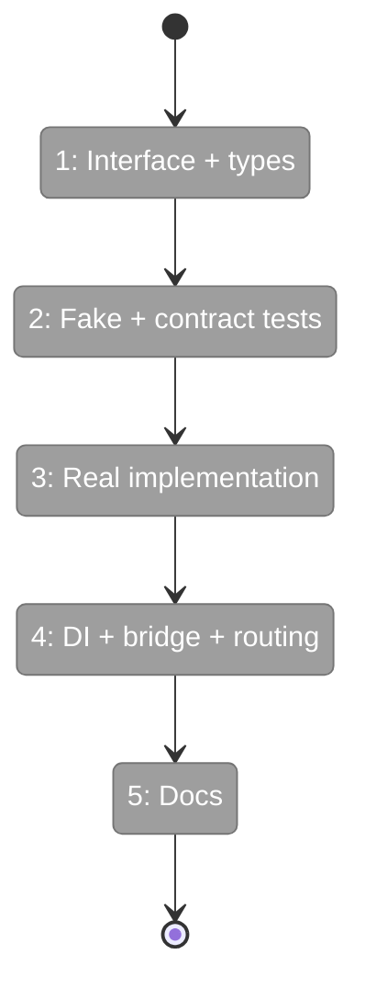
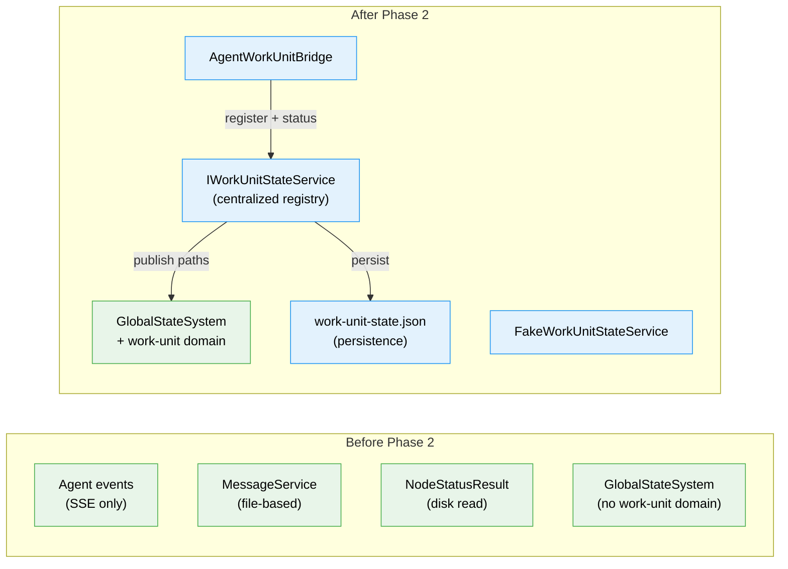

# Flight Plan: Phase 2 — WorkUnit State System

**Plan**: [fix-agents-plan.md](../../fix-agents-plan.md) (Phase B)
**Phase**: Phase 2: WorkUnit State System
**Generated**: 2026-02-28
**Status**: Ready for takeoff

---

## Departure → Destination

**Where we are**: Agents can be created, listed, and chatted with (Phase 1). Status and questions are reported through three disconnected channels (AgentNotifierService, MessageService, NodeStatusResult). No single place to ask "who needs attention?" The GlobalStateSystem exists but no work unit domain is registered.

**Where we're going**: A developer can register any work unit (agent, code unit, workflow node) with `IWorkUnitStateService`, publish status changes, ask first-class typed questions, and have answers routed back via callbacks. The service persists to JSON, publishes to GlobalStateSystem at `work-unit:{id}:*` paths, and auto-expires stale entries after 24h. Agents are automatically bridged via `AgentWorkUnitBridge`.

---

## Domain Context

### Domains We're Changing

| Domain | What Changes | Key Files |
|--------|-------------|-----------|
| work-unit-state | NEW — interface, types, implementation, fake, contract tests, DI registration | `packages/shared/src/interfaces/work-unit-state.interface.ts`, `apps/web/src/lib/work-unit-state/work-unit-state.service.ts` |
| agents | Add AgentWorkUnitBridge to publish agent lifecycle to work-unit-state | `apps/web/src/features/059-fix-agents/agent-work-unit-bridge.ts` |
| _platform/state | Extend publish() with source metadata, add ServerEventRoute bridge, extend GlobalStateConnector | `apps/web/src/lib/state/server-event-route.tsx`, `apps/web/src/lib/state/server-event-router.ts`, `apps/web/src/lib/state/state-connector.tsx` |
| _platform/events | Add WorkUnitState channel to WorkspaceDomain | `packages/shared/src/features/027-central-notify-events/workspace-domain.ts` |

### Domains We Depend On (no changes)

| Domain | What We Consume | Contract |
|--------|----------------|----------|
| agents | Agent lifecycle events | IAgentNotifierService (broadcastCreated, broadcastStatus) |

---

## Flight Status

**Legend**: grey = pending | yellow = active | red = blocked/needs input | green = done

---

## Stages

- [ ] **Stage 1: Interface + types** — Define IWorkUnitStateService, WorkUnitEntry, WorkUnitQuestion, QuestionAnswer in packages/shared (`work-unit-state.interface.ts`, `types.ts`)
- [ ] **Stage 2: Fake + contract tests** — Create FakeWorkUnitStateService with inspection methods, write contract test factory covering all 10 methods (`fake-work-unit-state.ts`, `work-unit-state.contract.ts`)
- [ ] **Stage 3: Real implementation** — Implement WorkUnitStateService with in-memory registry, JSON persistence, GlobalStateSystem publishing, tidyUp rules (`work-unit-state.service.ts`)
- [ ] **Stage 4: DI + bridge + routing** — Register singleton in DI container, create AgentWorkUnitBridge, implement answer routing via callbacks (`di-container.ts`, `agent-work-unit-bridge.ts`)
- [ ] **Stage 5: Docs** — Write integration guide (`docs/how/work-unit-state-integration.md`)

---

## Architecture: Before & After

**Legend**: existing (green, unchanged) | new (blue, created)

---

## Acceptance Criteria

- [ ] AC-09: IWorkUnitStateService interface in packages/shared with all methods
- [ ] AC-10: Implementation persists to JSON + publishes state paths
- [ ] AC-11: tidyUp() removes entries > 24h that aren't working/waiting
- [ ] AC-12: Working entries + questioned entries never expire
- [ ] AC-13: FakeWorkUnitStateService with inspection methods
- [ ] AC-14: Contract tests pass for both real and fake
- [ ] AC-15: AgentWorkUnitBridge auto-registers agents on creation
- [ ] AC-16: First-class question events → askQuestion() → has-question state path
- [ ] AC-17: answerQuestion() routes to callback + clears question state

## Goals & Non-Goals

**Goals**: Centralized work unit registry, JSON persistence, state path publishing, agent bridge, answer routing, contract-tested with fake parity, integration guide.

**Non-Goals**: UI components (Phase 3), cross-worktree queries (Phase 4), SSE broadcasting of work unit events, replacing MessageService or NodeStatusResult.

---

## Checklist

- [ ] T001: Define IWorkUnitStateService interface + types
- [ ] T002: Create FakeWorkUnitStateService
- [ ] T003: Write contract test factory + runner
- [ ] T004: Implement WorkUnitStateService (persistence + state paths)
- [ ] T005: Implement tidyUp rules
- [ ] T006: Register in DI container
- [ ] T007: Create AgentWorkUnitBridge
- [ ] T008: Implement answer routing
- [ ] T009: Write integration guide
