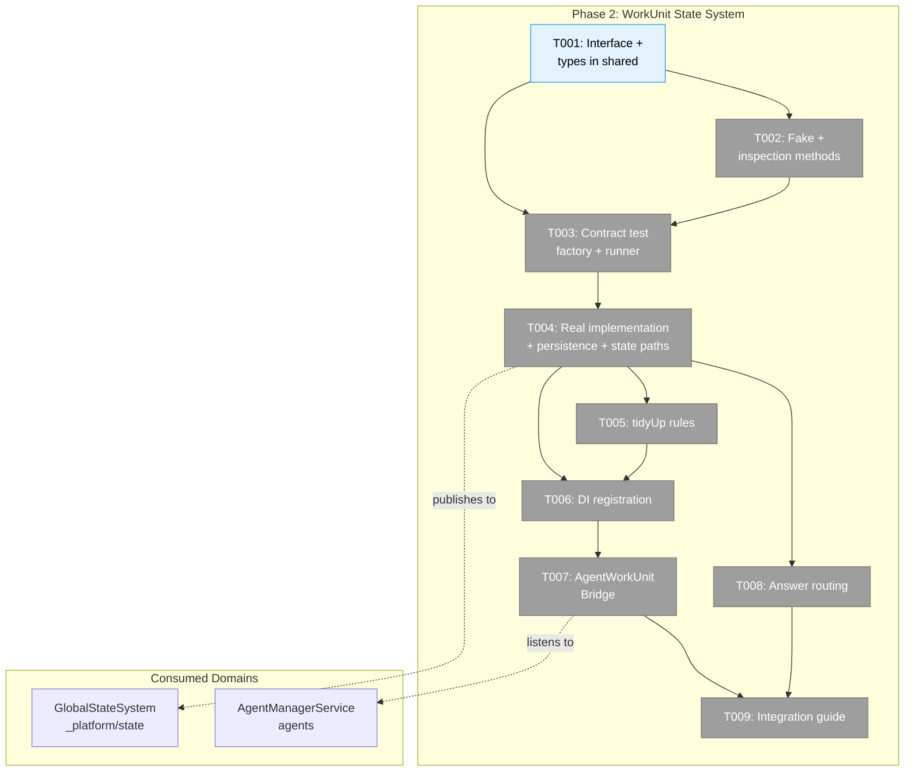
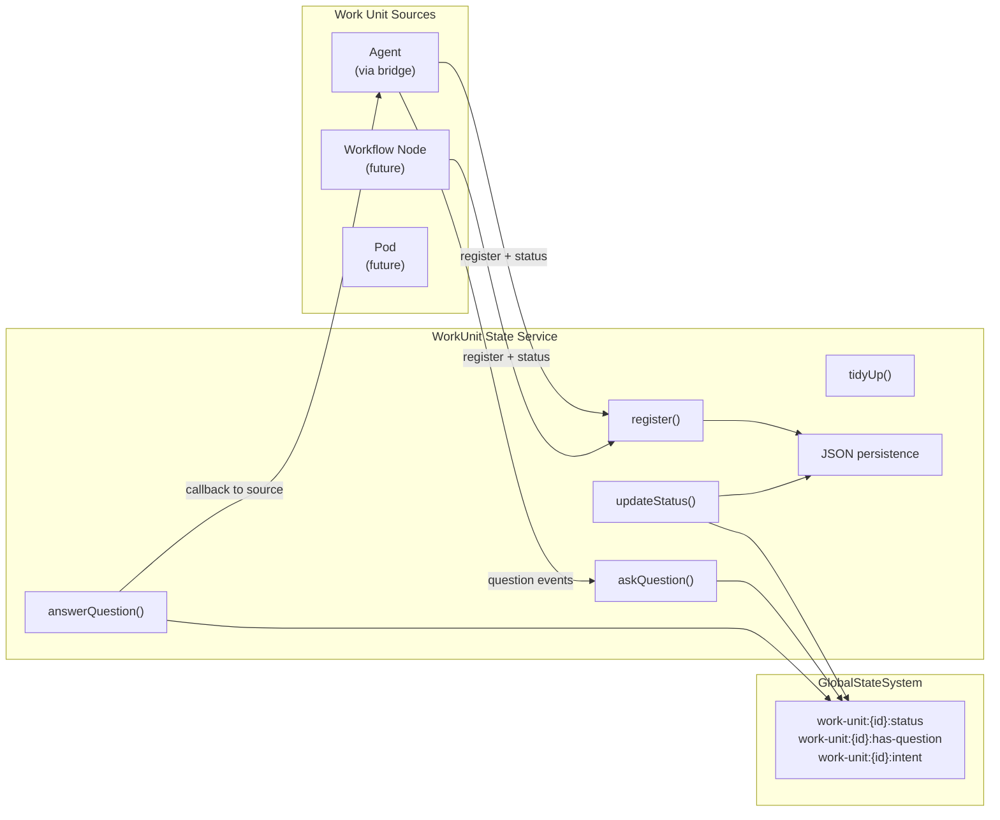
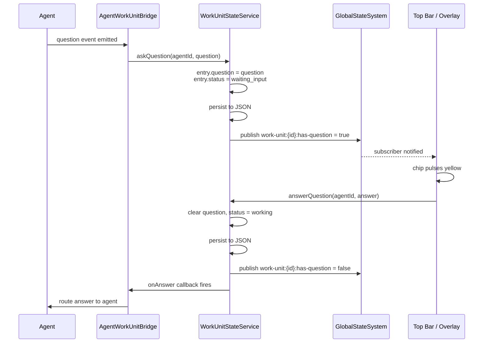

# Phase 2: WorkUnit State System — Tasks

**Plan**: [fix-agents-plan.md](../../fix-agents-plan.md) (Phase B)
**Created**: 2026-02-28
**Status**: Pending
**Complexity**: CS-3

---

## Executive Briefing

**Purpose**: Create a centralized "who's doing what and who needs help" registry that any work unit (agent, code unit, workflow node, pod) can report status and first-class questions into. This is the foundation for the top bar, attention system, and cross-worktree visibility.

**What We're Building**: `IWorkUnitStateService` interface + real implementation + fake test double + contract tests. Then an `AgentWorkUnitBridge` that auto-publishes agent lifecycle events into this registry. The service persists to JSON, publishes to GlobalStateSystem at `work-unit:{id}:*` paths, and routes question answers back to sources via callbacks.

**Goals**:
- ✅ IWorkUnitStateService interface in packages/shared with all methods
- ✅ WorkUnitStateService implementation with JSON persistence + state path publishing
- ✅ FakeWorkUnitStateService with inspection methods
- ✅ Contract tests pass for both real and fake
- ✅ AgentWorkUnitBridge auto-registers agents and publishes status/questions
- ✅ Answer routing via callbacks
- ✅ tidyUp rules: 24h expiry, working/waiting never expire
- ✅ DI registration with singleton guard
- ✅ docs/how/work-unit-state-integration.md guide

**Non-Goals**:
- ❌ UI components (Phase 3 — top bar, overlay, chips)
- ❌ Cross-worktree queries (Phase 4)
- ❌ SSE broadcasting of work unit events (consumers read via GlobalStateSystem)
- ❌ Replacing existing MessageService or NodeStatusResult — this is an aggregator

---

## Prior Phase Context

### Phase 1: Fix Agent Foundation

**A. Deliverables**:
- `apps/web/next.config.mjs` — Added copilot SDK to serverExternalPackages
- `packages/shared/.../agent-instance.interface.ts` — AgentType now includes `copilot-cli`; AdapterFactory accepts optional AdapterFactoryConfig
- `apps/web/app/api/agents/route.ts` — POST accepts all 3 types, broadcasts `agent_created` via SSE
- `apps/web/app/api/agents/[id]/route.ts` — DELETE broadcasts `agent_terminated`
- `apps/web/src/lib/di-container.ts` — CopilotCLIAdapter registered with sendEnter + tmux config
- `apps/web/src/components/agents/create-session-form.tsx` — Default copilot, copilot-cli fields
- `packages/shared/.../agent-notifier.interface.ts` — Added broadcastCreated/broadcastTerminated
- `packages/shared/.../agent-notifier.service.ts` — Implemented lifecycle broadcasts
- `packages/shared/.../fake-agent-notifier.service.ts` — Updated with lifecycle methods

**B. Dependencies Exported**:
- `AgentType = 'claude-code' | 'copilot' | 'copilot-cli'`
- `AdapterFactory(type, config?)` with `AdapterFactoryConfig { tmuxTarget?, defaultSessionId? }`
- `IAgentNotifierService.broadcastCreated(agentId, { name, type, workspace })`
- `IAgentNotifierService.broadcastTerminated(agentId)`
- `CreateAgentParams` now includes `sessionId?`, `tmuxWindow?`, `tmuxPane?`

**C. Gotchas & Debt**:
- AgentInstance eagerly creates adapter at construction — adapter failure crashes creation
- No try/catch in AgentManagerService.initialize() hydration loop — one bad agent blocks all
- Two AdapterFactory types exist (services/ vs 019/) — services/ is 1-arg, 019/ is 2-arg

**D. Incomplete Items**:
- T008 regression tests not written yet (planned but deprioritized)
- No manual verification of detail page streaming or persistence across restart

**E. Patterns to Follow**:
- Externalize SDK packages with `import.meta.resolve` in serverExternalPackages
- Broadcast SSE lifecycle events after mutations
- DI container as type-dispatch hub — don't hardcode adapters in routes
- Singleton via closure-captured flag in useFactory (survive HMR)

---

## Pre-Implementation Check

| File | Exists? | Domain Check | Notes |
|------|---------|-------------|-------|
| `packages/shared/src/interfaces/work-unit-state.interface.ts` | ❌ | work-unit-state ✅ | New — interface + types |
| `packages/shared/src/work-unit-state/types.ts` | ❌ | work-unit-state ✅ | New — WorkUnitEntry, WorkUnitQuestion, QuestionAnswer |
| `packages/shared/src/work-unit-state/index.ts` | ❌ | work-unit-state ✅ | New — barrel exports |
| `packages/shared/src/fakes/fake-work-unit-state.ts` | ❌ | work-unit-state ✅ | New — FakeWorkUnitStateService |
| `test/contracts/work-unit-state.contract.ts` | ❌ | work-unit-state ✅ | New — contract test factory |
| `test/contracts/work-unit-state.contract.test.ts` | ❌ | work-unit-state ✅ | New — contract test runner |
| `apps/web/src/lib/work-unit-state/work-unit-state.service.ts` | ❌ | work-unit-state ✅ | New — real implementation |
| `apps/web/src/lib/work-unit-state/index.ts` | ❌ | work-unit-state ✅ | New — barrel exports |
| `apps/web/src/lib/di-container.ts` | ✅ | cross-domain ✅ | Modify — add WorkUnitStateService singleton |
| `apps/web/src/features/059-fix-agents/agent-work-unit-bridge.ts` | ❌ | agents ✅ | New — bridges agent events to work-unit-state |
| `docs/how/work-unit-state-integration.md` | ❌ | work-unit-state ✅ | New — integration guide |

**Concept search**: IWorkUnitService exists in positional-graph for workflow orchestration (different purpose — executes work units, not tracks their state). IWorkUnitStateService is distinct — tracks status and questions. JSDoc will clarify.

---

## Architecture Map



---

## Tasks

| Status | ID | Task | Domain | Path(s) | Done When | Notes |
|--------|-----|------|--------|---------|-----------|-------|
| [ ] | T001 | Define IWorkUnitStateService interface + all types (WorkUnitEntry, WorkUnitQuestion, QuestionAnswer, WorkUnitFilter, WorkUnitStatus, QuestionType, WorkUnitCreator) | work-unit-state | `packages/shared/src/interfaces/work-unit-state.interface.ts`, `packages/shared/src/work-unit-state/types.ts`, `packages/shared/src/work-unit-state/index.ts` | Interface exported from `@chainglass/shared`; tsc compiles; types match Workshop 003 data model | AC-09; interface-first per P2 |
| [ ] | T002 | Create FakeWorkUnitStateService with inspection methods | work-unit-state | `packages/shared/src/fakes/fake-work-unit-state.ts` | Fake implements IWorkUnitStateService; has getPublished(), getQuestions(), getAnswers(), getRegistered() | AC-13; fakes-before-real per P4 |
| [ ] | T003 | Write contract test factory + runner | work-unit-state | `test/contracts/work-unit-state.contract.ts`, `test/contracts/work-unit-state.contract.test.ts` | Tests cover: register, unregister, updateStatus, askQuestion, answerQuestion, onAnswer, getUnit, getUnits, getQuestioned, tidyUp. Both real and fake run through factory. | AC-14; TDD red phase |
| [ ] | T004 | Implement WorkUnitStateService — in-memory registry + JSON persistence + GlobalStateSystem publishing | work-unit-state | `apps/web/src/lib/work-unit-state/work-unit-state.service.ts`, `apps/web/src/lib/work-unit-state/index.ts` | Passes all contract tests; persists to `<worktree>/.chainglass/data/work-unit-state.json`; publishes `work-unit:{id}:status`, `work-unit:{id}:has-question`, `work-unit:{id}:intent` | AC-10; TDD green phase; Finding 05 — only status-level changes |
| [ ] | T005 | Implement tidyUp rules — 24h expiry, working/waiting never expire | work-unit-state | `apps/web/src/lib/work-unit-state/work-unit-state.service.ts` | tidyUp() removes entries with lastActivityAt > 24h ago AND status NOT in ['working', 'waiting_input']; entries with pending questions never expire | AC-11, AC-12 |
| [ ] | T006 | Register WorkUnitStateService in DI container as singleton | work-unit-state | `apps/web/src/lib/di-container.ts` | Container resolves IWorkUnitStateService; lazy init guard; dependency order: GlobalStateSystem → WorkUnitStateService → AgentWorkUnitBridge | Finding 04; ADR-0004 |
| [ ] | T007 | Create AgentWorkUnitBridge — auto-register agents + publish status/questions | agents | `apps/web/src/features/059-fix-agents/agent-work-unit-bridge.ts` | Bridge registers agents on create, publishes status changes via updateStatus(), calls askQuestion() on first-class question events | AC-15, AC-16 |
| [ ] | T008 | Implement answer routing — answerQuestion() routes to registered onAnswer callback | work-unit-state | `apps/web/src/lib/work-unit-state/work-unit-state.service.ts` | Callback receives QuestionAnswer; entry.question cleared; status updated; state path `has-question` set to false | AC-17 |
| [ ] | T009 | Write docs/how/work-unit-state-integration.md | work-unit-state | `docs/how/work-unit-state-integration.md` | Guide covers: registering a source, publishing status, asking questions, answering, tidyUp lifecycle, state path schema | Documentation deliverable |

---

## Context Brief

### Key findings from plan

- **Finding 04** (High): DI singleton bootstrap ordering — adding WorkUnitStateService as second singleton risks init order issues. Use shared init guard; document dependency order in di-container.ts → T006
- **Finding 05** (High): State system list cache invalidation iterates ALL patterns per publish — keep agent streaming events OUT of state system; only publish status-level changes → T004
- **Finding 08** (Low): IWorkUnitService already exists in positional-graph — distinct naming; add JSDoc clarification → T001

### Domain dependencies

- `_platform/state`: Publish state paths (GlobalStateSystem.publish()) — work-unit entries publish `work-unit:{id}:*` paths
- `_platform/state`: Register domain descriptor (GlobalStateSystem.registerDomain()) — registers `work-unit-state` domain at bootstrap
- `agents`: Agent lifecycle events (IAgentNotifierService) — bridge listens for status/question events to forward

### Domain constraints

- work-unit-state interface + types live in `packages/shared` (cross-package contract)
- Real implementation lives in `apps/web` (server-side, has filesystem access)
- State paths follow colon-delimited format: `work-unit:{id}:property`
- Only publish status-level changes (not streaming text_delta etc.) per Finding 05
- IWorkUnitStateService is NOT IWorkUnitService (positional-graph) — distinct names, distinct purposes

### Reusable from prior phases

- Phase 1: DI container singleton pattern with closure-captured flag guard
- Phase 1: IAgentNotifierService.broadcastCreated/broadcastTerminated — bridge can hook into these
- Existing: FakeStateSystem in packages/shared for testing state path publishing
- Existing: WorktreeStatePublisher pattern — register domain descriptor + publish in useEffect
- Existing: Contract test factory pattern from test/contracts/agent-*.contract.ts

### Data flow diagram



### Sequence diagram — question flow



---

## Discoveries & Learnings

_Populated during implementation by plan-6._

| Date | Task | Type | Discovery | Resolution | References |
|------|------|------|-----------|------------|------------|

**Types**: `gotcha` | `research-needed` | `unexpected-behavior` | `workaround` | `decision` | `debt` | `insight`

---

## Directory Layout

```
docs/plans/059-fix-agents/
  ├── fix-agents-plan.md
  ├── fix-agents-spec.md
  ├── research-dossier.md
  ├── workshops/
  │   ├── 001-top-bar-agent-ux.md
  │   ├── 002-agent-connect-disconnect-ux.md
  │   ├── 003-work-unit-state-system.md
  │   └── 004-agent-creation-failure-root-cause.md
  ├── tasks/phase-1-fix-agent-foundation/
  │   ├── tasks.md
  │   └── tasks.fltplan.md
  └── tasks/phase-2-workunit-state-system/
      ├── tasks.md               ← this file
      ├── tasks.fltplan.md       ← flight plan (next)
      └── execution.log.md       ← created by plan-6
```
