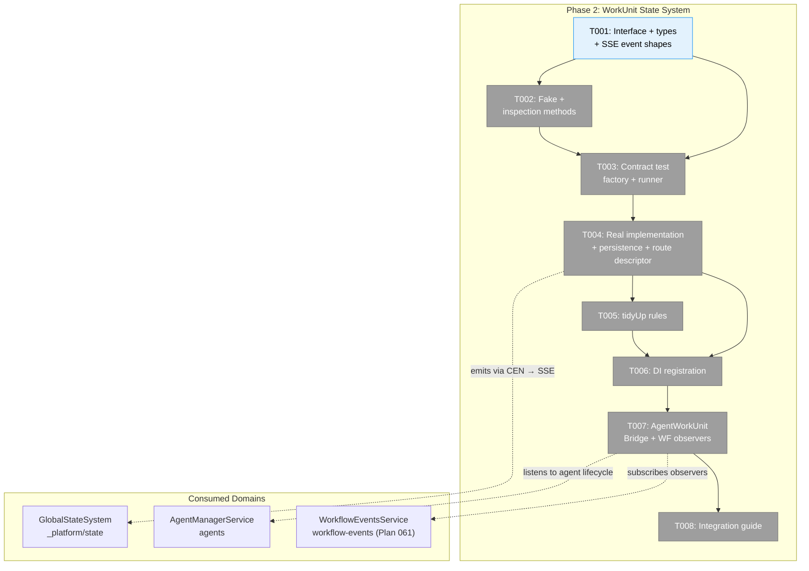
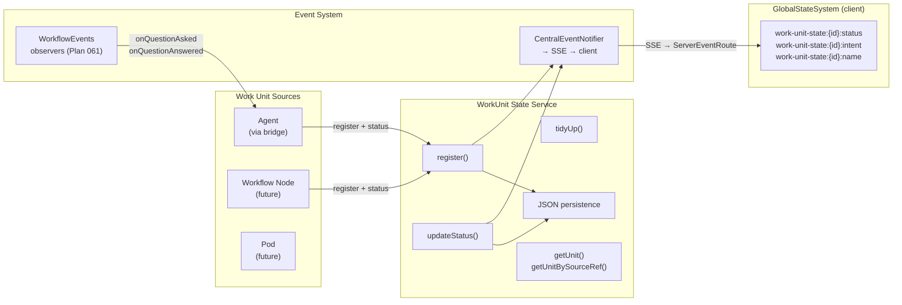
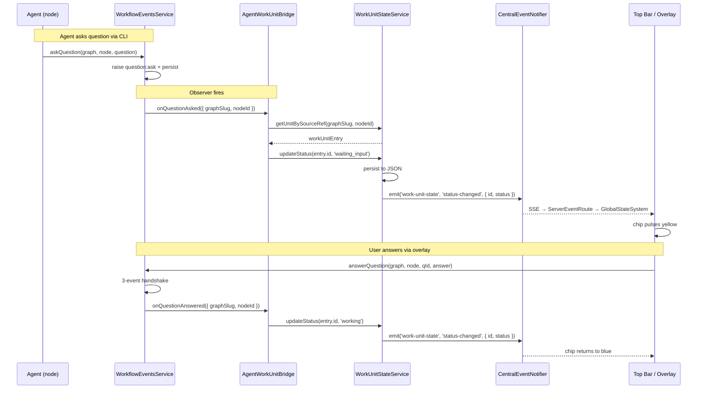

# Phase 2: WorkUnit State System — Tasks

**Plan**: [fix-agents-plan.md](../../fix-agents-plan.md) (Phase B)
**Created**: 2026-02-28
**Status**: Complete
**Complexity**: CS-3

---

## Executive Briefing

**Purpose**: Create a centralized "who's doing what and who needs help" registry that any work unit (agent, code unit, workflow node, pod) can report status and first-class questions into. This is the foundation for the top bar, attention system, and cross-worktree visibility.

**What We're Building**: `IWorkUnitStateService` interface + real implementation + fake test double + contract tests. Then an `AgentWorkUnitBridge` that auto-publishes agent lifecycle events into this registry. The service persists to JSON, publishes to GlobalStateSystem at `work-unit:{id}:*` paths, and routes question answers back to sources via callbacks.

**Goals**:
- ✅ IWorkUnitStateService interface in packages/shared with all methods
- ✅ WorkUnitStateService implementation with JSON persistence + state path publishing
- ✅ FakeWorkUnitStateService with inspection methods
- ✅ Contract tests pass for both real and fake
- ✅ AgentWorkUnitBridge auto-registers agents and publishes status/questions
- ✅ Answer routing via callbacks
- ✅ tidyUp rules: 24h expiry, working/waiting never expire
- ✅ DI registration with singleton guard
- ✅ docs/how/work-unit-state-integration.md guide

**Non-Goals**:
- ❌ UI components (Phase 3 — top bar, overlay, chips)
- ❌ Cross-worktree queries (Phase 4)
- ❌ SSE broadcasting of work unit events (consumers read via GlobalStateSystem)
- ❌ Replacing existing MessageService or NodeStatusResult — this is an aggregator

---

## Prior Phase Context

### Phase 1: Fix Agent Foundation

**A. Deliverables**:
- `apps/web/next.config.mjs` — Added copilot SDK to serverExternalPackages
- `packages/shared/.../agent-instance.interface.ts` — AgentType now includes `copilot-cli`; AdapterFactory accepts optional AdapterFactoryConfig
- `apps/web/app/api/agents/route.ts` — POST accepts all 3 types, broadcasts `agent_created` via SSE
- `apps/web/app/api/agents/[id]/route.ts` — DELETE broadcasts `agent_terminated`
- `apps/web/src/lib/di-container.ts` — CopilotCLIAdapter registered with sendEnter + tmux config
- `apps/web/src/components/agents/create-session-form.tsx` — Default copilot, copilot-cli fields
- `packages/shared/.../agent-notifier.interface.ts` — Added broadcastCreated/broadcastTerminated
- `packages/shared/.../agent-notifier.service.ts` — Implemented lifecycle broadcasts
- `packages/shared/.../fake-agent-notifier.service.ts` — Updated with lifecycle methods

**B. Dependencies Exported**:
- `AgentType = 'claude-code' | 'copilot' | 'copilot-cli'`
- `AdapterFactory(type, config?)` with `AdapterFactoryConfig { tmuxTarget?, defaultSessionId? }`
- `IAgentNotifierService.broadcastCreated(agentId, { name, type, workspace })`
- `IAgentNotifierService.broadcastTerminated(agentId)`
- `CreateAgentParams` now includes `sessionId?`, `tmuxWindow?`, `tmuxPane?`

**C. Gotchas & Debt**:
- AgentInstance eagerly creates adapter at construction — adapter failure crashes creation
- No try/catch in AgentManagerService.initialize() hydration loop — one bad agent blocks all
- Two AdapterFactory types exist (services/ vs 019/) — services/ is 1-arg, 019/ is 2-arg

**D. Incomplete Items**:
- T008 regression tests not written yet (planned but deprioritized)
- No manual verification of detail page streaming or persistence across restart

**E. Patterns to Follow**:
- Externalize SDK packages with `import.meta.resolve` in serverExternalPackages
- Broadcast SSE lifecycle events after mutations
- DI container as type-dispatch hub — don't hardcode adapters in routes
- Singleton via closure-captured flag in useFactory (survive HMR)

---

## Pre-Implementation Check

| File | Exists? | Domain Check | Notes |
|------|---------|-------------|-------|
| `packages/shared/src/interfaces/work-unit-state.interface.ts` | ❌ | work-unit-state ✅ | New — interface + types |
| `packages/shared/src/work-unit-state/types.ts` | ❌ | work-unit-state ✅ | New — WorkUnitEntry, WorkUnitQuestion, QuestionAnswer |
| `packages/shared/src/work-unit-state/index.ts` | ❌ | work-unit-state ✅ | New — barrel exports |
| `packages/shared/src/fakes/fake-work-unit-state.ts` | ❌ | work-unit-state ✅ | New — FakeWorkUnitStateService |
| `test/contracts/work-unit-state.contract.ts` | ❌ | work-unit-state ✅ | New — contract test factory |
| `test/contracts/work-unit-state.contract.test.ts` | ❌ | work-unit-state ✅ | New — contract test runner |
| `apps/web/src/lib/work-unit-state/work-unit-state.service.ts` | ❌ | work-unit-state ✅ | New — real implementation |
| `apps/web/src/lib/work-unit-state/index.ts` | ❌ | work-unit-state ✅ | New — barrel exports |
| `apps/web/src/lib/di-container.ts` | ✅ | cross-domain ✅ | Modify — add WorkUnitStateService singleton |
| `apps/web/src/features/059-fix-agents/agent-work-unit-bridge.ts` | ❌ | agents ✅ | New — bridges agent events to work-unit-state |
| `docs/how/work-unit-state-integration.md` | ❌ | work-unit-state ✅ | New — integration guide |

**Concept search**: IWorkUnitService exists in positional-graph for workflow orchestration (different purpose — executes work units, not tracks their state). IWorkUnitStateService is distinct — tracks status and questions. JSDoc will clarify.

---

## Architecture Map



---

## Tasks

| Status | ID | Task | Domain | Path(s) | Done When | Notes |
|--------|-----|------|--------|---------|-----------|-------|
| [x] | T001 | Define IWorkUnitStateService interface + all types (WorkUnitEntry, WorkUnitFilter, WorkUnitStatus, WorkUnitCreator). Add `getUnitBySourceRef(graphSlug, nodeId)` lookup method (DYK-R-02). Define SSE event shapes: WorkUnitStatusEvent, WorkUnitRegisteredEvent, WorkUnitRemovedEvent (DYK-R-04). **No QnA methods** — status observation only. State paths use `work-unit-state:{id}:property`. | work-unit-state | `packages/shared/src/interfaces/work-unit-state.interface.ts`, `packages/shared/src/work-unit-state/types.ts`, `packages/shared/src/work-unit-state/index.ts` | Interface exported from `@chainglass/shared`; tsc compiles; methods: register, unregister, updateStatus, getUnit, getUnits, getUnitBySourceRef, tidyUp; SSE event types exported | AC-09; DYK-R-02, DYK-R-04 |
| [x] | T002 | Create FakeWorkUnitStateService with inspection methods | work-unit-state | `packages/shared/src/fakes/fake-work-unit-state.ts` | Fake implements IWorkUnitStateService; has getPublished(), getRegistered(), reset() | AC-13; fakes-before-real per P4 |
| [x] | T003 | Write contract test factory + runner | work-unit-state | `test/contracts/work-unit-state.contract.ts`, `test/contracts/work-unit-state.contract.test.ts` | Tests cover: register, unregister, updateStatus, getUnit, getUnits, getUnitBySourceRef, tidyUp. Both real and fake run through factory. | AC-14; TDD red phase |
| [x] | T004 | Implement WorkUnitStateService — in-memory registry + JSON persistence + CentralEventNotifier emit + workUnitStateRoute descriptor. **Emits via CentralEventNotifierService** using SSE event shapes from T001. Creates route descriptor (ServerEventRouteDescriptor per Subtask 001) and adds to SERVER_EVENT_ROUTES. Calls tidyUp on startup hydration (DYK-R-03). | work-unit-state | `apps/web/src/lib/work-unit-state/work-unit-state.service.ts`, `apps/web/src/lib/work-unit-state/index.ts`, `apps/web/src/lib/state/state-connector.tsx` | Passes all contract tests; persists to `<worktree>/.chainglass/data/work-unit-state.json`; emits via notifier using defined event shapes; route descriptor publishes `work-unit-state:{id}:status`, `work-unit-state:{id}:intent`, `work-unit-state:{id}:name` | AC-10; DYK #1, DYK-R-04 |
| [x] | T005 | Implement tidyUp rules — 24h expiry, working/waiting never expire. Called on startup hydration + register() (DYK-R-03). Public method for future housekeeping. | work-unit-state | `apps/web/src/lib/work-unit-state/work-unit-state.service.ts` | tidyUp() removes entries with lastActivityAt > 24h ago AND status NOT in ['working', 'waiting_input']; called at hydration + register | AC-11, AC-12; DYK-R-03 |
| [x] | T006 | Register WorkUnitStateService in DI container as singleton. **Inject workspace path resolver + CentralEventNotifierService** (confirmed in DI as WORKSPACE_DI_TOKENS.CENTRAL_EVENT_NOTIFIER). | work-unit-state | `apps/web/src/lib/di-container.ts` | Container resolves IWorkUnitStateService; lazy init guard; workspace resolver + CEN injected | Finding 04; DYK #4 |
| [x] | T007 | Create AgentWorkUnitBridge — auto-register agents + publish status changes via updateStatus(). **Subscribe to WorkflowEvents observers** (Plan 061 complete): `onQuestionAsked` → updateStatus('waiting_input'), `onQuestionAnswered` → updateStatus('working'). Subscribe per work unit's sourceRef.graphSlug at register() time; unsubscribe at unregister() (DYK-R-01). Use `getUnitBySourceRef(graphSlug, nodeId)` for observer→entry lookup (DYK-R-02). | agents | `apps/web/src/features/059-fix-agents/agent-work-unit-bridge.ts` | Bridge registers agents on create, publishes status, subscribes to WF observers per graph, unsubscribes on terminate; observer events update work unit status | AC-15; DYK-R-01, DYK-R-02; Workshop 006 |
| [x] | T008 | Write docs/how/work-unit-state-integration.md. Include relationship to WorkflowEvents (status aggregator, not Q&A mechanics). | work-unit-state | `docs/how/work-unit-state-integration.md` | Guide covers: registering a source, publishing status, tidyUp lifecycle, state path schema, SSE event shapes, relationship to Plan 061 | Documentation deliverable |

---

## Context Brief

### Key findings from plan

- **Finding 04** (High): DI singleton bootstrap ordering — adding WorkUnitStateService as second singleton risks init order issues. Use shared init guard; document dependency order in di-container.ts → T006
- **Finding 05** (High): State system list cache invalidation iterates ALL patterns per publish — keep agent streaming events OUT of state system; only publish status-level changes → T004
- **Finding 08** (Low): IWorkUnitService already exists in positional-graph — distinct naming; add JSDoc clarification → T001

### Domain dependencies

- `_platform/state`: Publish state paths (GlobalStateSystem.publish()) — work-unit entries publish `work-unit:{id}:*` paths
- `_platform/state`: Register domain descriptor (GlobalStateSystem.registerDomain()) — registers `work-unit-state` domain at bootstrap
- `agents`: Agent lifecycle events (IAgentNotifierService) — bridge listens for status/question events to forward

### Domain constraints

- work-unit-state interface + types live in `packages/shared` (cross-package contract)
- Real implementation lives in `apps/web` (server-side, has filesystem access)
- State paths follow colon-delimited format: `work-unit:{id}:property`
- Only publish status-level changes (not streaming text_delta etc.) per Finding 05
- IWorkUnitStateService is NOT IWorkUnitService (positional-graph) — distinct names, distinct purposes

### Reusable from prior phases

- Phase 1: DI container singleton pattern with closure-captured flag guard
- Phase 1: IAgentNotifierService.broadcastCreated/broadcastTerminated — bridge can hook into these
- Existing: FakeStateSystem in packages/shared for testing state path publishing
- Existing: WorktreeStatePublisher pattern — register domain descriptor + publish in useEffect
- Existing: Contract test factory pattern from test/contracts/agent-*.contract.ts

### Data flow diagram



### Sequence diagram — question flow



---

## Discoveries & Learnings

_Populated during implementation by plan-6._

| Date | Task | Type | Discovery | Resolution | References |
|------|------|------|-----------|------------|------------|
| 2026-03-01 | Pre-T001 | decision | **Drop `askQuestion`, `answerQuestion`, `onAnswer` from IWorkUnitStateService** — QnA is entirely handled by the WF event system (Plan 032) via `question:ask`/`question:answer`/`node:restart` events. Agents exit after asking, get reinvoked in new Pods, fetch answer via CLI `cg wf node get-answer`. WorkUnitStateService should NOT own question mechanics — it only observes `status === 'waiting_input'`. | Remove Q&A methods from T001 interface. T008 (answer routing) removed — delivered by Plan 061 + web action. | DYK #3, Workshop 006, Plan 061 |
| 2026-03-01 | Pre-T001 | gotcha | **State domain name mismatch: `work-unit` vs `work-unit-state`** — Workshop 003 defines paths as `work-unit:{id}:status` but domain name is `work-unit-state`, WorkspaceDomain channel is `'work-unit-state'`, and ServerEventRoute uses `stateDomain: 'work-unit-state'`. If T001 follows workshop verbatim, subscribers on `work-unit:*:status` would never match `work-unit-state:agent-1:status`. | Standardize on `work-unit-state` everywhere. All state paths use `work-unit-state:{id}:property`. Workshop 003 examples using `work-unit:` are shorthand that needs correcting. | DYK #2 |
| 2026-03-01 | Pre-T001 | insight | **T004 can't publish to GlobalStateSystem directly** — WorkUnitStateService is server-side DI singleton, GlobalStateSystem is client-side React Context. Must emit via `CentralEventNotifierService.emit('work-unit-state', eventType, data)` → SSE → client ServerEventRoute → GlobalStateSystem.publish(). T004 needs to: inject CentralEventNotifierService, emit on every state change, create `workUnitStateRoute` descriptor, and add route to `SERVER_EVENT_ROUTES` in state-connector.tsx. | Amend T004 done-when to include: emits via CentralEventNotifierService, creates workUnitStateRoute descriptor, adds route to SERVER_EVENT_ROUTES. | DYK #1, Subtask 001 |
| 2026-03-01 | Pre-T001 | decision | **Singleton + per-worktree persistence** — WorkUnitStateService is a singleton (T006) managing work units across ALL worktrees, but persists to `<worktree>/.chainglass/data/work-unit-state.json`. Needs workspace path resolver injection at construction, or use a single global file and scope reads by workspace field. | T006 DI registration must inject workspace path resolver alongside CentralEventNotifierService. | DYK #4 |
| 2026-03-01 | Pre-T001 | insight | **Plan 061 (WorkflowEvents) complete** — Observer hooks (`onQuestionAsked`, `onQuestionAnswered`, `onProgress`, `onEvent`) delivered. T007 bridge subscribes to these. T008 (answer routing) removed — handled by existing web `answerQuestion` action delegating to WorkflowEvents. | T007 expanded to include observer subscription. Old T008 removed, old T009 renumbered to T008. | Plan 061 complete, Workshop 006 |
| 2026-03-02 | T007 | insight | **Observer graphSlug scoping** — `onQuestionAsked(graphSlug, handler)` requires specific graph. Bridge subscribes per work unit's `sourceRef.graphSlug` at register() time; unsubscribes at unregister(). Ties subscription lifecycle to work unit lifecycle. | Bridge manages Map<workUnitId, unsubscribeFn[]> for cleanup. | DYK-R-01, Workshop 006 |
| 2026-03-02 | T001 | decision | **Add `getUnitBySourceRef(graphSlug, nodeId)` lookup** — observer events arrive with `{ graphSlug, nodeId }`, need to find WorkUnitEntry. Convention-based `node-${nodeId}` id is fragile. Proper query method is more robust. | Add to T001 interface. Bridge uses in T007. | DYK-R-02 |
| 2026-03-02 | T005 | decision | **tidyUp invocation strategy** — call on startup hydration + register(). Public method available for future housekeeping orchestrators. No timer/interval needed. | T005 + T004 updated. | DYK-R-03 |
| 2026-03-02 | T001/T004 | insight | **SSE event shapes must be co-designed with route descriptor** — CEN.emit() sends flat payload, ServerEventRouteDescriptor.mapEvent() must extract instanceId + property updates from it. Define event types (WorkUnitStatusEvent, WorkUnitRegisteredEvent, WorkUnitRemovedEvent) in T001 alongside interface. | T001 scope expanded to include SSE event types. T004 uses them. | DYK-R-04 |

**Types**: `gotcha` | `research-needed` | `unexpected-behavior` | `workaround` | `decision` | `debt` | `insight`

---

## Directory Layout

```
docs/plans/059-fix-agents/
  ├── fix-agents-plan.md
  ├── fix-agents-spec.md
  ├── research-dossier.md
  ├── workshops/
  │   ├── 001-top-bar-agent-ux.md
  │   ├── 002-agent-connect-disconnect-ux.md
  │   ├── 003-work-unit-state-system.md
  │   └── 004-agent-creation-failure-root-cause.md
  ├── tasks/phase-1-fix-agent-foundation/
  │   ├── tasks.md
  │   └── tasks.fltplan.md
  └── tasks/phase-2-workunit-state-system/
      ├── tasks.md               ← this file
      ├── tasks.fltplan.md       ← flight plan (next)
      └── execution.log.md       ← created by plan-6
```
