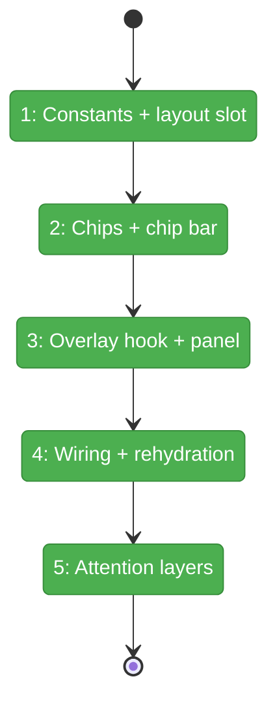
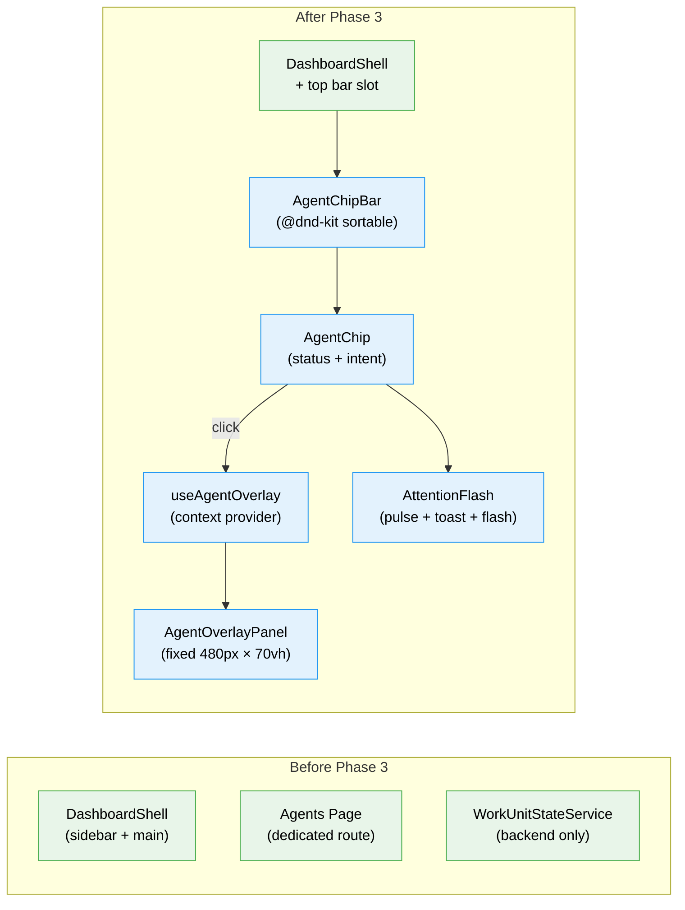

# Flight Plan: Phase 3 — Top Bar + Agent Overlay

**Plan**: [fix-agents-plan.md](../../fix-agents-plan.md) (Phase C)
**Phase**: Phase 3: Top Bar + Agent Overlay
**Generated**: 2026-03-02
**Status**: Landed

---

## Departure → Destination

**Where we are**: Agents can be created, listed, and chatted with on dedicated pages. The WorkUnitStateService tracks agent status via SSE → GlobalStateSystem. But agents are only visible when you navigate to the agents page — there's no persistent visibility or quick-access from other pages.

**Where we're going**: A developer can see all active agents as chips along the top of every page. Clicking a chip opens a chat overlay without navigating away. When an agent asks a question, the chip pulses amber, a toast appears, and (if the user has been away) the screen flashes green with a floating ❓ badge. Agents are always one click away.

---

## Domain Context

### Domains We're Changing

| Domain | What Changes | Key Files |
|--------|-------------|-----------|
| agents | New UI: chip bar, overlay, attention layers, constants, hooks | `agent-chip.tsx`, `agent-chip-bar.tsx`, `agent-overlay-panel.tsx`, `attention-flash.tsx`, `useRecentAgents.ts`, `useAgentOverlay.ts`, `constants.ts` |
| _platform/panel-layout | Add top bar slot in DashboardShell | `dashboard-shell.tsx` |
| workflow-ui | Wire node click → agent overlay | Canvas node click handler |

### Domains We Depend On (no changes)

| Domain | What We Consume | Contract |
|--------|----------------|----------|
| work-unit-state | Agent status via GlobalState paths | `IWorkUnitStateService`, `work-unit-state:{id}:*` |
| agents (Phase 1) | Agent data + streaming | `useAgentManager`, `useAgentInstance` |
| _platform/state | State subscription | `useGlobalState`, `useGlobalStateList` |
| _platform/events | SSE transport | `useSSE` |

---

## Flight Status

**Legend**: grey = pending | yellow = active | red = blocked/needs input | green = done

---

## Stages

- [x] **Stage 1: Constants + layout slot** — z-index hierarchy, storage keys, DashboardShell top bar slot (T001, T002)
- [x] **Stage 2: Chips + chip bar** — useRecentAgents hook, AgentChip component, AgentChipBar with @dnd-kit (T003, T004, T005)
- [x] **Stage 3: Overlay hook + panel** — useAgentOverlay context/hook, AgentOverlayPanel with chat UI (T006, T007)
- [x] **Stage 4: Wiring + rehydration** — chip click → overlay, session rehydration, workflow node → overlay (T008, T009)
- [x] **Stage 5: Attention layers** — chip pulse, toast, screen border flash, ❓ badge (T010)

---

## Architecture: Before & After

**Legend**: existing (green, unchanged) | new (blue, created)

---

## Acceptance Criteria

- [ ] AC-18: Persistent chip bar above all page content, showing current worktree's recent agents
- [ ] AC-19: Chips show type icon, name, status indicator, intent snippet
- [ ] AC-20: Drag-to-reorder with @dnd-kit; order persists in localStorage
- [ ] AC-21: Overlay panel 480px × 70vh with full chat UI
- [ ] AC-22: Overlay doesn't navigate away; closing keeps agent running
- [ ] AC-23: useAgentOverlay() provides { openAgent, closeAgent, activeAgentId }
- [ ] AC-24: Workflow node with agentSessionId → openAgent()
- [ ] AC-25: Old sessions rehydrate from stored NDJSON; resume if host has session
- [ ] AC-26: Invalid session ID shows clear error
- [ ] AC-27: waiting_input → chip pulse + toast
- [ ] AC-28: Question while not viewing → green border flash (30s cooldown) + ❓ badge

## Goals & Non-Goals

**Goals**: Persistent top bar with agent chips, overlay chat panel, drag-to-reorder, session rehydration, attention system for questions, workflow node integration.

**Non-Goals**: Cross-worktree badges (Phase 4), agent creation from top bar, expanded overlay mode, drag-to-position overlay.

---

## Checklist

- [x] T001: Define z-index hierarchy + storage keys
- [x] T002: Add top bar slot in DashboardShell
- [x] T003: Create useRecentAgents hook
- [x] T004: Create AgentChip component
- [x] T005: Create AgentChipBar with @dnd-kit
- [x] T006: Create useAgentOverlay hook + provider
- [x] T007: Create AgentOverlayPanel with chat UI
- [x] T008: Wire chip → overlay + session rehydration
- [x] T009: Wire workflow node → overlay
- [x] T010: Implement attention layers (pulse, toast, flash)
