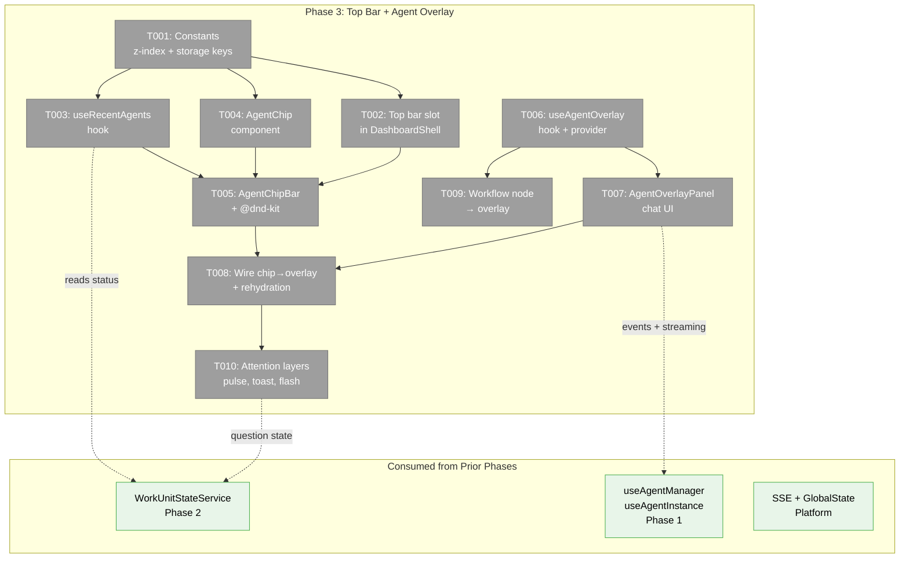
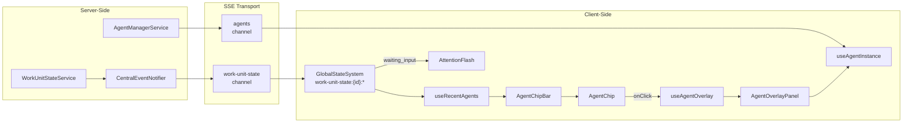
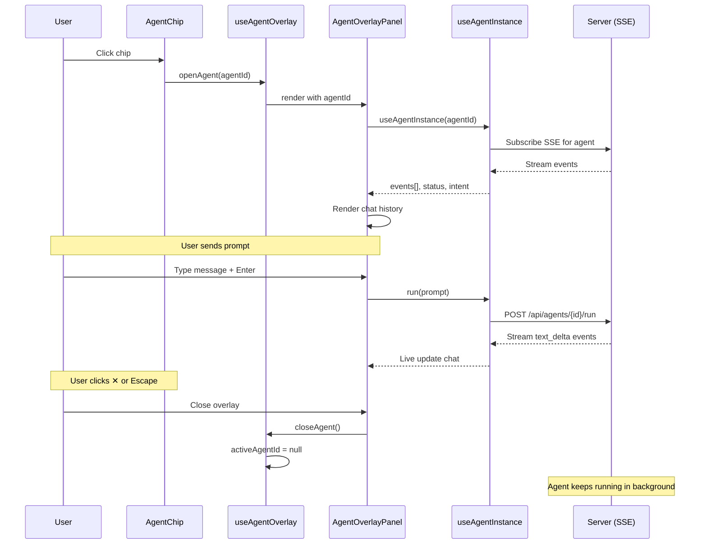

# Phase 3: Top Bar + Agent Overlay — Tasks

**Plan**: [fix-agents-plan.md](../../fix-agents-plan.md) (Phase C)
**Created**: 2026-03-02
**Status**: Pending
**Complexity**: CS-3

---

## Executive Briefing

**Purpose**: Build the always-visible agent chip bar and seamless overlay panel so users can see and interact with agents from any page without navigating away. This is the "manage teams of agents" UX — agents are always visible along the top, clickable to open a chat overlay.

**What We're Building**: A persistent top bar with agent status chips (type icon, name, status, intent), drag-to-reorder via @dnd-kit, a fixed-position overlay panel with full chat UI triggered from chips/workflow nodes/anywhere via `useAgentOverlay()`, and a 3-layer attention system (chip pulse, toast, screen flash) for agent questions.

**Goals**:
- ✅ Persistent agent chip bar above all page content in DashboardShell
- ✅ Chips with type icon, name, status indicator, intent snippet
- ✅ Drag-to-reorder with @dnd-kit, order persisted in localStorage
- ✅ Fixed-position overlay panel (480px × 70vh) with full chat UI
- ✅ `useAgentOverlay()` hook callable from any component
- ✅ Workflow node → agent overlay integration
- ✅ Session rehydration from stored NDJSON events
- ✅ 3-layer attention system: chip pulse, toast, screen border flash

**Non-Goals**:
- ❌ Cross-worktree badges in left menu (Phase 4)
- ❌ Cross-worktree state queries (Phase 4)
- ❌ Agent creation from top bar (use existing agents page)
- ❌ Expanded overlay mode (50vw) — compact mode only in v1
- ❌ Drag-to-position the overlay panel (future enhancement)

---

## Prior Phase Context

### Phase 1: Fix Agent Foundation

**A. Deliverables**:
- `apps/web/next.config.mjs` — Added copilot SDK to serverExternalPackages
- `packages/shared/.../agent-instance.interface.ts` — AgentType includes `copilot-cli`
- `apps/web/app/api/agents/route.ts` — POST accepts all 3 types, broadcasts `agent_created` via SSE
- `apps/web/app/api/agents/[id]/route.ts` — DELETE broadcasts `agent_terminated`
- `apps/web/src/lib/di-container.ts` — CopilotCLIAdapter registered
- `apps/web/src/components/agents/create-session-form.tsx` — Default copilot, copilot-cli fields

**B. Dependencies Exported**:
- `AgentType = 'claude-code' | 'copilot' | 'copilot-cli'`
- `IAgentNotifierService.broadcastCreated/broadcastTerminated`
- `useAgentManager` hook — `agents[], isLoading, isConnected, createAgent()`
- `useAgentInstance` hook — `agent, status, intent, events[], isWorking, run()`

**C. Gotchas & Debt**:
- AgentInstance eagerly creates adapter at construction — adapter failure crashes creation
- No try/catch in AgentManagerService.initialize() hydration loop
- T008 regression tests not written yet

**D. Incomplete Items**: T008 regression tests deferred

**E. Patterns to Follow**:
- SSE broadcast after mutations via AgentNotifierService
- DI container as type-dispatch hub
- Singleton via closure-captured flag in useFactory

### Phase 2: WorkUnit State System

**A. Deliverables**:
- `IWorkUnitStateService` interface + types + SSE event shapes in packages/shared
- `WorkUnitStateService` implementation with JSON persistence + CEN emit
- `FakeWorkUnitStateService` test double
- 57 contract tests (real + fake conformance + behavioral)
- `AgentWorkUnitBridge` — auto-registers agents, subscribes WF observers
- `workUnitStateRoute` ServerEventRouteDescriptor wired in state-connector
- DI registration (singleton + bridge)
- Integration guide + domain docs

**B. Dependencies Exported**:
- `IWorkUnitStateService` (7 methods: register, unregister, updateStatus, getUnit, getUnits, getUnitBySourceRef, tidyUp)
- `WorkUnitEntry` (id, name, status, creator, intent, sourceRef, registeredAt, lastActivityAt)
- `WorkUnitStatus = 'idle' | 'working' | 'waiting_input' | 'error' | 'completed'`
- State paths: `work-unit-state:{id}:status`, `work-unit-state:{id}:intent`, `work-unit-state:{id}:name`
- SSE events: `registered`, `status-changed`, `removed` on channel `work-unit-state`
- `AgentWorkUnitBridge` (registerAgent, updateAgentStatus, unregisterAgent)
- `POSITIONAL_GRAPH_DI_TOKENS.WORK_UNIT_STATE_SERVICE` + `AGENT_WORK_UNIT_BRIDGE`

**C. Gotchas & Debt**:
- WorkUnitStateService uses direct node:fs — documented exception (server-side only)
- Worktree path defaults to process.cwd() (async resolver incompatible with sync DI)
- Observer subscription scoped per graphSlug — bridge manages Map<workUnitId, unsubscribeFn[]>

**D. Incomplete Items**: None — all 8 tasks complete

**E. Patterns to Follow**:
- CEN → SSE → ServerEventRoute → GlobalStateSystem chain for cross-boundary state
- Contract test factory running both real and fake
- DI singleton with closure-captured flag guard
- getUnitBySourceRef() for observer→entry lookup

---

## Pre-Implementation Check

| File | Exists? | Domain Check | Notes |
|------|---------|-------------|-------|
| `apps/web/src/lib/agents/constants.ts` | ❌ | agents ✅ | New — z-index hierarchy + storage keys |
| `apps/web/src/components/dashboard-shell.tsx` | ✅ | _platform/panel-layout ✅ | Modify — add top bar slot |
| `apps/web/src/hooks/useRecentAgents.ts` | ❌ | agents ✅ | New — recency-based list hook |
| `apps/web/src/components/agents/agent-chip.tsx` | ❌ | agents ✅ | New — individual chip component |
| `apps/web/src/components/agents/agent-chip-bar.tsx` | ❌ | agents ✅ | New — chip bar with drag-to-reorder |
| `apps/web/src/hooks/useAgentOverlay.ts` | ❌ | agents ✅ | New — overlay context + hook |
| `apps/web/src/components/agents/agent-overlay-panel.tsx` | ❌ | agents ✅ | New — fixed-position chat overlay |
| `apps/web/src/components/agents/attention-flash.tsx` | ❌ | agents ✅ | New — screen border flash + badge |

**Concept search**: No existing "agent chip", "agent top bar", or "overlay panel" components found. `useAgentInstance` provides streaming events for overlay chat. `@dnd-kit` already installed.

---

## Architecture Map



---

## Tasks

| Status | ID | Task | Domain | Path(s) | Done When | Notes |
|--------|-----|------|--------|---------|-----------|-------|
| [ ] | T001 | Define z-index hierarchy constants + localStorage storage keys with QuotaExceededError handling. Verify shadcn/Radix Dialog backdrop z-index matches our z-50 assumption (DYK-P3-05). Document z-index contract. | agents | `apps/web/src/lib/agents/constants.ts` | Constants exported: Z_INDEX (backdrop:40, overlay:45, modal:50, tooltip:60, toast:70) + STORAGE_KEYS with version-namespaced keys. Safe localStorage helpers with QuotaExceededError catch. Radix dialog stacking verified. | Per findings 06, 07; ADR-0008 deviation; DYK-P3-05 |
| [ ] | T002 | Add top bar slot in DashboardShell — insert between SidebarInset and main | _platform/panel-layout | `apps/web/src/components/dashboard-shell.tsx` | DashboardShell renders optional top bar area above `{children}` in SidebarInset. No visual change when no children provided. | AC-18; minimal change to shared layout |
| [ ] | T003 | Create useRecentAgents hook — REST-fetched initial state + SSE-driven live updates. Initial load reads from useAgentManager (REST-backed, full agent list) enriched with WorkUnitState status via GlobalState subscriptions. SSE events update status in real-time. Agents run overnight unattended — page load must always show full picture from persisted state. | agents | `apps/web/src/hooks/useRecentAgents.ts` | Hook returns agents for current worktree on mount (REST-seeded), live-updates via SSE. Auto-removes stale (>24h, not working/waiting_input). Returns `{ agents: WorkUnitEntry[], dismiss(id) }`. | DYK-P3-01: REST for existence, SSE for live status |
| [ ] | T004 | Create AgentChip component — type icon, name, status dot, intent snippet | agents | `apps/web/src/components/agents/agent-chip.tsx` | Chip renders 5 states: working (blue pulse), idle (grey), waiting_input (amber pulse + ❓), error (red), completed (green). Shows type icon (🤖/💻/🔧), truncated name, intent snippet. onClick triggers overlay. | AC-19; responsive: full/medium/compact modes per Workshop 001 |
| [ ] | T005 | Create AgentChipBar — renders chips in slim mode (single row, priority sort: questions→errors→working→idle, "+N more" overflow) with expand toggle to scrollable multi-row view. Drag-to-reorder with @dnd-kit/sortable v10. Order persisted in localStorage per worktree. | agents | `apps/web/src/components/agents/agent-chip-bar.tsx` | Slim mode: single row, priority-sorted, "+N" expand. Expanded: multi-row scrollable (max ~50vh). Chips draggable; order persists. Empty state hidden. | AC-18, AC-20; DYK-P3-04 slim/expanded modes |
| [ ] | T006 | Create AgentOverlayProvider + useAgentOverlay hook | agents | `apps/web/src/hooks/useAgentOverlay.ts` | Context provides `{ openAgent(id), closeAgent(), activeAgentId, isOpen }`. Provider wraps DashboardShell children. One overlay at a time. | AC-23; all entry points unify through openAgent() |
| [ ] | T007 | Create AgentOverlayPanel — fixed-position (480px × 70vh) with full chat UI | agents | `apps/web/src/components/agents/agent-overlay-panel.tsx` | Panel renders at z-45 fixed bottom-right. Shows agent name/status header, scrollable event list (reuses existing chat components), chat input. Close via ✕/Escape/chip toggle. Click outside does NOT close. | AC-21, AC-22; reuse agent-chat-view + agent-chat-input |
| [ ] | T008 | Wire chip click → openAgent + session rehydration from stored NDJSON | agents | `apps/web/src/components/agents/agent-chip-bar.tsx`, `apps/web/src/components/agents/agent-overlay-panel.tsx` | Clicking chip calls openAgent(id). Overlay loads events via useAgentInstance. Old sessions rehydrate from storage. Invalid session shows error banner. | AC-25, AC-26 |
| [ ] | T009 | Wire workflow node → openAgent via agentSessionId property | workflow-ui | `apps/web/src/features/workflow-ui/` (canvas node click handler) | Clicking workflow node with agentSessionId calls openAgent(). No navigation — overlay pops over workflow canvas. | AC-24; cross-domain call via useAgentOverlay() |
| [ ] | T010 | Implement attention layers — chip pulse, toast, screen border flash (30s cooldown) + ❓ badge | agents | `apps/web/src/components/agents/attention-flash.tsx`, `apps/web/src/components/agents/agent-chip.tsx` | Layer 1: chip amber pulse when waiting_input. Layer 2: toast when overlay closed. Layer 3: green border flash (30s cooldown) + floating ❓ badge when idle >60s. Badge click cycles through questioning agents. | AC-27, AC-28; Workshop 001 3-layer escalation |

---

## Context Brief

### Key findings from plan

- **Finding 06** (High): All UI overlays use z-50 — no layering precedence defined. Agent overlay needs dedicated z-index layer → T001
- **Finding 07** (High): No localStorage pattern exists — chip order persistence needs namespaced keys, error handling, version migration → T001

### Domain dependencies

- `work-unit-state`: WorkUnitStateService (getUnits, state paths via GlobalState) — recent agents + status display
- `agents`: useAgentManager (agent list + creation), useAgentInstance (events + streaming) — overlay chat
- `_platform/state`: useGlobalState (subscribe to work-unit-state paths) — reactive chip updates
- `_platform/events`: useSSE (agent event streaming) — live overlay chat
- `_platform/panel-layout`: DashboardShell (layout slot insertion) — top bar placement

### Domain constraints

- Agent chip bar is `'use client'` — needs interactivity (drag, click, hover)
- Overlay must not navigate away — fixed-position, not a route
- @dnd-kit is already in dependencies — use `@dnd-kit/sortable` for chip reordering
- Z-index must be below existing modals (z-50) to avoid conflicts
- localStorage keys must be version-namespaced to support future migration

### Reusable from prior phases

- `agent-chat-view.tsx` — existing chat message renderer (reuse in overlay)
- `agent-chat-input.tsx` — existing chat input (reuse in overlay)
- `agent-status-indicator.tsx` — existing status dot (extend for chip)
- `useAgentInstance` — existing hook for agent events + streaming
- `useAgentManager` — existing hook for agent list
- `WorkUnitStateService` SSE → GlobalState chain (Phase 2)
- DashboardShell layout structure (insert top bar before main)

### Data flow diagram



### Sequence diagram — chip click → overlay



---

## Discoveries & Learnings

_Populated during implementation by plan-6._

| Date | Task | Type | Discovery | Resolution | References |
|------|------|------|-----------|------------|------------|
| 2026-03-02 | Pre-T003 | decision | **DYK-P3-01: useRecentAgents must REST-seed initial state** — GlobalState is empty on page load (SSE only delivers deltas while connected). Agents run overnight; page load must show full picture. | useRecentAgents sources agent list from useAgentManager (REST-backed), enriches with work-unit-state status via GlobalState. REST for existence, SSE for live updates. | DYK #1 |
| 2026-03-02 | Pre-T005 | insight | **DYK-P3-02: No new SSE connections needed** — work-unit-state channel (Phase 2) + agents channel (Phase 1) cover all Phase 3 needs. CEN is the single server-side emitter. | No action — 2 of ~6 connections used, well within budget. | DYK #2 |
| 2026-03-02 | Pre-T005 | gotcha | **DYK-P3-03: @dnd-kit v10 API breaking changes** — installed @dnd-kit/sortable@10.0.0 has different API from v8 tutorials that dominate search results. | Pin to v10 patterns. Reference official v10 migration guide, not community tutorials. | DYK #3 |
| 2026-03-02 | Pre-T005 | decision | **DYK-P3-04: Slim/expanded chip bar** — 9+ agents wrapping to multiple rows consumes too much vertical space. | Slim mode (default): single row, priority sort (questions→errors→working→idle), "+N more" overflow. Expanded: multi-row scrollable (~50vh). | DYK #4 |
| 2026-03-02 | Pre-T001 | gotcha | **DYK-P3-05: Radix Dialog z-index vs overlay** — shadcn Dialog portals at document root with own z-index. Overlay at z-45 must survive dialog open/close cycle. | Verify Radix backdrop z-index matches z-50 assumption. Test overlay+dialog stacking. Document contract in constants.ts. | DYK #5 |

**Types**: `gotcha` | `research-needed` | `unexpected-behavior` | `workaround` | `decision` | `debt` | `insight`

---

## Directory Layout

```
docs/plans/059-fix-agents/
  ├── fix-agents-plan.md
  ├── fix-agents-spec.md
  ├── research-dossier.md
  ├── workshops/
  │   ├── 001-top-bar-agent-ux.md
  │   ├── 002-agent-connect-disconnect-ux.md
  │   ├── 003-work-unit-state-system.md
  │   ├── 004-agent-creation-failure-root-cause.md
  │   └── 006-plan-059-resumption-after-061.md
  ├── tasks/phase-1-fix-agent-foundation/
  │   ├── tasks.md
  │   └── tasks.fltplan.md
  ├── tasks/phase-2-workunit-state-system/
  │   ├── tasks.md
  │   ├── tasks.fltplan.md
  │   └── execution.log.md
  └── tasks/phase-3-top-bar-agent-overlay/
      ├── tasks.md               ← this file
      ├── tasks.fltplan.md       ← flight plan (next)
      └── execution.log.md       ← created by plan-6
```
