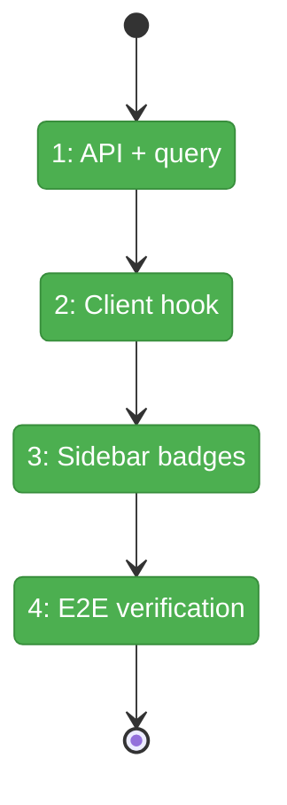
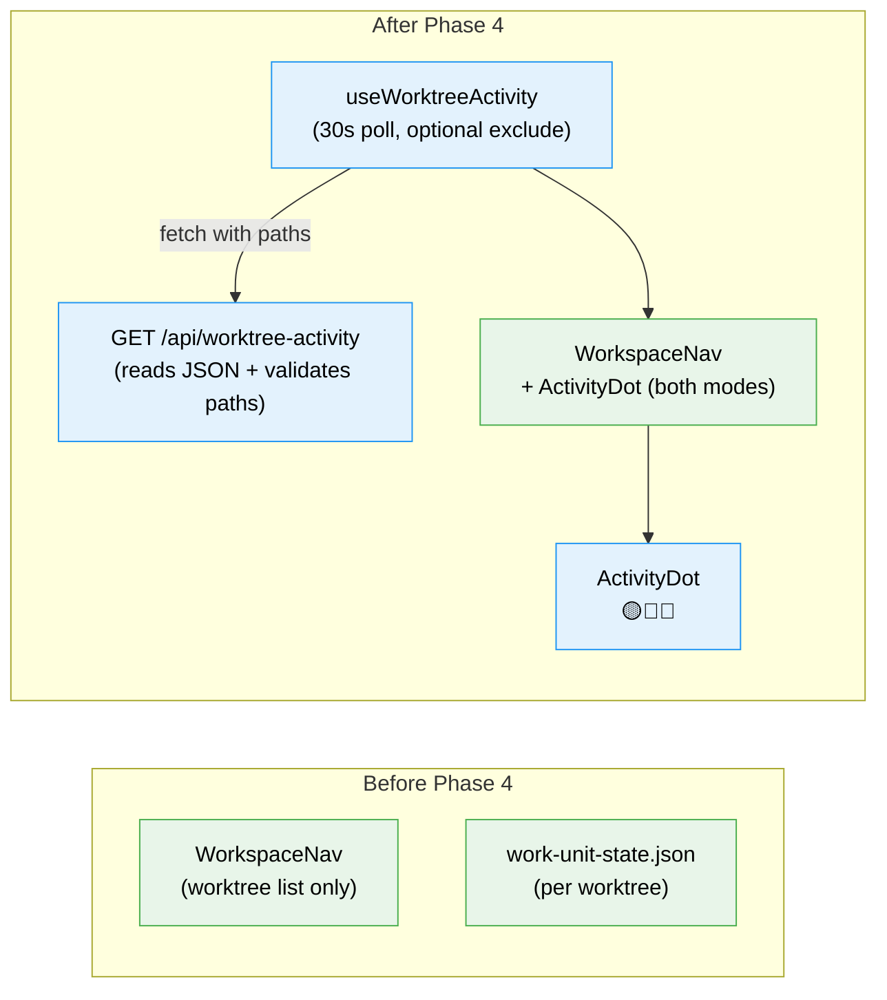

# Flight Plan: Phase 4 — Cross-Worktree & Left Menu

**Plan**: [fix-agents-plan.md](../../fix-agents-plan.md) (Phase D)
**Phase**: Phase 4: Cross-Worktree & Left Menu
**Generated**: 2026-03-02
**Status**: In Review

---

## Departure → Destination

**Where we are**: Agents can be created, tracked via WorkUnitStateService, and managed through the top bar chip bar + overlay. But agent activity is only visible within the current worktree. If agents in another worktree need attention, the user has no way to know without manually switching.

**Where we're going**: A developer can see at a glance which other worktrees have agents needing attention — colored badges (🟡 questions, 🔴 errors, 🔵 working) appear next to worktree entries in the left sidebar. Clicking a badge navigates directly to that worktree's agent page.

---

## Domain Context

### Domains We're Changing

| Domain | What Changes | Key Files |
|--------|-------------|-----------|
| work-unit-state | New API endpoint (reads JSON directly, no interface change) | `apps/web/app/api/worktree-activity/route.ts` |
| agents | New useWorktreeActivity hook for badge data | `apps/web/src/hooks/use-worktree-activity.ts` |
| _platform/panel-layout | ActivityDot component + badges in both WorkspaceNav modes | `apps/web/src/components/workspaces/activity-dot.tsx`, `workspace-nav.tsx` |

### Domains We Depend On (no changes)

| Domain | What We Consume | Contract |
|--------|----------------|----------|
| work-unit-state | JSON file format (`work-unit-state.json`) | Read-only, no interface change per DYK-P4-01 |
| agents | useRecentAgents for current worktree contrast | `useRecentAgents()` |
| _platform/panel-layout | WorkspaceNav two rendering modes | `workspace-nav.tsx` (inside + outside workspace) |

---

## Flight Status

**Legend**: grey = pending | yellow = active | red = blocked/needs input | green = done

---

## Stages

- [x] **Stage 1: API + validation** — Cross-worktree activity API endpoint with path validation against WorkspaceService (T001)
- [x] **Stage 2: Client hook** — useWorktreeActivity polling hook with optional excludeWorktree param (T002)
- [x] **Stage 3: Sidebar badges** — ActivityDot component in both WorkspaceNav modes + badge click navigation (T003, T004)
- [x] **Stage 4: E2E verification** — All 4 phases working together, both nav modes tested (T005)

---

## Architecture: Before & After

**Legend**: existing (green, unchanged) | new (blue, created)

---

## Acceptance Criteria

- [ ] AC-29: Left menu shows activity badges (🟡 questions, 🔴 errors, 🔵 working) in both nav modes
- [ ] AC-30: Badges for OTHER worktrees when one is selected; all worktrees when none selected
- [ ] AC-31: Click badge → navigate to that worktree's agent page

## Goals & Non-Goals

**Goals**: Cross-worktree activity awareness in sidebar, colored badges per status, navigation on click, graceful handling of missing state files.

**Non-Goals**: Real-time SSE for cross-worktree state, cross-worktree overlay, cross-worktree agent management.

---

## Checklist

- [x] T001: Cross-worktree activity API (reads JSON directly, validates paths)
- [x] T002: useWorktreeActivity polling hook (optional excludeWorktree)
- [x] T003: ActivityDot component in both WorkspaceNav modes
- [x] T004: Badge click → navigate to agent page
- [x] T005: End-to-end verification (both nav modes)
