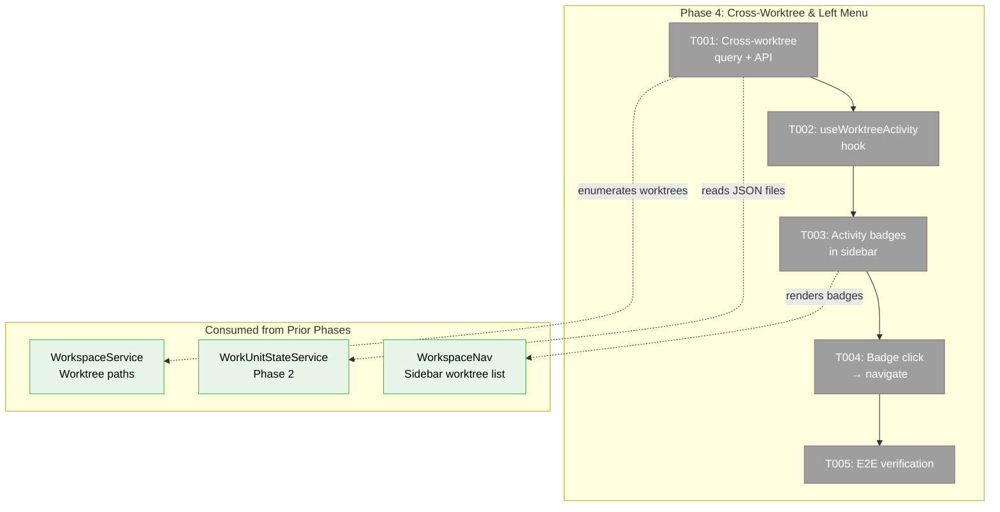
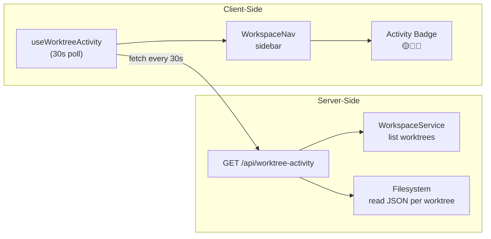
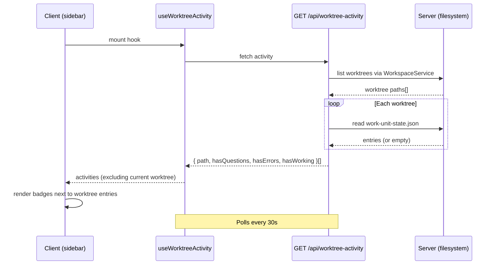

# Phase 4: Cross-Worktree & Left Menu — Tasks

**Plan**: [fix-agents-plan.md](../../fix-agents-plan.md) (Phase D)
**Created**: 2026-03-02
**Status**: Pending
**Complexity**: CS-2

---

## Executive Briefing

**Purpose**: Add cross-worktree activity awareness to the left sidebar menu so users can see at a glance which OTHER worktrees have agents that need attention — questions, errors, or active work.

**What We're Building**: A cross-worktree query capability on WorkUnitStateService that reads `work-unit-state.json` from all known worktrees, a `useWorktreeActivity` client hook that polls this data, activity badges (🟡 questions, 🔴 errors, 🔵 working) next to worktree entries in the sidebar, and navigation from badge click to that worktree's agent page.

**Goals**:
- ✅ Left menu shows activity badges for OTHER worktrees
- ✅ Badges: 🟡 for pending questions, 🔴 for errors, 🔵 for working agents
- ✅ Current worktree excluded (visible in top bar)
- ✅ Click badge → navigate to that worktree's agent page
- ✅ End-to-end: all 4 phases working together

**Non-Goals**:
- ❌ Real-time SSE for cross-worktree state (polling is sufficient)
- ❌ Cross-worktree overlay (agents only visible in their own worktree)
- ❌ Cross-worktree agent creation or management

---

## Prior Phase Context

### Phase 1: Fix Agent Foundation

**A. Deliverables**: Agent creation, listing, chat — copilot/claude-code/copilot-cli types. SSE broadcasts. DI wiring.
**B. Dependencies Exported**: `AgentType`, `useAgentManager`, `useAgentInstance`, `IAgentNotifierService.broadcastCreated/Terminated`
**C. Gotchas**: Adapter eagerly created at construction. No try/catch in hydration loop.
**D. Incomplete**: T008 regression tests deferred.
**E. Patterns**: SSE broadcast after mutations. DI as type-dispatch hub. Singleton via closure flag.

### Phase 2: WorkUnit State System

**A. Deliverables**: `IWorkUnitStateService` (7 methods), `WorkUnitStateService` (JSON persistence + CEN emit), `FakeWorkUnitStateService`, 57 contract tests, `AgentWorkUnitBridge`, `workUnitStateRoute` descriptor.
**B. Dependencies Exported**: `WorkUnitEntry`, `WorkUnitStatus`, state paths `work-unit-state:{id}:*`, SSE events: registered/status-changed/removed.
**C. Gotchas**: Direct node:fs (documented exception). CWD as worktree path (async resolver incompatible). Observer scoping per graphSlug.
**D. Incomplete**: None — all 8 tasks complete.
**E. Patterns**: CEN → SSE → ServerEventRoute → GlobalState chain. Contract test factory. DI singleton guard. getUnitBySourceRef() for observer lookup.

### Phase 3: Top Bar + Agent Overlay

**A. Deliverables**: `AgentChipBar` (@dnd-kit sortable), `AgentChip` (5 states), `AgentOverlayPanel` (full-height), `useAgentOverlay`, `useRecentAgents`, `AttentionFlash` (3-layer), `WorkspaceAgentChrome`, `constants.ts`.
**B. Dependencies Exported**: `useAgentOverlay()` → `{openAgent, closeAgent, toggleAgent, activeAgentId}`. `useRecentAgents()` → `{agents, dismiss}`. `Z_INDEX`, `STORAGE_KEYS`.
**C. Gotchas**: SSE saturation (fixed with polling). Overlay width on tablets. @dnd-kit v10 API changes.
**D. Incomplete**: T009 workflow node→overlay wiring (needs orchestrator mapping).
**E. Patterns**: REST + polling hybrid (no SSE in chip bar). Slim/expanded UI. One overlay at a time. Priority sort: questions → errors → working → idle.

---

## Pre-Implementation Check

| File | Exists? | Domain Check | Notes |
|------|---------|-------------|-------|
| `apps/web/src/lib/work-unit-state/work-unit-state.service.ts` | ✅ | work-unit-state ✅ | Modify — add cross-worktree query method |
| `packages/shared/src/interfaces/work-unit-state.interface.ts` | ✅ | work-unit-state ✅ | Modify — add getUnitsAcrossWorktrees to interface |
| `packages/shared/src/fakes/fake-work-unit-state.ts` | ✅ | work-unit-state ✅ | Modify — add getUnitsAcrossWorktrees to fake |
| `apps/web/src/hooks/use-worktree-activity.ts` | ❌ | agents ✅ | New — client hook for cross-worktree badge data |
| `apps/web/src/components/workspaces/workspace-nav.tsx` | ✅ | _platform/panel-layout ✅ | Modify — add activity badges next to worktree entries |
| `apps/web/app/api/worktree-activity/route.ts` | ❌ | work-unit-state ✅ | New — API endpoint for cross-worktree state |

---

## Architecture Map



---

## Tasks

| Status | ID | Task | Domain | Path(s) | Done When | Notes |
|--------|-----|------|--------|---------|-----------|-------|
| [ ] | T001 | Add cross-worktree query: API endpoint that reads `work-unit-state.json` from all known worktrees (via WorkspaceService.list() for paths), returns summary per worktree `{ path, hasQuestions, hasErrors, hasWorking, agentCount }`. Gracefully handle missing/corrupt files. | work-unit-state | `apps/web/app/api/worktree-activity/route.ts` | GET returns array of `{ worktreePath, hasQuestions, hasErrors, hasWorking, agentCount }` for all worktrees. Missing files return zeroes, not errors. | Cross-worktree risk: read other worktrees' data files |
| [ ] | T002 | Create `useWorktreeActivity` hook — polls the API endpoint every 30s, filters out current worktree, returns badge data per worktree. | agents | `apps/web/src/hooks/use-worktree-activity.ts` | Hook returns `{ activities: WorktreeActivity[], isLoading }` where each entry has path, badge color, tooltip text. Current worktree excluded. | AC-29, AC-30; 30s polling per plan risk section |
| [ ] | T003 | Add activity badges to WorkspaceNav worktree entries — small colored dots next to worktree branch labels. Only for OTHER worktrees. | _platform/panel-layout | `apps/web/src/components/workspaces/workspace-nav.tsx` | Badges render: 🟡 dot for questions, 🔴 for errors, 🔵 for working. Hidden when no activity. Only shown for non-current worktrees. | AC-29, AC-30; follows star-button pattern in workspace-nav |
| [ ] | T004 | Wire badge click → navigate to that worktree's agent page. Clicking a badge navigates to `/workspaces/[slug]/agents?worktree=[path]`. | agents | `apps/web/src/components/workspaces/workspace-nav.tsx` | Clicking badge navigates to agent page for that worktree. | AC-31 |
| [ ] | T005 | End-to-end verification: create agent in one worktree, verify top bar shows it, verify other worktrees show badge in sidebar. | agents | — | All 4 phases verified working together via Playwright or manual test. | Integration gate |

---

## Context Brief

### Key findings from plan

- **Cross-worktree file access risk** (Medium): WorkUnitStateService is per-worktree. Need to enumerate all worktrees and read their state files. Handle missing/corrupt files gracefully.
- **Polling frequency** (Low): Poll every 30s for cross-worktree state. No SSE for this — too many connections already.

### Domain dependencies

- `work-unit-state`: WorkUnitStateService (JSON persistence at `<worktree>/.chainglass/data/work-unit-state.json`) — read other worktrees' state files
- `_platform/panel-layout`: WorkspaceNav (worktree list rendering at `workspace-nav.tsx` lines 160-204) — add badges
- `agents`: useRecentAgents (current worktree agents in top bar) — contrast: sidebar shows OTHER worktrees only

### Domain constraints

- Cross-worktree reads are **server-side only** (filesystem access required)
- API endpoint returns aggregated summary, not raw entries (minimize data transfer)
- Badges in sidebar are client-side rendered from polled API data
- Current worktree excluded from badge display (visible in top bar)

### Reusable from prior phases

- `WorkUnitStateService` JSON hydration logic (loadFromDisk pattern)
- `WorkspaceService.list()` returns all workspaces with worktree paths
- WorkspaceNav star-button pattern for adding interactive elements next to worktree entries
- `useRecentAgents` priority sort + recency filter logic (reuse for badge priority)
- React Query polling pattern (`refetchInterval: 30000`)

### Data flow diagram



### Sequence diagram — badge display



---

## Discoveries & Learnings

_Populated during implementation by plan-6._

| Date | Task | Type | Discovery | Resolution | References |
|------|------|------|-----------|------------|------------|

**Types**: `gotcha` | `research-needed` | `unexpected-behavior` | `workaround` | `decision` | `debt` | `insight`

---

## Directory Layout

```
docs/plans/059-fix-agents/
  ├── fix-agents-plan.md
  ├── fix-agents-spec.md
  ├── tasks/phase-1-fix-agent-foundation/
  ├── tasks/phase-2-workunit-state-system/
  ├── tasks/phase-3-top-bar-agent-overlay/
  └── tasks/phase-4-cross-worktree-left-menu/
      ├── tasks.md               ← this file
      ├── tasks.fltplan.md       ← flight plan (next)
      └── execution.log.md       ← created by plan-6
```
