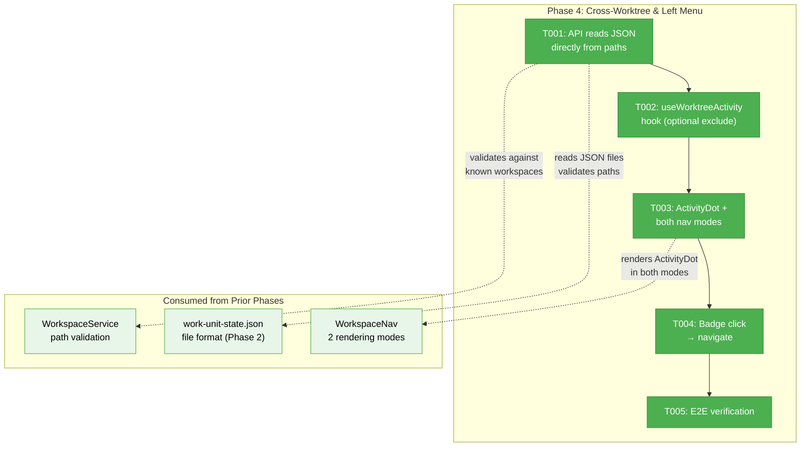
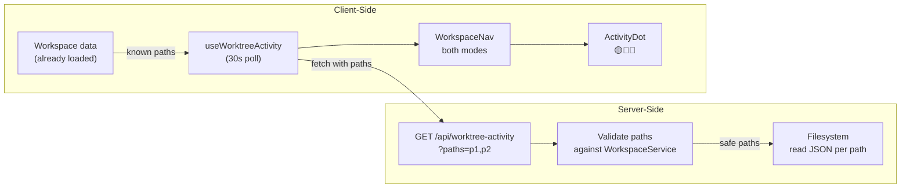
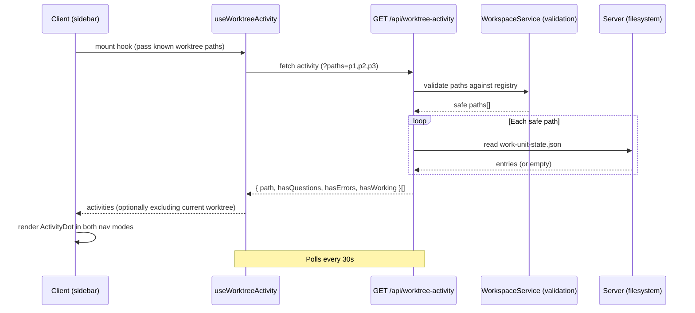

# Phase 4: Cross-Worktree & Left Menu — Tasks

**Plan**: [fix-agents-plan.md](../../fix-agents-plan.md) (Phase D)
**Created**: 2026-03-02
**Status**: Complete
**Complexity**: CS-2

---

## Executive Briefing

**Purpose**: Add cross-worktree activity awareness to the left sidebar menu so users can see at a glance which OTHER worktrees have agents that need attention — questions, errors, or active work.

**What We're Building**: A standalone API endpoint that reads `work-unit-state.json` directly from worktree paths (without modifying IWorkUnitStateService), a `useWorktreeActivity` client hook that polls this data, a reusable `ActivityDot` component rendered in both WorkspaceNav rendering modes (inside-workspace flat list + outside-workspace expandable tree), and navigation from badge click to that worktree's agent page.

**Goals**:
- ✅ Left menu shows activity badges for OTHER worktrees
- ✅ Badges: 🟡 for pending questions, 🔴 for errors, 🔵 for working agents
- ✅ Current worktree excluded when one is selected (visible in top bar); all show when no worktree is active
- ✅ Click badge → navigate to that worktree's agent page
- ✅ End-to-end: all 4 phases working together

**Non-Goals**:
- ❌ Real-time SSE for cross-worktree state (polling is sufficient)
- ❌ Cross-worktree overlay (agents only visible in their own worktree)
- ❌ Cross-worktree agent creation or management

---

## Prior Phase Context

### Phase 1: Fix Agent Foundation

**A. Deliverables**: Agent creation, listing, chat — copilot/claude-code/copilot-cli types. SSE broadcasts. DI wiring.
**B. Dependencies Exported**: `AgentType`, `useAgentManager`, `useAgentInstance`, `IAgentNotifierService.broadcastCreated/Terminated`
**C. Gotchas**: Adapter eagerly created at construction. No try/catch in hydration loop.
**D. Incomplete**: T008 regression tests deferred.
**E. Patterns**: SSE broadcast after mutations. DI as type-dispatch hub. Singleton via closure flag.

### Phase 2: WorkUnit State System

**A. Deliverables**: `IWorkUnitStateService` (7 methods), `WorkUnitStateService` (JSON persistence + CEN emit), `FakeWorkUnitStateService`, 57 contract tests, `AgentWorkUnitBridge`, `workUnitStateRoute` descriptor.
**B. Dependencies Exported**: `WorkUnitEntry`, `WorkUnitStatus`, state paths `work-unit-state:{id}:*`, SSE events: registered/status-changed/removed.
**C. Gotchas**: Direct node:fs (documented exception). CWD as worktree path (async resolver incompatible). Observer scoping per graphSlug.
**D. Incomplete**: None — all 8 tasks complete.
**E. Patterns**: CEN → SSE → ServerEventRoute → GlobalState chain. Contract test factory. DI singleton guard. getUnitBySourceRef() for observer lookup.

### Phase 3: Top Bar + Agent Overlay

**A. Deliverables**: `AgentChipBar` (@dnd-kit sortable), `AgentChip` (5 states), `AgentOverlayPanel` (full-height), `useAgentOverlay`, `useRecentAgents`, `AttentionFlash` (3-layer), `WorkspaceAgentChrome`, `constants.ts`.
**B. Dependencies Exported**: `useAgentOverlay()` → `{openAgent, closeAgent, toggleAgent, activeAgentId}`. `useRecentAgents()` → `{agents, dismiss}`. `Z_INDEX`, `STORAGE_KEYS`.
**C. Gotchas**: SSE saturation (fixed with polling). Overlay width on tablets. @dnd-kit v10 API changes.
**D. Incomplete**: T009 workflow node→overlay wiring (needs orchestrator mapping).
**E. Patterns**: REST + polling hybrid (no SSE in chip bar). Slim/expanded UI. One overlay at a time. Priority sort: questions → errors → working → idle.

---

## Pre-Implementation Check

| File | Exists? | Domain Check | Notes |
|------|---------|-------------|-------|
| `apps/web/app/api/worktree-activity/route.ts` | ❌ | work-unit-state ✅ | New — API endpoint reads JSON directly from worktree paths (DYK-P4-01: no interface change) |
| `apps/web/src/hooks/use-worktree-activity.ts` | ❌ | agents ✅ | New — client hook for cross-worktree badge data |
| `apps/web/src/components/workspaces/workspace-nav.tsx` | ✅ | _platform/panel-layout ✅ | Modify — add ActivityDot in BOTH rendering modes (DYK-P4-02: inside + outside workspace) |
| `apps/web/src/components/workspaces/activity-dot.tsx` | ❌ | _platform/panel-layout ✅ | New — reusable badge dot component shared by both WorkspaceNav views |

---

## Architecture Map



---

## Tasks

| Status | ID | Task | Domain | Path(s) | Done When | Notes |
|--------|-----|------|--------|---------|-----------|-------|
| [x] | T001 | API endpoint that reads `work-unit-state.json` directly from worktree paths. Client passes known paths as query params (`?paths=p1,p2`). Server validates each path against WorkspaceService registry before reading (DYK-P4-05). Returns summary per worktree `{ worktreePath, hasQuestions, hasErrors, hasWorking, agentCount }`. Gracefully handle missing/corrupt files (return zeroes). Do NOT modify IWorkUnitStateService interface. | work-unit-state | `apps/web/app/api/worktree-activity/route.ts` | GET with `?paths=` returns validated activity array. Unknown/invalid paths silently dropped. Missing JSON files return zeroes. | DYK-P4-01: no interface change. DYK-P4-03: client passes paths. DYK-P4-05: validate against registry |
| [x] | T002 | Create `useWorktreeActivity` hook — polls API every 30s, accepts optional `excludeWorktree` param (null = show all). Passes worktree paths from already-loaded workspace data to API (avoids server re-enumeration). | agents | `apps/web/src/hooks/use-worktree-activity.ts` | Hook returns `{ activities: WorktreeActivity[], isLoading }`. Handles null excludeWorktree gracefully (returns all). Uses React Query with `refetchInterval: 30000`. | AC-29, AC-30; DYK-P4-03: reuse client-known paths; DYK-P4-04: null exclude = show all |
| [x] | T003 | Create `ActivityDot` component and add to WorkspaceNav in BOTH rendering modes: inside-workspace flat list (line 162 map) AND outside-workspace expandable tree (line 257 map). Small colored dots: 🟡 questions, 🔴 errors, 🔵 working. Hidden when no activity. | _platform/panel-layout | `apps/web/src/components/workspaces/activity-dot.tsx`, `apps/web/src/components/workspaces/workspace-nav.tsx` | ActivityDot renders in both nav modes. Inside-workspace: excludes current worktree. Outside-workspace: shows all worktrees with activity. | AC-29, AC-30; DYK-P4-02: both rendering modes; DYK-P4-04: outside-workspace shows all |
| [x] | T004 | Wire badge click → navigate to that worktree's agent page. Clicking a badge navigates to `/workspaces/[slug]/agents?worktree=[path]`. Works in both nav modes (slug available from URL or iteration context). | agents | `apps/web/src/components/workspaces/workspace-nav.tsx` | Clicking badge navigates to agent page for that worktree in both views. | AC-31 |
| [x] | T005 | End-to-end verification: create agent in one worktree, verify top bar shows it, verify other worktrees show badge in sidebar. Test both nav modes. | agents | — | All 4 phases verified working together via manual test. Both inside-workspace and outside-workspace badge views tested. | Integration gate |

---

## Context Brief

### Key findings from plan

- **Cross-worktree file access risk** (Medium): WorkUnitStateService is per-worktree. API reads JSON files directly — does NOT modify the interface (DYK-P4-01).
- **Polling frequency** (Low): Poll every 30s for cross-worktree state. No SSE for this — too many connections already.

### DYK findings (from didyouknow-v2 analysis)

| # | Finding | Impact | Action |
|---|---------|--------|--------|
| DYK-P4-01 | IWorkUnitStateService is single-worktree-scoped — adding cross-worktree breaks its design | HIGH | API route reads JSON directly, no interface change |
| DYK-P4-02 | WorkspaceNav has TWO rendering modes (inside + outside workspace) | HIGH | Shared ActivityDot component, placed in both `map()` loops |
| DYK-P4-03 | WorkspaceService.list() lacks worktree paths; client already has them | MEDIUM | Client passes known paths to API via query params |
| DYK-P4-04 | No current worktree on workspace root pages (null `?worktree=`) | MEDIUM | Hook treats null excludeWorktree as "show all" |
| DYK-P4-05 | Client-supplied paths need server-side validation against registry | MEDIUM | API validates paths against WorkspaceService before reading |

### Domain dependencies

- `work-unit-state`: WorkUnitStateService (JSON persistence at `<worktree>/.chainglass/data/work-unit-state.json`) — read other worktrees' state files
- `_platform/panel-layout`: WorkspaceNav (worktree list rendering at `workspace-nav.tsx` — TWO modes: inside-workspace lines 160-204, outside-workspace lines 207-308) — add ActivityDot in both
- `agents`: useRecentAgents (current worktree agents in top bar) — contrast: sidebar shows OTHER worktrees only

### Domain constraints

- Cross-worktree reads are **server-side only** (filesystem access required)
- API endpoint returns aggregated summary, not raw entries (minimize data transfer)
- Badges in sidebar are client-side rendered from polled API data
- Current worktree excluded from badge display when selected (visible in top bar); all badges shown when no worktree is active (DYK-P4-04)

### Reusable from prior phases

- `WorkUnitStateService` JSON hydration logic (loadFromDisk pattern)
- `WorkspaceService.list()` returns workspaces (not worktree paths) — client already has paths from existing fetch (DYK-P4-03)
- WorkspaceNav star-button pattern for adding interactive elements next to worktree entries
- WorkspaceNav renders in TWO modes — both need badge support (DYK-P4-02)
- `useRecentAgents` priority sort + recency filter logic (reuse for badge priority)
- React Query polling pattern (`refetchInterval: 30000`)

### Data flow diagram



### Sequence diagram — badge display



---

## Discoveries & Learnings

_Populated during implementation by plan-6._

| Date | Task | Type | Discovery | Resolution | References |
|------|------|------|-----------|------------|------------|
| 2026-03-02 | T003 | gotcha | Adding `useWorktreeActivity` (React Query) to WorkspaceNav broke 7 existing tests that render DashboardSidebar/DashboardShell without QueryClientProvider | Added QueryClientProvider wrapper to test renders | `dashboard-sidebar.test.tsx`, `dashboard-navigation.test.tsx` |

**Types**: `gotcha` | `research-needed` | `unexpected-behavior` | `workaround` | `decision` | `debt` | `insight`

---

## Directory Layout

```
docs/plans/059-fix-agents/
  ├── fix-agents-plan.md
  ├── fix-agents-spec.md
  ├── tasks/phase-1-fix-agent-foundation/
  ├── tasks/phase-2-workunit-state-system/
  ├── tasks/phase-3-top-bar-agent-overlay/
  └── tasks/phase-4-cross-worktree-left-menu/
      ├── tasks.md               ← this file
      ├── tasks.fltplan.md       ← flight plan (next)
      └── execution.log.md       ← created by plan-6
```
