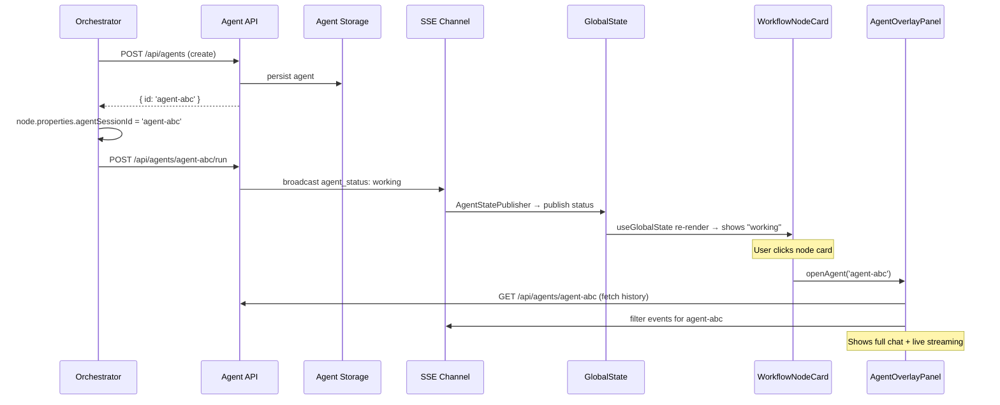

# Workshop: Agent Connect/Disconnect UX — Seamless Background Agent Interaction

**Type**: Integration Pattern + CLI Flow (hybrid)
**Plan**: 059-fix-agents
**Research Dossier**: [research-dossier.md](../research-dossier.md)
**Created**: 2025-07-25
**Status**: Draft

**Related Documents**:
- Research Dossier: Agent system architecture, data flows, state integration
- Plan 053: GlobalStateSystem — state publishing infrastructure
- Plan 050: Workflow UI — node interaction, canvas architecture
- ADR-0007: SSE single-channel with client-side filtering

**Domain Context**:
- **Primary Domain**: agents (proposed) — session lifecycle, execution, state publishing
- **Related Domains**: 
  - `_platform/state` — cross-component state for popover visibility + agent status
  - `_platform/panel-layout` — overlay/popover rendering patterns
  - `_platform/events` — SSE transport for real-time agent events
  - `workflow-ui` — workflow graph node → agent session mapping

---

## Purpose

Define the complete UX and technical design for **connecting to** and **disconnecting from** background agents. This is the system's core interaction loop: agents run constantly in the background; the user effortlessly pops in, observes, provides input, and moves on. The experience should feel like switching between chat tabs — not navigating a complex app.

This workshop drives decisions on: popover architecture, connection lifecycle, state management, reconnection strategy, multi-entry-point design, and the developer API for triggering agent views.

## Key Questions Addressed

1. What does "connecting" to an agent mean technically?
2. How does the popover work — full chat with input, read-only observation, or both modes?
3. What is the complete lifecycle from click → popover → connected → streaming → close?
4. How is reconnection handled after disconnect (tab switch, navigation)?
5. How does clicking a workflow node resolve to an agent session?
6. How do multiple entry points (top bar, workflow node, agent list, sidebar, notification) unify?
7. What React state drives the popover? Global context? URL params?
8. What's the developer API — `openAgentPopover(agentId)` or React hook?
9. Can users view multiple agents simultaneously?
10. How do we handle performance with many agents (20+)?

---

## Overview

The agent connect/disconnect system is a **floating overlay layer** mounted at the dashboard shell level, driven by global state, accessible from anywhere in the app without navigation. All entry points funnel through a single imperative API: `openAgent(agentId)`. The overlay reuses the existing `AgentChatView` component and `useAgentInstance` hook, adding a thin lifecycle wrapper for connect/disconnect semantics.

```
┌─────────────────────────────────────────────────────────────────────────┐
│ DashboardShell                                                          │
│ ┌───────┐ ┌───────────────────────────────────────────────────────────┐ │
│ │Sidebar│ │ SidebarInset                                              │ │
│ │       │ │ ┌───────────────────────────────────────────────────────┐ │ │
│ │ Agent │ │ │ Top Bar (agent chips: ● Claude  ● Copilot  ● Fix-DB) │ │ │
│ │ list  │ │ ├───────────────────────────────────────────────────────┤ │ │
│ │       │ │ │                                                       │ │ │
│ │ [🤖]──┼─┼─┤  Main Content (any page)                             │ │ │
│ │ [🤖]  │ │ │                                                       │ │ │
│ │ [🤖]  │ │ │          ┌──────────────────────────┐                 │ │ │
│ │       │ │ │          │   AgentOverlayPanel      │ ◄── fixed z-50  │ │
│ │       │ │ │          │   ┌──────────────────┐   │                 │ │ │
│ │       │ │ │          │   │ Agent: Claude     │   │                 │ │ │
│ │       │ │ │          │   │ Status: Working   │   │                 │ │ │
│ │       │ │ │          │   │ ─────────────────│   │                 │ │ │
│ │       │ │ │          │   │ > Editing file... │   │                 │ │ │
│ │       │ │ │          │   │ > Running tests...│   │                 │ │ │
│ │       │ │ │          │   │ ─────────────────│   │                 │ │ │
│ │       │ │ │          │   │ [Send prompt... ] │   │                 │ │ │
│ │       │ │ │          │   └──────────────────┘   │                 │ │ │
│ │       │ │ │          └──────────────────────────┘                 │ │ │
│ │       │ │ │                                                       │ │ │
│ └───────┘ │ └───────────────────────────────────────────────────────┘ │ │
│           └───────────────────────────────────────────────────────────┘ │
└─────────────────────────────────────────────────────────────────────────┘
```

---

## Core Concepts

### What "Connect" Means

"Connecting" to an agent is **not** establishing a new connection. The SSE channel `/api/agents/events` is already open (single global channel, ADR-0007). "Connect" means:

1. **Mount the overlay** — Render `AgentOverlayPanel` with the target `agentId`
2. **Activate the hook** — `useAgentInstance(agentId)` starts filtering SSE events for this agent
3. **Load history** — React Query fetches agent data + stored events from GET `/api/agents/[id]`
4. **Stream live** — SSE events for this agentId flow into the rendered chat view

"Disconnect" means:
1. **Unmount the overlay** — Remove the panel from DOM
2. **Release the hook** — `useAgentInstance` unsubscribes from SSE filtering for this agent
3. **Cache survives** — React Query cache retains agent data (stale but available on reconnect)
4. **Agent continues** — Server-side execution is completely unaffected

**Why this is fast**: There's no server-side "connect" call. It's purely a client-side mount/unmount. The SSE channel is already open. React Query cache means reconnecting shows cached data instantly while fresh data loads.

### Connection States

```
                    ┌──────────┐
         click      │          │     unmount
    ┌──────────────►│ MOUNTING │────────────────┐
    │               │          │                │
    │               └────┬─────┘                │
    │                    │ component mounted     │
    │               ┌────▼─────┐                │
    │               │          │                │
    │               │ LOADING  │ ◄── show cached data (if any)
    │               │          │     + skeleton for fresh data
    │               └────┬─────┘                │
    │                    │ query resolved        │
    │               ┌────▼─────┐                │
    │               │          │                │
    │               │CONNECTED │ ◄── full chat view, live SSE streaming
    │               │          │                │
    │               └────┬─────┘                │
    │                    │ user closes           │
    │               ┌────▼─────┐                │
    │               │          │                │
    └───────────────┤  IDLE    │ ◄── no overlay rendered, cache retained
                    │          │
                    └──────────┘
```

| State | What User Sees | What's Happening |
|-------|---------------|-----------------|
| IDLE | No overlay | Nothing — agent running in background |
| MOUNTING | Panel appears, blank | React rendering `AgentOverlayPanel` |
| LOADING | Panel with spinner + cached events (if revisit) | `useAgentInstance` fetching fresh data |
| CONNECTED | Full chat: events stream, input enabled | Live SSE filtering active, full interaction |

**Design choice**: MOUNTING → LOADING should feel **instant** (<100ms). Show cached events immediately (React Query `staleTime`), overlay fresh data when query resolves.

---

## Popover Architecture

### Panel Type: Fixed Overlay (Not Radix Popover)

**RESOLVED**: Use a **fixed-position panel** (`position: fixed`), not Radix `<Popover>`.

**Why not Radix Popover?**
- Popover is anchored to a trigger element — we have multiple triggers (top bar, workflow node, sidebar)
- Popover closes on outside click — we want persistent panel that survives interaction with the rest of the app
- Popover has limited size control — we need a resizable chat panel

**Why fixed panel?**
- Mounts at `DashboardShell` level, survives page navigation within dashboard
- `position: fixed; z-index: 50` — matches existing overlay patterns (command palette, modals)
- Can be positioned anywhere (bottom-right, right side, custom position)
- Can be resized and dragged (future enhancement)
- Not tied to any trigger element

### Panel Sizes

```
┌─────────────────────────────────────┐
│ COMPACT (default)                    │
│ Width: 420px                         │
│ Height: 600px                        │
│ Position: bottom-right, 16px inset   │
│ Use: Quick check-in, send a prompt   │
│                                      │
│ ┌──────────────┐                     │
│ │  Header      │                     │
│ │  Events      │                     │
│ │  ...         │                     │
│ │  Input       │                     │
│ └──────────────┘                     │
└─────────────────────────────────────┘

┌─────────────────────────────────────┐
│ EXPANDED                             │
│ Width: 50vw (min 480px)              │
│ Height: 100vh - top bar              │
│ Position: right side, full height    │
│ Use: Extended interaction, review     │
│                                      │
│ ┌──────────────────────────┐         │
│ │  Header                  │         │
│ │  Events (scrollable)     │         │
│ │  ...                     │         │
│ │  ...                     │         │
│ │  ...                     │         │
│ │  Input                   │         │
│ └──────────────────────────┘         │
└─────────────────────────────────────┘

┌─────────────────────────────────────┐
│ FULL PAGE (escape hatch)             │
│ Navigate to:                         │
│ /workspaces/[slug]/agents/[id]       │
│ Use: When user needs full context    │
│                                      │
│ Opens existing AgentChatView page    │
└─────────────────────────────────────┘
```

**Size toggling**: Header has expand/collapse button. Double-click header to toggle. `Escape` closes panel entirely.

### Panel Anatomy

```
┌─────────────────────────────────────────┐
│ ● Working  Claude: fix-db-migration      │ ◄── Header
│              [↗ expand] [— minimize] [✕] │
├─────────────────────────────────────────┤
│                                          │
│ 🤖 Analyzing the database schema...     │ ◄── Event stream
│                                          │     (reuses AgentChatView
│ 🔧 Tool: read_file                      │      internals)
│    └─ db/migrations/001.sql              │
│                                          │
│ 🤖 I found the issue. The migration     │
│    is missing a NOT NULL constraint...   │
│                                          │
│ ▌ (streaming cursor)                     │ ◄── Live streaming indicator
│                                          │
├─────────────────────────────────────────┤
│ > Send a message...              [Send]  │ ◄── Input (always enabled)
└─────────────────────────────────────────┘
```

**Header elements**:
| Element | Purpose |
|---------|---------|
| Status dot (●) | Color-coded: 🟢 working, 🟡 waiting, ⚪ idle, 🔴 error |
| Agent type badge | "Claude" / "Copilot" / "Copilot CLI" |
| Agent name | User-assigned name, truncated with tooltip |
| Expand button (↗) | Toggle compact ↔ expanded |
| Minimize button (—) | Collapse to just the header bar (future) |
| Close button (✕) | Unmount overlay. Agent keeps running. |

### Interaction Modes

**RESOLVED**: The popover is **always full interaction mode** — not read-only.

The user can always:
- See the full event stream (past + live)
- Send prompts to the agent
- Answer agent questions
- Stop the agent

**Why not read-only?** The whole point is effortless interaction. If you open the popover and see the agent is stuck on a question, you should answer it immediately — not switch to a "write mode" or navigate to the full page.

---

## Entry Points — Unified Trigger

All entry points call the same function: `openAgent(agentId)`. The function is exposed via a React context so any component anywhere in the tree can trigger it.

### Entry Point Map

```
┌─────────────────────────────────────────────────────────────┐
│                                                              │
│  (a) Top Bar Agent Chip                                      │
│      [● Claude fix-db]  ─── onClick ──► openAgent(agentId)  │
│                                                              │
│  (b) Workflow Node Click                                     │
│      [🤖 Agent Node]    ─── onClick ──► openAgent(           │
│                              node.metadata.agentSessionId)   │
│                                                              │
│  (c) Agent List Page                                         │
│      [Agent row]         ─── onClick ──► openAgent(agentId)  │
│                              (or navigate to full page)      │
│                                                              │
│  (d) Sidebar Activity Area                                   │
│      [🤖 2 agents running] ─ onClick ──► openAgent(agentId)  │
│                                                              │
│  (e) Notification / ? Alert                                  │
│      [❓ Agent has question] ─ onClick ──► openAgent(agentId) │
│                                                              │
└──────────────────────── all go to ──────────────────────────┘
                              │
                              ▼
                    openAgent(agentId: string)
                              │
                              ▼
                    AgentOverlayPanel mounts
                    with that agentId
```

### Entry Point Details

#### (a) Top Bar Agent Chips

```
┌─────────────────────────────────────────────────────────────────────┐
│ ● Claude: fix-db │ ● Copilot: refactor │ ❓ Claude: schema-review  │
└─────────────────────────────────────────────────────────────────────┘
```

- Each chip: status dot + agent type + agent name (truncated)
- ❓ prefix replaces status dot when agent has a question (`has-question` state)
- Click → `openAgent(agentId)`
- Chips come from `useGlobalStateList('agent:*:status')` — any agent with published state appears
- Chip ordering: **creation order** (stable, no visual thrashing)
- Overflow: wrap to second row, or `+N more` dropdown if many

#### (b) Workflow Node Click

```
┌─────────────────────────────┐
│  🤖 fix-migration           │
│  agent | ● working          │ ◄── Node shows agent status from
│  Intent: Analyzing schema   │     useGlobalState(`agent:${sessionId}:status`)
│                              │
│  Click anywhere on card ──────────► IF node.agentSessionId exists:
│                              │        openAgent(node.agentSessionId)
│                              │      ELSE:
│                              │        open node properties panel
└─────────────────────────────┘
```

**Resolution**: Workflow nodes of `unitType: 'agent'` have their `agentSessionId` set when the orchestrator creates an agent for them. This ID is stored in `node.properties.agentSessionId` (added to `NodeConfig.properties`).

**Click behavior** (modified `WorkflowNodeCard.onSelect`):
```typescript
function handleNodeClick(node: NodeStatusResult) {
  const sessionId = node.properties?.agentSessionId;
  if (sessionId && node.unitType === 'agent') {
    // Agent node with active session — open overlay
    openAgent(sessionId);
  } else {
    // Non-agent node or no session yet — existing behavior
    onSelect(node.nodeId);
  }
}
```

#### (c) Agent List Page

Agent list at `/workspaces/[slug]/agents` gets a new behavior:
- Click agent row → `openAgent(agentId)` (opens overlay, stays on list page)
- "Open full page" link/button → navigates to `/workspaces/[slug]/agents/[id]` (existing behavior)

#### (d) Sidebar Activity Area

In the left `DashboardSidebar`, below workspace navigation:
```
┌───────────────────┐
│ 📁 Workspaces      │
│   my-project       │
│   other-project    │
│                    │
│ 🤖 Agents (3)      │ ◄── Section header with count
│   ● Claude fix-db  │     from useGlobalStateList('agent:*:status')
│   ● Copilot refac  │
│   ❓ Claude review  │
│                    │
│ ⚙️ Settings        │
└───────────────────┘
```

Click any agent → `openAgent(agentId)`.

#### (e) Notification / Attention Alert

When an agent has a question (`agent:{id}:has-question` = true):
- Top bar chip shows ❓ prefix with amber glow animation
- Optional: toast notification "Agent 'fix-db' has a question"
- Click toast OR click chip → `openAgent(agentId)`

---

## Connection Lifecycle — Complete Flow

### Happy Path: Click → View → Interact → Close

```
User clicks agent chip in top bar
         │
         ▼
┌─ openAgent('agent-abc-123') ─────────────────────────────────────┐
│                                                                    │
│  1. agentOverlayState.set({ agentId: 'agent-abc-123' })           │
│     └─► Triggers React re-render of <AgentOverlayManager>        │
│                                                                    │
│  2. <AgentOverlayPanel agentId="agent-abc-123"> mounts            │
│     ├─ Shows panel skeleton + cached data (if any from prior visit)│
│     ├─ useAgentInstance('agent-abc-123') activates                 │
│     │  ├─ React Query: GET /api/agents/agent-abc-123              │
│     │  │  └─ Returns agent data + stored events array             │
│     │  └─ SSE: starts filtering events where agentId matches      │
│     │                                                              │
│  3. Query resolves (typically <200ms, cached: <10ms)               │
│     ├─ Panel renders full event history via LogEntry components    │
│     ├─ Auto-scrolls to bottom                                      │
│     └─ If agent is working: streaming content appears live         │
│                                                                    │
│  4. User reads events, sees agent working                          │
│     ├─ New SSE events append to view in real-time                  │
│     └─ Streaming text_delta events animate as typing               │
│                                                                    │
│  5. User types "Use NOT NULL constraint" → hits Enter              │
│     ├─ Shows optimistic pending prompt immediately                  │
│     ├─ POST /api/agents/agent-abc-123/run { prompt: "..." }       │
│     └─ Server SSE confirms with agent_user_prompt event            │
│                                                                    │
│  6. Agent processes prompt, streams response                       │
│     └─ User watches or clicks ✕ to close                          │
│                                                                    │
│  7. User clicks ✕ (close)                                          │
│     ├─ agentOverlayState.set({ agentId: null })                    │
│     ├─ <AgentOverlayPanel> unmounts                                │
│     ├─ useAgentInstance cleanup: SSE filter removed                │
│     ├─ React Query cache RETAINED (agent data stays warm)          │
│     └─ Agent continues executing on server — no interruption       │
│                                                                    │
└────────────────────────────────────────────────────────────────────┘
```

### Reconnection After Disconnect

```
User opens agent overlay again (same agent, minutes later)
         │
         ▼
openAgent('agent-abc-123')
         │
         ▼
Panel mounts:
  ├─ React Query: cache HIT → show cached events instantly (stale)
  ├─ React Query: background refetch → GET /api/agents/agent-abc-123
  │   └─ Returns ALL events (including those that happened while disconnected)
  ├─ SSE: resumes filtering for this agentId
  └─ View updates with full event history — no gaps
```

**Why this works**: Events are stored on server as NDJSON (PL-01). When we refetch, we get the complete history. There's no "missed events" problem — the server is the source of truth, not the SSE stream (PL-10: SSE is hint, REST is data).

### Tab Switch / Page Navigation

```
User navigates to different page (e.g., file browser → workflow)
         │
         ▼
┌─ AgentOverlayManager is mounted at DashboardShell level ─────────┐
│                                                                    │
│  The overlay SURVIVES page navigation within the dashboard.        │
│  DashboardShell doesn't unmount during client-side navigation.     │
│                                                                    │
│  State: agentOverlayState persists in GlobalStateSystem            │
│  Panel: stays visible, SSE keeps streaming                         │
│  User: can interact with main content AND agent overlay            │
│                                                                    │
└────────────────────────────────────────────────────────────────────┘
```

**This is the key insight**: Because the overlay is mounted at `DashboardShell` (not inside any page), it persists across all dashboard navigation. The user can have an agent chat open while browsing files, editing workflows, or viewing other agents.

### Hard Refresh / Tab Close

```
User refreshes page or closes tab
         │
         ▼
Panel state lost (agentOverlayState resets)
Agent keeps running on server
On re-visit: user can re-open overlay, sees full history
```

**RESOLVED**: We do NOT persist overlay open/closed state across hard refreshes. It adds complexity with minimal benefit — opening an agent is one click.

---

## State Management

### State Architecture

```
┌─────────────────────────────────────────────────────────────────────┐
│ GlobalStateSystem (Plan 053)                                        │
│                                                                      │
│ Agent Instance State (published by AgentStatePublisher):             │
│   agent:{agentId}:status     = 'idle' | 'working' | 'stopped' | ..│
│   agent:{agentId}:intent     = 'Analyzing schema...'               │
│   agent:{agentId}:type       = 'copilot' | 'claude-code' | ...    │
│   agent:{agentId}:name       = 'fix-db-migration'                  │
│   agent:{agentId}:workspace  = 'my-project'                        │
│   agent:{agentId}:has-question = true | false                       │
│                                                                      │
│ Overlay State (published by AgentOverlayManager):                    │
│   ui:agent-overlay:active-id  = 'agent-abc-123' | null             │
│   ui:agent-overlay:size       = 'compact' | 'expanded'              │
│                                                                      │
└─────────────────────────────────────────────────────────────────────┘
```

**Why GlobalStateSystem?** 
- Cross-component: top bar chips, sidebar, workflow nodes, and overlay all need agent status
- Already proven pattern (worktree state publisher)
- DevTools integration: can inspect agent state in State Inspector (Plan 056)
- Pattern-based subscriptions: `useGlobalStateList('agent:*:status')` gets all agents

### Domain Registration

```typescript
// features/agents/state/register-agent-state.ts
export function registerAgentState(state: IStateService): void {
  const already = state.listDomains().some((d) => d.domain === 'agent');
  if (already) return;

  state.registerDomain({
    domain: 'agent',
    description: 'Agent instance runtime state — status, intent, type, workspace',
    multiInstance: true,  // Keyed by agentId
    properties: [
      { key: 'status',       description: 'Current execution status',    typeHint: 'string' },
      { key: 'intent',       description: 'Current task description',    typeHint: 'string' },
      { key: 'type',         description: 'Adapter type',               typeHint: 'string' },
      { key: 'name',         description: 'User-assigned agent name',   typeHint: 'string' },
      { key: 'workspace',    description: 'Workspace slug',             typeHint: 'string' },
      { key: 'has-question', description: 'Waiting for user input',     typeHint: 'boolean' },
    ],
  });
}

// UI overlay state (single-instance domain)
export function registerAgentOverlayState(state: IStateService): void {
  const already = state.listDomains().some((d) => d.domain === 'ui');
  if (already) return;

  state.registerDomain({
    domain: 'ui',
    description: 'UI state — overlays, panel visibility, active selections',
    multiInstance: false,
    properties: [
      { key: 'agent-overlay:active-id', description: 'Currently open agent ID', typeHint: 'string | null' },
      { key: 'agent-overlay:size',      description: 'Overlay panel size',      typeHint: 'string' },
    ],
  });
}
```

### Agent State Publisher

```typescript
// features/agents/state/agent-state-publisher.tsx
// Invisible component that syncs agent status → GlobalStateSystem

export function AgentStatePublisher({ agentId }: { agentId: string }) {
  const state = useStateSystem();
  const { agent, status, intent } = useAgentInstance(agentId, {
    subscribeToSSE: true,
  });

  // Publish status changes
  useEffect(() => {
    if (!agent) return;
    state.publish(`agent:${agentId}:status`, agent.status ?? 'idle');
  }, [state, agentId, agent?.status]);

  // Publish intent changes
  useEffect(() => {
    state.publish(`agent:${agentId}:intent`, intent ?? '');
  }, [state, agentId, intent]);

  // Publish static properties on mount
  useEffect(() => {
    if (!agent) return;
    state.publish(`agent:${agentId}:type`, agent.type);
    state.publish(`agent:${agentId}:name`, agent.name);
    state.publish(`agent:${agentId}:workspace`, agent.workspace);
  }, [state, agentId, agent?.type, agent?.name, agent?.workspace]);

  // Publish has-question state
  useEffect(() => {
    const hasQuestion = agent?.status === 'waiting_input';
    state.publish(`agent:${agentId}:has-question`, hasQuestion);
  }, [state, agentId, agent?.status]);

  // Cleanup on unmount: remove all instance state
  useEffect(() => {
    return () => {
      state.removeInstance('agent', agentId);
    };
  }, [state, agentId]);

  return null; // Invisible wiring component
}
```

**Where this mounts**: A `<AgentStateConnector>` renders one `<AgentStatePublisher>` per known agent. It subscribes to the agent list SSE and creates/destroys publishers as agents come and go.

---

## Developer API

### The `openAgent` Function

The primary developer API is a single function exposed via React context:

```typescript
// features/agents/overlay/agent-overlay-context.tsx

interface AgentOverlayAPI {
  /** Open the agent overlay panel for the given agent */
  openAgent: (agentId: string) => void;

  /** Close the currently open overlay */
  closeAgent: () => void;

  /** Currently active agent ID (null if closed) */
  activeAgentId: string | null;

  /** Toggle overlay size between compact and expanded */
  toggleSize: () => void;

  /** Current overlay size */
  size: 'compact' | 'expanded';
}

const AgentOverlayContext = createContext<AgentOverlayAPI | null>(null);
```

### Hook for Consumers

```typescript
// features/agents/overlay/use-agent-overlay.ts

export function useAgentOverlay(): AgentOverlayAPI {
  const ctx = useContext(AgentOverlayContext);
  if (!ctx) throw new Error('useAgentOverlay must be inside <AgentOverlayProvider>');
  return ctx;
}
```

### Usage Examples

```typescript
// In top bar agent chip
function AgentChip({ agentId }: { agentId: string }) {
  const { openAgent } = useAgentOverlay();
  const status = useGlobalState<string>(`agent:${agentId}:status`);
  const name = useGlobalState<string>(`agent:${agentId}:name`);

  return (
    <button onClick={() => openAgent(agentId)}>
      <StatusDot status={status} />
      <span>{name}</span>
    </button>
  );
}

// In workflow node card
function WorkflowNodeCard({ node, onSelect }: Props) {
  const { openAgent } = useAgentOverlay();

  function handleClick() {
    const sessionId = node.properties?.agentSessionId;
    if (sessionId && node.unitType === 'agent') {
      openAgent(sessionId);
    } else {
      onSelect(node.nodeId);
    }
  }

  return <div onClick={handleClick}>...</div>;
}

// From anywhere — imperative
function SomeDeepComponent() {
  const { openAgent } = useAgentOverlay();

  function handleNotificationClick(agentId: string) {
    openAgent(agentId);
  }
}
```

### Implementation

```typescript
// features/agents/overlay/agent-overlay-provider.tsx

export function AgentOverlayProvider({ children }: { children: ReactNode }) {
  const state = useStateSystem();

  // Read from GlobalStateSystem (survives re-renders, sharable)
  const activeAgentId = useGlobalState<string | null>('ui:agent-overlay:active-id', null);
  const size = useGlobalState<'compact' | 'expanded'>('ui:agent-overlay:size', 'compact');

  const api = useMemo<AgentOverlayAPI>(() => ({
    openAgent: (agentId: string) => {
      state.publish('ui:agent-overlay:active-id', agentId);
    },
    closeAgent: () => {
      state.publish('ui:agent-overlay:active-id', null);
    },
    activeAgentId: activeAgentId ?? null,
    toggleSize: () => {
      state.publish('ui:agent-overlay:size', size === 'compact' ? 'expanded' : 'compact');
    },
    size: size ?? 'compact',
  }), [state, activeAgentId, size]);

  return (
    <AgentOverlayContext.Provider value={api}>
      {children}
      {activeAgentId && (
        <AgentOverlayPanel
          agentId={activeAgentId}
          size={size ?? 'compact'}
          onClose={() => api.closeAgent()}
          onToggleSize={() => api.toggleSize()}
        />
      )}
    </AgentOverlayContext.Provider>
  );
}
```

**Where to mount**: Inside `DashboardShell`, wrapping `<SidebarInset>`:

```typescript
// components/dashboard-shell.tsx (modified)
export function DashboardShell({ children }: { children: ReactNode }) {
  return (
    <SidebarProvider>
      <div className="flex h-screen w-full">
        <DashboardSidebar />
        <AgentOverlayProvider>
          <SidebarInset>
            <main className="flex-1 overflow-hidden">
              {children}
            </main>
          </SidebarInset>
        </AgentOverlayProvider>
      </div>
    </SidebarProvider>
  );
}
```

---

## Workflow Node → Agent Session Mapping

### How It Works

```
┌─────────────────────────────────────────────────────────────────────┐
│ Orchestrator creates agent for workflow node:                        │
│                                                                      │
│ 1. Node 'fix-migration' (unitType: agent) enters 'starting' status │
│ 2. Orchestrator: POST /api/agents { name, type, workspace }        │
│    └─ Returns agentId: 'agent-abc-123'                              │
│ 3. Orchestrator stores: node.properties.agentSessionId = agentId    │
│ 4. Orchestrator: POST /api/agents/agent-abc-123/run { prompt }     │
│                                                                      │
│ Now NodeStatusResult includes:                                       │
│   { nodeId: 'node-1', properties: { agentSessionId: 'agent-abc' } }│
│                                                                      │
│ UI reads this:                                                       │
│   const sessionId = node.properties?.agentSessionId;                 │
│   if (sessionId) → show agent status on node, enable click-to-open  │
│                                                                      │
└─────────────────────────────────────────────────────────────────────┘
```

### Node Card Enhancement

```typescript
// Enhanced WorkflowNodeCard for agent nodes
function WorkflowNodeCard({ node, onSelect }: Props) {
  const { openAgent } = useAgentOverlay();
  const sessionId = node.properties?.agentSessionId as string | undefined;

  // Subscribe to agent state if this node has an active session
  const agentStatus = useGlobalState<string>(
    sessionId ? `agent:${sessionId}:status` : ''  // empty string = no subscription
  );
  const agentIntent = useGlobalState<string>(
    sessionId ? `agent:${sessionId}:intent` : ''
  );

  return (
    <div
      onClick={() => {
        if (sessionId && node.unitType === 'agent') {
          openAgent(sessionId);
        } else {
          onSelect(node.nodeId);
        }
      }}
      className={cn(
        'workflow-node-card',
        sessionId && 'cursor-pointer hover:ring-2 hover:ring-blue-400'
      )}
    >
      <NodeIcon type={node.unitType} />
      <span>{node.unitSlug}</span>

      {/* Agent-specific status overlay */}
      {sessionId && agentStatus && (
        <div className="agent-status-badge">
          <StatusDot status={agentStatus} />
          <span className="text-xs text-muted-foreground truncate">
            {agentIntent || agentStatus}
          </span>
        </div>
      )}
    </div>
  );
}
```

### Data Flow: Orchestrator → Node → UI



---

## Multiple Agents — Simultaneous Viewing

### Decision: Single Overlay, Fast Switching

**RESOLVED**: One overlay panel at a time, with instant switching.

**Why not multiple panels?**
- Screen real estate: 420px per panel, most screens can't fit 2+ comfortably
- Complexity: z-index management, focus handling, drag-to-arrange
- Marginal value: you're checking on agents, not comparing them side-by-side
- Future option: can add split-view later without architectural changes

**How fast switching works**:

```
User has overlay open for Agent A
User clicks Agent B chip in top bar
         │
         ▼
openAgent('agent-b')
         │
         ▼
┌─ State updates: ────────────────────────────────────────────────────┐
│  ui:agent-overlay:active-id = 'agent-b' (was 'agent-a')            │
│                                                                      │
│  React: AgentOverlayPanel re-renders with new agentId               │
│  ├─ useAgentInstance('agent-a') unmounts → SSE filter removed       │
│  ├─ useAgentInstance('agent-b') mounts → SSE filter added           │
│  ├─ React Query: cache check for agent-b                             │
│  │   ├─ Cache HIT: show cached data instantly                        │
│  │   └─ Cache MISS: show skeleton, fetch from API                    │
│  └─ Transition feels instant (React Query cache)                     │
│                                                                      │
│  Key: Agent A's React Query cache is RETAINED even after unmount.    │
│  Switching back to A shows cached data immediately.                  │
└──────────────────────────────────────────────────────────────────────┘
```

This is the "chat tab switching" feel: click a tab, see the conversation immediately (cached), fresh data loads in background.

### Agent Chip Bar — The Tab Bar Metaphor

```
┌──────────────────────────────────────────────────────────────────────┐
│ [● Claude: fix-db] [● Copilot: refactor] [❓ Claude: review]         │
│  ▲ active (highlighted)                    ▲ has question (amber)    │
└──────────────────────────────────────────────────────────────────────┘
```

- Active agent chip gets highlighted ring/background
- Clicking active chip → closes overlay (toggle behavior)
- Clicking different chip → switches to that agent (instant)
- This is the "tab bar" for agents

---

## Performance

### With 20+ Agents Running

| Concern | Solution |
|---------|----------|
| **SSE filtering overhead** | Single SSE channel, client filters by agentId. Only active overlay processes events fully — chips only need status/intent (from GlobalState, not SSE) |
| **Loading all events on connect** | Only fetched when overlay opens. React Query caches with 30s staleTime. Subsequent opens are instant. |
| **Event list length** | For long-running agents (1000+ events): virtualize with `react-window` or `@tanstack/virtual`. AgentChatView already scrolls — swap inner list for virtual list. |
| **Agent chips in top bar** | `useGlobalStateList('agent:*:status')` is O(n) pattern scan. With 20 agents × 6 properties = 120 state entries. This is trivially fast. |
| **State publishers** | One `AgentStatePublisher` per agent. Each creates ~5 state entries. With 20 agents = 100 entries + 20 SSE filter callbacks. Well within performance budget. |
| **React Query cache** | Each agent cached independently. 20 agents × ~50KB = ~1MB. Not a concern. |

### Lazy Loading Strategy

```typescript
// AgentOverlayPanel — only loads full events when opened
function AgentOverlayPanel({ agentId, size, onClose, onToggleSize }: Props) {
  // This hook only runs while panel is mounted
  const {
    agent,
    events,
    isLoading,
    isConnected,
    run,
  } = useAgentInstance(agentId, {
    subscribeToSSE: true,
    onAgentEvent: (type, data) => {
      // Handle streaming text_delta for live typing effect
    },
  });

  // Events virtualization for long sessions
  const shouldVirtualize = events.length > 200;

  return (
    <div className={cn(panelStyles[size])}>
      <OverlayHeader agent={agent} onClose={onClose} onToggleSize={onToggleSize} />
      {shouldVirtualize ? (
        <VirtualizedEventList events={events} />
      ) : (
        <EventList events={events} />
      )}
      <AgentChatInput onSubmit={(prompt) => run({ prompt })} />
    </div>
  );
}
```

### Top Bar Chips — Lightweight State Consumers

```typescript
// AgentChipBar — lightweight, no event loading
function AgentChipBar() {
  // Pattern subscription: all agent status entries
  const agentEntries = useGlobalStateList('agent:*:status');
  const { openAgent, activeAgentId } = useAgentOverlay();

  return (
    <div className="flex flex-wrap gap-1 px-2 py-1">
      {agentEntries.map(({ path, value: status }) => {
        const agentId = path.split(':')[1]; // agent:{id}:status → {id}
        return (
          <AgentChip
            key={agentId}
            agentId={agentId}
            status={status as string}
            isActive={agentId === activeAgentId}
            onClick={() => openAgent(agentId)}
          />
        );
      })}
    </div>
  );
}

// Individual chip — only reads from GlobalState, no API calls
function AgentChip({ agentId, status, isActive, onClick }: AgentChipProps) {
  const name = useGlobalState<string>(`agent:${agentId}:name`);
  const type = useGlobalState<string>(`agent:${agentId}:type`);
  const hasQuestion = useGlobalState<boolean>(`agent:${agentId}:has-question`);

  return (
    <button
      onClick={onClick}
      className={cn(
        'flex items-center gap-1.5 rounded-full px-3 py-1 text-xs',
        'border transition-colors',
        isActive && 'ring-2 ring-primary bg-primary/10',
        hasQuestion && 'border-amber-400 animate-pulse'
      )}
    >
      {hasQuestion ? (
        <span className="text-amber-500">❓</span>
      ) : (
        <StatusDot status={status} />
      )}
      <span className="font-medium">{type}</span>
      <span className="text-muted-foreground truncate max-w-[100px]">{name}</span>
    </button>
  );
}
```

---

## Component Tree

```
DashboardShell
├── DashboardSidebar
│   └── AgentSidebarSection           ◄── (d) sidebar entry point
│       └── AgentChip[] (from GlobalState)
│
├── AgentOverlayProvider              ◄── context provider + overlay mount
│   ├── SidebarInset
│   │   ├── AgentChipBar              ◄── (a) top bar chips
│   │   │   └── AgentChip[] (from GlobalState)
│   │   │
│   │   └── main (page content)
│   │       ├── WorkflowEditor        ◄── (b) workflow node clicks
│   │       │   └── WorkflowNodeCard[]
│   │       │
│   │       └── AgentListPage         ◄── (c) agent list clicks
│   │
│   └── AgentOverlayPanel (portal)    ◄── THE OVERLAY (fixed position)
│       ├── OverlayHeader
│       ├── EventList / VirtualizedEventList
│       └── AgentChatInput
│
└── AgentStateConnector               ◄── publishes agent state to GlobalState
    └── AgentStatePublisher[] (one per known agent)
```

---

## Keyboard Shortcuts

| Shortcut | Action | Context |
|----------|--------|---------|
| `Escape` | Close overlay | When overlay is focused |
| `Cmd+Shift+A` | Toggle overlay for last active agent | Global |
| `Cmd+Enter` | Send prompt | When overlay input is focused |
| `Cmd+Shift+↑/↓` | Switch to prev/next agent | When overlay is open |
| `Cmd+Shift+E` | Toggle compact ↔ expanded | When overlay is open |

**Focus management**: Opening overlay should NOT steal focus from main content. Only focus the overlay input when user clicks into it or presses a specific shortcut.

---

## CSS & Positioning

### Panel Styles

```typescript
// Tailwind class maps for overlay panel
const panelPositionStyles = {
  compact: cn(
    'fixed bottom-4 right-4',
    'w-[420px] h-[600px]',
    'rounded-xl border shadow-2xl',
    'bg-background',
    'z-50',
    'flex flex-col',
    'animate-in slide-in-from-bottom-4 fade-in duration-200',
  ),
  expanded: cn(
    'fixed top-0 right-0',
    'w-[50vw] min-w-[480px] h-screen',
    'border-l shadow-2xl',
    'bg-background',
    'z-50',
    'flex flex-col',
    'animate-in slide-in-from-right duration-200',
  ),
} as const;

// Exit animation
const exitAnimation = 'animate-out fade-out slide-out-to-bottom-4 duration-150';
```

### Dark Mode

All styles use Tailwind semantic tokens (`bg-background`, `border`, `text-foreground`) which automatically adapt to theme. No special dark mode handling needed.

---

## Error Handling

### Agent Not Found

```
User clicks chip for deleted agent
         │
         ▼
openAgent('agent-deleted-123')
         │
         ▼
useAgentInstance returns { agent: null }  (PL: DYK-19)
         │
         ▼
Panel shows:
┌─────────────────────────────────┐
│ ⚠️  Agent Not Found              │
│                                  │
│ This agent session no longer     │
│ exists. It may have been         │
│ deleted or expired.              │
│                                  │
│ [Close]                          │
└─────────────────────────────────┘

AND: remove stale state entries
state.removeInstance('agent', agentId)
```

### SSE Disconnection

```
SSE connection drops (network issue)
         │
         ▼
useAgentInstance: isConnected = false
         │
         ▼
Panel shows:
┌──────────────────────────────────┐
│ ● Reconnecting...   Claude fix-db│
│ ════════════════════════════════ │
│                                  │
│ (existing events still visible)  │
│                                  │
│ ⚡ Connection lost. Retrying... │
│    (attempt 2/5)                 │
│                                  │
└──────────────────────────────────┘

useAgentInstance handles retry (max 5, 3s delay)
On reconnect: refetches full agent data (fills any gaps)
```

### Agent in Error State

```
Agent execution fails
         │
         ▼
Panel shows last events + error:
┌──────────────────────────────────┐
│ 🔴 Error    Claude fix-db        │
│ ════════════════════════════════ │
│                                  │
│ 🤖 Running migration...         │
│ 🔧 Tool: execute_sql            │
│ ❌ Error: Connection refused     │
│                                  │
│ [Retry] [Send new prompt]        │
│                                  │
│ > ...                    [Send]  │
└──────────────────────────────────┘
```

---

## Critical Requirement: Session Persistence & Rehydration

**Stakeholder clarification (2026-02-28)**: Sessions are **persistent, rehydratable artifacts**, not ephemeral connections.

### Core Principle

Even if an agent has stopped, the web server has rebooted, or months have passed — the user should be able to say "connect to and show this session" and it will **rehydrate** the session with its resumption session ID, showing content on screen as if it were still running.

### What This Means

1. **Sessions survive everything**: Server restarts, browser refreshes, weeks of inactivity. As long as the underlying agent host (Copilot CLI `~/.copilot/session-state/{id}/`, Claude Code session) still has the session data, we can rehydrate.
2. **"Connect" = load stored events + optionally resume SSE**: Opening a months-old session loads its NDJSON event log from disk. If the agent process is still alive, SSE resumes. If not, you see the historical chat read-only with an option to resume.
3. **Session ID is the key**: Every session is addressable by its session ID. The overlay, chips, workflow nodes, sidebar — all resolve to a session ID and rehydrate from there.
4. **Graceful degradation**: If the underlying agent host no longer has the session (deleted, expired), show a clear error: "Session not found — the agent host no longer has this session." Easy to test by inventing wrong session IDs.
5. **Resume capability**: For sessions where the agent host still has state, user can send a new prompt to resume the conversation. The adapter handles resumption (Copilot CLI via `--resume`, Claude Code via session ID).

### Implementation Implications

- **AgentSessionService** must persist session metadata (ID, type, workspace, adapter config) to disk — not just in-memory
- **Event storage** (NDJSON at `<worktree>/.chainglass/data/agents/{sessionId}/events.ndjson`) is the rehydration source
- **openAgent(sessionId)** in the overlay must handle: (a) live agent with active SSE, (b) stopped agent with stored events, (c) unknown session needing rehydration from adapter, (d) session not found error
- **Adapter rehydration**: Each adapter type knows how to check if an old session is still valid:
  - CopilotCLI: Check if `~/.copilot/session-state/{sessionId}/` exists
  - SdkCopilot: Attempt to list sessions via SDK
  - ClaudeCode: Check session directory
- **No TTL on sessions**: Sessions don't expire from our side. They're permanent until explicitly deleted.

### State Paths for Rehydrated Sessions

| Path | Value (rehydrated) | Notes |
|------|-------------------|-------|
| `agent:{id}:status` | `'idle'` or `'disconnected'` | Not 'working' until user resumes |
| `agent:{id}:rehydrated` | `true` | Distinguishes from live-created agents |
| `agent:{id}:last-event-at` | ISO timestamp | When the last stored event occurred |
| `agent:{id}:host-available` | `boolean` | Whether underlying agent host still has session |

---

## Open Questions

### Q1: Should expanded mode have a backdrop overlay?

**OPEN**: When in expanded mode (50vw), should the rest of the page dim like a modal? Or stay fully interactive?

- Option A: No backdrop — page stays interactive, overlay is like a side panel
- Option B: Light backdrop (bg-black/10) — subtle dimming, page still clickable
- Option C: Full backdrop (bg-black/50) — modal-like, must close overlay to interact with page

**Leaning**: Option A (no backdrop). The whole point is not interrupting workflow. But B could help focus attention.

### Q2: Should clicking outside the overlay close it?

**RESOLVED**: No. The overlay is persistent. Only close via ✕ button, Escape key, or clicking the active agent's chip again (toggle). This prevents accidental closure while interacting with the page.

### Q3: Should we support dragging the overlay to reposition?

**OPEN**: Future enhancement. Not needed for v1. If added later:
- Store position in GlobalState: `ui:agent-overlay:position`
- Use a drag handle in the header
- Snap to edges/corners

### Q4: How do agent chips order when agents are created by different workspaces?

**RESOLVED**: Show all agents regardless of workspace. Order by creation time (stable). Group indicators by workspace if needed (e.g., colored dot or workspace initial). Workspace filtering is a sidebar concern, not top bar.

### Q5: Should the overlay have a "pin" mode that converts it to a persistent side panel?

**OPEN**: Interesting idea for power users. "Pin" the overlay to the right side, and main content reflows to accommodate. Similar to browser DevTools docking. Architectural support exists (panel-layout already handles resizable panels).

- Option A: v1 ships without pin. Overlay floats.
- Option B: Pin mode from day 1 — overlay can dock to right side.

**Leaning**: Option A. Ship the overlay, iterate toward pinning.

---

## Implementation Priority

| Priority | Component | Why |
|----------|-----------|-----|
| **P0** | `AgentOverlayProvider` + `useAgentOverlay` | Core API everything depends on |
| **P0** | `AgentOverlayPanel` | The actual floating panel |
| **P0** | `AgentStatePublisher` + registration | Feeds chips and node status |
| **P1** | `AgentChipBar` (top bar) | Primary entry point |
| **P1** | Workflow node integration | Click node → open agent |
| **P2** | Sidebar agent section | Secondary entry point |
| **P2** | Keyboard shortcuts | Power user feature |
| **P3** | Virtual scrolling for long sessions | Performance optimization |
| **P3** | Expanded mode | Nice-to-have size option |

---

## Quick Reference

```typescript
// Open an agent overlay from anywhere
const { openAgent } = useAgentOverlay();
openAgent('agent-abc-123');

// Close the overlay
const { closeAgent } = useAgentOverlay();
closeAgent();

// Check if overlay is open
const { activeAgentId } = useAgentOverlay();
if (activeAgentId) { /* overlay is showing */ }

// Read agent status from anywhere (no overlay needed)
const status = useGlobalState<string>(`agent:${agentId}:status`);
const intent = useGlobalState<string>(`agent:${agentId}:intent`);

// List all agents
const agents = useGlobalStateList('agent:*:status');

// Check if agent has question
const hasQ = useGlobalState<boolean>(`agent:${agentId}:has-question`);
```

### File Structure (Proposed)

```
apps/web/src/features/agents/
├── overlay/
│   ├── agent-overlay-provider.tsx    # Context + overlay mount
│   ├── agent-overlay-panel.tsx       # The floating panel component
│   ├── agent-overlay-header.tsx      # Panel header with controls
│   ├── use-agent-overlay.ts          # Consumer hook
│   └── index.ts
├── state/
│   ├── register-agent-state.ts       # Domain registration
│   ├── agent-state-connector.tsx     # Mounts publishers for all agents
│   ├── agent-state-publisher.tsx     # Per-agent state publisher
│   └── index.ts
├── chips/
│   ├── agent-chip-bar.tsx            # Top bar chip container
│   ├── agent-chip.tsx                # Individual chip
│   └── index.ts
└── index.ts
```
