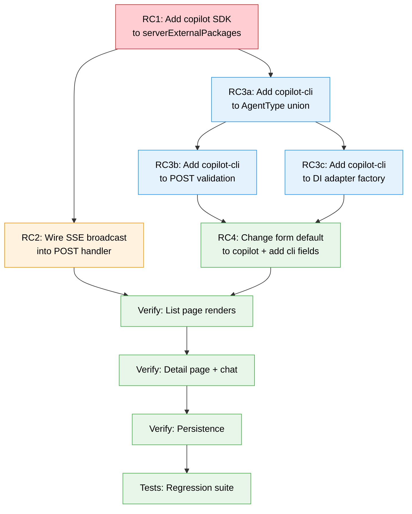

# Workshop: Agent Creation Failure Root Cause Analysis

**Type**: Integration Pattern
**Plan**: 059-fix-agents
**Spec**: [fix-agents-spec.md](../fix-agents-spec.md)
**Created**: 2026-02-28
**Status**: Approved

**Related Documents**:
- [Research Dossier](../research-dossier.md) — Findings 01-03
- [Phase 1 Tasks](../tasks/phase-1-fix-agent-foundation/tasks.md)

**Domain Context**:
- **Primary Domain**: agents
- **Related Domains**: _platform/sdk (CopilotClient), _platform/events (SSE)

---

## Purpose

Eliminate assumptions about why agents are broken. The research dossier identified 4 issues (serialization, SSE wiring, copilot-cli type, DI factory), but live testing reveals a different primary root cause. This workshop traces the actual failure and documents all confirmed issues with evidence.

## Key Questions Addressed

- Why does "Failed to create agent" appear for GitHub Copilot type?
- Why does claude-code agent creation work but copilot doesn't?
- Is the GET serialization actually broken, or is the list empty because creation fails?
- What's the correct fix order — what unblocks the most?
- Are there secondary issues hidden behind the primary failure?

---

## Root Cause 1: Turbopack Bundles `@github/copilot-sdk` (CRITICAL)

### Evidence

```bash
$ curl -s -X POST http://localhost:3000/api/agents \
  -H 'Content-Type: application/json' \
  -d '{"name":"Test","type":"copilot","workspace":"chainglass"}'

{"error":"Failed to create agent","message":"__TURBOPACK__import$2e$meta__.resolve is not a function"}
```

Compared to:
```bash
$ curl -s -X POST http://localhost:3000/api/agents \
  -H 'Content-Type: application/json' \
  -d '{"name":"Test","type":"claude-code","workspace":"chainglass"}'

{"id":"agent-mm655vd4-f509hg","name":"Test","type":"claude-code",...}  # ← SUCCESS
```

### Call Chain

```
POST /api/agents { type: 'copilot' }
  └→ ensureInitialized()  ← OK (no stored copilot agents)
  └→ agentManager.createAgent({ type: 'copilot' })
       └→ new AgentInstance(config, adapterFactory, notifier, storage)
            └→ this._adapter = adapterFactory('copilot')        // line 128
                 └→ c.resolve<CopilotClient>(DI_TOKENS.COPILOT_CLIENT)  // first-time singleton
                      └→ new CopilotClient()                             // SDK constructor
                           └→ getBundledCliPath()                         // line 105
                                └→ import.meta.resolve("@github/copilot/sdk")  // line 31
                                     └→ __TURBOPACK__import$2e$meta__.resolve   // ❌ CRASH
                                          TypeError: not a function
```

### Why It Happens

`@github/copilot-sdk` (v0.x) uses Node.js `import.meta.resolve()` at line 31 of `dist/client.js`:

```javascript
function getBundledCliPath() {
  const sdkUrl = import.meta.resolve("@github/copilot/sdk");  // Node.js API
  const sdkPath = fileURLToPath(sdkUrl);
  return join(dirname(dirname(sdkPath)), "index.js");
}
```

This is called from the `CopilotClient` constructor (line 105):
```javascript
constructor(options = {}) {
    ...
    cliPath: options.cliPath || getBundledCliPath(),  // ← triggers import.meta.resolve
```

Turbopack bundles the module and rewrites `import.meta.resolve` to `__TURBOPACK__import$2e$meta__.resolve`, which doesn't exist. Native Node.js `import.meta.resolve()` works fine:

```bash
$ node -e "console.log(import.meta.resolve('@github/copilot/sdk'))"
file:///.../@github/copilot/sdk/index.js  # ← works in Node.js
```

### Why claude-code Works

The `adapterFactory` only constructs the adapter for the requested type. For `claude-code`, it creates `ClaudeCodeAdapter` (which uses `ProcessManager`, no SDK dependency). `CopilotClient` is never instantiated, so the broken code path is never hit.

### Why the adapter is created at construction time

`AgentInstance` constructor (line 128):
```typescript
constructor(config, adapterFactory, notifier, storage?) {
    ...
    this._adapter = adapterFactory(config.type);  // ← eagerly created
}
```

This means the failure happens during `createAgent()`, not during `run()`.

### Fix

Add `@github/copilot-sdk` and `@github/copilot` to `serverExternalPackages` in `apps/web/next.config.mjs`:

```javascript
serverExternalPackages: [
    'shiki',
    'vscode-oniguruma',
    '@shikijs/core',
    '@shikijs/engine-oniguruma',
    '@github/copilot-sdk',   // ← NEW: uses import.meta.resolve
    '@github/copilot',       // ← NEW: resolved by copilot-sdk
],
```

This follows the exact same pattern as shiki (already documented in the codebase). `serverExternalPackages` tells Next.js/Turbopack to NOT bundle these packages, leaving them as native Node.js imports where `import.meta.resolve` works correctly.

### Secondary Impact: Hydration

The same crash would occur during `AgentManagerService.initialize()` if any stored copilot agent exists:
```
initialize() → hydrate(storedAgent) → new AgentInstance() → adapterFactory('copilot') → CRASH
```

The `initialize()` loop (line 105-117 in `agent-manager.service.ts`) has NO try/catch around individual agent hydration. If ANY stored copilot agent exists, ALL agents fail to load. And since the route's `ensureInitialized()` flag never gets set, every subsequent request retries and fails.

---

## Root Cause 2: POST Does Not Broadcast SSE Event (HIGH)

### Evidence

POST handler (`apps/web/app/api/agents/route.ts` lines 130-149):
```typescript
const agent = agentManager.createAgent({
    name: body.name,
    type: body.type,
    workspace: body.workspace,
});

// ← NO broadcast call here

return NextResponse.json(response, { status: 201 });
```

The `AgentNotifierService` exists and has `broadcastStatus()`, but it's never called from the POST handler.

### Impact

When a client creates an agent, other connected clients (or the same client's `useAgentManager` hook listening on SSE) never receive the `agent_created` event. The agent list only updates on manual page refresh.

### Fix

After `createAgent()`, resolve the notifier and broadcast:
```typescript
const notifier = container.resolve<IAgentNotifierService>(
    SHARED_DI_TOKENS.AGENT_NOTIFIER_SERVICE
);
notifier.broadcastStatus(agent.id, agent.status);
```

---

## Root Cause 3: `copilot-cli` Type Not Supported (MEDIUM)

### Evidence

Three locations reject `copilot-cli`:

1. **AgentType union** (`019/agent-instance.interface.ts:19`):
   ```typescript
   export type AgentType = 'claude-code' | 'copilot';  // ← missing copilot-cli
   ```
   (The 034 module already has it: `'claude-code' | 'copilot' | 'copilot-cli'`)

2. **POST validation** (`route.ts:122`):
   ```typescript
   if (body.type !== 'claude-code' && body.type !== 'copilot') {
       return NextResponse.json({ error: 'Invalid agent type' }, { status: 400 });
   }
   ```

3. **DI adapter factory** (`di-container.ts:399-410`):
   ```typescript
   if (agentType === 'claude-code') { ... }
   if (agentType === 'copilot') { ... }
   throw new Error(`Unknown agent type: ${agentType}`);
   ```

### Impact

Users cannot create copilot-cli agents from the web UI. The adapter implementation exists (`packages/shared/src/adapters/copilot-cli.adapter.ts`) but is unreachable from the web.

### Fix

Update all three locations + add `copilot-cli` to the creation form.

---

## Root Cause 4: Form Defaults to claude-code (LOW)

### Evidence

`create-session-form.tsx:43`:
```typescript
const [agentType, setAgentType] = useState<AgentType>('claude-code');
```

### Impact

Users must manually switch to GitHub Copilot. The spec says copilot should be the default.

### Fix

Change default to `'copilot'`.

---

## Confirmed Non-Issues

| Suspected Issue | Status | Evidence |
|----------------|--------|----------|
| GET /api/agents serialization broken | **Not broken** | `curl GET /api/agents` returns correct shape with all fields hooks expect (id, name, type, workspace, status, intent, sessionId, createdAt, updatedAt) |
| DI container bootstrap fails | **Works fine** | claude-code agent created successfully through full DI stack |
| AgentManagerService initialization fails | **Works fine** | No stored copilot agents → initialize() succeeds |
| Agent list page broken | **Works, just empty** | Page renders "No agents" correctly; agents appear after successful creation |
| SSE event stream broken | **Works** | SSE endpoint functional; issue is that events aren't published on creation |

---

## Revised Fix Order



**Critical path**: RC1 (serverExternalPackages) unblocks EVERYTHING. Without this, copilot agents can't be created or hydrated. This is a 1-line config change.

### Priority ranking

| # | Fix | Severity | Effort | Unblocks |
|---|-----|----------|--------|----------|
| 1 | Add `@github/copilot-sdk` + `@github/copilot` to serverExternalPackages | Critical | 1 line | All copilot agent functionality |
| 2 | Wire SSE broadcast into POST handler | High | ~5 lines | Real-time agent list updates |
| 3 | Add copilot-cli to AgentType + validation + DI factory | Medium | ~10 lines across 3 files | copilot-cli agent creation |
| 4 | Change form default + add copilot-cli fields | Low | ~40 lines | Better UX + copilot-cli support |
| 5 | Verify pages + persistence | Low | 0 (verification only) | Confidence |
| 6 | Regression tests | Low | ~60 lines | Future safety |

---

## Impact on Phase 1 Task Order

The original Phase 1 tasks (T001-T008) assumed serialization and type issues were primary. This workshop reveals:

1. **T001 (AgentType union)** stays but is NOT the first fix
2. **T002 (DI factory)** stays
3. **T003 (POST validation + SSE)** stays but should be split: SSE broadcast is separate from validation
4. **T004 (form)** stays
5. **T005 (GET serialization)** → **downgraded to verification only** — GET is not broken
6. **T006 (detail page)** stays as verification
7. **T007 (persistence)** stays as verification
8. **T008 (tests)** stays

**NEW task needed**: Add `@github/copilot-sdk` to serverExternalPackages — this must be FIRST.

---

## Open Questions

### Q1: Should we also externalize `reflect-metadata`?

**RESOLVED**: No. `reflect-metadata` is imported in di-container.ts and works with Turbopack. Only packages using `import.meta.resolve` need externalization.

### Q2: Could stored copilot agents break initialize()?

**RESOLVED**: Yes, confirmed. If a copilot agent was previously stored (before this bug appeared), `initialize()` would crash on hydration. However, current state shows no stored copilot agents (only the test claude-code agent we created). The initialize loop should still get a try/catch around individual agent hydration as a defensive measure.

### Q3: Why didn't the existing 42 agent test files catch this?

**RESOLVED**: Tests use `FakeAgentAdapter` and `FakeCopilotClient` — they never import from `@github/copilot-sdk`. The real CopilotClient is only used in the DI container's production wiring, which is never exercised in unit tests. This is a Turbopack-specific runtime issue that only manifests in the dev server.

### Q4: Should we pass `cliPath` explicitly instead of externalizing?

**RESOLVED**: No. Externalization is the cleaner fix — it follows the existing shiki pattern, requires 1 line, and ensures the entire SDK works as Node.js expects. Passing `cliPath` would require knowing the pnpm-resolved path at build time, which is fragile.
