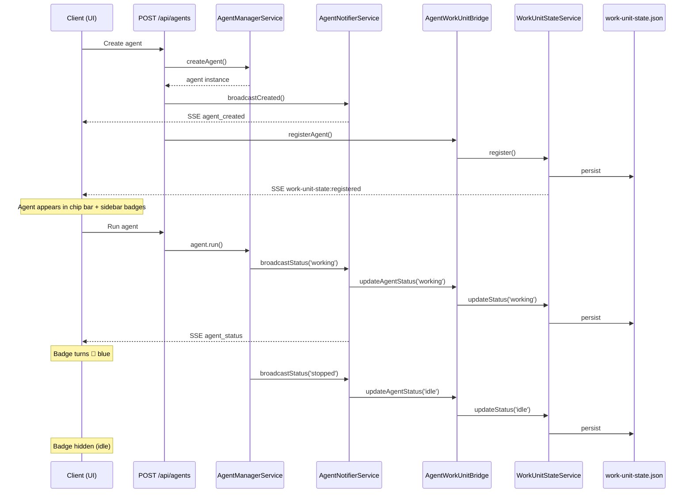

# Workshop: Agent → WorkUnitState Registration

**Type**: Integration Pattern
**Plan**: 059-fix-agents
**Spec**: [fix-agents-spec.md](../fix-agents-spec.md)
**Created**: 2026-03-02
**Status**: Draft

**Related Documents**:
- [Workshop 003: Work Unit State System](003-work-unit-state-system.md)
- [Workshop 004: Agent Creation Failure Root Cause](004-agent-creation-failure-root-cause.md)

**Domain Context**:
- **Primary Domain**: agents (lifecycle owner)
- **Related Domains**: work-unit-state (status registry), _platform/events (CEN broadcast)

---

## Purpose

Wire regular UI-created agents into WorkUnitStateService so that sidebar badges, top bar chips, and cross-worktree activity indicators actually have data. Currently `AgentWorkUnitBridge` exists but nothing calls it — agents are created and never registered.

## Key Questions Addressed

- Where in the agent lifecycle should we call bridge.registerAgent()?
- How do agent status changes (working/stopped/error) propagate to work-unit-state?
- How do we map AgentInstanceStatus (3 values) to WorkUnitStatus (5 values)?
- Should we hook into the existing notifier pattern or the API route directly?

---

## The Gap

```
Current Flow (BROKEN):

  UI → POST /api/agents → AgentManagerService.createAgent()
                        → notifier.broadcastCreated()     ← SSE works ✅
                        → ❌ NOTHING calls bridge.registerAgent()
                        → work-unit-state.json is EMPTY
                        → sidebar badges: nothing to show
```

```
Target Flow:

  UI → POST /api/agents → AgentManagerService.createAgent()
                        → notifier.broadcastCreated()     ← SSE works ✅
                        → bridge.registerAgent()          ← NEW
                        → work-unit-state.json has entry
                        → sidebar badges light up ✅

  Agent runs            → agent._setStatus('working')
                        → notifier.broadcastStatus()      ← SSE works ✅
                        → bridge.updateAgentStatus()      ← NEW
                        → work-unit-state.json updated
                        → chip bar shows working ✅

  Agent stops/errors    → agent._setStatus('stopped'|'error')
                        → bridge.updateAgentStatus()      ← NEW
                        → badges reflect status

  Agent deleted         → DELETE /api/agents/[id]
                        → bridge.unregisterAgent()        ← NEW
                        → entry removed from JSON
```

---

## Status Mapping

AgentInstanceStatus has 3 values. WorkUnitStatus has 5. Mapping:

| AgentInstanceStatus | WorkUnitStatus | When | Badge Color |
|---------------------|---------------|------|-------------|
| *(creation)* | `idle` | Agent just created, not yet run | — (hidden) |
| `working` | `working` | Agent is actively running | 🔵 blue |
| `stopped` | `idle` | Agent finished successfully | — (hidden) |
| `error` | `error` | Agent run failed | 🔴 red |
| *(n/a — from WF observer)* | `waiting_input` | Agent waiting for user input | 🟡 amber pulse |

**Key insight**: `stopped` maps to `idle` (not `completed`), because agents can be re-run. `completed` would imply finality. An idle agent just isn't doing anything right now.

---

## Design Options

### Option A: Hook into POST/DELETE API routes (Recommended)

Wire bridge calls directly in the API route handlers:

```
POST /api/agents       → bridge.registerAgent()
POST /api/agents/[id]/run  → bridge.updateAgentStatus('working')
                          (status changes via notifier subscription)
DELETE /api/agents/[id] → bridge.unregisterAgent()
```

**Pros**:
- Simple, explicit, easy to understand
- No new abstractions or indirection
- Bridge is already in DI, just resolve and call
- Matches existing pattern (notifier is called in same routes)

**Cons**:
- Route handlers get slightly longer
- Status changes during run require separate hook (notifier)

### Option B: Decorate AgentNotifierService

Wrap the notifier so every broadcast also calls the bridge:

```typescript
class BridgedAgentNotifier implements IAgentNotifierService {
  constructor(
    private inner: IAgentNotifierService,
    private bridge: AgentWorkUnitBridge,
  ) {}

  broadcastCreated(id, data) {
    this.inner.broadcastCreated(id, data);
    this.bridge.registerAgent(id, data.name, data.type);
  }

  broadcastStatus(id, status) {
    this.inner.broadcastStatus(id, status);
    this.bridge.updateAgentStatus(id, mapStatus(status));
  }

  broadcastTerminated(id) {
    this.inner.broadcastTerminated(id);
    this.bridge.unregisterAgent(id);
  }
  // ... delegate remaining methods
}
```

**Pros**:
- All events automatically captured
- No route handler changes
- Single integration point

**Cons**:
- New class + DI wiring complexity
- Decorator pattern adds indirection
- broadcastStatus is called from AgentInstance (deep in shared package)
- Couples two domains at the notifier level

### Option C: Subscribe to CEN events

Listen to existing SSE broadcasts on the server side:

**Rejected** — SSE is a client-side transport. Server-side code should not subscribe to its own SSE channel.

---

## Recommendation: Option A (API Route Hooks)

Option A is simplest and matches the existing pattern. The bridge calls live next to the notifier calls — same place, same pattern, easy to audit.

For status changes during agent runs, we need to handle the fact that `broadcastStatus()` is called from deep inside `AgentInstance._setStatus()`, not from API routes. Two sub-approaches:

### A1: Hook broadcastStatus only (hybrid of A + B)

Add bridge calls in API routes for create/delete, but for mid-run status changes, extend the notifier:

```
POST handler:    bridge.registerAgent()     ← explicit
Run handler:     bridge.updateAgentStatus('working')  ← explicit start
Notifier:        broadcastStatus() → also bridge.updateAgentStatus()  ← automatic mid-run
DELETE handler:  bridge.unregisterAgent()   ← explicit
```

This is the cleanest because:
- Create/delete are one-time events in routes (easy)
- Status changes during runs happen many times from within AgentInstance (need automatic hook)

### Implementation sketch (A1)

#### 1. Modify AgentNotifierService constructor to accept optional bridge

```typescript
// agent-notifier.service.ts
constructor(
  private readonly broadcaster: ISSEBroadcaster,
  private readonly bridge?: AgentWorkUnitBridge,
) {}

broadcastStatus(agentId: string, status: AgentInstanceStatus): void {
  // Existing SSE broadcast
  this.broadcaster.broadcast(AGENTS_CHANNEL, 'agent_status', { ... });

  // NEW: Update work-unit-state
  if (this.bridge) {
    this.bridge.updateAgentStatus(agentId, mapAgentStatus(status));
  }
}
```

#### 2. Add bridge calls in API routes

```typescript
// POST /api/agents (after createAgent + broadcastCreated)
const bridge = container.resolve<AgentWorkUnitBridge>(
  POSITIONAL_GRAPH_DI_TOKENS.AGENT_WORK_UNIT_BRIDGE
);
bridge.registerAgent(agent.id, agent.name, agent.type);

// DELETE /api/agents/[id] (before terminateAgent)
bridge.unregisterAgent(id);
```

#### 3. Status mapping function

```typescript
function mapAgentStatus(status: AgentInstanceStatus): WorkUnitStatus {
  switch (status) {
    case 'working': return 'working';
    case 'error':   return 'error';
    case 'stopped': return 'idle';
  }
}
```

#### 4. DI wiring — inject bridge into notifier

```typescript
// di-container.ts — update notifier registration
childContainer.register<IAgentNotifierService>(SHARED_DI_TOKENS.AGENT_NOTIFIER_SERVICE, {
  useFactory: (c) => new AgentNotifierService(
    c.resolve<ISSEBroadcaster>(...),
    c.resolve<AgentWorkUnitBridge>(POSITIONAL_GRAPH_DI_TOKENS.AGENT_WORK_UNIT_BRIDGE),
  ),
});
```

---

## Hydration on Server Restart

When the server restarts, WorkUnitStateService hydrates from `work-unit-state.json`. But what about stale entries from agents that crashed?

**tidyUp already handles this**: entries > 24h with status not `working`/`waiting_input` are removed. For shorter-lived stale entries, the agent's next interaction will re-register it.

**No additional hydration logic needed.**

---

## Sequence Diagram — Full Agent Lifecycle



---

## Scope & Non-Goals

**In scope**:
- Register agents in WorkUnitStateService on creation
- Update status on run start/stop/error
- Unregister on deletion
- Status mapping (3 → 5 values)

**Not in scope**:
- Workflow observer wiring (already works via Plan 061)
- `waiting_input` status from UI agents (no mechanism yet — future)
- Cross-worktree badge logic (already works, just needs data)
- New SSE channels (reuse existing)

---

## Files to Change

| File | Change | Size |
|------|--------|------|
| `apps/web/app/api/agents/route.ts` | Add bridge.registerAgent() in POST | +5 lines |
| `apps/web/app/api/agents/[id]/route.ts` | Add bridge.unregisterAgent() in DELETE | +5 lines |
| `apps/web/src/features/019-agent-manager-refactor/agent-notifier.service.ts` | Accept optional bridge, call on broadcastStatus | +15 lines |
| `apps/web/src/lib/di-container.ts` | Pass bridge to notifier factory | +3 lines |

**Total: ~28 lines changed. No new files.**

---

## Open Questions

### Q1: Should we register existing agents on server start?

**RESOLVED**: No. tidyUp handles stale entries. When the user interacts with an existing agent (runs it), the POST /run handler can re-register if missing. Alternatively, the hydration from `work-unit-state.json` preserves agents that were properly registered. New registrations happen on create.

### Q2: What about agents created before this fix ships?

**RESOLVED**: They won't appear in badges until they're interacted with (run/delete). This is acceptable — the fix is forward-looking. Users can delete and re-create old agents if they want badge visibility.

### Q3: Should broadcastIntent also update WorkUnitStateService?

**RESOLVED**: Yes — intent changes should flow through. The bridge's `updateAgentStatus` already accepts an optional `intent` parameter. Wire `broadcastIntent` to call `bridge.updateAgentStatus(id, currentStatus, intent)`.
