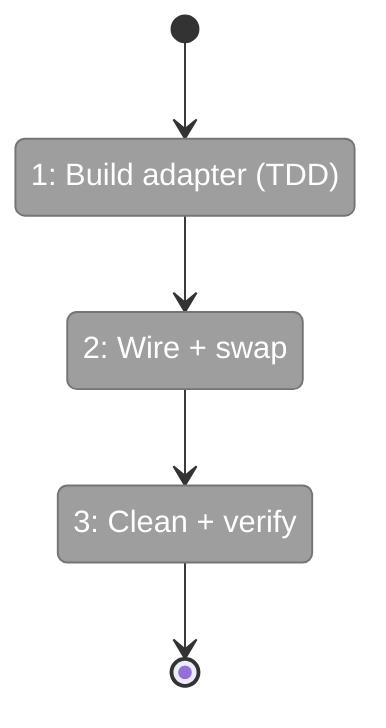
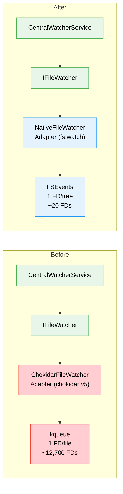

# Flight Plan: Phase 1 — Replace Chokidar with Native File Watcher

**Plan**: [native-file-watcher-plan.md](../../native-file-watcher-plan.md)
**Phase**: Phase 1: Replace Chokidar (only phase)
**Generated**: 2026-02-28
**Status**: Landed

---

## Departure → Destination

**Where we are**: The CentralWatcherService uses `ChokidarFileWatcherAdapter` (chokidar v5) which on macOS opens 1 file descriptor per watched file via kqueue. With 4 worktrees, this accumulates ~12,700 FDs, causing `spawn EBADF` when Next.js tries to fork jest-worker processes. The dev server is unusable for multi-workspace development.

**Where we're going**: A developer starts `just dev` with 4+ worktrees registered and the dev server works without errors. File change events continue to fire correctly. The process uses < 200 FDs. chokidar is removed from the dependency tree.

---

## Domain Context

### Domains We're Changing

| Domain | What Changes | Key Files |
|--------|-------------|-----------|
| _platform/events | Replace ChokidarFileWatcherAdapter with NativeFileWatcherAdapter; swap factory in DI; remove chokidar dep | `packages/workflow/src/adapters/native-file-watcher.adapter.ts` (new), `apps/web/src/lib/di-container.ts`, `packages/workflow/package.json` |

### Domains We Depend On (no changes)

| Domain | What We Consume | Contract |
|--------|----------------|----------|
| _platform/events | IFileWatcher, IFileWatcherFactory, FileWatcherOptions | `packages/workflow/src/interfaces/file-watcher.interface.ts` |
| _platform/events | SOURCE_WATCHER_IGNORED | `packages/workflow/src/features/023-central-watcher-notifications/source-watcher.constants.ts` |

---

## Flight Status

<!-- Updated by /plan-6-v2: pending → active → done -->

**Legend**: grey = pending | yellow = active | red = blocked/needs input | green = done

---

## Stages

- [ ] **Stage 1: Build adapter with TDD** — Implement NativeFileWatcherAdapter + Factory with event normalization, ignored filtering, write stabilization (`native-file-watcher.adapter.ts` — new file)
- [ ] **Stage 2: Wire and swap** — Update DI, barrel exports, integration test (`di-container.ts`, `index.ts`, integration test)
- [ ] **Stage 3: Clean and verify** — Remove chokidar dep, delete old adapter, smoke test dev server (`package.json`, `chokidar-file-watcher.adapter.ts` — delete)

---

## Architecture: Before & After

**Legend**: green = existing (unchanged) | blue = new (created) | red = removed

---

## Acceptance Criteria

- [ ] AC-01: Dev server starts without `spawn EBADF` with 4+ worktrees
- [ ] AC-02: NativeFileWatcherAdapter implements IFileWatcher (add, unwatch, close, on)
- [ ] AC-03: File change events (add, change, unlink, addDir, unlinkDir) fire correctly
- [ ] AC-04: SOURCE_WATCHER_IGNORED patterns suppressed
- [ ] AC-05: Write stabilization works (rapid writes → single event)
- [ ] AC-06: FD count < 200 after startup
- [ ] AC-07: Existing unit tests pass unchanged
- [ ] AC-08: Integration test passes with real filesystem
- [ ] AC-09: chokidar removed from package.json
- [ ] AC-10: Startup log shows watcher backend

## Goals & Non-Goals

**Goals**: Eliminate FD exhaustion, drop-in adapter swap, remove chokidar, FDs < 200
**Non-Goals**: Architecture changes, watcher budgets, new docs, new fakes

---

## Checklist

- [ ] T001: Create NativeFileWatcherAdapter with add/on/close
- [ ] T002: Event normalization (rename → add/unlink/addDir/unlinkDir via stat)
- [ ] T003: Ignored pattern filtering (string, RegExp, function)
- [ ] T004: Write stabilization (per-file debounce)
- [ ] T005: unwatch() implementation
- [ ] T006: NativeFileWatcherFactory
- [ ] T007: Swap DI registration
- [ ] T008: Update barrel exports
- [ ] T009: Update integration test
- [ ] T010: Remove chokidar dependency
- [ ] T011: Delete chokidar adapter
- [ ] T012: Smoke test dev server
