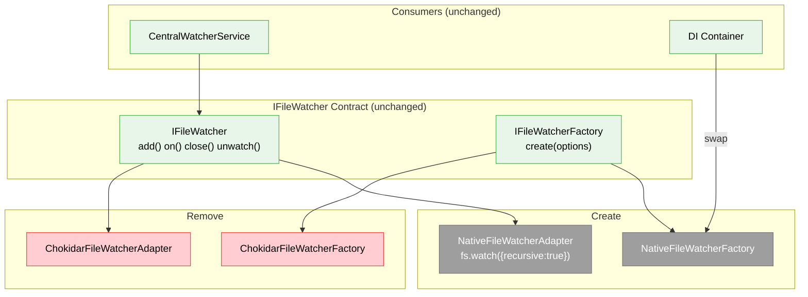
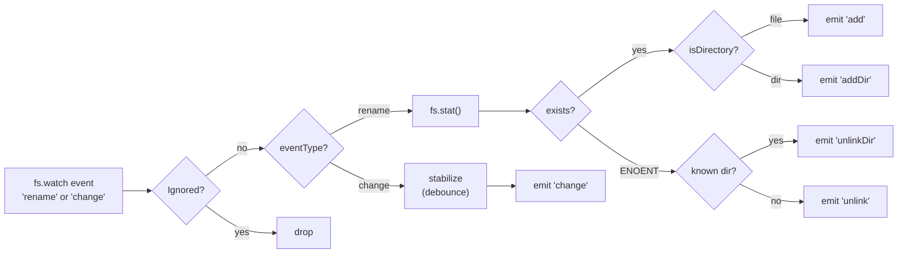
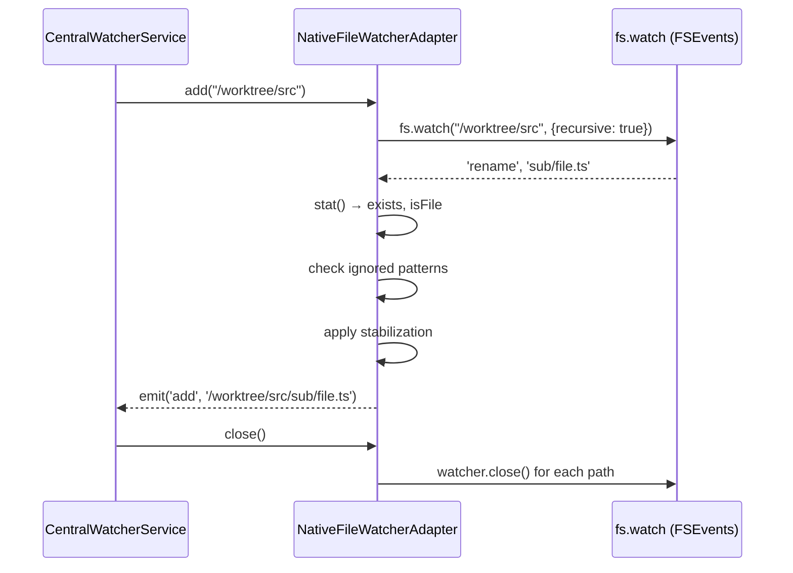

# Phase 1: Replace Chokidar with Native File Watcher — Tasks

**Plan**: [native-file-watcher-plan.md](../../native-file-watcher-plan.md)
**Phase**: Phase 1 (only phase — Simple mode)
**Status**: Pending

---

## Executive Briefing

**Purpose**: Replace the chokidar v5 file watcher backend with Node.js native `fs.watch({recursive: true})` to eliminate the `spawn EBADF` crash that makes the dev server unusable with multiple worktrees. This is a concrete adapter swap behind the existing `IFileWatcher` interface.

**What We're Building**: A `NativeFileWatcherAdapter` that implements `IFileWatcher` using `fs.watch({recursive: true})`, normalizes the limited `rename`/`change` events into the full add/change/unlink/addDir/unlinkDir event set via `stat()`, applies ignored patterns as filters, and implements write stabilization as a per-file debounce timer.

**Goals**:
- ✅ Dev server works with 4+ worktrees (no EBADF)
- ✅ Drop-in replacement — IFileWatcher contract unchanged
- ✅ Remove chokidar dependency
- ✅ FD count < 200 (vs current ~12,700)

**Non-Goals**:
- ❌ Changing CentralWatcherService architecture
- ❌ Adding watcher budgets or lazy watching
- ❌ New documentation
- ❌ New fakes (existing FakeFileWatcher tests remain unchanged)

---

## Prior Phase Context

_No prior phases — this is Phase 1 of a Simple mode plan._

---

## Pre-Implementation Check

| File | Exists? | Action | Domain | Notes |
|------|---------|--------|--------|-------|
| `packages/workflow/src/adapters/native-file-watcher.adapter.ts` | ❌ | CREATE | _platform/events | New adapter + factory |
| `packages/workflow/src/adapters/chokidar-file-watcher.adapter.ts` | ✅ | DELETE | _platform/events | 75 lines; exports ChokidarFileWatcherAdapter + Factory |
| `packages/workflow/src/adapters/index.ts` | ✅ | MODIFY | _platform/events | Barrel: swap chokidar → native export |
| `packages/workflow/src/index.ts` | ✅ | MODIFY | _platform/events | Public API: swap ChokidarFileWatcherFactory → NativeFileWatcherFactory |
| `apps/web/src/lib/di-container.ts` | ✅ | MODIFY | _platform/events | Line 69: import; Line 456: registration — single-point swap |
| `test/integration/workflow/features/023/central-watcher.integration.test.ts` | ✅ | MODIFY | _platform/events | Lines 18,39,68: ChokidarFileWatcherFactory; timing constants |
| `packages/workflow/package.json` | ✅ | MODIFY | _platform/events | Remove `"chokidar": "^5.0.0"` |
| `packages/workflow/src/interfaces/file-watcher.interface.ts` | ✅ | READ ONLY | _platform/events | IFileWatcher + IFileWatcherFactory — contract unchanged |

**Concept check**: No new concepts to search — this is a backend swap of an existing abstraction.

---

## Architecture Map



---

## Tasks

| Status | ID | Task | Domain | Path(s) | Done When | Notes |
|--------|-----|------|--------|---------|-----------|-------|
| [ ] | T001 | Create `NativeFileWatcherAdapter` with basic `add()`, `on()`, `close()` using `fs.watch({recursive: true})` | _platform/events | `packages/workflow/src/adapters/native-file-watcher.adapter.ts` | TDD: integration test creates temp dir, writes file, receives 'change' event | Core scaffold. One FSWatcher per add() call stored in Map. Finding 05: 4 FDs per 3 watchers verified |
| [ ] | T002 | Implement event normalization: `rename` → add/unlink/addDir/unlinkDir via `fs.stat()` | _platform/events | same | TDD: create file → 'add'; delete → 'unlink'; mkdir → 'addDir'; rmdir → 'unlinkDir' | Finding 02. DYK#4: No known-paths Set — ENOENT renames always emit 'unlink'. stat() isDirectory → 'addDir'. Simplest correct approach |
| [ ] | T003 | Implement `ignored` pattern filtering — apply string, RegExp, and function predicates | _platform/events | same | TDD: ignored path produces no event; SOURCE_WATCHER_IGNORED function predicates work | Finding 04: filter in event callback before emitting. FileWatcherOptions.ignored supports all 3 types |
| [ ] | T004 | Implement write stabilization (awaitWriteFinish equivalent via per-file debounce) | _platform/events | same | TDD: 5 rapid writes → single 'change' event after stabilityThreshold ms | Finding 03. DYK#3: Apply debounce ONLY to 'change' events — let rename (add/unlink) pass through immediately |
| [ ] | T005 | Implement `unwatch()` — close specific FSWatcher by path | _platform/events | same | TDD: unwatch() stops events for that path; other paths still fire | Finding 06: never called by consumers but interface requires it |
| [ ] | T006 | Create `NativeFileWatcherFactory` implementing `IFileWatcherFactory` | _platform/events | same | Factory.create(options) returns configured NativeFileWatcherAdapter | Map FileWatcherOptions to adapter config |
| [ ] | T007 | Wire into DI: swap factory in `di-container.ts` | _platform/events | `apps/web/src/lib/di-container.ts` | Import NativeFileWatcherFactory; change line 456 registration | Single import + single line swap |
| [ ] | T008 | Update barrel exports: `adapters/index.ts` + `packages/workflow/src/index.ts` | _platform/events | 2 files | NativeFileWatcherFactory exported; ChokidarFileWatcherFactory removed | Check for any other re-exports |
| [ ] | T009 | Update integration test to use NativeFileWatcherFactory | _platform/events | `test/integration/workflow/features/023/central-watcher.integration.test.ts` | Test passes with native watcher; timing constants adjusted | Finding 07: remove chokidar timing assumptions |
| [ ] | T010 | Remove chokidar dep from `packages/workflow/package.json` + `pnpm install` | _platform/events | `packages/workflow/package.json` | Build passes; `pnpm why chokidar` empty | Audit confirmed: only consumer |
| [ ] | T011 | Delete `chokidar-file-watcher.adapter.ts` | _platform/events | `packages/workflow/src/adapters/chokidar-file-watcher.adapter.ts` | File gone; no dangling imports | After all tests green |
| [ ] | T012 | Smoke test: dev server with 4+ worktrees, verify no EBADF, check FD count | _platform/events | — | Pages serve; `lsof` shows < 200 FDs | AC-01, AC-06, AC-10 |

---

## Context Brief

**Key findings from plan**:
- **Finding 01** (Critical): chokidar v5 uses kqueue = 1 FD/file. `fs.watch({recursive: true})` uses FSEvents = ~1 FD/tree. **667x reduction measured.**
- **Finding 02** (High): `fs.watch` emits `'rename'`/`'change'` only. Adapter must normalize via `stat()`. Full relative paths confirmed (e.g., `sub/deep/file.txt`).
- **Finding 03** (High): No `awaitWriteFinish` in native. Implement as per-file debounce timer with same thresholds (200-300ms).
- **Finding 04** (High): `SOURCE_WATCHER_IGNORED` uses function predicates. Apply as filter in event callback.
- **Finding 05** (Medium): One FSWatcher per `add()` = 4 FDs for 3 watched paths. Negligible.

**Domain dependencies**:
- `_platform/events`: IFileWatcher, IFileWatcherFactory, FileWatcherOptions, FileWatcherEvent — all consumed, none changed
- `_platform/events`: CentralWatcherService — consumer of IFileWatcher, no changes needed
- `_platform/events`: SOURCE_WATCHER_IGNORED — consumed by CentralWatcherService, passed as `ignored` option

**Domain constraints**:
- Adapter must implement `IFileWatcher` exactly — no interface changes
- Factory must implement `IFileWatcherFactory` exactly — no interface changes
- No domain-specific imports in the adapter (per Plan 023 AC12)

**Reusable from prior work**:
- `FakeFileWatcher` / `FakeFileWatcherFactory` — existing test doubles remain unchanged
- Integration test structure at `test/integration/workflow/features/023/` — reuse same test shape
- `SOURCE_WATCHER_IGNORED` constants — reuse as-is for ignored pattern filtering

**Event normalization flow**:


**Adapter lifecycle**:


---

## ⚠️ Platform Notes

### Linux inotify Watch Limits

`fs.watch({recursive: true})` on Linux creates **one inotify watch per subdirectory** in the tree (not per file). The default system limit is **8,192 watches per user** (`/proc/sys/fs/inotify/max_user_watches`). If you see `ENOSPC: System limit for number of file watchers reached` on Linux, this is why.

**Fix**: `echo 65536 | sudo tee /proc/sys/fs/inotify/max_user_watches` (temporary) or add `fs.inotify.max_user_watches=65536` to `/etc/sysctl.conf` (permanent).

**macOS is unaffected** — FSEvents uses a single kernel stream per directory tree regardless of size.

---

## Discoveries & Learnings

_Populated during implementation by plan-6._

| Date | Task | Type | Discovery | Resolution | References |
|------|------|------|-----------|------------|------------|

---

## Directory Layout

```
docs/plans/060-native-file-watcher/
  ├── native-file-watcher-spec.md
  ├── native-file-watcher-plan.md
  └── tasks/phase-1-replace-chokidar/
      ├── tasks.md              ← this file
      ├── tasks.fltplan.md      ← flight plan (below)
      └── execution.log.md     # created by plan-6
```
