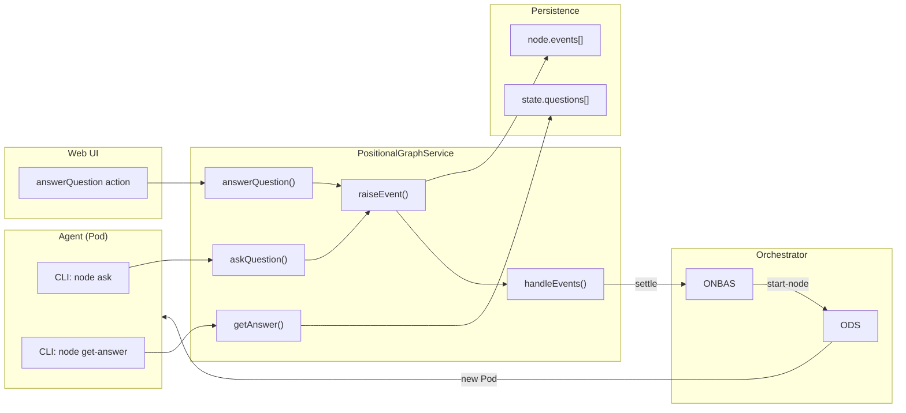
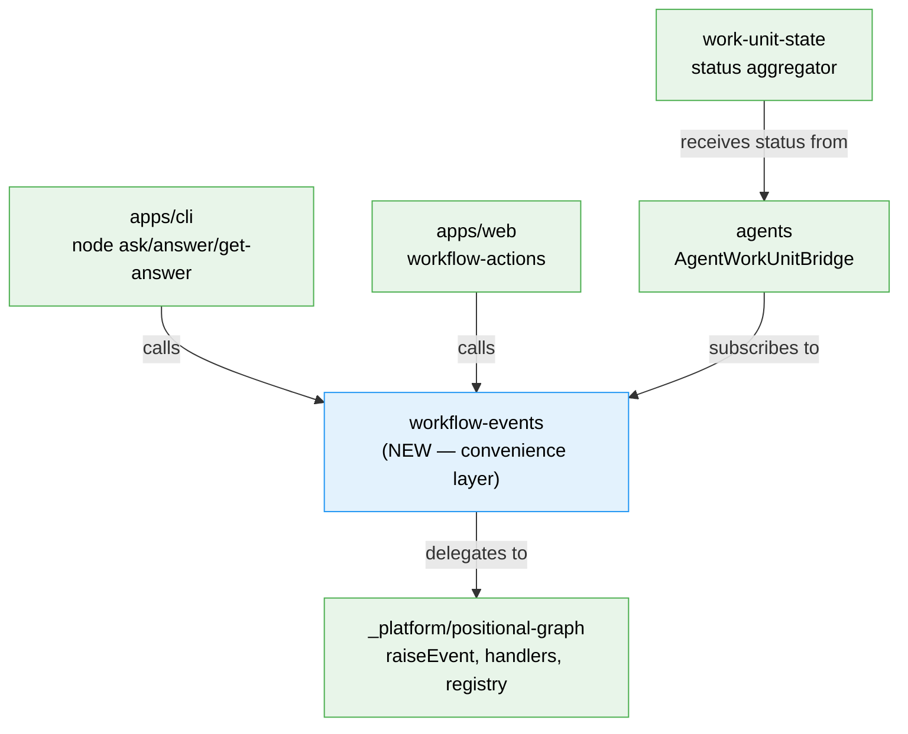

# Research Report: WorkflowEvents — First-Class Convenience Domain

**Generated**: 2026-03-01T02:15:00Z
**Research Query**: "WorkflowEvents as a first-class convenience domain on top of the generic event system"
**Mode**: Pre-Plan (Plan 061)
**Location**: docs/plans/061-workflow-events/research-dossier.md
**FlowSpace**: Available
**Findings**: 78 findings from 9 subagents

## Executive Summary

### What It Does
The workflow event system (Plan 032) provides a generic, schema-validated, registry-based event infrastructure for positional graph node lifecycle. Seven core event types (`node:accepted`, `node:completed`, `node:error`, `question:ask`, `question:answer`, `progress:update`, `node:restart`) drive all node state transitions through a 5-step validation pipeline (`raiseEvent`) and a handler registry (`handleEvents`).

### Business Purpose
QnA, progress reporting, and error handling are all built ON TOP of the generic event system via convenience wrappers scattered across PositionalGraphService, CLI commands, web actions, and test helpers. This diffusion means 88+ files reference `question:ask`, 77+ reference `raiseEvent`, and developers must understand the raw event machinery to do simple things like "answer a question."

### Key Insights
1. **QnA is layered, not baked in** — ONBAS (orchestrator) doesn't know what a question is. It sees `restart-pending` → `ready` → `start-node`.
2. **Agents exit after asking questions** — they don't poll. The orchestrator reinvokes them in a new Pod session after the answer is recorded.
3. **A "WorkflowEvents" domain would create circular deps** if it tried to own event type definitions. Better design: convenience layer that wraps PositionalGraphService methods.
4. **Test helpers already ARE the convenience layer** — `answerNodeQuestion()`, `completeUserInputNode()` in `dev/test-graphs/shared/helpers.ts` are the pattern WorkflowEvents should formalize.
5. **15 prior learnings** from Plan 032 provide critical gotchas (stamp model, state transitions, payload field names, idempotency).

### Quick Stats
- **Components**: 32 source files in positional-graph referencing "question", 88 files referencing "question:ask"
- **Dependencies**: PositionalGraphService (gateway), NodeEventService, NodeEventRegistry, EventHandlerRegistry
- **Test Coverage**: 75% overall — strong unit/handler tests, gap in CLI QnA integration and full ask→answer→restart E2E
- **Complexity**: Medium — event system is well-architected, convenience layer is straightforward wrapper
- **Prior Learnings**: 15 critical discoveries from Plan 032 implementation
- **Domains**: 4 existing domains touched, 1 new domain proposed

## How It Currently Works

### Entry Points

| Entry Point | Type | Location | Purpose |
|------------|------|----------|---------|
| `cg wf node ask` | CLI | apps/cli positional-graph.command.ts:~810 | Agent asks a question |
| `cg wf node answer` | CLI | apps/cli positional-graph.command.ts:~845 | Human/orchestrator answers |
| `cg wf node get-answer` | CLI | apps/cli positional-graph.command.ts:~873 | Agent retrieves answer |
| `cg wf node raise-event` | CLI | apps/cli positional-graph.command.ts:~1300 | Generic event raising |
| `answerQuestion()` | Web Action | apps/web workflow-actions.ts:~416 | Web UI answers question |
| `submitUserInput()` | Web Action | apps/web workflow-actions.ts:~539 | Human input node completion |

### Core QnA Execution Flow

```
1. Agent (in Pod) → CLI: `cg wf node ask --text "Which lang?" --type single --options "Python,Go"`
2. CLI → PGService.askQuestion() → raiseEvent('question:ask', payload, 'agent')
3. raiseEvent: validate(5 steps) → create event → append to node.events[] → persist
4. handleEvents() → handleQuestionAsk() → node.status = 'waiting-question'
5. CLI returns: { questionId, status: 'waiting-question' } + "[AGENT INSTRUCTION] STOP HERE"
6. Agent process EXITS

7. Human (Web UI or CLI) → answerQuestion() → raiseEvent('question:answer')
8. handleQuestionAnswer() → cross-stamps ask event (no status change!)
9. Web action ALSO raises: raiseEvent('node:restart', { reason: 'question-answered' })
10. handleNodeRestart() → node.status = 'restart-pending'

11. Orchestrator (next tick) → Reality Builder maps restart-pending → 'ready'
12. ONBAS sees ready → returns { type: 'start-node', nodeId }
13. ODS creates new Pod → reinvokes agent with continuation prompt
14. Agent → CLI: `cg wf node get-answer <questionId>` → gets answer → continues
```

### Data Flow


## Architecture & Design

### 5-Step Validation Pipeline (raiseEvent)

| Step | Check | Error Code | Example |
|------|-------|------------|---------|
| 1 | Event type exists in registry | E190 | Unknown type 'question:invalid' |
| 2 | Payload passes Zod schema | E191 | Missing required field 'text' |
| 3 | Source is in allowedSources | E192 | 'agent' trying to raise 'question:answer' (human-only) |
| 4 | Node in VALID_FROM_STATES | E193 | Asking question from 'starting' (must be 'agent-accepted') |
| 5 | Question reference valid | E194/E195 | Answer references non-existent question |

### VALID_FROM_STATES Map

```typescript
'node:accepted': ['starting']
'node:completed': ['agent-accepted']
'node:error': ['starting', 'agent-accepted']
'question:ask': ['agent-accepted']
'question:answer': ['waiting-question']
'progress:update': ['starting', 'agent-accepted', 'waiting-question']
'node:restart': ['waiting-question', 'blocked-error', 'complete']
```

### Design Patterns

1. **Record-Only + Handle** — raiseEvent records, handleEvents mutates. Two-phase separation enables event replay.
2. **Subscriber Stamps** — Per-subscriber tracking (replaced markHandled). Supports multi-handler/multi-context.
3. **Convenience Wrappers** — PGService.askQuestion wraps raiseEvent + handleEvents + backward-compat writes.
4. **Handler Context** — Handlers receive structured HandlerContext with stamp/findEvents methods.
5. **Two Registries** — NodeEventRegistry (type validation) + EventHandlerRegistry (handler dispatch).

## Dependencies & Integration

### What the Event System Depends On
- IPositionalGraphService (state I/O, node validation)
- INodeEventRegistry (type definitions, payload validation)
- EventHandlerRegistry (handler routing)
- State persistence layer (loadState/persistState)

### What Depends on the Event System

| Consumer | Package | Methods Used |
|----------|---------|-------------|
| CLI commands | apps/cli | askQuestion, answerQuestion, getAnswer, raiseNodeEvent |
| Web actions | apps/web | answerQuestion (+ node:restart), submitUserInput |
| Test helpers | dev/test-graphs | answerNodeQuestion, completeUserInputNode, clearErrorAndRestart |
| E2E scripts | test/e2e | Full event lifecycle (raiseNodeEvent, processGraph, etc.) |
| Orchestration | packages/positional-graph | processGraph (settle), ONBAS (read settled state) |

## Quality & Testing

### Test Coverage
- **Unit Tests**: 95% — 16 test files in 032-node-event-system covering all handlers, registry, raiseEvent
- **Integration Tests**: 70% — CLI event commands strong, QnA CLI integration GAP
- **E2E Tests**: 60% — Visual demo exists, full ask→answer→restart not automated
- **Overall**: 75%

### E2E Test Files That Need Updating

| File | Size | Events | Update Needed |
|------|------|--------|---------------|
| test/e2e/positional-graph-orchestration-e2e.ts | 38KB | Full lifecycle | YES |
| test/e2e/node-event-system-visual-e2e.ts | 32KB | All 7 event types | YES |
| test/e2e/positional-graph-execution-e2e.test.ts | 49KB | QnA + transitions | YES |
| test/integration/orchestration-drive.test.ts | QnA helpers | answerNodeQuestion | YES |
| test/integration/real-agent-orchestration.test.ts | Real agents | Full stack | YES |
| scripts/test-advanced-pipeline.ts | 6-node real agents | QnA + fan-out | YES |
| scripts/drive-demo.ts | Simple demo | completeUserInput | YES |

### Test Helpers (the proto-WorkflowEvents)

| Helper | Location | What It Wraps |
|--------|----------|---------------|
| `completeUserInputNode()` | dev/test-graphs/shared/helpers.ts | raiseNodeEvent('node:accepted') + endNode() |
| `answerNodeQuestion()` | dev/test-graphs/shared/helpers.ts | answerQuestion() + raiseNodeEvent('node:restart') |
| `clearErrorAndRestart()` | dev/test-graphs/shared/helpers.ts | raiseNodeEvent('node:restart', {reason}) |

### Justfile Recipes

| Recipe | What It Runs | Needs Update |
|--------|-------------|-------------|
| `test-advanced-pipeline` | scripts/test-advanced-pipeline.ts | YES |
| `drive-demo` | scripts/drive-demo.ts | YES |
| `test-e2e` | test/e2e/agent-cli-e2e.test.ts | NO (agent-only) |
| `dope` | scripts/dope-workflows.ts | NO (state injection) |

## Prior Learnings (From Plan 032 Implementation)

### PL-01: answerQuestion() Returns 'starting', Not 'agent-accepted'
**Source**: Plan 032 Phase 2
**Action**: WorkflowEvents.answerQuestion() must account for this — after answer + restart, node goes to 'starting', not directly to 'agent-accepted'.

### PL-04: markHandled() Deleted in Favor of Subscriber Stamps
**Source**: Plan 032 Phase 5
**Action**: WorkflowEvents must use stamps model, not direct field writes.

### PL-06: Stamps Model Preserves 'Orchestrator Hasn't Seen' Signal
**Source**: Plan 032 Phase 5
**Action**: Per-subscriber stamping is critical for multi-pass settlement.

### PL-09: processGraph() Count-Before-Stamp Prevents Stale Count Bug
**Source**: Plan 032 Phase 7
**Action**: Event settlement requires counting unstamped events BEFORE handling them.

### PL-12: Exact Schema Field Names Required (Strict Validation)
**Source**: Plan 032 Phase 8
**Action**: Payloads use `percent` not `percentage`, `answer` not `text`. Zod `.strict()` rejects extras.

### PL-14: Idempotency Requires Two-Pass Settlement
**Source**: Plan 032 Phase 8
**Action**: Settle + verify passes needed. Single processGraph() may not be idempotent.

| ID | Type | Key Insight | Action |
|----|------|-------------|--------|
| PL-01 | gotcha | answerQuestion → 'starting' | Account in state expectations |
| PL-04 | decision | Stamps replaced markHandled | Use stamps API |
| PL-06 | insight | Per-subscriber stamping | Multi-pass settlement |
| PL-09 | gotcha | Count before stamp | Prevent stale counts |
| PL-12 | gotcha | Strict Zod field names | Use exact names |
| PL-14 | gotcha | Two-pass idempotency | Double-settle |

## Domain Context

### Existing Domains Relevant

| Domain | Relationship | Relevant Contracts |
|--------|-------------|-------------------|
| _platform/positional-graph | OWNS event infrastructure | raiseEvent, handleEvents, registry, handlers |
| _platform/events | SSE transport | CentralEventNotifier, useSSE |
| workflow-ui | Web consumer | answerQuestion action, HumanInputModal |
| agents | Event raiser | CLI commands, adapter lifecycle |
| work-unit-state | Status aggregator | Observes events for top bar visibility |

### Circular Dependency Risk (DB-06)
A "workflow-events" domain that OWNS event type definitions would create circular deps with positional-graph. The correct architecture: **workflow-events wraps positional-graph methods** (like test helpers already do), it doesn't own the underlying event types.

### Domain Architecture



## Migration Impact Summary

### Files That Need Updating

**9 critical test/script files** + 1 helper file + CLI/web consumers:

| Category | Count | Key Files |
|----------|-------|-----------|
| E2E scripts | 3 | orchestration-e2e, event-system-e2e, execution-e2e |
| Integration tests | 3 | orchestration-drive, cli-event-commands, real-agent-orch |
| Scripts | 2 | test-advanced-pipeline, drive-demo |
| Test helpers | 1 | dev/test-graphs/shared/helpers.ts (THE GATEWAY) |
| CLI handlers | 3 | handleNodeAsk, handleNodeAnswer, handleNodeGetAnswer |
| Web actions | 2 | answerQuestion, submitUserInput |

### What Does NOT Change
- Core event system (Plan 032) — untouched
- Orchestration (ONBAS/ODS) — untouched
- Event type definitions — stay in positional-graph
- State persistence — unchanged

## Recommendations

### Implementation Strategy
1. **Interface + types** in packages/shared (IWorkflowEvents, QuestionInput, AnswerInput, typed constants)
2. **Implementation** wraps PositionalGraphService (delegates, doesn't replace)
3. **Server-side observers** (onQuestionAsked, onQuestionAnswered) — in-memory, per-graph
4. **Migrate test helpers** — `dev/test-graphs/shared/helpers.ts` becomes thin delegates
5. **Migrate CLI handlers** — swap PGService calls for WorkflowEvents calls
6. **Migrate web actions** — swap answerQuestion + node:restart for single call
7. **Update E2E scripts** — use convenience API for clarity
8. **Add typed constants** — `WorkflowEventType.QuestionAsk` replaces `'question:ask'` strings
9. **Domain extraction** — `docs/domains/workflow-events/domain.md`

### Testing Priority
1. Contract tests: IWorkflowEvents real + fake parity
2. QnA CLI integration tests (current gap)
3. Full ask→answer→restart E2E cycle
4. E2E script updates for new convenience API

---

**Research Complete**: 2026-03-01T02:15:00Z
**Report Location**: docs/plans/061-workflow-events/research-dossier.md

**Next step**: Run `/plan-1b-v2-specify` to create the feature specification for Plan 061.
