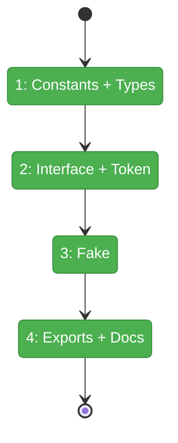
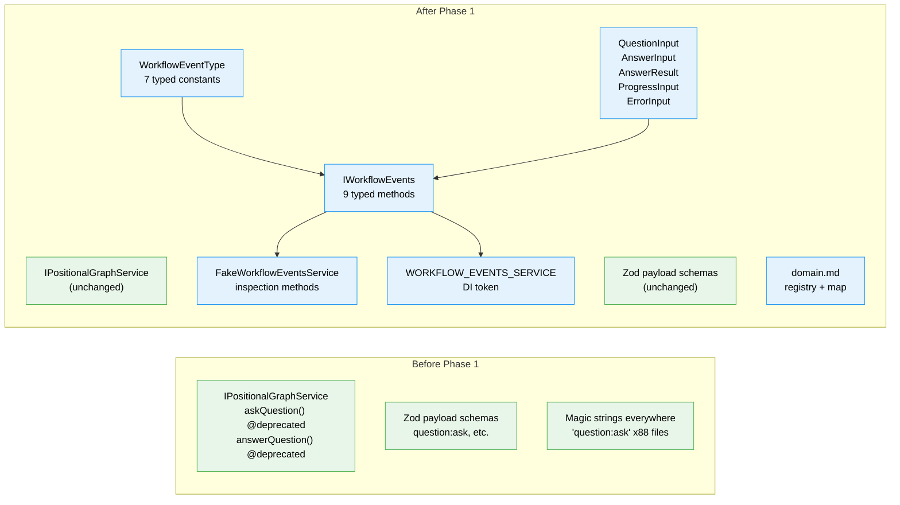

# Flight Plan: Phase 1 — Interface, Types, and Constants

**Plan**: [workflow-events-plan.md](../../workflow-events-plan.md)
**Phase**: Phase 1: Interface, Types, and Constants
**Generated**: 2026-03-01
**Status**: Landed

---

## Departure → Destination

**Where we are**: The workflow event system (Plan 032) has 7 core event types with Zod schemas, but no consumer-friendly contract layer. QnA convenience methods exist on IPositionalGraphService (already @deprecated). 88+ files use magic strings like `'question:ask'`. No IWorkflowEvents interface, no typed constants, no Fake, no domain documentation.

**Where we're going**: A developer can `import { IWorkflowEvents, WorkflowEventType, QuestionInput, FakeWorkflowEventsService } from '@chainglass/shared'` and have the complete typed contract for workflow event interactions. The `workflow-events` domain is documented and registered. Phase 2 can implement against this contract.

---

## Domain Context

### Domains We're Changing

| Domain | What Changes | Key Files |
|--------|-------------|-----------|
| workflow-events (NEW) | Create entire contract layer: interface, types, constants, fake, DI token, domain doc | `packages/shared/src/workflow-events/`, `packages/shared/src/interfaces/workflow-events.interface.ts`, `packages/shared/src/fakes/fake-workflow-events.ts` |
| cross-domain | Barrel exports, package.json entry, registry, domain map | `packages/shared/src/index.ts`, `packages/shared/package.json`, `docs/domains/registry.md`, `docs/domains/domain-map.md` |

### Domains We Depend On (no changes)

| Domain | What We Consume | Contract |
|--------|----------------|----------|
| _platform/positional-graph | Field name alignment from Zod schemas, AskQuestionOptions type reference | event-payloads.schema.ts, positional-graph-service.interface.ts |

---

## Flight Status

**Legend**: grey = pending | yellow = active | red = blocked/needs input | green = done

---

## Stages

- [x] **Stage 1: Define typed constants and types** — WorkflowEventType constants + all input/output/observer types in `packages/shared/src/workflow-events/` (`constants.ts`, `types.ts`)
- [x] **Stage 2: Define interface and DI token** — IWorkflowEvents interface + WORKFLOW_EVENTS_SERVICE token (`workflow-events.interface.ts`, `di-tokens.ts`)
- [x] **Stage 3: Create Fake test double** — FakeWorkflowEventsService with in-memory stores and inspection methods (`fake-workflow-events.ts`)
- [x] **Stage 4: Wire exports and documentation** — Barrel exports, package.json entry, domain doc, registry + map updates

---

## Architecture: Before & After

**Legend**: existing (green, unchanged) | changed (orange, modified) | new (blue, created)

---

## Acceptance Criteria

- [x] AC-01: IWorkflowEvents interface in packages/shared with 9 methods
- [x] AC-04: FakeWorkflowEventsService with inspection methods
- [x] AC-06: WorkflowEventType typed constants for all 7 event types
- [x] AC-07: Typed input/output types exist
- [x] AC-14: Domain doc created
- [x] AC-15: Domain registered in registry + map

## Goals & Non-Goals

**Goals**: IWorkflowEvents contract, typed constants, convenience types, Fake test double, DI token, domain documentation
**Non-Goals**: Implementation (Phase 2), consumer migration (Phase 3), E2E updates (Phase 4)

---

## Checklist

- [x] T001: Create WorkflowEventType typed constants for 7 core event types
- [x] T002: Create convenience types (QuestionInput, AnswerInput, AnswerResult, ProgressInput, ErrorInput)
- [x] T003: Create observer event types (QuestionAskedEvent, QuestionAnsweredEvent, ProgressEvent, WorkflowEvent)
- [x] T004: Define IWorkflowEvents interface with 9 methods
- [x] T005: Add WORKFLOW_EVENTS_SERVICE DI token
- [x] T006: Create FakeWorkflowEventsService with inspection methods
- [x] T007: Create barrel exports + package.json ./workflow-events entry
- [x] T008: Create domain doc, update registry + domain map
