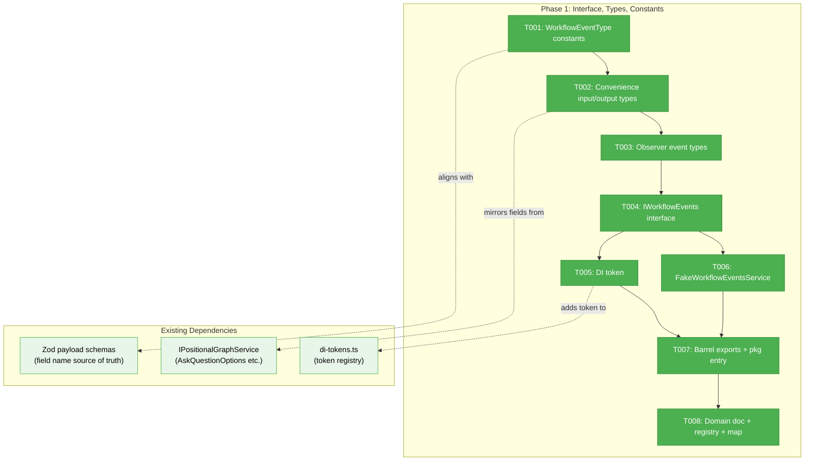
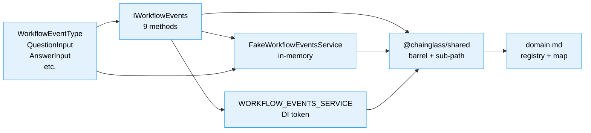
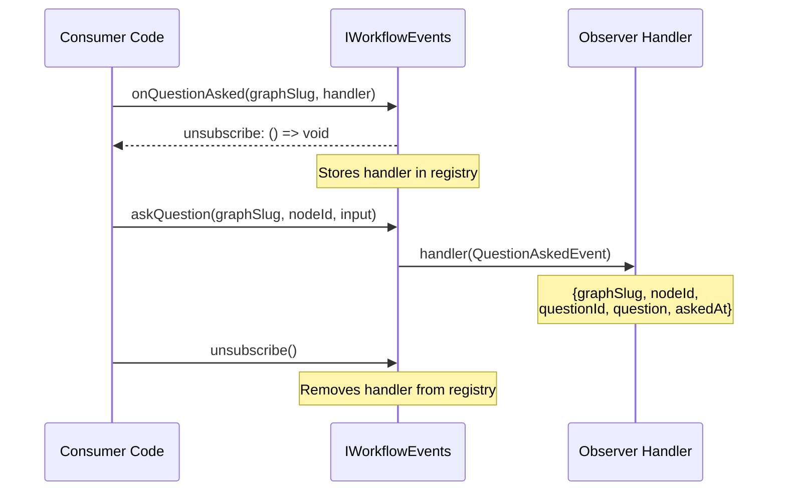

# Phase 1: Interface, Types, and Constants — Task Dossier

**Plan**: [workflow-events-plan.md](../../workflow-events-plan.md)
**Spec**: [workflow-events-spec.md](../../workflow-events-spec.md)
**Phase**: Phase 1 — Interface, Types, and Constants
**Domain**: workflow-events (NEW)
**Status**: Ready

---

## Executive Briefing

**Purpose**: Define the IWorkflowEvents contract, typed event constants, convenience input/output types, observer event types, Fake test double, and DI token in packages/shared. This phase creates the entire public surface area of the workflow-events domain — everything consumers will import. No implementation logic yet.

**What We're Building**: The contract layer for a convenience domain that wraps the generic event system (Plan 032). After this phase, any package can import `IWorkflowEvents`, `WorkflowEventType`, `QuestionInput`, `FakeWorkflowEventsService` etc. from `@chainglass/shared`. The domain is documented and registered.

**Goals**:
- ✅ IWorkflowEvents interface with 9 methods (5 actions + 4 observers)
- ✅ WorkflowEventType typed constants for all 7 core event types
- ✅ Convenience input/output types aligned with existing Zod schemas
- ✅ Observer event types for cross-domain consumption
- ✅ FakeWorkflowEventsService with inspection methods
- ✅ DI token, barrel exports, package.json sub-path export
- ✅ Domain doc, registry entry, domain map node + edges

**Non-Goals**:
- ❌ Implementation of WorkflowEventsService (Phase 2)
- ❌ Observer registry or HMR survival (Phase 2)
- ❌ Consumer migration (Phase 3)
- ❌ E2E test updates (Phase 4)

---

## Pre-Implementation Check

| File | Exists? | Domain Check | Notes |
|------|---------|-------------|-------|
| `packages/shared/src/workflow-events/constants.ts` | ❌ create | workflow-events | New file |
| `packages/shared/src/workflow-events/types.ts` | ❌ create | workflow-events | New file; align field names with Zod .strict() schemas |
| `packages/shared/src/workflow-events/index.ts` | ❌ create | workflow-events | New barrel |
| `packages/shared/src/interfaces/workflow-events.interface.ts` | ❌ create | workflow-events | New interface file |
| `packages/shared/src/di-tokens.ts` | ✅ modify | cross-domain | Add WORKFLOW_EVENTS_SERVICE token to POSITIONAL_GRAPH_DI_TOKENS |
| `packages/shared/src/fakes/fake-workflow-events.ts` | ❌ create | workflow-events | New fake |
| `packages/shared/src/fakes/index.ts` | ✅ modify | cross-domain | Add FakeWorkflowEventsService export |
| `packages/shared/src/interfaces/index.ts` | ✅ modify | cross-domain | Add IWorkflowEvents export |
| `packages/shared/src/index.ts` | ✅ modify | cross-domain | Add workflow-events re-exports |
| `packages/shared/package.json` | ✅ modify | cross-domain | Add `./workflow-events` export entry |
| `docs/domains/workflow-events/domain.md` | ❌ create | workflow-events | New domain doc |
| `docs/domains/registry.md` | ✅ modify | cross-domain | Add workflow-events row |
| `docs/domains/domain-map.md` | ✅ modify | cross-domain | Add workflow-events node + edges |

All files in correct domain source trees. No concept duplication risk — thoroughly validated in research dossier (78 findings).

---

## Architecture Map



---

## Tasks

| Status | ID | Task | Domain | Path(s) | Done When | Notes |
|--------|-----|------|--------|---------|-----------|-------|
| [x] | T001 | Create `WorkflowEventType` typed constants for all 7 core event types | workflow-events | `/packages/shared/src/workflow-events/constants.ts` | `WorkflowEventType.QuestionAsk === 'question:ask'` and all 7 types exported as `as const` object | AC-06; align with core-event-types.ts registered strings |
| [x] | T002 | Create convenience types: `QuestionInput`, `AnswerInput`, `AnswerResult`, `ProgressInput`, `ErrorInput` | workflow-events | `/packages/shared/src/workflow-events/types.ts` | Types compile; field names match Zod `.strict()` schemas exactly | AC-07; Finding 05: `percent` not `percentage`, `question_id` not `questionId`, type values `'text'\|'single'\|'multi'\|'confirm'` not `'free_text'` etc. |
| [x] | T003 | Create observer event types: `QuestionAskedEvent`, `QuestionAnsweredEvent`, `ProgressEvent`, `WorkflowEvent` | workflow-events | `/packages/shared/src/workflow-events/types.ts` | Types compile; contain `graphSlug`, `nodeId`, typed payload | AC-08; these are what observer handlers receive |
| [x] | T004 | Define `IWorkflowEvents` interface with 9 methods | workflow-events | `/packages/shared/src/interfaces/workflow-events.interface.ts` | Interface exported from `@chainglass/shared` with 5 action + 4 observer methods | AC-01; reference WorkspaceContext from existing PGS pattern |
| [x] | T005 | Add `WORKFLOW_EVENTS_SERVICE` DI token | workflow-events | `/packages/shared/src/di-tokens.ts` | Token `'IWorkflowEvents'` in POSITIONAL_GRAPH_DI_TOKENS section | Q7 clarification; follows existing naming: value = interface name |
| [x] | T006 | Create `FakeWorkflowEventsService` with inspection methods | workflow-events | `/packages/shared/src/fakes/fake-workflow-events.ts` | Implements IWorkflowEvents; has `getAskedQuestions()`, `getAnswers()`, `getProgressReports()`, `getObserverCount()`, `reset()` | AC-04; Finding 04: self-contained, NOT dependent on FakePGService |
| [x] | T007 | Create barrel exports + package.json `./workflow-events` entry | workflow-events | `/packages/shared/src/workflow-events/index.ts`, `/packages/shared/src/interfaces/index.ts`, `/packages/shared/src/fakes/index.ts`, `/packages/shared/src/index.ts`, `/packages/shared/package.json` | `import { IWorkflowEvents, WorkflowEventType, FakeWorkflowEventsService } from '@chainglass/shared'` works; `@chainglass/shared/workflow-events` sub-path works | ADR-0009; dual import+types in package.json |
| [x] | T008 | Create domain doc, update registry + domain map | workflow-events | `/docs/domains/workflow-events/domain.md`, `/docs/domains/registry.md`, `/docs/domains/domain-map.md` | domain.md has boundary/contracts/composition/source locations; registry has workflow-events row; map has node + edges to positional-graph and events | AC-14, AC-15 |

---

## Context Brief

### Key Findings from Plan

- **Finding 05 (High)**: Zod payload schemas are `.strict()` — exact field names required. WorkflowEvents types MUST use: `percent` (not `percentage`), `question_id` (not `questionId`), `question_event_id` (not `questionId` for answer payloads), type values `'text' | 'single' | 'multi' | 'confirm'` (not `'free_text'` | `'single_choice'` etc.). Source of truth: `event-payloads.schema.ts`.
- **Finding 04 (High)**: FakeWorkflowEventsService must be self-contained with its own in-memory state — NOT delegating to FakePositionalGraphService. Independent backing stores.
- **Finding 08 (Medium)**: No circular dep risk — packages/shared has no dependency on positional-graph. Interface + types in shared, implementation in positional-graph.

### Critical Type Alignment Notes

The workshop spec proposed slightly different field names than the actual Zod schemas. The types MUST align with Zod:

| Workshop Proposal | Actual Zod Schema | Use This |
|-------------------|-------------------|----------|
| `type: 'free_text'` | `type: 'text'` | `'text'` |
| `type: 'single_choice'` | `type: 'single'` | `'single'` |
| `type: 'multi_choice'` | `type: 'multi'` | `'multi'` |
| `percentage?: number` | `percent?: number` | `percent` |
| `questionId: string` (answer payload) | `question_event_id: string` | `question_event_id` |

However, the **IWorkflowEvents method signatures** use clean TypeScript naming (camelCase). The snake_case alignment is for types that map to/from Zod payloads. The interface methods use `questionId: string` as a parameter name — that's fine. The _payload types_ that get validated by Zod must use snake_case field names.

### Existing Types to Reference (NOT duplicate)

These types already exist in `positional-graph-service.interface.ts` and are consumed by Phase 2 implementation:

- `AskQuestionOptions`: `{ type, text, options?, default? }`
- `AskQuestionResult`: `{ success, nodeId?, questionId?, status? }`
- `AnswerQuestionResult`: `{ success, nodeId?, questionId?, status? }`
- `GetAnswerResult`: `{ success, nodeId?, questionId?, answered, answer? }`
- `WorkspaceContext`: execution context required by all PGService methods

WorkflowEvents types (`QuestionInput`, `AnswerInput` etc.) are the **consumer-facing** versions. They're simpler — no `WorkspaceContext`, no `BaseResult`. The implementation (Phase 2) maps between them.

### Domain Dependencies

- `_platform/positional-graph`: AskQuestionOptions, event type string values (reference for constants alignment)
- `_platform/events`: No direct dependency in Phase 1 (Phase 2 uses CentralEventNotifierService)

### Domain Constraints

- workflow-events contracts live in `packages/shared` (cross-package importable)
- Implementation lives in `packages/positional-graph` (Phase 2, not Phase 1)
- No imports from `packages/positional-graph` in Phase 1 types — they must be standalone
- DI token goes in POSITIONAL_GRAPH_DI_TOKENS section (same grouping as the service it tokens)

### Patterns to Follow

- **DI Tokens**: `SCREAMING_SNAKE_CASE` key, interface name as value, in `as const` object
- **Interfaces**: `I` prefix, JSDoc on every method, supporting types alongside
- **Fakes**: `Fake{Name}` class, `implements IWorkflowEvents`, private Map/array backing stores, inspection methods (`getAskedQuestions()`, `reset()`), behavioral (not stubbed)
- **Barrel Exports**: `export type {}` for interfaces, `export {}` for implementations, dual `import`+`types` in package.json
- **Domain Registry**: slug `workflow-events`, type `business`, status `active`

### Data Flow (Phase 1 scope)



### Observer Hook Signatures (for reference)



---

## Discoveries & Learnings

| Date | Task | Type | Discovery | Resolution | References |
|------|------|------|-----------|------------|------------|
| 2026-03-01 | T004 | DYK | AnswerInput too restrictive — existing system passes `answer: unknown` everywhere (CLI, web, helpers, PGService). Structured AnswerInput would block Phase 3 migration. | Changed `answerQuestion(answer: AnswerInput)` → `answerQuestion(answer: unknown)`. AnswerInput remains as optional helper type. | DYK-P1-01 |
| 2026-03-01 | T006 | DYK | Fake observer notifyObservers lacks error isolation — one throwing handler prevents subsequent handlers from firing. Same issue as ServerEventRoute F003. | Added try/catch per handler in notifyObservers loop. | DYK-P1-02 |
| 2026-03-01 | T003 | DYK | WorkflowEvent.eventType typed as WorkflowEventTypeValue (7 known types only) but onEvent says "ANY workflow event". Custom registered events won't fit. | Widened to `WorkflowEventTypeValue \| string`. | DYK-P1-03 |
| 2026-03-01 | — | DYK | No dedicated onError observer — reportError exists but errors only surface via generic onEvent. Inconsistent with onProgress having dedicated observer. | Noted for Phase 2. Spec AC-08 deliberately excludes it. Consider adding if agents bridge needs it. | DYK-P1-04 |
| 2026-03-01 | T004 | DYK | reportProgress takes ProgressInput object, workshop designed flat args (message, percentage?). Object form is more extensible. | Kept object form — better long-term choice. | DYK-P1-05 |

---

## Directory Layout

```
docs/plans/061-workflow-events/
  ├── workflow-events-plan.md
  ├── workflow-events-spec.md
  ├── research-dossier.md
  ├── workshops/
  │   └── 001-workflow-events-domain.md
  └── tasks/phase-1-interface-types-constants/
      ├── tasks.md              ← this file
      ├── tasks.fltplan.md      ← flight plan
      └── execution.log.md      # created by plan-6
```
