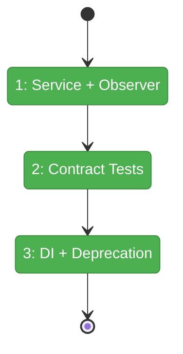
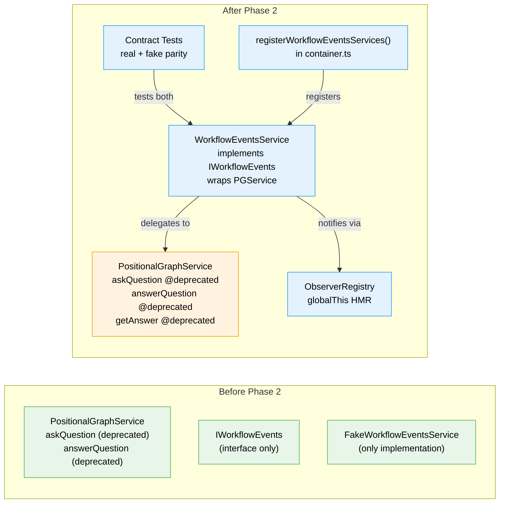

# Flight Plan: Phase 2 — Implementation and Contract Tests

**Plan**: [workflow-events-plan.md](../../workflow-events-plan.md)
**Phase**: Phase 2: Implementation and Contract Tests
**Generated**: 2026-03-01
**Status**: Landed

---

## Departure → Destination

**Where we are**: Phase 1 delivered the complete contract layer: IWorkflowEvents (9 methods), WorkflowEventType (7 constants), convenience types, FakeWorkflowEventsService, DI token, and domain docs. Everything is importable from `@chainglass/shared`. But there's no real implementation — the Fake is the only thing that satisfies the interface.

**Where we're going**: A developer can resolve `IWorkflowEvents` from the DI container and call `answerQuestion()` — it correctly handles the 3-event handshake, notifies server-side observers, and broadcasts via SSE. Contract tests prove the real implementation and Fake behave identically. PGService Q&A methods are marked deprecated.

---

## Domain Context

### Domains We're Changing

| Domain | What Changes | Key Files |
|--------|-------------|-----------|
| workflow-events | WorkflowEventsService implementation, observer registry | `packages/positional-graph/src/workflow-events/` |
| _platform/positional-graph | DI registration, @deprecated markers, barrel export | `container.ts`, `index.ts`, `positional-graph-service.interface.ts` |

### Domains We Depend On (no changes)

| Domain | What We Consume | Contract |
|--------|----------------|----------|
| _platform/positional-graph | askQuestion, answerQuestion, getAnswer, raiseNodeEvent | IPositionalGraphService |
| _platform/events | SSE broadcast | ICentralEventNotifier |
| workflow-events (Phase 1) | Interface, types, constants, fake, DI token | IWorkflowEvents, WorkflowEventType, etc. |

---

## Flight Status

**Legend**: grey = pending | yellow = active | red = blocked/needs input | green = done

---

## Stages

- [x] **Stage 1: Service implementation + observer registry**
- [x] **Stage 2: Contract tests**
- [x] **Stage 3: DI registration + deprecation**

---

## Architecture: Before & After

**Legend**: existing (green, unchanged) | changed (orange, modified) | new (blue, created)

---

## Acceptance Criteria

- [x] AC-02: WorkflowEventsService delegates to IPositionalGraphService
- [x] AC-03: answerQuestion() handles 3-event handshake in single call
- [x] AC-05: Contract tests pass for real + fake parity
- [x] AC-08: Server-side observers fire correctly
- [x] AC-09: Observer unsubscribe works

## Goals & Non-Goals

**Goals**: Real implementation wrapping PGService, observer registry with HMR survival, contract tests proving real/fake parity, DI registration, @deprecated markers
**Non-Goals**: Consumer migration (Phase 3), E2E updates (Phase 4), UI work

---

## Checklist

- [x] T001: Implement WorkflowEventsService: askQuestion, getAnswer, reportProgress, reportError
- [x] T002: Implement answerQuestion with 3-event handshake
- [x] T003: Implement observer registry with globalThis HMR survival
- [x] T004: Write contract test factory + runner
- [x] T005: Register via registerWorkflowEventsServices() in DI container
- [x] T006: (MOVED TO PHASE 3)
