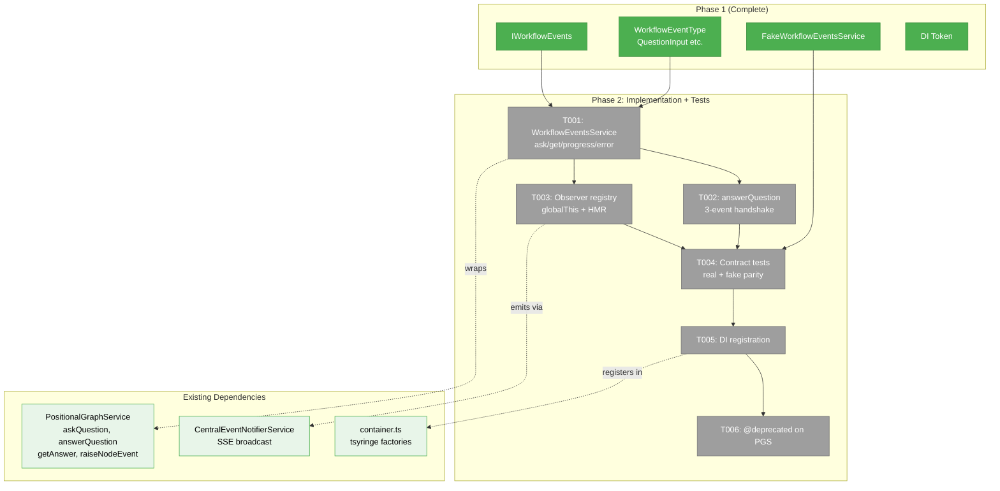
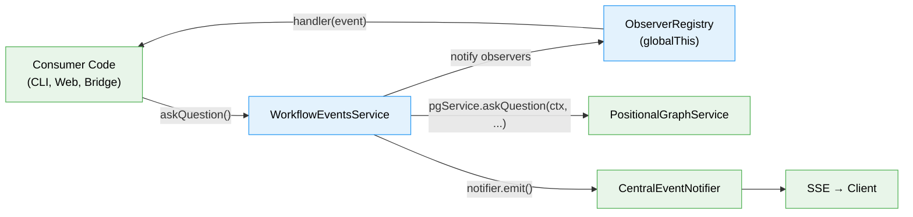
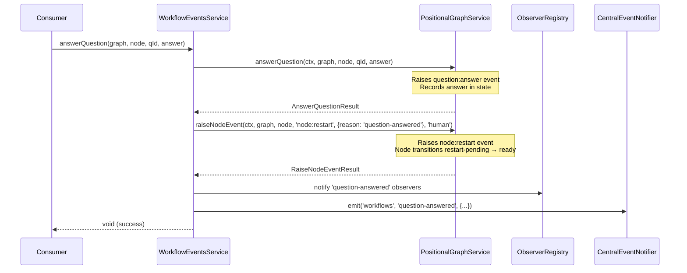

# Phase 2: Implementation and Contract Tests — Task Dossier

**Plan**: [workflow-events-plan.md](../../workflow-events-plan.md)
**Spec**: [workflow-events-spec.md](../../workflow-events-spec.md)
**Phase**: Phase 2 — Implementation and Contract Tests
**Domain**: workflow-events
**Status**: Ready

---

## Executive Briefing

**Purpose**: Build the WorkflowEventsService that implements IWorkflowEvents, wrapping IPositionalGraphService methods with convenience logic (3-event handshake, observer notifications). Add contract tests ensuring real + fake parity, register in DI, and mark PGService Q&A methods as deprecated.

**What We're Building**: A concrete service in packages/positional-graph that transforms intent-based calls (askQuestion, answerQuestion) into the raw event primitives the underlying system needs. Plus an observer registry that lets other domains react to workflow events without coupling to event infrastructure. Contract tests run the same suite against both WorkflowEventsService (real) and FakeWorkflowEventsService (fake).

**Goals**:
- ✅ WorkflowEventsService wrapping PGService for ask/answer/getAnswer/progress/error
- ✅ answerQuestion encapsulates 3-event handshake (question:answer + node:restart)
- ✅ Observer registry: onQuestionAsked, onQuestionAnswered, onProgress, onEvent with unsubscribe
- ✅ globalThis pattern for HMR survival of observer registry
- ✅ Contract test factory running against real + fake
- ✅ DI registration via registerWorkflowEventsServices()
- ✅ @deprecated on PGService askQuestion, answerQuestion, getAnswer

**Non-Goals**:
- ❌ Consumer migration (CLI, web, helpers) — Phase 3
- ❌ E2E test updates — Phase 4
- ❌ UI components — Plan 059

---

## Prior Phase Context

### Phase 1: Interface, Types, and Constants

**A. Deliverables**:
- `packages/shared/src/workflow-events/constants.ts` — WorkflowEventType (7 typed constants)
- `packages/shared/src/workflow-events/types.ts` — QuestionInput, AnswerInput, AnswerResult, ProgressInput, ErrorInput + observer event types
- `packages/shared/src/interfaces/workflow-events.interface.ts` — IWorkflowEvents (9 methods)
- `packages/shared/src/fakes/fake-workflow-events.ts` — FakeWorkflowEventsService with inspection methods
- `packages/shared/src/di-tokens.ts` — WORKFLOW_EVENTS_SERVICE token in POSITIONAL_GRAPH_DI_TOKENS
- `packages/shared/src/workflow-events/index.ts` — barrel export
- `packages/shared/package.json` — `./workflow-events` sub-path export
- `docs/domains/workflow-events/domain.md` — domain boundary, contracts, concepts table

**B. Dependencies Exported**:
- `IWorkflowEvents` interface: 5 actions (askQuestion, answerQuestion, getAnswer, reportProgress, reportError) + 4 observers (onQuestionAsked, onQuestionAnswered, onProgress, onEvent)
- `WorkflowEventType` constants: QuestionAsk, QuestionAnswer, NodeRestart, NodeAccepted, NodeCompleted, NodeError, ProgressUpdate
- Convenience types: QuestionInput, AnswerInput, AnswerResult, ProgressInput, ErrorInput
- Observer event types: QuestionAskedEvent, QuestionAnsweredEvent, ProgressEvent, WorkflowEvent
- `FakeWorkflowEventsService` with getAskedQuestions(), getAnswers(), getProgressReports(), getErrors(), getObserverCount(), getObserverCountFor(), reset()
- `POSITIONAL_GRAPH_DI_TOKENS.WORKFLOW_EVENTS_SERVICE = 'IWorkflowEvents'`

**C. Gotchas & Debt**:
- DYK-P1-01: `answerQuestion(answer: unknown)` not `AnswerInput` — existing callers pass raw values
- DYK-P1-02: Observer error isolation — try/catch per handler (already applied to Fake)
- DYK-P1-03: `WorkflowEvent.eventType` widened to `WorkflowEventTypeValue | string` for custom events
- DYK-P1-04: No dedicated `onError` observer — errors only via generic `onEvent`
- F001: ErrorInput.details widened to `unknown` (fixed in review)

**D. Incomplete Items**: None — Phase 1 fully complete and reviewed (APPROVE)

**E. Patterns to Follow**:
- Fake is self-contained (no FakePGService dependency) — real impl DOES wrap PGService
- Observer error isolation: try/catch per handler in notification loops
- Field names align with Zod .strict() schemas
- DI token pattern: SCREAMING_SNAKE_CASE, interface name as value

---

## Pre-Implementation Check

| File | Exists? | Domain Check | Notes |
|------|---------|-------------|-------|
| `packages/positional-graph/src/workflow-events/workflow-events.service.ts` | ❌ create | workflow-events | New file — wraps PGService |
| `packages/positional-graph/src/workflow-events/observer-registry.ts` | ❌ create | workflow-events | New file — globalThis pattern for HMR |
| `packages/positional-graph/src/workflow-events/index.ts` | ❌ create | workflow-events | New barrel |
| `packages/positional-graph/src/container.ts` | ✅ modify | _platform/positional-graph | Add registerWorkflowEventsServices() |
| `packages/positional-graph/src/index.ts` | ✅ modify | _platform/positional-graph | Export new registration function |
| `packages/positional-graph/src/interfaces/positional-graph-service.interface.ts` | ✅ modify | _platform/positional-graph | @deprecated on 3 methods |
| `test/contracts/workflow-events.contract.ts` | ❌ create | workflow-events | Contract test factory |
| `test/contracts/workflow-events.contract.test.ts` | ❌ create | workflow-events | Contract test runner |

All files in correct domain source trees. No concept duplication — WorkflowEventsService is deliberately wrapping PGService (confirmed in Phase 1 anti-reinvention check).

---

## Architecture Map



---

## Tasks

| Status | ID | Task | Domain | Path(s) | Done When | Notes |
|--------|-----|------|--------|---------|-----------|-------|
| [x] | T001 | Implement WorkflowEventsService: askQuestion, getAnswer, reportProgress, reportError using raiseNodeEvent() directly | workflow-events | `packages/positional-graph/src/workflow-events/workflow-events.service.ts` | 4 methods use raiseNodeEvent + direct state reads (NOT delegating to deprecated PGS methods), return typed results, notify observers | AC-02; DYK-P2-02: accept contextResolver; DYK-P2-03: NO CentralEventNotifier; DYK-P2-05: Q&A logic reimplemented here |
| [x] | T002 | Implement answerQuestion with 3-event handshake using raiseNodeEvent() directly | workflow-events | `packages/positional-graph/src/workflow-events/workflow-events.service.ts` | Single call raises question:answer + node:restart via raiseNodeEvent() | AC-03; Finding 02; DYK-P2-04: partial failure handling; DYK-P2-05: no PGS.answerQuestion delegation |
| [x] | T003 | Implement observer registry with globalThis HMR survival | workflow-events | `packages/positional-graph/src/workflow-events/observer-registry.ts` | subscribe/unsubscribe works; survives HMR; per-handler error isolation | AC-08, AC-09; Finding 06: use globalThis pattern |
| [x] | T004 | Write contract test factory + runner | workflow-events | `test/contracts/workflow-events.contract.ts`, `test/contracts/workflow-events.contract.test.ts` | Interface conformance tests (both impls): method signatures, return shapes, observer subscribe/unsubscribe. Behavioral cycle tests (Fake only): ask→answer→getAnswer flow. | AC-05; DYK-P2-01: split contract scope due to FakePGService limitations |
| [x] | T005 | Register via registerWorkflowEventsServices() in DI container | _platform/positional-graph | `packages/positional-graph/src/container.ts`, `packages/positional-graph/src/index.ts` | Container resolves IWorkflowEvents via WORKFLOW_EVENTS_SERVICE token | Q7; ADR-0009 naming; useFactory resolving PGService + contextResolver |
| [ ] | T006 | **MOVED TO PHASE 3** — Delete PGService Q&A methods after all consumers migrated | — | — | — | DYK-P2-05: Deletion deferred to end of Phase 3 (after CLI, web, helpers migrated). Phase 2 reimplements using raiseNodeEvent() but leaves PGS methods in place until consumers are updated. |

---

## Context Brief

### Key Findings from Plan

- **Finding 01 (Critical)**: PGService Q&A methods already @deprecated — WorkflowEvents wraps raiseNodeEvent() directly where possible, delegates to deprecated methods for backward compat state.questions[] writes
- **Finding 02 (Critical)**: 3-event QnA handshake (question:answer + node:restart) is ONLY done in web action today — CLI answer doesn't raise node:restart. WorkflowEvents.answerQuestion() fixes this gap.
- **Finding 06 (High)**: Observer hooks are in-memory and must survive HMR. Use globalThis pattern consistent with SSEManager, DI container.
- **Finding 08 (Medium)**: No circular dep risk — packages/shared has no dependency on positional-graph, and WorkflowEventsService lives in packages/positional-graph wrapping its own PGService.

### Domain Dependencies

- `_platform/positional-graph`: IPositionalGraphService (askQuestion, answerQuestion, getAnswer, raiseNodeEvent) — WorkflowEventsService wraps these
- `_platform/events`: ICentralEventNotifier (emit) — observer hooks broadcast via SSE for client visibility
- `workflow-events` (own domain, Phase 1): IWorkflowEvents interface, WorkflowEventType constants, convenience types, FakeWorkflowEventsService

### Domain Constraints

- WorkflowEventsService lives in `packages/positional-graph` (same package as PGService it wraps)
- Interface + types live in `packages/shared` (Phase 1, already done)
- No imports from `packages/positional-graph` into `packages/shared` (one-way dependency)
- DI registration function named `registerWorkflowEventsServices()` per ADR-0009
- Observer registry on `globalThis.__workflowEventObservers` for HMR survival

### Reusable from Phase 1

- All types and interface — import from `@chainglass/shared/workflow-events` and `@chainglass/shared`
- FakeWorkflowEventsService — used in contract test runner
- DI token — `POSITIONAL_GRAPH_DI_TOKENS.WORKFLOW_EVENTS_SERVICE`
- Observer error isolation pattern (try/catch per handler) — established in Fake

### Patterns to Follow

- **DI registration**: `useFactory` pattern, resolve prerequisites from container
- **Contract tests**: Factory function `() => new Implementation(deps)`, same suite runs real + fake
- **Observer registry**: Map<string, Set<Function>>, globalThis storage, per-handler try/catch
- **Service methods**: Accept clean params (graphSlug, nodeId, ...), internally construct WorkspaceContext and call PGService

### WorkspaceContext Resolution

WorkflowEventsService needs a WorkspaceContext for every PGService call. Options:
1. Accept it as constructor param (injected once at creation)
2. Accept a resolver function that produces it on demand
3. Create a minimal one internally

Research shows PGService methods need `WorkspaceContext` with `workspacePath`. The DI factory can resolve `IWorkspaceContextResolver` and pass the resolved context to WorkflowEventsService constructor.

### Data Flow



### Sequence: answerQuestion 3-Event Handshake



---

## Discoveries & Learnings

| Date | Task | Type | Discovery | Resolution | References |
|------|------|------|-----------|------------|------------|
| 2026-03-01 | T004 | DYK | FakePGService.getAnswer() always returns answered: false. Full Q&A cycle contract test fails for real impl backed by FakePGService. | Split contract: interface conformance (both impls) + behavioral cycle (Fake only). E2E covers real in Phase 4. | DYK-P2-01 |
| 2026-03-01 | T001 | DYK | IWorkflowEvents omits WorkspaceContext but PGService requires it on every call. Service must resolve it internally. | Accept `contextResolver: (graphSlug) => WorkspaceContext` in constructor. DI factory provides workspace registry resolver. Contract tests provide simple fake ctx. | DYK-P2-02 |
| 2026-03-01 | T001/T003 | DYK | PGService has ZERO calls to CentralEventNotifierService. WorkflowEventsService would be first to SSE-emit from positional-graph package. | Skip CentralEventNotifier in Phase 2. Observer registry sufficient for server-side. SSE emission added in Phase 3 when web actions migrate. | DYK-P2-03 |
| 2026-03-01 | T002 | DYK | answerQuestion does PGS.answerQuestion() + PGS.raiseNodeEvent(restart) as two separate calls. No atomicity — partial failure leaves answer recorded but node not restarted. | Wrap both in try. If restart fails after answer succeeds, still notify observers but rethrow with descriptive message. Don't rollback answer. | DYK-P2-04 |
| 2026-03-01 | T006 | DYK | PGService askQuestion/answerQuestion/getAnswer already have @deprecated from Plan 054. T006 just needs message update to "Use IWorkflowEvents instead". | **USER OVERRIDE**: Delete methods from IPositionalGraphService entirely. Reimplement Q&A logic in WorkflowEventsService using raiseNodeEvent() + direct state access. Bigger Phase 2, cleaner result. T001 scope increases. T006 becomes deletion task. Phase 3 consumer migration must also update all direct PGS Q&A callers to use WorkflowEvents. | DYK-P2-05 |

---

## Directory Layout

```
docs/plans/061-workflow-events/
  ├── workflow-events-plan.md
  ├── workflow-events-spec.md
  ├── research-dossier.md
  ├── workshops/
  │   └── 001-workflow-events-domain.md
  ├── reviews/
  │   ├── review.phase-1-interface-types-constants.md
  │   └── _computed.diff
  └── tasks/
      ├── phase-1-interface-types-constants/
      │   ├── tasks.md ✅
      │   ├── tasks.fltplan.md ✅
      │   └── execution.log.md ✅
      └── phase-2-implementation-contract-tests/
          ├── tasks.md              ← this file
          ├── tasks.fltplan.md      ← flight plan
          └── execution.log.md     # created by plan-6
```
