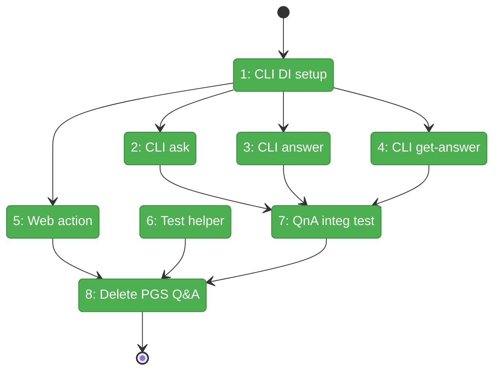
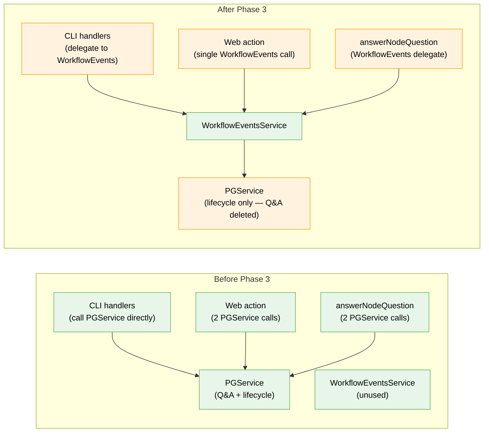

# Flight Plan: Phase 3 — Consumer Migration

**Plan**: [../../workflow-events-plan.md](../../workflow-events-plan.md)
**Phase**: Phase 3: Consumer Migration
**Generated**: 2026-03-01
**Status**: Landed

---

## Departure → Destination

**Where we are**: WorkflowEventsService exists (Phase 2), IWorkflowEvents interface defined (Phase 1), DI registration in place, contract tests pass (36 tests). But no consumer code actually uses it yet — CLI, web, and test helpers still call PGService Q&A methods directly. PGService Q&A methods are @deprecated but still present.

**Where we're going**: A developer can `cg wf node ask|answer|get-answer` and it routes through WorkflowEventsService. CLI answer now includes node:restart automatically (fixes correctness gap). Web answerQuestion is a single call. PGService Q&A methods are gone — WorkflowEventsService is the only way to do Q&A.

---

## Domain Context

### Domains We're Changing

| Domain | What Changes | Key Files |
|--------|-------------|-----------|
| _platform/positional-graph | CLI handlers migrate; PGService Q&A methods deleted; Q&A unit tests deleted | `apps/cli/src/commands/positional-graph.command.ts`, interface + service + tests |
| workflow-ui | Web answerQuestion action delegates to WorkflowEvents | `apps/web/app/actions/workflow-actions.ts` |
| workflow-events | Test helper answerNodeQuestion migrated; CLI integration test added | `dev/test-graphs/shared/helpers.ts`, `test/integration/.../cli-event-commands.test.ts` |

### Domains We Depend On (no changes)

| Domain | What We Consume | Contract |
|--------|----------------|----------|
| workflow-events | IWorkflowEvents (askQuestion, answerQuestion, getAnswer) | `@chainglass/shared` |
| workflow-events | WorkflowEventsService, registerWorkflowEventsServices | `@chainglass/positional-graph` |
| _platform/positional-graph | IPositionalGraphService.raiseNodeEvent (stays — only Q&A removed) | `@chainglass/positional-graph` |

---

## Flight Status

<!-- Updated by /plan-6-v2: pending → active → done. Use blocked for problems/input needed. -->

**Legend**: grey = pending | yellow = active | red = blocked/needs input | green = done

---

## Stages

<!-- Updated by /plan-6-v2 during implementation: [ ] → [~] → [x] -->

- [x] **Stage 1: CLI DI wiring** — Add `createWorkflowEventsService(ctx)` + WorkflowEventError class + update WorkflowEventsService throws (`errors.ts`, `positional-graph.command.ts`, `workflow-events.service.ts`)
- [x] **Stage 2: Migrate CLI ask** — Replace handleNodeAsk PGService call with WorkflowEvents.askQuestion() (`positional-graph.command.ts`)
- [x] **Stage 3: Migrate CLI answer** — Replace handleNodeAnswer PGService call with WorkflowEvents.answerQuestion() — fixes node:restart gap (`positional-graph.command.ts`)
- [x] **Stage 4: Migrate CLI get-answer** — Replace handleNodeGetAnswer PGService call with WorkflowEvents.getAnswer() (`positional-graph.command.ts`)
- [x] **Stage 5: Migrate web action** — Replace 2-call pattern with single WorkflowEvents.answerQuestion() (`workflow-actions.ts`)
- [x] **Stage 6: Migrate test helper** — answerNodeQuestion internally delegates to WorkflowEventsService (`helpers.ts`)
- [x] **Stage 7: QnA integration test** — 5 tests: full cycle, null answer, wrong state error, bad questionId error, choice round-trip (`cli-event-commands.test.ts`)
- [x] **Stage 8: Delete PGService Q&A** — Removed methods, types, 1 test file, trimmed wrapper contracts. 334 files, 4722 tests, 0 failures.

---

## Architecture: Before & After

**Legend**: existing (green, unchanged) | changed (orange, modified) | new (blue, created) | deleted (red)

---

## Acceptance Criteria

- [ ] AC-10: CLI handlers (handleNodeAsk, handleNodeAnswer, handleNodeGetAnswer) delegate to WorkflowEvents
- [ ] AC-11: Web server action answerQuestion() delegates to WorkflowEvents
- [ ] AC-12: Test helper answerNodeQuestion delegates to WorkflowEvents
- [ ] AC-17: CLI QnA integration test (ask → answer → get-answer cycle)
- [ ] AC-16: pnpm test passes (no regressions, baseline: 335 files, 4741 tests)
- [ ] PGService Q&A methods deleted from interface + implementation + fake

## Goals & Non-Goals

**Goals**:
- CLI/web/helpers use WorkflowEvents for Q&A
- CLI answer includes node:restart (Finding 02 fix)
- PGService Q&A cleanup — interface slimmed
- QnA integration test gap filled

**Non-Goals**:
- E2E test/script migration (Phase 4)
- CentralEventNotifier SSE integration
- Migrating non-Q&A helpers (completeUserInputNode, clearErrorAndRestart)

---

## Checklist

- [x] T001: Add createWorkflowEventsService(ctx) + WorkflowEventError + update service throws
- [x] T002: Migrate CLI handleNodeAsk to WorkflowEvents.askQuestion()
- [x] T003: Migrate CLI handleNodeAnswer to WorkflowEvents.answerQuestion()
- [x] T004: Migrate CLI handleNodeGetAnswer to WorkflowEvents.getAnswer()
- [x] T005: Migrate web answerQuestion action to WorkflowEvents
- [x] T006: Migrate test helper answerNodeQuestion to WorkflowEvents
- [x] T007: Add QnA CLI integration test (ask → answer → get-answer)
- [x] T008: Delete PGService Q&A methods + types + tests
