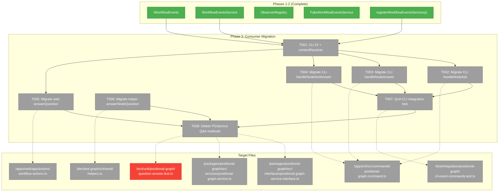
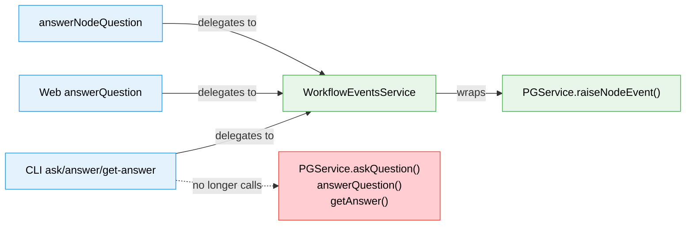
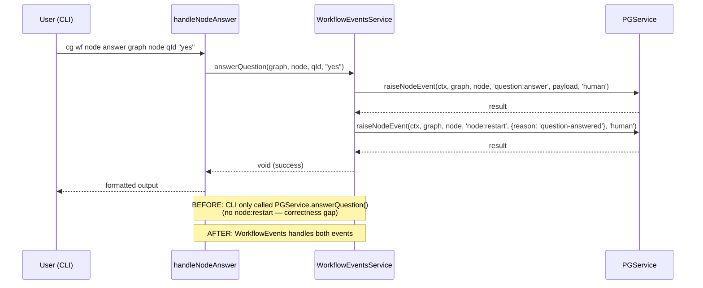

# Phase 3: Consumer Migration — Task Dossier

**Plan**: [workflow-events-plan.md](../../workflow-events-plan.md)
**Spec**: [workflow-events-spec.md](../../workflow-events-spec.md)
**Phase**: Phase 3 — Consumer Migration
**Domain**: workflow-events + consumers
**Status**: Ready

---

## Executive Briefing

**Purpose**: Migrate all consumers (CLI commands, web server actions, test helpers) from direct PGService Q&A calls to the WorkflowEventsService convenience API, then delete the deprecated PGService Q&A methods. This phase is the "payoff" — callers finally express intent instead of orchestrating raw event primitives.

**What We're Building**: CLI handlers (ask/answer/get-answer) delegate to IWorkflowEvents instead of IPositionalGraphService. Web answerQuestion action becomes a single `wfEvents.answerQuestion()` call (replacing 2 separate PGService calls). Test helper `answerNodeQuestion` delegates to WorkflowEvents. A new QnA CLI integration test fills the gap identified in research. Finally, we delete askQuestion/answerQuestion/getAnswer from IPositionalGraphService and their associated unit tests.

**Goals**:
- ✅ CLI `cg wf node ask|answer|get-answer` delegates to IWorkflowEvents
- ✅ CLI answer now includes node:restart (fixes correctness gap — Finding 02)
- ✅ Web answerQuestion action becomes single WorkflowEvents call
- ✅ Test helper `answerNodeQuestion` delegates to WorkflowEvents
- ✅ QnA CLI integration test covering ask → answer → get-answer cycle
- ✅ PGService Q&A methods deleted from interface + implementation + FakePGService
- ✅ Associated Q&A unit tests removed or adapted

**Non-Goals**:
- ❌ E2E test/script updates — Phase 4
- ❌ Migrating `completeUserInputNode` or `clearErrorAndRestart` — these use PGService node lifecycle methods (startNode, endNode, raiseNodeEvent), not Q&A. They remain on PGService.
- ❌ Migrating `workgraph.command.ts` `getAnswer` call — uses `IWorkNodeService`, not PGService directly
- ❌ CentralEventNotifier SSE integration — deferred (DYK-P2-03)

---

## Prior Phase Context

### Phase 1: Interface, Types, and Constants

**A. Deliverables**:
- `packages/shared/src/workflow-events/constants.ts` — WorkflowEventType (7 typed constants)
- `packages/shared/src/workflow-events/types.ts` — QuestionInput, AnswerInput, AnswerResult, ProgressInput, ErrorInput + observer event types
- `packages/shared/src/interfaces/workflow-events.interface.ts` — IWorkflowEvents (9 methods)
- `packages/shared/src/fakes/fake-workflow-events.ts` — FakeWorkflowEventsService
- `packages/shared/src/di-tokens.ts` — WORKFLOW_EVENTS_SERVICE token
- `docs/domains/workflow-events/domain.md` — domain boundary, contracts, concepts

**B. Dependencies Exported**:
- `IWorkflowEvents` interface: 5 actions + 4 observers
- `WorkflowEventType` constants: 7 typed event type constants
- `QuestionInput`, `AnswerInput`, `AnswerResult`, `ProgressInput`, `ErrorInput`
- `FakeWorkflowEventsService` with inspection methods
- `POSITIONAL_GRAPH_DI_TOKENS.WORKFLOW_EVENTS_SERVICE`

**C. Gotchas & Debt**:
- DYK-P1-01: `answerQuestion(answer: unknown)` not `AnswerInput` — callers pass raw values
- DYK-P1-03: `WorkflowEvent.eventType` widened to `WorkflowEventTypeValue | string`
- No dedicated `onError` observer (DYK-P1-04)

**D. Incomplete Items**: None — fully complete and reviewed (APPROVE)

**E. Patterns to Follow**:
- Import types from `@chainglass/shared/workflow-events` and `@chainglass/shared`
- DI token: `POSITIONAL_GRAPH_DI_TOKENS.WORKFLOW_EVENTS_SERVICE`
- Field names align with Zod .strict() schemas

### Phase 2: Implementation and Contract Tests

**A. Deliverables**:
- `packages/positional-graph/src/workflow-events/workflow-events.service.ts` — WorkflowEventsService (~320 lines)
- `packages/positional-graph/src/workflow-events/observer-registry.ts` — globalThis-backed registry
- `packages/positional-graph/src/workflow-events/index.ts` — barrel exports
- `packages/positional-graph/src/container.ts` — `registerWorkflowEventsServices(container, contextResolver)`
- `test/contracts/workflow-events.contract.ts` — contract test factory (36 tests)
- `test/contracts/workflow-events.contract.test.ts` — contract test runner

**B. Dependencies Exported**:
- `WorkflowEventsService` class — wraps PGService.raiseNodeEvent() + loadGraphState/persistGraphState
- `WorkflowEventObserverRegistry` — globalThis-backed, HMR-surviving
- `registerWorkflowEventsServices(container, contextResolver)` — DI registration function
- `WorkspaceContextResolver` type — `(graphSlug: string) => WorkspaceContext`
- All exported from `@chainglass/positional-graph` barrel

**C. Gotchas & Debt**:
- DYK-P2-01: FakePGService.getAnswer() always returns `answered: false` — can't test full QnA cycle through real WorkflowEventsService
- DYK-P2-02: WorkflowEventsService needs `contextResolver` — each environment (CLI, web, test) provides its own
- DYK-P2-03: CentralEventNotifier SSE deferred to later — observer registry is server-side only
- DYK-P2-04: answerQuestion partial failure: if restart fails after answer recorded, notifies observers then rethrows
- T006 moved to Phase 3: Delete PGService Q&A methods after consumers migrated

**D. Incomplete Items**: T006 (PGService deletion) — deferred to this phase

**E. Patterns to Follow**:
- Observer error isolation: try/catch per handler in notification loops
- DI: `useFactory` pattern, resolve prerequisites from container
- WorkflowEventsService takes `(pgService, contextResolver, observers)` constructor
- Contract tests: factory function producing implementation, same suite for both real + fake
- Package aliases: `@chainglass/shared`, `@chainglass/shared/workflow-events`

---

## Pre-Implementation Check

| File | Exists? | Domain Check | Notes |
|------|---------|-------------|-------|
| `apps/cli/src/commands/positional-graph.command.ts` | ✅ modify | _platform/positional-graph | Modify handlers at lines 887-983 + add getWorkflowEventsService() helper |
| `apps/web/app/actions/workflow-actions.ts` | ✅ modify | workflow-ui | Modify answerQuestion at lines 416-445 |
| `dev/test-graphs/shared/helpers.ts` | ✅ modify | workflow-events | Modify answerNodeQuestion at lines 93-110 |
| `test/integration/positional-graph/cli-event-commands.test.ts` | ✅ modify | workflow-events | Add QnA integration test section |
| `packages/positional-graph/src/interfaces/positional-graph-service.interface.ts` | ✅ modify | _platform/positional-graph | Delete Q&A methods (lines 746-772) + types (lines 469-497) |
| `packages/positional-graph/src/services/positional-graph.service.ts` | ✅ modify | _platform/positional-graph | Delete askQuestion/answerQuestion/getAnswer implementations |
| `packages/shared/src/fakes/fake-positional-graph.service.ts` | ✅ modify | _platform/positional-graph | Delete Q&A stubs |
| `test/unit/positional-graph/question-answer.test.ts` | ✅ delete | _platform/positional-graph | Entire file tests deleted PGService methods |
| `test/unit/positional-graph/features/032-node-event-system/service-wrapper-contracts.test.ts` | ✅ modify | _platform/positional-graph | Remove askQuestion/answerQuestion sections (lines 149-260) |
| `apps/cli/src/lib/container.ts` | ✅ modify | _platform/positional-graph | Ensure registerWorkflowEventsServices() called with CLI contextResolver |

### Key Migration Discovery

**CLI contextResolver pattern**: The CLI handlers use `resolveOrOverrideContext(options.workspacePath)` to support `--workspace-path` override. WorkflowEventsService resolves context internally via `contextResolver(graphSlug)`. The CLI's DI container registration must provide a contextResolver that uses the correct workspace path. Since `createCliProductionContainer()` is called per handler, the contextResolver at registration time needs to use the CLI's default workspace resolution.

**Test helper partial migration**: Only `answerNodeQuestion` is Q&A-related and migratable. `completeUserInputNode` uses `startNode/raiseNodeEvent/saveOutputData/endNode` (node lifecycle — not Q&A). `clearErrorAndRestart` uses `raiseNodeEvent('node:restart')` (generic event — not Q&A). These stay on PGService.

**workgraph.command.ts**: Has 1 `getAnswer` call but uses `IWorkNodeService`, not PGService. NOT affected by PGService deletion. Different interface, different domain.

---

## Architecture Map



---

## Tasks

| Status | ID | Task | Domain | Path(s) | Done When | Notes |
|--------|-----|------|--------|---------|-----------|-------|
| [x] | T001 | Add per-request WorkflowEventsService construction helper in CLI. Create `WorkflowEventError` custom error class in `packages/shared/src/workflow-events/errors.ts` preserving original errors array. Update WorkflowEventsService to throw WorkflowEventError instead of plain Error. DYK-P3-01: construct per-request (not DI) — resolve PGService from DI, closure contextResolver over resolved ctx. DYK-P3-02: custom error class preserves structured errors for CLI --json output. | workflow-events + _platform/positional-graph | `apps/cli/src/commands/positional-graph.command.ts`, `packages/shared/src/workflow-events/errors.ts`, `packages/positional-graph/src/workflow-events/workflow-events.service.ts` | `createWorkflowEventsService(ctx)` helper in CLI constructs per-request; `WorkflowEventError.errors` preserves structured error array; WorkflowEventsService throws WorkflowEventError not plain Error | DYK-P3-01, DYK-P3-02. DI registration stays for future agents bridge. |
| [x] | T002 | Migrate `handleNodeAsk` (lines 887-930) to use `wfEvents.askQuestion()`. Replace PGService call with WorkflowEvents. Adjust error handling (WorkflowEventsService throws on error, PGService returns result with errors array). | workflow-events | `apps/cli/src/commands/positional-graph.command.ts` | `cg wf node ask` works identically; uses IWorkflowEvents not IPositionalGraphService | AC-10; WorkflowEvents.askQuestion throws on error (try/catch needed). QuestionInput maps from CLI's AskOptions. |
| [x] | T003 | Migrate `handleNodeAnswer` (lines 932-961) to use `wfEvents.answerQuestion()`. Single call replaces PGService.answerQuestion(). Fixes Finding 02: CLI answer now includes node:restart automatically. | workflow-events | `apps/cli/src/commands/positional-graph.command.ts` | `cg wf node answer` works identically + now raises node:restart. Uses IWorkflowEvents. | AC-10; Finding 02 — correctness fix. WorkflowEvents.answerQuestion throws on error. JSON parse logic stays. |
| [x] | T004 | Migrate `handleNodeGetAnswer` (lines 963-983) to use `wfEvents.getAnswer()`. Replace PGService.getAnswer() with WorkflowEvents.getAnswer(). | workflow-events | `apps/cli/src/commands/positional-graph.command.ts` | `cg wf node get-answer` works identically; uses IWorkflowEvents | AC-10; Return type differs: WorkflowEvents returns `AnswerResult \| null` vs PGService returns `GetAnswerResult`. Adapt output format. |
| [x] | T005 | Migrate web `answerQuestion` action (lines 416-445) to use `wfEvents.answerQuestion()`. Replace 2 PGService calls (answer + raiseNodeEvent restart) with single WorkflowEvents call. Resolve WorkflowEvents from web DI container. | workflow-ui | `apps/web/app/actions/workflow-actions.ts` | Server action uses single WorkflowEvents.answerQuestion() call | AC-11; Currently does 2 calls (answer + restart). WorkflowEvents does both in 1. Check web container calls registerWorkflowEventsServices(). |
| [x] | T006 | Migrate `answerNodeQuestion` helper — internally constructs WorkflowEventsService from PGService+ctx. Signature unchanged to avoid breaking 37 importers. `completeUserInputNode` and `clearErrorAndRestart` stay on PGService (non-Q&A lifecycle ops). | workflow-events | `dev/test-graphs/shared/helpers.ts` | `answerNodeQuestion` internally delegates to WorkflowEventsService; build passes; callers unchanged | AC-12; DYK-P3-03 resolved: helper is migration boundary, TypeScript enforces types at callsites. |
| [x] | T007 | Add QnA CLI integration test: ask → answer → get-answer cycle through WorkflowEventsService. Add error scenario tests: ask on wrong-state node, answer with bad questionId. Assert node state transitions (waiting-question → not waiting-question after answer). 5 new tests in `cli-event-commands.test.ts`. | workflow-events | `test/integration/positional-graph/cli-event-commands.test.ts` | Happy path ask→answer→get-answer cycle passes; error scenarios verified; node no longer waiting-question after answer (DYK-P3-05) | AC-17; DYK-P3-04: error coverage; DYK-P3-05: behavioral change asserted |
| [x] | T008 | Delete PGService Q&A methods: removed `askQuestion`, `answerQuestion`, `getAnswer` from `IPositionalGraphService` interface + `PositionalGraphService` implementation + `FakePositionalGraphService`. Deleted `AskQuestionOptions`, `AskQuestionResult`, `AnswerQuestionResult`, `GetAnswerResult` types. Deleted `test/unit/positional-graph/question-answer.test.ts`. Removed Q&A sections from `service-wrapper-contracts.test.ts`. Cleaned unused imports. 334 files pass, 4722 tests, 0 failures. | _platform/positional-graph | `packages/positional-graph/src/interfaces/positional-graph-service.interface.ts`, `packages/positional-graph/src/services/positional-graph.service.ts`, `packages/positional-graph/src/fakes/fake-positional-graph-service.ts`, `test/unit/positional-graph/question-answer.test.ts` (deleted), `test/unit/positional-graph/features/032-node-event-system/service-wrapper-contracts.test.ts` | Build passes; tests pass; Q&A methods gone from PGService interface | Phase 2 T006 (moved); DYK-P2-05. |

---

## Context Brief

### Key Findings from Plan

- **Finding 02 (Critical)**: CLI answer doesn't raise node:restart — WorkflowEvents.answerQuestion() fixes this. After migration, CLI answer includes the restart automatically.
- **Finding 03 (High)**: Test helpers already import from @chainglass/positional-graph — same import pattern. Migration path is clean.
- **Finding 07 (High)**: positional-graph.command.ts is 2,358 lines. Target handlers are lines 887-983 (~95 lines). Safe, isolated section.

### Domain Dependencies

- `workflow-events`: IWorkflowEvents (askQuestion, answerQuestion, getAnswer) — the convenience API we migrate TO
- `_platform/positional-graph`: IPositionalGraphService (raiseNodeEvent, loadGraphState — used internally by WorkflowEventsService, no longer called directly by consumers for Q&A)
- `workflow-ui`: Web server actions — consumer of IWorkflowEvents after migration

### Domain Constraints

- CLI command file stays in `apps/cli/` — it's a consumer, not a domain source file
- Web action stays in `apps/web/` — consumer layer
- Test helper in `dev/test-graphs/shared/` — cross-domain utility
- PGService interface modification is in `_platform/positional-graph` domain
- All imports use package aliases: `@chainglass/shared`, `@chainglass/positional-graph`

### Reusable from Prior Phases

- `IWorkflowEvents` interface — import from `@chainglass/shared`
- `POSITIONAL_GRAPH_DI_TOKENS.WORKFLOW_EVENTS_SERVICE` — DI token
- `WorkflowEventsService` — resolves from DI container
- `registerWorkflowEventsServices(container, contextResolver)` — call in CLI/web container setup
- `QuestionInput`, `AnswerResult` types — from `@chainglass/shared/workflow-events`
- CLI DI pattern: `createCliProductionContainer()` → `container.resolve<T>(TOKEN)`
- Contract tests (36 tests) — verify WorkflowEventsService still works after changes

### Migration Pattern Summary

**CLI handler migration** (T002-T004):
```typescript
// BEFORE (PGService direct)
const service = getPositionalGraphService();
const result = await service.askQuestion(ctx, graphSlug, nodeId, askOptions);
console.log(adapter.format('wf.node.ask', result));

// AFTER (WorkflowEvents)
const wfEvents = getWorkflowEventsService();
const result = await wfEvents.askQuestion(graphSlug, nodeId, question);
console.log(adapter.format('wf.node.ask', { questionId: result.questionId, errors: [] }));
```

**Web action migration** (T005):
```typescript
// BEFORE (2 PGService calls)
const answerResult = await svc.answerQuestion(ctx, graphSlug, nodeId, questionId, answer);
const restartResult = await svc.raiseNodeEvent(ctx, graphSlug, nodeId, 'node:restart', ...);

// AFTER (single WorkflowEvents call)
await wfEvents.answerQuestion(graphSlug, nodeId, questionId, answer);
```

**Test helper migration** (T006):
```typescript
// BEFORE (PGService + manual restart)
await service.answerQuestion(ctx, graphSlug, nodeId, questionId, answer);
await service.raiseNodeEvent(ctx, graphSlug, nodeId, 'node:restart', ...);

// AFTER (WorkflowEvents — single call)
await wfEvents.answerQuestion(graphSlug, nodeId, questionId, answer);
```

### Error Handling Differences

| | PGService | WorkflowEventsService |
|---|---|---|
| askQuestion | Returns `{ errors: [], questionId? }` | Throws on error; returns `{ questionId }` |
| answerQuestion | Returns `{ errors: [] }` | Throws on error; returns `void` |
| getAnswer | Returns `{ errors: [], answered, answer? }` | Returns `AnswerResult \| null` |

CLI handlers currently check `result.errors.length > 0` then `process.exit(1)`. After migration, they need `try/catch` blocks instead.

### Data Flow: After Migration



### Sequence: CLI Answer Migration (Finding 02 Fix)



---

## Discoveries & Learnings

| Date | Task | Type | Discovery | Resolution | References |
|------|------|------|-----------|------------|------------|
| 2026-03-01 | T001 | DYK | contextResolver is fixed at construction time but CLI and web resolve context per-request with different parameters (--workspace-path flag, async workspaceSlug). DI-resolved instance can't honor per-request overrides. | Construct WorkflowEventsService per-request: resolve PGService from DI, create closure contextResolver over already-resolved ctx, fresh observers. DI registration stays for future server-side consumers (agents bridge). | DYK-P3-01 |
| 2026-03-01 | T002-T004 | DYK | PGService returns `{ errors: [{code, message, action}] }` formatted by adapter.format(). WorkflowEventsService throws Error with message string. CLI --json output format breaks. | Add WorkflowEventError custom error class preserving original errors array. CLI catch blocks extract structured errors for adapter.format(). Small addition: one class in workflow-events types. | DYK-P3-02 |
| 2026-03-01 | T006 | DYK | Changing answerNodeQuestion signature from `(service: IPositionalGraphService, ctx, ...)` to `(wfEvents: IWorkflowEvents, ...)` breaks all callers — 37 files import from helpers.ts. Build breaks between Phase 3 and Phase 4 if callers not updated. | **USER OVERRIDE**: Clean break — change signature, update all answerNodeQuestion callers in Phase 3. Let TypeScript catch every callsite. Keeping backward-compat shim hides bugs where wrong service/context is passed. Phase 3 scope expands to include caller updates. | DYK-P3-03 |
| 2026-03-01 | T008 | DYK | question-answer.test.ts has 17 tests verifying error codes (E176, E173, E195, E153). After deletion, no test verifies error paths through WorkflowEventsService. Contract tests only cover happy paths. | Add 3-4 error scenario tests in T007: ask on wrong-state node, answer with bad questionId, answer already-answered question. Verify errors survive migration as thrown exceptions. | DYK-P3-04 |
| 2026-03-01 | T003 | DYK | `cg wf node answer` currently only records answer (node stays waiting-question). After migration, also raises node:restart (node auto-transitions). Behavioral change for existing scripts/workflows. | Desired fix (Finding 02). Document in commit message. T007 must assert node is no longer waiting-question after answerQuestion — make behavioral change a tested contract. | DYK-P3-05 |

---

## Directory Layout

```
docs/plans/061-workflow-events/
  ├── workflow-events-plan.md
  ├── workflow-events-spec.md
  ├── research-dossier.md
  ├── workshops/
  │   └── 001-workflow-events-domain.md
  ├── reviews/
  │   ├── review.phase-1-interface-types-constants.md
  │   ├── review.phase-2-implementation-contract-tests.md
  │   └── _computed.diff
  └── tasks/
      ├── phase-1-interface-types-constants/
      │   ├── tasks.md ✅
      │   ├── tasks.fltplan.md ✅
      │   └── execution.log.md ✅
      ├── phase-2-implementation-contract-tests/
      │   ├── tasks.md ✅
      │   ├── tasks.fltplan.md ✅
      │   └── execution.log.md ✅
      └── phase-3-consumer-migration/
          ├── tasks.md              ← this file
          ├── tasks.fltplan.md      ← flight plan
          └── execution.log.md     # created by plan-6
```
