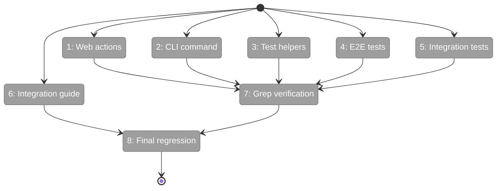

# Flight Plan: Phase 4 — E2E Test Updates and Documentation

**Plan**: [../../workflow-events-plan.md](../../workflow-events-plan.md)
**Phase**: Phase 4: E2E Test Updates and Documentation
**Generated**: 2026-03-01
**Status**: Ready for takeoff

---

## Departure → Destination

**Where we are**: WorkflowEventsService is live — CLI, web, and helpers all delegate to it (Phase 3). But consumer code still uses magic strings like `'question:ask'` instead of `WorkflowEventType.QuestionAsk`. No integration guide exists.

**Where we're going**: Zero magic event strings in consumer code. A clean integration guide. All tests pass. Plan 061 complete.

---

## Flight Status

**Legend**: grey = pending | yellow = active | green = done

---

## Stages

- [ ] **Stage 1: Web actions** — Replace `'node:accepted'`, `'node:restart'` in workflow-actions.ts
- [ ] **Stage 2: CLI command** — Replace magic strings in positional-graph.command.ts raiseNodeEvent calls
- [ ] **Stage 3: Test helpers** — Replace `'node:accepted'`, `'node:restart'` in helpers.ts
- [ ] **Stage 4: E2E tests** — Replace programmatic magic strings in 3 E2E files (careful: CLI args stay as strings)
- [ ] **Stage 5: Integration tests** — Replace `'question:ask'` in orchestration-drive.test.ts
- [ ] **Stage 6: Integration guide** — Write docs/how/workflow-events-integration.md
- [ ] **Stage 7: Grep verification** — Zero magic strings in consumer code
- [ ] **Stage 8: Final regression** — pnpm test passes (334+ files, 4722+ tests)

---

## Checklist

- [ ] T001: Replace magic strings in web actions
- [ ] T002: Replace magic strings in CLI command
- [ ] T003: Replace magic strings in test helpers
- [ ] T004: Replace magic strings in E2E tests
- [ ] T005: Replace magic strings in integration tests
- [ ] T006: Write integration guide
- [ ] T007: Grep verification pass
- [ ] T008: Final regression check
