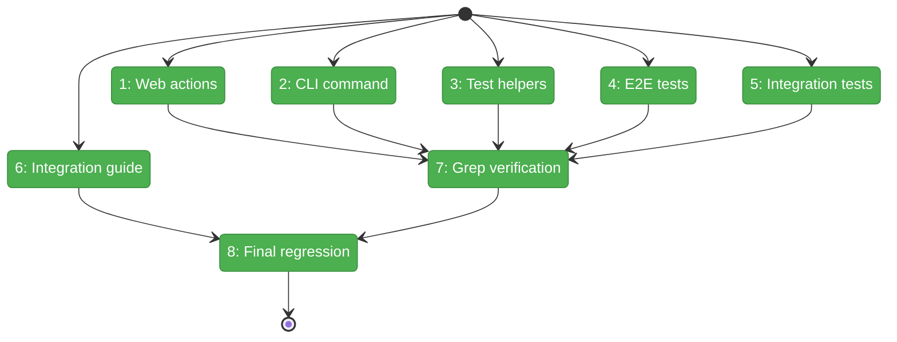

# Flight Plan: Phase 4 — E2E Test Updates and Documentation

**Plan**: [../../workflow-events-plan.md](../../workflow-events-plan.md)
**Phase**: Phase 4: E2E Test Updates and Documentation
**Generated**: 2026-03-01
**Status**: Landed

---

## Departure → Destination

**Where we are**: WorkflowEventsService is live — CLI, web, and helpers all delegate to it (Phase 3). But consumer code still uses magic strings like `'question:ask'` instead of `WorkflowEventType.QuestionAsk`. No integration guide exists.

**Where we're going**: Zero magic event strings in consumer code. A clean integration guide. All tests pass. Plan 061 complete.

---

## Flight Status

**Legend**: grey = pending | yellow = active | green = done

---

## Stages

- [x] **Stage 1: Web actions** — Replaced `'node:accepted'`, `'node:restart'` with WorkflowEventType constants
- [x] **Stage 2: CLI command** — Replaced `'node:accepted'`, `'node:error'` with WorkflowEventType constants
- [x] **Stage 3: Test helpers** — Replaced `'node:accepted'`, `'node:restart'` with WorkflowEventType constants
- [x] **Stage 4: E2E tests** — All E2E strings are CLI subprocess args — correctly kept as plain strings (DYK-P4-01)
- [x] **Stage 5: Integration tests** — Replaced `'question:ask'` in orchestration-drive.test.ts + `'node:accepted'` in inspect-cli.test.ts
- [x] **Stage 6: Integration guide** — Written at docs/how/workflow-events-integration.md
- [x] **Stage 7: Grep verification** — Zero consumer hits outside infra/E2E CLI args
- [x] **Stage 8: Final regression** — 338 files, 4783 tests, 0 failures

---

## Checklist

- [x] T001: Replace magic strings in web actions
- [x] T002: Replace magic strings in CLI command
- [x] T003: Replace magic strings in test helpers
- [x] T004: Replace magic strings in E2E tests (all CLI args — kept as strings per DYK-P4-01)
- [x] T005: Replace magic strings in integration tests
- [x] T006: Write integration guide
- [x] T007: Grep verification pass
- [x] T008: Final regression check
