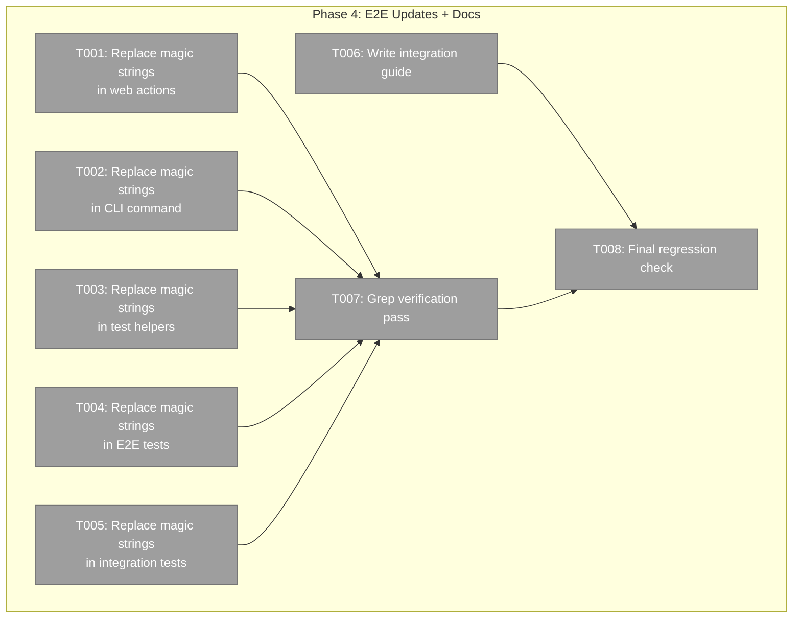

# Phase 4: E2E Test Updates and Documentation — Task Dossier

**Plan**: [workflow-events-plan.md](../../workflow-events-plan.md)
**Spec**: [workflow-events-spec.md](../../workflow-events-spec.md)
**Phase**: Phase 4 — E2E Test Updates and Documentation
**Domain**: workflow-events
**Status**: Ready

---

## Executive Briefing

**Purpose**: Replace magic event strings with `WorkflowEventType` typed constants across all consumer code (E2E tests, scripts, CLI, web, helpers). Write the integration guide. Final regression check. This phase is the "polish" — the system works, now we make it consistent and documented.

**What We're Building**: No new functionality. We're replacing `'question:ask'` → `WorkflowEventType.QuestionAsk` everywhere outside positional-graph internals, writing `docs/how/workflow-events-integration.md`, and verifying everything still passes.

**Goals**:
- Replace magic event strings with WorkflowEventType constants in all consumer code
- Write integration guide for consuming domains
- Final regression: all tests pass

**Non-Goals**:
- Replacing strings inside positional-graph core event system (those are the canonical definitions)
- Adding new functionality
- Migrating completeUserInputNode/clearErrorAndRestart (non-Q&A lifecycle — stay on PGService)

---

## Prior Phase Context

### Phases 1-3 Summary

**Delivered**:
- IWorkflowEvents interface, WorkflowEventType constants, convenience types (Phase 1)
- WorkflowEventsService, observer registry, contract tests (Phase 2)
- CLI/web/helper migration, WorkflowEventError, PGService Q&A deletion, QnA integration tests (Phase 3)

**Available for Phase 4**:
- `WorkflowEventType.QuestionAsk`, `.QuestionAnswer`, `.NodeRestart`, `.NodeAccepted`, `.NodeCompleted`, `.NodeError`, `.ProgressUpdate` — import from `@chainglass/shared/workflow-events`
- `WorkflowEventError` — structured error class
- All consumers already delegate Q&A to WorkflowEventsService

**Test baseline**: 334 files, 4722 tests, 0 failures

---

## Pre-Implementation Check

### Magic strings to replace (consumer code only)

| File | String | Line(s) | Context |
|------|--------|---------|---------|
| `apps/web/app/actions/workflow-actions.ts` | `'node:accepted'` | ~520+ | submitUserInput action |
| `apps/web/app/actions/workflow-actions.ts` | `'node:restart'` | ~580+ | resetUserInput action |
| `apps/cli/src/commands/positional-graph.command.ts` | `'node:accepted'` | event handler section | raiseNodeEvent calls |
| `dev/test-graphs/shared/helpers.ts` | `'node:restart'` | clearErrorAndRestart | raiseNodeEvent call |
| `dev/test-graphs/shared/helpers.ts` | `'node:accepted'` | completeUserInputNode | raiseNodeEvent call |
| `test/e2e/positional-graph-orchestration-e2e.ts` | `'question:ask'`, `'question:answer'` | event filtering | CLI-based, may be in grep/filter strings |
| `test/e2e/node-event-system-visual-e2e.ts` | `'question:ask'`, `'progress:update'`, `'node:accepted'`, `'question:answer'`, `'node:restart'` | Multiple | Event type assertions and filters |
| `test/integration/orchestration-drive.test.ts` | `'question:ask'` | ~402 | Event type filtering |

### Files that should NOT change

| File | Why |
|------|-----|
| `packages/positional-graph/src/features/032-node-event-system/*` | Core event definitions — the canonical source of truth |
| `packages/positional-graph/src/services/positional-graph.service.ts` | Internal implementation |
| Unit tests for event system features | Test the internal event infrastructure |

---

## Architecture Map



---

## Tasks

| Status | ID | Task | Domain | Path(s) | Done When | Notes |
|--------|-----|------|--------|---------|-----------|-------|
| [ ] | T001 | Replace magic event strings in web actions with WorkflowEventType constants. `submitUserInput` uses `'node:accepted'`, `resetUserInput` uses `'node:restart'`. | workflow-ui | `apps/web/app/actions/workflow-actions.ts` | No magic event strings in file; imports WorkflowEventType | AC-06 |
| [ ] | T002 | Replace magic event strings in CLI command with WorkflowEventType constants. Various handlers use `'node:accepted'` etc. in raiseNodeEvent calls. | _platform/positional-graph | `apps/cli/src/commands/positional-graph.command.ts` | No magic event strings in file; imports WorkflowEventType | AC-06 |
| [ ] | T003 | Replace magic event strings in test helpers. `completeUserInputNode` uses `'node:accepted'`, `clearErrorAndRestart` uses `'node:restart'`. | workflow-events | `dev/test-graphs/shared/helpers.ts` | No magic event strings in file | AC-06 |
| [ ] | T004 | Replace magic event strings in E2E tests. `positional-graph-orchestration-e2e.ts` and `node-event-system-visual-e2e.ts` use `'question:ask'`, `'question:answer'`, `'progress:update'` etc. in event filtering and assertions. Note: some may be CLI command args (strings passed to subprocess) — those stay as strings. Only replace programmatic usage. | workflow-events | `test/e2e/positional-graph-orchestration-e2e.ts`, `test/e2e/node-event-system-visual-e2e.ts`, `test/e2e/positional-graph-execution-e2e.test.ts` | Magic strings replaced where programmatic; CLI arg strings may stay | AC-13 |
| [ ] | T005 | Replace magic event strings in integration tests. `orchestration-drive.test.ts` uses `'question:ask'` in event filtering. | workflow-events | `test/integration/orchestration-drive.test.ts` | No magic event strings in programmatic usage | AC-13 |
| [ ] | T006 | Write `docs/how/workflow-events-integration.md`. Cover: asking questions, answering (3-event handshake), getting answers, reporting progress/errors, observing events, typed constants reference, migration guide from PGService. | workflow-events | `docs/how/workflow-events-integration.md` | Guide exists with all sections; code examples use WorkflowEventType constants | AC-17 docs |
| [ ] | T007 | Grep verification pass: `grep -rn "'question:ask'\|'question:answer'\|'node:restart'\|'node:error'\|'progress:update'" --include="*.ts"` in source (not docs) returns 0 hits outside positional-graph internals and core event type definitions. | workflow-events | Codebase-wide | Grep returns 0 consumer hits | AC-06 verification |
| [ ] | T008 | Final regression check: `pnpm test`. Verify baseline maintained. | workflow-events | — | 334+ files pass, 4722+ tests, 0 failures | AC-16 |

---

## Context Brief

### Key Findings

- **E2E tests are CLI-driven**: Many magic strings are in CLI subprocess args (`runCli(['wf', 'node', 'event', 'raise', graphSlug, nodeId, 'question:ask', ...])`). These are string arguments to CLI commands — they MUST stay as plain strings (the CLI parses them). Only replace programmatic TypeScript usage.
- **node-event-system-visual-e2e.ts is the densest**: 890 lines, multiple magic string types. Needs careful review of which are programmatic vs CLI args.
- **drive-demo.ts and test-advanced-pipeline.ts**: Use helpers only (no magic strings themselves). Already exercise WorkflowEvents through migrated helpers. No changes needed.
- **orchestration-drive.test.ts**: One `'question:ask'` string in event filtering (line ~402) — replace with constant.

### What to replace vs keep

| Replace | Keep (string stays) |
|---------|-------------------|
| `service.raiseNodeEvent(ctx, graph, node, 'node:accepted', ...)` | `runCli(['wf', 'node', 'event', 'raise', graph, node, 'question:ask', ...])` |
| `events.find(e => e.event_type === 'question:ask')` | String literals in CLI command construction |
| `if (type === 'node:restart')` | Comments and documentation |

### Patterns to Follow

```typescript
// BEFORE
await service.raiseNodeEvent(ctx, graph, node, 'node:accepted', {}, 'agent');

// AFTER
import { WorkflowEventType } from '@chainglass/shared/workflow-events';
await service.raiseNodeEvent(ctx, graph, node, WorkflowEventType.NodeAccepted, {}, 'agent');
```

---

## Discoveries & Learnings

_Populated during implementation by plan-6._

| Date | Task | Type | Discovery | Resolution | References |
|------|------|------|-----------|------------|------------|

---

## Directory Layout

```
docs/plans/061-workflow-events/
  └── tasks/
      ├── phase-1-interface-types-constants/ ✅
      ├── phase-2-implementation-contract-tests/ ✅
      ├── phase-3-consumer-migration/ ✅
      └── phase-4-e2e-updates-documentation/
          ├── tasks.md              ← this file
          ├── tasks.fltplan.md      ← flight plan
          └── execution.log.md     # created by plan-6
```
