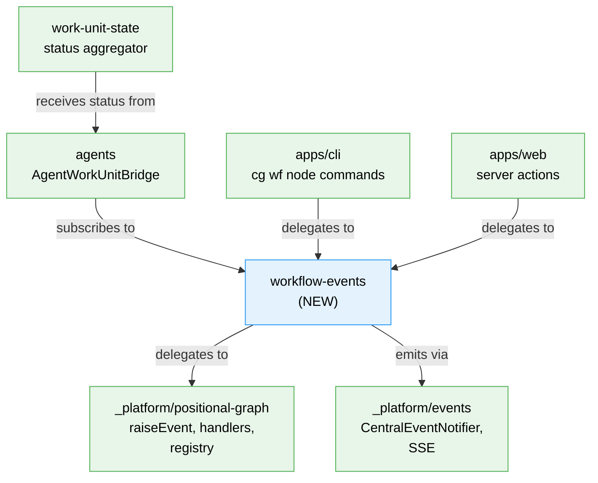

# Workshop: WorkflowEvents — First-Class Convenience Domain for Workflow Event Interactions

**Type**: Integration Pattern / Domain Design
**Plan**: 059-fix-agents
**Spec**: [fix-agents-spec.md](../fix-agents-spec.md)
**Created**: 2026-03-01
**Status**: Draft

**Related Documents**:
- [Workshop 003 — WorkUnit State System](./003-work-unit-state-system.md): Consumer of workflow events for status aggregation
- [Plan 032 — Node Event System](../../032-node-event-system/): The underlying generic event infrastructure
- [Plan 054 — Unified Human Input](../../054-unified-human-input/): QnA UX layer that would benefit from this domain
- [Plan 030 — Orchestration](../../030-orchestration/): Orchestrator that consumes events but is event-type-agnostic
- [ADR-0008](../../../adr/): Module registration pattern used by event type registry

**Domain Context**:
- **Primary Domain**: `workflow-events` (NEW — to be extracted/created)
- **Related Domains**: `_platform/events` (SSE transport), `_platform/positional-graph` (owns raw event infrastructure), `workflow-ui` (web consumer), `agents` (raises events via CLI), `work-unit-state` (status aggregator)

---

## Purpose

Extract workflow event interactions (QnA, status updates, progress) from their current diffuse state into a first-class domain with clean contracts. Today, using workflow events requires understanding `raiseEvent()`, `VALID_FROM_STATES`, event handler internals, the 5-step validation pipeline, and 3+ convenience methods scattered across `PositionalGraphService`. This workshop designs `workflow-events` as a convenience domain that provides a clean, intent-based API: "ask a question", "get the answer", "report progress" — without callers needing to understand the underlying event machinery.

## The Problem Today

```
Today: Event concepts are diffuse and emergent

  packages/positional-graph/
    features/032-node-event-system/
      core-event-types.ts          ← 7 event type definitions
      event-handlers.ts            ← 7 handler functions
      raise-event.ts               ← 5-step validation pipeline
      event-payloads.schema.ts     ← Zod schemas
      node-event.schema.ts         ← Event shape
      event-type-registration.interface.ts  ← Registry interface
    services/positional-graph.service.ts
      askQuestion()                ← convenience wrapper (line ~2184)
      answerQuestion()             ← convenience wrapper
      getAnswer()                  ← convenience wrapper
      raiseNodeEvent()             ← generic wrapper

  apps/cli/
    commands/positional-graph.command.ts
      handleNodeAsk                ← CLI handler (line ~2357)
      handleNodeAnswer             ← CLI handler (line ~2384)
      handleNodeGetAnswer          ← CLI handler (line ~2407)
      handleNodeRaiseEvent         ← generic CLI handler (line ~1300)

  apps/web/
    app/actions/workflow-actions.ts
      answerQuestion()             ← server action (line ~416)
      submitUserInput()            ← human input action (line ~539)

  88 files reference "question:ask"
  82 files reference "question:answer"
  77 files reference "raiseEvent"
  53 files reference "askQuestion"

  Result: To use QnA, you need to understand:
  - raiseEvent() 5-step pipeline
  - VALID_FROM_STATES map
  - Event handler side effects
  - question:ask + question:answer + node:restart 3-event handshake
  - State transitions: agent-accepted → waiting-question → restart-pending → ready
  - PositionalGraphService convenience methods
  - CLI command interfaces
  - Web server actions
```

## Key Questions Addressed

- Q1: What is WorkflowEvents and what does it own?
- Q2: What does the public API look like?
- Q3: How does this layer on top of the existing event system (not replace it)?
- Q4: What about non-QnA events — status updates, progress, custom events?
- Q5: How does WorkUnitStateService consume these events?
- Q6: What migration work is needed to "upgrade" existing code?
- Q7: Where does this domain live in the hierarchy?

---

## Q1: What is WorkflowEvents?

A **convenience domain** that provides intent-based APIs for common workflow event patterns. It does NOT replace the generic event system (Plan 032) — it sits on top as a consumer-friendly layer.

```
┌─────────────────────────────────────────────────────────────┐
│ BEFORE: Callers talk to raw event infrastructure            │
│                                                             │
│  Agent → CLI → PositionalGraphService.askQuestion()         │
│           ↓         ↓                                       │
│      raiseEvent('question:ask', ...) + handleEvents()       │
│           ↓                                                 │
│      5-step validation → state mutation → persist           │
│                                                             │
│  Web UI → server action → PGService.answerQuestion()        │
│           ↓         ↓                                       │
│      raiseEvent('question:answer') + raiseEvent('node:restart')│
│                                                             │
│  Everyone needs to understand the raw machinery.            │
├─────────────────────────────────────────────────────────────┤
│ AFTER: Callers talk to WorkflowEvents                       │
│                                                             │
│  Agent → CLI → WorkflowEvents.askQuestion(node, question)   │
│  Web UI → WorkflowEvents.answerQuestion(node, answer)       │
│  Bridge → WorkflowEvents.onQuestionAsked(handler)           │
│  Agent → WorkflowEvents.getAnswer(node, questionId)         │
│  Agent → WorkflowEvents.reportProgress(node, message)       │
│                                                             │
│  WorkflowEvents internally composes:                        │
│    raiseEvent() + handleEvents() + state reads + 3-event    │
│    handshakes + VALID_FROM_STATES awareness                 │
│                                                             │
│  Callers see: clean methods. No pipeline knowledge needed.  │
└─────────────────────────────────────────────────────────────┘
```

### What It Owns

- **IWorkflowEvents interface** — the convenience contract
- **Domain event subscriptions** — `onQuestionAsked()`, `onStatusChanged()`, `onProgressReported()` observer hooks
- **Convenience wrappers** — `askQuestion()`, `answerQuestion()`, `getAnswer()`, `reportProgress()`, `reportError()`
- **Event type constants** — `WorkflowEventType.QuestionAsk`, etc. (typed strings, not magic strings)
- **Payload type helpers** — `QuestionPayload`, `AnswerPayload`, `ProgressPayload` (TypeScript types wrapping Zod schemas)

### What It Does NOT Own

- **The generic event system** — `raiseEvent()`, `handleEvents()`, event registry, VALID_FROM_STATES (stays in `_platform/positional-graph`)
- **Node state machine** — status transitions (stays in positional-graph)
- **Orchestration logic** — ONBAS, ODS, reality builder (stays in orchestration domain)
- **CLI command definitions** — `cg wf node ask` (stays in CLI app, but delegates to WorkflowEvents)
- **Web actions** — server actions (stay in web app, but delegate to WorkflowEvents)

---

## Q2: Public API

```typescript
/**
 * IWorkflowEvents — Intent-based API for workflow event interactions.
 *
 * Sits on top of the generic event system (Plan 032). Callers don't need
 * to understand raiseEvent(), event handlers, state transitions, or the
 * 3-event QnA handshake. They express intent; this service handles the rest.
 */
interface IWorkflowEvents {
  // ── Questions ──

  /**
   * Ask a question from a node. Internally raises question:ask,
   * runs handlers (node → waiting-question), persists.
   * Returns the generated questionId.
   */
  askQuestion(
    graphSlug: string,
    nodeId: string,
    question: QuestionInput
  ): Promise<{ questionId: string }>;

  /**
   * Answer a pending question. Internally raises question:answer +
   * node:restart (the 3-event handshake), runs handlers, persists.
   */
  answerQuestion(
    graphSlug: string,
    nodeId: string,
    questionId: string,
    answer: AnswerInput
  ): Promise<void>;

  /**
   * Get the answer to a previously asked question.
   * Returns null if not yet answered.
   */
  getAnswer(
    graphSlug: string,
    nodeId: string,
    questionId: string
  ): Promise<AnswerResult | null>;

  // ── Status & Progress ──

  /**
   * Report progress from a node. Informational only — no state change.
   * Raises progress:update event.
   */
  reportProgress(
    graphSlug: string,
    nodeId: string,
    message: string,
    percentage?: number
  ): Promise<void>;

  /**
   * Report an error from a node. Raises node:error event.
   * Node transitions to blocked-error.
   */
  reportError(
    graphSlug: string,
    nodeId: string,
    error: ErrorInput
  ): Promise<void>;

  // ── Observation (server-side event subscription) ──

  /**
   * Subscribe to question-asked events across all nodes in a graph.
   * Fires when any node enters waiting-question state.
   * Returns unsubscribe function.
   */
  onQuestionAsked(
    graphSlug: string,
    handler: (event: QuestionAskedEvent) => void
  ): () => void;

  /**
   * Subscribe to question-answered events.
   * Fires when an answer is recorded.
   */
  onQuestionAnswered(
    graphSlug: string,
    handler: (event: QuestionAnsweredEvent) => void
  ): () => void;

  /**
   * Subscribe to progress events.
   */
  onProgress(
    graphSlug: string,
    handler: (event: ProgressEvent) => void
  ): () => void;

  /**
   * Subscribe to ANY workflow event (generic escape hatch).
   */
  onEvent(
    graphSlug: string,
    handler: (event: WorkflowEvent) => void
  ): () => void;
}
```

### Input/Output Types

```typescript
/** What a caller provides to ask a question */
interface QuestionInput {
  type: 'free_text' | 'single_choice' | 'multi_choice' | 'confirm';
  text: string;
  options?: string[];
  defaultValue?: unknown;
}

/** What a caller provides to answer a question */
interface AnswerInput {
  text?: string;
  selected?: string[];
  confirmed?: boolean;
}

/** What getAnswer() returns */
interface AnswerResult {
  questionId: string;
  answered: true;
  answer: AnswerInput;
  answeredAt: string;
}

/** What onQuestionAsked handlers receive */
interface QuestionAskedEvent {
  graphSlug: string;
  nodeId: string;
  questionId: string;
  question: QuestionInput;
  askedAt: string;
  source: string;
}

/** What onQuestionAnswered handlers receive */
interface QuestionAnsweredEvent {
  graphSlug: string;
  nodeId: string;
  questionId: string;
  answer: AnswerInput;
  answeredAt: string;
}

/** What onProgress handlers receive */
interface ProgressEvent {
  graphSlug: string;
  nodeId: string;
  message: string;
  percentage?: number;
}

/** Generic workflow event (escape hatch) */
interface WorkflowEvent {
  graphSlug: string;
  nodeId: string;
  eventType: string;
  payload: Record<string, unknown>;
  source: string;
  timestamp: string;
}

/** Typed event type constants */
const WorkflowEventType = {
  QuestionAsk: 'question:ask',
  QuestionAnswer: 'question:answer',
  NodeRestart: 'node:restart',
  NodeAccepted: 'node:accepted',
  NodeCompleted: 'node:completed',
  NodeError: 'node:error',
  ProgressUpdate: 'progress:update',
} as const;
```

---

## Q3: How Does This Layer on Top?

```
┌───────────────────────────────────────────────┐
│ Callers (CLI, Web Actions, Bridges)           │
│                                               │
│   workflowEvents.askQuestion(...)             │
│   workflowEvents.answerQuestion(...)          │
│   workflowEvents.onQuestionAsked(handler)     │
└──────────────────┬────────────────────────────┘
                   │ delegates to
                   ▼
┌───────────────────────────────────────────────┐
│ WorkflowEventsService (this domain)           │
│                                               │
│ - Composes raiseEvent() + handleEvents()      │
│ - Manages 3-event handshake for QnA           │
│ - Emits to CentralEventNotifier for SSE      │
│ - Maintains in-memory observer registry       │
│ - Provides typed event constants              │
└──────────────────┬────────────────────────────┘
                   │ uses
                   ▼
┌───────────────────────────────────────────────┐
│ Generic Event System (Plan 032) — UNCHANGED   │
│                                               │
│ raiseEvent() → validate → create → persist    │
│ handleEvents() → run registered handlers      │
│ EventTypeRegistry → type definitions          │
│ VALID_FROM_STATES → transition rules          │
│                                               │
│ The raw machinery. Still works standalone.    │
│ WorkflowEvents is a convenience consumer.     │
└───────────────────────────────────────────────┘
```

### Implementation Sketch

```typescript
class WorkflowEventsService implements IWorkflowEvents {
  constructor(
    private readonly pgService: IPositionalGraphService,
    private readonly notifier: ICentralEventNotifier,
  ) {}

  async askQuestion(graphSlug: string, nodeId: string, question: QuestionInput) {
    // Delegates to existing method — which internally does
    // raiseEvent('question:ask') + handleEvents()
    const result = await this.pgService.askQuestion(
      this.createContext(graphSlug),
      graphSlug,
      nodeId,
      question
    );
    
    // Emit to SSE for client-side visibility
    this.notifier.emit(WorkspaceDomain.Workflows, 'question-asked', {
      graphSlug, nodeId, questionId: result.questionId,
    });
    
    // Notify server-side observers
    this.notifyObservers('question-asked', {
      graphSlug, nodeId, questionId: result.questionId,
      question, askedAt: new Date().toISOString(), source: 'agent',
    });
    
    return { questionId: result.questionId };
  }

  async answerQuestion(graphSlug: string, nodeId: string, questionId: string, answer: AnswerInput) {
    // The 3-event handshake — callers don't need to know about this
    const ctx = this.createContext(graphSlug);
    await this.pgService.answerQuestion(ctx, graphSlug, nodeId, questionId, answer);
    await this.pgService.raiseNodeEvent(ctx, graphSlug, nodeId, 'node:restart', {
      reason: 'question-answered',
    }, 'human');
    
    this.notifier.emit(WorkspaceDomain.Workflows, 'question-answered', {
      graphSlug, nodeId, questionId,
    });
    
    this.notifyObservers('question-answered', {
      graphSlug, nodeId, questionId, answer,
      answeredAt: new Date().toISOString(),
    });
  }

  async getAnswer(graphSlug: string, nodeId: string, questionId: string) {
    return this.pgService.getAnswer(
      this.createContext(graphSlug), graphSlug, nodeId, questionId
    );
  }

  // ── Observer pattern (in-memory, per-graph) ──
  
  private observers = new Map<string, Set<Function>>();
  
  onQuestionAsked(graphSlug: string, handler: (e: QuestionAskedEvent) => void) {
    return this.addObserver(`${graphSlug}:question-asked`, handler);
  }
  
  onQuestionAnswered(graphSlug: string, handler: (e: QuestionAnsweredEvent) => void) {
    return this.addObserver(`${graphSlug}:question-answered`, handler);
  }
}
```

---

## Q4: Beyond QnA — Status Updates, Progress, Custom Events

The domain is **not QnA-only**. It's the place for ALL high-level workflow event interactions:

```typescript
// Phase 1: QnA (this plan)
workflowEvents.askQuestion(graph, node, question);
workflowEvents.answerQuestion(graph, node, qId, answer);
workflowEvents.getAnswer(graph, node, qId);
workflowEvents.onQuestionAsked(graph, handler);

// Phase 1: Progress & Errors
workflowEvents.reportProgress(graph, node, "Building auth module", 45);
workflowEvents.reportError(graph, node, { code: 'E001', message: '...' });

// Future: Status subscriptions
workflowEvents.onNodeStatusChanged(graph, handler);
workflowEvents.onNodeCompleted(graph, handler);
workflowEvents.onNodeError(graph, handler);

// Future: Custom domain events
workflowEvents.raiseCustom(graph, node, 'deploy:started', { env: 'staging' });
workflowEvents.onCustom(graph, 'deploy:*', handler);
```

The key insight: **any new event type that gets registered in the generic system automatically gets a convenience path through WorkflowEvents**.

---

## Q5: How Does WorkUnitStateService Consume These Events?

```
┌──────────────────────────────────────────────────────────┐
│                                                          │
│  WorkflowEventsService                                   │
│    │  onQuestionAsked → observers fire                   │
│    │  onNodeStatusChanged → observers fire               │
│    ▼                                                     │
│  AgentWorkUnitBridge (subscribes at bootstrap)           │
│    │  questionAsked → updateStatus(unitId, 'waiting_input')│
│    │  statusChanged → updateStatus(unitId, newStatus)    │
│    ▼                                                     │
│  WorkUnitStateService                                    │
│    │  updateStatus() → persist + emit via notifier       │
│    ▼                                                     │
│  CentralEventNotifierService                             │
│    │  emit('work-unit-state', 'status-changed', ...)     │
│    ▼                                                     │
│  SSE → ServerEventRoute → GlobalStateSystem              │
│    │  work-unit-state:{id}:status = 'waiting_input'      │
│    ▼                                                     │
│  Top Bar UI (subscribes via useGlobalState)              │
└──────────────────────────────────────────────────────────┘
```

WorkUnitStateService does NOT understand QnA. It sees:
- `status: 'waiting_input'` — something needs attention
- `status: 'working'` — something is active
- `status: 'idle'` — something is parked
- `status: 'error'` — something broke

The bridge translates workflow-specific events into generic work-unit status updates.

---

## Q6: Migration Work — "Upgrade" to First-Class Domain

### What Needs to Change

| Current Location | What Moves | Where It Goes | Effort |
|-----------------|-----------|---------------|--------|
| `PositionalGraphService.askQuestion()` | Stays as internal impl | WorkflowEventsService delegates to it | None — wrap, don't move |
| `PositionalGraphService.answerQuestion()` | Stays as internal impl | WorkflowEventsService handles 3-event handshake | None — wrap |
| `PositionalGraphService.getAnswer()` | Stays as internal impl | WorkflowEventsService delegates | None — wrap |
| `apps/cli handleNodeAsk` | Update to call WorkflowEvents | `workflowEvents.askQuestion()` instead of `pgService.askQuestion()` | Small — swap call target |
| `apps/cli handleNodeAnswer` | Update to call WorkflowEvents | `workflowEvents.answerQuestion()` instead of 2 separate calls | Small — swap + simplify |
| `apps/cli handleNodeGetAnswer` | Update to call WorkflowEvents | `workflowEvents.getAnswer()` | Small — swap |
| `apps/web workflow-actions.ts answerQuestion` | Update to call WorkflowEvents | Single call instead of answer + restart | Small — simplify |
| `apps/web workflow-actions.ts submitUserInput` | Update to call WorkflowEvents | Same pattern | Small |
| Magic strings `'question:ask'` etc. | Replace with typed constants | `WorkflowEventType.QuestionAsk` | Grep + replace |
| Event payload construction | Use typed helpers | `QuestionPayload`, `AnswerPayload` | Small — type narrowing |
| No observer pattern | NEW | `onQuestionAsked()`, `onQuestionAnswered()` | Medium — new infrastructure |

### What Does NOT Change

- **Core event system (Plan 032)** — untouched. `raiseEvent()`, handlers, registry all stay.
- **Orchestration (ONBAS/ODS)** — untouched. Still sees `restart-pending` → `ready`.
- **CLI command structure** — `cg wf node ask/answer/get-answer` stay. Just swap the implementation target.
- **Test infrastructure** — existing tests keep working. Add WorkflowEvents contract tests.

### Migration Order

1. **Create interface + types** in `packages/shared` (cross-package contract)
2. **Create implementation** in `apps/web` (wraps PositionalGraphService)
3. **Create Fake** for testing
4. **Update CLI handlers** to delegate to WorkflowEvents
5. **Update web actions** to delegate to WorkflowEvents
6. **Add observer hooks** for server-side event subscription
7. **Wire AgentWorkUnitBridge** to use observers
8. **Replace magic strings** with typed constants
9. **Extract domain doc** (`docs/domains/workflow-events/domain.md`)

---

## Q7: Where Does This Domain Live?

```
docs/domains/
  workflow-events/
    domain.md

packages/shared/
  src/interfaces/
    workflow-events.interface.ts    ← IWorkflowEvents
  src/workflow-events/
    types.ts                        ← QuestionInput, AnswerInput, event types
    constants.ts                    ← WorkflowEventType const
    index.ts                        ← barrel

apps/web/
  src/lib/workflow-events/
    workflow-events.service.ts      ← WorkflowEventsService implementation
    index.ts                        ← barrel

packages/shared/
  src/fakes/
    fake-workflow-events.ts         ← FakeWorkflowEventsService
```

### Domain Relationships



### Dependency Direction

- `workflow-events` **depends on**: `_platform/positional-graph` (raw event infra), `_platform/events` (SSE notify)
- `agents` **depends on**: `workflow-events` (observer hooks)
- `work-unit-state` **depends on**: nothing workflow-specific (receives generic status via bridge)
- `apps/cli` **depends on**: `workflow-events` (convenience methods)
- `apps/web` **depends on**: `workflow-events` (convenience methods)

---

## Open Questions

### Q8: Should WorkflowEvents own the observer pattern, or should we extend CentralEventNotifierService?

**RESOLVED**: WorkflowEvents owns its own observer registry. CentralEventNotifierService is SSE-only (outbound to clients). Server-side observation is a different concern — it's about in-process notification, not cross-boundary transport. Keeping them separate means:
- CentralEventNotifierService stays simple (one job: SSE broadcast)
- WorkflowEvents can optimize its observer pattern (e.g., per-graph scoping)
- No risk of circular dependencies

### Q9: Should the CLI still have a generic `raise-event` command?

**RESOLVED**: Yes. The generic `cg wf node raise-event` stays as an escape hatch. WorkflowEvents provides convenience commands; `raise-event` provides raw access for advanced/debugging use. Both coexist.

### Q10: When should this be built?

**OPEN for user decision**: Options:
- **Option A**: Build during Plan 059 Phase 2, before T007 (AgentWorkUnitBridge). This lets the bridge use WorkflowEvents.onQuestionAsked() from day one.
- **Option B**: Build as a separate plan (e.g., Plan 061). Phase 2 T007 bridge calls PositionalGraphService directly for now; migrate later.
- **Option C**: Minimal version now (interface + types + thin wrapper), full migration later.

### Q11: Does this affect Plan 054 (Unified Human Input)?

**RESOLVED**: Yes, positively. Plan 054's human input modal currently calls `submitUserInput` server action which directly manipulates PG service. With WorkflowEvents, it would call `workflowEvents.answerQuestion()` — cleaner, and the 3-event handshake is encapsulated. Future Plan 054 work benefits immediately.

---

## Summary

WorkflowEvents is a **convenience domain** (~200 lines of code) that:
1. Wraps the 3-event QnA handshake in single method calls
2. Provides typed constants replacing magic event type strings
3. Adds server-side observer hooks (onQuestionAsked, onStatusChanged)
4. Gives WorkUnitStateService/AgentWorkUnitBridge a clean subscription point
5. Centralizes what is currently scattered across 88+ files

It doesn't replace the generic event system — it makes it accessible. Like how `fetch()` wraps HTTP and `useSSE` wraps EventSource.
