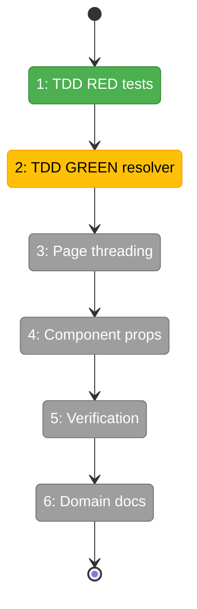
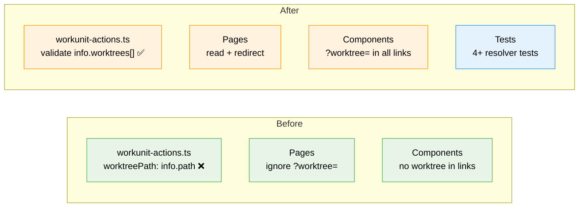

# Flight Plan: Implementation — Work Unit Worktree Resolution

**Plan**: [workunit-worktree-resolution-plan.md](../../workunit-worktree-resolution-plan.md)
**Phase**: Implementation (Simple Mode)
**Generated**: 2026-03-01
**Status**: Landed

---

## Departure → Destination

**Where we are**: Work unit pages always read from/write to the main workspace path (`/substrate/chainglass`), ignoring git worktrees. The editor page extracts `?worktree=` from the URL but only uses it for the "Back to Workflow" return link — data loading is hardcoded. All infrastructure is in place (IWorkUnitService is worktree-aware, nav sidebar preserves `?worktree=`, workflow-actions.ts has the correct pattern).

**Where we're going**: A developer on a worktree branch navigates to Work Units and sees units from their branch. Creating, editing, saving all target the correct worktree. Missing `?worktree=` redirects instead of silently falling back. Verified with Playwright screenshots.

---

## Domain Context

### Domains We're Changing

| Domain | What Changes | Key Files |
|--------|-------------|-----------|
| `058-workunit-editor` | Fix resolver, thread worktree through pages + 5 components, add tests | `workunit-actions.ts`, 2 pages, 5 components, 1 test file |

### Domains We Depend On (no changes)

| Domain | What We Consume | Contract |
|--------|----------------|----------|
| `_platform/positional-graph` | Work unit CRUD (already worktree-aware) | `IWorkUnitService` |
| `_platform/workspace-url` | Nav link construction (already preserves worktree) | `workspaceHref()` |
| `@chainglass/workflow` | Workspace info with detected worktrees | `IWorkspaceService.getInfo()` |

---

## Flight Status

<!-- Updated by /plan-6-v2: pending → active → done. Use blocked for problems/input needed. -->

**Legend**: grey = pending | yellow = active | red = blocked/needs input | green = done

---

## Stages

<!-- Updated by /plan-6-v2 during implementation: [ ] → [~] → [x] -->

- [x] **Stage 1: TDD RED** — Write 4+ resolver tests with fakes (`workunit-actions-worktree.test.ts` — new file)
- [x] **Stage 2: TDD GREEN** — Fix `resolveWorkspaceContext`, add `worktreePath?` to 8 actions (`workunit-actions.ts`)
- [x] **Stage 3: Page threading** — Read `?worktree=`, redirect if missing, thread to actions (`page.tsx` × 2)
- [x] **Stage 4: Component props** — Thread worktreePath to 5 components, append to links + save calls
- [x] **Stage 5: Verification** — `just fft` + Next.js MCP + Playwright screenshots
- [x] **Stage 6: Domain docs** — Update domain.md history

---

## Architecture: Before & After

**Legend**: existing (green, unchanged) | changed (orange, modified) | new (blue, created)

---

## Acceptance Criteria

- [x] AC-01: List page with `?worktree=` lists units from specified worktree
- [x] AC-02: Editor page with `?worktree=` loads content from specified worktree
- [x] AC-03: Editing saves to specified worktree
- [x] AC-04: Creating scaffolds in specified worktree
- [x] AC-05: Deleting/renaming operates on specified worktree
- [x] AC-06: Links preserve `?worktree=` between units
- [x] AC-07: Missing `?worktree=` redirects to worktree picker (no silent fallback)
- [x] AC-08: Edit Template round-trip preserves worktree for data ops
- [x] AC-09: `just fft` passes
- [x] AC-10: Unit tests verify resolver validates worktree
- [x] AC-11: Next.js MCP: zero errors
- [x] AC-12: Playwright screenshots confirm correct behavior

## Goals & Non-Goals

**Goals**:
- All work unit CRUD targets the active worktree
- Missing `?worktree=` redirects (no silent fallback)
- Links preserve `?worktree=` between units
- Edit Template round-trip maintains worktree context
- TDD for resolver, Playwright verification

**Non-Goals**:
- Consolidating resolver duplication (ARCH-001)
- Fixing other worktree-unaware features
- Modifying IWorkUnitService or file watcher

---

## Checklist

- [x] T001: TDD RED — write resolver tests (4+ cases, fakes only)
- [~] T002: TDD GREEN — fix resolver + add worktreePath to 8 actions
- [x] T003: Pages — read searchParams.worktree, redirect if missing
- [x] T004: Components — thread worktreePath to 5 components
- [x] T005: Verification — just fft + MCP + Playwright screenshots
- [x] T006: Domain docs — update domain.md history
