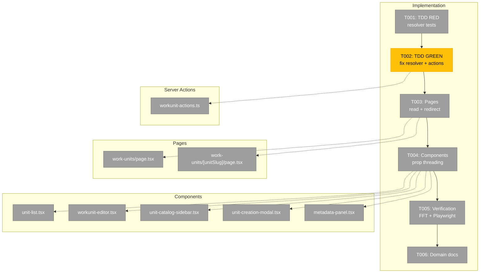
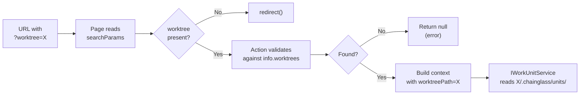
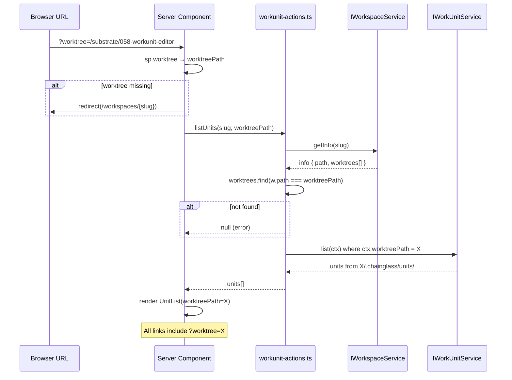

# Implementation: Work Unit Worktree Resolution — Tasks

## Executive Briefing

- **Purpose**: Fix work unit pages to thread worktree context through URLs, server actions, and components so CRUD operations target the correct git worktree instead of always hitting the main workspace.
- **What We're Building**: Worktree-aware `resolveWorkspaceContext` in `workunit-actions.ts`, page-level `?worktree=` extraction with redirect-on-missing, and prop-threading through 5 components.
- **Goals**: ✅ All work unit CRUD targets the active worktree  ✅ Missing `?worktree=` redirects (no silent fallback)  ✅ Links preserve `?worktree=` between units  ✅ Edit Template round-trip maintains worktree context  ✅ TDD for resolver, Playwright verification
- **Non-Goals**: ❌ Consolidating resolver duplication (ARCH-001)  ❌ Fixing other worktree-unaware features (agents, file-actions)  ❌ Modifying IWorkUnitService or file watcher

---

## Prior Phase Context

N/A — Simple mode plan, single implementation phase. No prior phases.

**Reusable from Plan 058** (parent plan):
- All component files already exist with established prop patterns
- `workunit-actions.ts` already has `resolveWorkspaceContext` — just needs worktree parameter
- Editor page already extracts `sp.worktree` as `returnWorktree` — just needs threading to data calls
- `WorkUnitEditor` already has `returnWorktree?: string` prop — rename/extend to `worktreePath`

**Reference implementation**: `apps/web/app/actions/workflow-actions.ts` lines 35-61 — the correct worktree resolution pattern.

---

## Pre-Implementation Check

| File | Exists? | Domain Check | Notes |
|------|---------|-------------|-------|
| `apps/web/app/actions/workunit-actions.ts` | ✅ | ✅ `058-workunit-editor` | Modify — fix resolver, add worktreePath to 8 actions. Already has 3 worktree refs (hardcoded). |
| `apps/web/app/(dashboard)/.../work-units/page.tsx` | ✅ | ✅ `058-workunit-editor` | Modify — add searchParams reading, redirect if missing. Currently 30 lines, no worktree refs. |
| `apps/web/app/(dashboard)/.../work-units/[unitSlug]/page.tsx` | ✅ | ✅ `058-workunit-editor` | Modify — thread existing `returnWorktree` to data calls. Already extracts sp.worktree (line 18). |
| `.../058-workunit-editor/components/unit-list.tsx` | ✅ | ✅ `058-workunit-editor` | Modify — add worktreePath prop, append to links. UnitListProps interface. |
| `.../058-workunit-editor/components/workunit-editor.tsx` | ✅ | ✅ `058-workunit-editor` | Modify — extend returnWorktree to worktreePath, thread to save callbacks. WorkUnitEditorProps. |
| `.../058-workunit-editor/components/unit-catalog-sidebar.tsx` | ✅ | ✅ `058-workunit-editor` | Modify — add worktreePath prop, append to links. UnitCatalogSidebarProps. |
| `.../058-workunit-editor/components/unit-creation-modal.tsx` | ✅ | ✅ `058-workunit-editor` | Modify — pass worktreePath to createUnit, include in redirect. UnitCreationModalProps. |
| `.../058-workunit-editor/components/metadata-panel.tsx` | ✅ | ✅ `058-workunit-editor` | Modify — add worktreePath prop, pass to direct updateUnit() calls. MetadataPanelProps. |
| `test/unit/web/actions/workunit-actions-worktree.test.ts` | ❌ New | ✅ `058-workunit-editor` | Create — TDD tests for resolver function. |

No concept search needed — this is a plumbing fix using an established pattern, not a new concept.

---

## Architecture Map



---

## Tasks

| Status | ID | Task | Domain | Path(s) | Done When | Notes |
|--------|-----|------|--------|---------|-----------|-------|
| [ ] | T001 | **TDD RED**: Write tests for `resolveWorkspaceContext(slug, worktreePath?)`. Test cases: (1) valid worktree in `info.worktrees[]` → returns context with correct `worktreePath`; (2) invalid worktree not in list → returns null or error; (3) missing worktreePath (undefined) → returns null or error (no silent fallback per AC-07); (4) missing workspace (unknown slug) → returns null. Use DI with fakes: `resetBootstrapSingleton()` + `createTestContainer()` to inject FakeWorkspaceService. Test via exported actions (e.g., `listUnits`). | `058-workunit-editor` | `/Users/jordanknight/substrate/058-workunit-editor/test/unit/web/actions/workunit-actions-worktree.test.ts` | 4+ tests written, all RED (failing against current code) | Per constitution Principle 3+4. DI pattern: `resetBootstrapSingleton()` in beforeEach, inject test container with fakes (DYK #2). CS-1. |
| [ ] | T002 | **TDD GREEN** (blocked by T001): Fix `resolveWorkspaceContext` — replace hardcoded resolver with `workspaceService.resolveContextFromParams(slug, worktreePath)`. Return null if worktree missing/invalid (no fallback). Add `worktreePath?` as last param to all 8 exported actions: `listUnits`, `loadUnit`, `loadUnitContent`, `createUnit`, `updateUnit`, `deleteUnit`, `renameUnit`, `saveUnitContent`. | `058-workunit-editor` | `/Users/jordanknight/substrate/058-workunit-editor/apps/web/app/actions/workunit-actions.ts` | All T001 tests pass GREEN. 8 action signatures updated. TypeScript compiles. | Use canonical `resolveContextFromParams()` (not inline pattern). Handles trailing-slash normalization (DYK #3+#5). Per finding 01. CS-2. |
| [ ] | T003 | **Pages**: (A) List page — add `searchParams` to PageProps, read `sp.worktree`, call `redirect(\`/workspaces/${slug}\`)` if missing (worktree picker), pass to `listUnits(slug, worktreePath)` and `<UnitList worktreePath={worktreePath}>`. (B) Editor page — extract `worktreePath` from `sp.worktree` (keep existing `returnWorktree` for return link per DYK #4), thread `worktreePath` to all 3 `Promise.all` action calls (`loadUnit`, `loadUnitContent`, `listUnits`), pass as new prop to `<WorkUnitEditor worktreePath={worktreePath}>`. Redirect to worktree picker if missing. | `058-workunit-editor` | `/Users/jordanknight/substrate/058-workunit-editor/apps/web/app/(dashboard)/workspaces/[slug]/work-units/page.tsx`, `/Users/jordanknight/substrate/058-workunit-editor/apps/web/app/(dashboard)/workspaces/[slug]/work-units/[unitSlug]/page.tsx` | Both pages thread worktree to actions; missing `?worktree=` redirects to `/workspaces/${slug}` (worktree picker). | Per findings 02+05. Use `redirect()` from `next/navigation`. Redirect to workspace home avoids loop when sidebar nav lacks worktree context (DYK #1). CS-2. |
| [ ] | T004 | **Components**: Add `worktreePath?: string` to props of 5 components (keep existing `returnWorktree` separate per DYK #4). (A) `UnitList` — append `?worktree=` to unit links. (B) `WorkUnitEditor` — add NEW `worktreePath` prop (alongside existing `returnWorktree`), thread to all save callbacks (`useCallback` deps must include `worktreePath`), pass to child components. (C) `UnitCatalogSidebar` — append `?worktree=` to sidebar unit links. (D) `UnitCreationModal` — pass to `createUnit()`, include in redirect URL after create. (E) `MetadataPanel` — pass to `updateUnit()` calls (imports server action directly). | `058-workunit-editor` | `/Users/jordanknight/substrate/058-workunit-editor/apps/web/src/features/058-workunit-editor/components/unit-list.tsx`, `workunit-editor.tsx`, `unit-catalog-sidebar.tsx`, `unit-creation-modal.tsx`, `metadata-panel.tsx` | All links include `?worktree=`; all action calls pass worktreePath; all `useCallback` deps correct; TypeScript compiles. | Per findings 03+04. Always use `encodeURIComponent()` for URLs. CS-2. |
| [ ] | T005 | **Verification**: Run `just fft` (0 failures). Query Next.js MCP port 3001 for errors (0 errors). Launch Playwright headless Chrome. Navigate to `/workspaces/chainglass/work-units?worktree=/Users/jordanknight/substrate/058-workunit-editor` — verify units listed from worktree. Navigate to an editor page with `?worktree=` — verify content loads. Navigate WITHOUT `?worktree=` — verify redirect (not silent render). Take screenshots as evidence. | all | N/A | `just fft` passes. MCP: 0 errors. Playwright confirms: correct units, correct editor, redirect on missing param. | Per AC-09, AC-11, AC-12. CS-2. |
| [ ] | T006 | **Domain docs**: Update `058-workunit-editor/domain.md` history with Plan 062 entry. Add "Worktree Context Threading" concept to Concepts table if not present. | `058-workunit-editor` | `/Users/jordanknight/substrate/058-workunit-editor/docs/domains/058-workunit-editor/domain.md` | History updated. | CS-1. |

---

## Context Brief

**Key findings from plan**:
- Finding 01 (Critical): `resolveWorkspaceContext` hardcodes `worktreePath: info.path` — fix by adding param + validating against `info.worktrees[]`
- Finding 02 (Critical): Editor page reads `sp.worktree` but ignores it for data loading — thread to all 3 `Promise.all` action calls
- Finding 03 (High): MetadataPanel calls `updateUnit()` directly — needs `worktreePath` prop threaded through
- Finding 04 (High): UnitCatalogSidebar constructs links without `?worktree=` — users lose context clicking between units
- Finding 05 (Medium): Use `redirect()` from `next/navigation` for missing param (pattern from `worktree/page.tsx`)
- Finding 06 (Info): Nav sidebar already handles worktree via `workspaceHref()` — no nav changes needed

**Domain dependencies** (concepts and contracts this phase consumes):
- `_platform/positional-graph`: Work Unit CRUD (`IWorkUnitService.list/load/create/update/delete/rename`) — all methods already accept `WorkspaceContext` with `worktreePath` field
- `_platform/workspace-url`: URL Construction (`workspaceHref()`) — sidebar nav already appends `?worktree=`
- `@chainglass/workflow`: Workspace Info (`IWorkspaceService.getInfo()`) — returns `worktrees: Worktree[]` array with detected git worktrees

**Domain constraints**:
- All changes within `058-workunit-editor` domain — no cross-domain imports added
- MetadataPanel imports `updateUnit` from server actions (established pattern, not a new cross-boundary)
- `redirect()` only available in Server Components (pages), not Client Components

**Reusable from Plan 058**:
- `WorkUnitEditorProps` already has `returnWorktree?: string` — extend/rename to `worktreePath`
- `[unitSlug]/page.tsx` already extracts `sp.worktree` at line 18 — just needs threading to data calls
- Test fixtures: `createTestWorkspaceContext()` from `test/helpers/workspace-context.ts`

**System flow**:


**Worktree threading sequence**:


---

## Discoveries & Learnings

_Populated during implementation by plan-6._

| Date | Task | Type | Discovery | Resolution | References |
|------|------|------|-----------|------------|------------|

---

## Directory Layout

```
docs/plans/062-workunit-worktree-resolution/
  ├── workunit-worktree-resolution-spec.md
  ├── workunit-worktree-resolution-plan.md
  ├── research-dossier.md
  └── tasks/implementation/
      ├── tasks.md                  ← this file
      ├── tasks.fltplan.md          ← flight plan
      └── execution.log.md          ← created by plan-6
```
