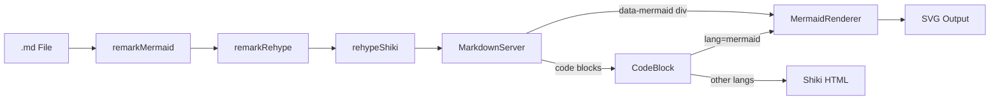
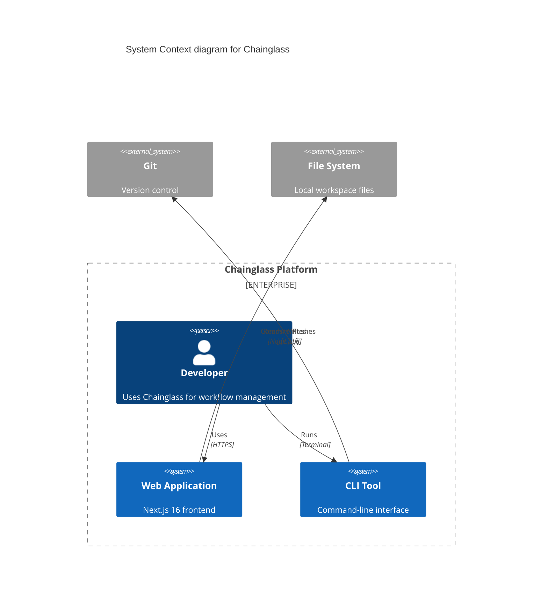

# Research Report: C4 Diagram First-Class Support

**Generated**: 2026-03-02T08:06:45Z
**Research Query**: "C4 first-class support — rendering, syntax highlighting, interactive layer zoom, domain decomposition exemplar, best practice design principles"
**Mode**: Pre-Plan (branch `063-c4-models`)
**Location**: `docs/plans/063-c4-models/research-dossier.md`
**FlowSpace**: Available
**Findings**: 70+ across 8 subagents + external research

## Executive Summary

### What It Does
This plan introduces first-class C4 architecture diagram support to Chainglass, enabling multi-layer system visualization (Context → Container → Component → Code) that decomposes domains into increasingly detailed views. C4 diagrams will render inline in markdown preview, support interactive layer drill-down, and link back to domain documentation files.

### Business Purpose
C4 diagrams serve as the **architecture alignment tool** for both humans and AI agents navigating the codebase. By creating a full multi-layer C4 model of the existing domain system, we establish: (1) a visual decomposition of system architecture at multiple zoom levels, (2) a navigable map that agents can use for discovery and alignment, (3) best-practice design principles codified as `.instruction.md` for future C4 authoring.

### Key Insights
1. **The rendering infrastructure is ready** — Mermaid v11 is installed, CodeBlock routing dispatches by language, and the remark plugin pattern (`remark-mermaid`) provides a reusable blueprint for C4 block detection.
2. **Mermaid has native C4 syntax** (`C4Context`, `C4Container`, `C4Component`, `C4Dynamic`, `C4Deployment`) — no new rendering library required for basic C4 support. Mermaid already renders C4 diagrams.
3. **Interactive zoom between layers is the hard problem** — Mermaid renders static SVGs; drill-down requires either (a) navigating between linked diagrams, or (b) a richer rendering engine like LikeC4 or custom React Flow integration.
4. **The domain system provides the exemplar content** — 14 active domains with contracts, boundaries, and a Mermaid dependency graph already exist, ready to be modeled as C4 layers.

### Quick Stats
- **Rendering Components**: 6 viewer components, 3 remark/rehype plugins, 2 server processors
- **Installed Libraries**: mermaid v11.12.2, @xyflow/react v12.10.0, @dagrejs/dagre v2.0.3, shiki v3.21.0
- **Test Coverage**: Full viewer test suite (mermaid-renderer, markdown-viewer, file-viewer, shiki-processor)
- **Complexity**: Medium (extends existing patterns) to High (interactive zoom/drill-down)
- **Prior Learnings**: 15 relevant discoveries from Plans 006, 041, 046, 055, 058
- **Domains**: 14 active domains; `_platform/viewer` is primary integration target

## How It Currently Works

### Entry Points

| Entry Point | Type | Location | Purpose |
|------------|------|----------|---------|
| MarkdownViewer | Component | `apps/web/src/components/viewers/markdown-viewer.tsx` | Source/preview toggle for .md files |
| CodeBlock | Component | `apps/web/src/components/viewers/code-block.tsx` | Routes code fences by language |
| MermaidRenderer | Component | `apps/web/src/components/viewers/mermaid-renderer.tsx` | Renders Mermaid SVG diagrams |
| remarkMermaid | Plugin | `apps/web/src/lib/remark-mermaid.ts` | Extracts mermaid blocks from AST |
| renderMarkdownToHtml | Server | `apps/web/src/lib/server/markdown-renderer.ts` | Unified markdown→HTML pipeline |
| highlightCodeAction | Server Action | `apps/web/src/lib/server/highlight-action.ts` | Shiki syntax highlighting |
| detectContentType | Utility | `apps/web/src/lib/content-type-detection.ts` | File→category routing |
| detectLanguage | Utility | `apps/web/src/lib/language-detection.ts` | Filename→Shiki language ID |

### Core Rendering Pipeline

```
Markdown File (.md)
  ↓ remarkParse
  ↓ remarkGfm (GitHub Flavored Markdown)
  ↓ remarkMermaid (extracts ```mermaid blocks → data-attributes)
  ↓ remarkRehype (markdown AST → HTML)
  ↓ rehypeSlug (auto-anchor IDs)
  ↓ rehypeShiki (syntax highlighting via @shikijs/rehype)
  ↓ rehypeStringify (HTML output)
  ↓
HTML with:
  • Highlighted code blocks (<pre class="shiki">)
  • Mermaid placeholders (<div data-mermaid="true" data-mermaid-code="...">)
  ↓
MarkdownServer (Server Component)
  ↓ components.div detects data-mermaid
  ↓
MermaidRenderer (Client Component, lazy-loaded)
  ↓ dynamic import('mermaid')
  ↓ mermaid.render() → SVG
  ↓
<div dangerouslySetInnerHTML={{ __html: svg }} />
```

### Data Flow



### State Management

Viewer state is managed via headless hooks:
- `useFileViewerState(file)` → `{language, showLineNumbers, toggleLineNumbers}`
- `useMarkdownViewerState(file)` → `{mode: 'source'|'preview', toggleMode}`
- Base factory: `createViewerStateBase()` in `viewer-state-utils.ts`
- All state persists per-file via React state (not global state)

## Architecture & Design

### Component Map

#### Core Viewer Components
- **FileViewer** (`'use client'`): Displays pre-highlighted code with line numbers
- **MarkdownViewer** (`'use client'`): Source/preview toggle wrapping FileViewer + MarkdownServer
- **MarkdownServer** (Server Component): Async markdown rendering with custom component routing
- **MermaidRenderer** (`'use client'`): Lazy-loaded Mermaid SVG with theme awareness
- **CodeBlock**: Routes code fences (mermaid → MermaidRenderer, else → Shiki)
- **DiffViewer** (`'use client'`): Split/unified git diff visualization

#### Supporting Infrastructure
- **PanelShell**: Root compositor (ExplorerPanel + LeftPanel + MainPanel)
- **FileViewerPanel**: File browser integration layer
- **GlobalStateSystem**: SSE-backed state pub/sub
- **SDK**: Command registry for domain contributions

### Design Patterns Identified

1. **Remark Plugin Pattern**: Extract special code blocks before Shiki processes them
   - Blueprint: `remark-mermaid.ts` transforms `code[lang=mermaid]` → `div[data-mermaid]`
   - Reusable for C4: Create `remark-c4.ts` following same AST transformation

2. **Lazy-Loaded Client Renderer**: Heavy libraries loaded on demand
   - Blueprint: MermaidRenderer uses `import('mermaid')` in useEffect
   - Avoids 1.5MB+ upfront bundle cost

3. **Server/Client Split**: Server does heavy computation, client does interaction
   - Server: markdown parsing, syntax highlighting, HTML generation
   - Client: diagram rendering, theme switching, mode toggles

4. **Headless State Hooks**: Separate state logic from rendering
   - Blueprint: `useMarkdownViewerState` manages mode toggle independent of UI

5. **Domain-Driven Architecture**: Each capability lives in a domain with explicit contracts
   - Blueprint: `_platform/viewer` owns rendering primitives

### System Boundaries

- **Internal**: Viewer domain owns all rendering; file-browser consumes
- **External**: Mermaid library (client), Shiki (server), React Flow (workflow editor)
- **Integration**: Content type detection → viewer routing → renderer selection

## Dependencies & Integration

### What C4 Would Depend On

#### Internal Dependencies

| Dependency | Type | Purpose | Risk if Changed |
|------------|------|---------|-----------------|
| `_platform/viewer` | Required | Viewer contracts, CodeBlock routing | Medium — C4 extends this |
| `_platform/panel-layout` | Required | PanelShell for layout | Low — consumer only |
| `_platform/state` | Optional | Zoom/selection persistence | Low — additive |
| `_platform/events` | Optional | SSE for live updates | Low — consumer only |
| `_platform/file-ops` | Required | Read domain.md files | Low — stable contract |

#### External Dependencies

| Library | Version | Purpose | Already Installed |
|---------|---------|---------|-------------------|
| mermaid | v11.12.2 | C4 diagram rendering (native C4 syntax) | Yes |
| @xyflow/react | v12.10.0 | Interactive graph visualization (optional) | Yes |
| @dagrejs/dagre | v2.0.3 | DAG layout engine (optional) | Yes |
| shiki | v3.21.0 | Syntax highlighting for C4 DSL | Yes |

### What Would Depend on C4

| Consumer | How | Contract |
|----------|-----|----------|
| file-browser | Renders .c4.md files with C4 diagrams | MarkdownViewer (existing) |
| domain docs | Embeds C4 blocks in domain.md | Markdown code fences |
| AI agents | Reads C4 for codebase discovery | Structured C4 files |

## Quality & Testing

### Current Test Coverage

- **Mermaid renderer**: `test/unit/web/components/viewers/mermaid-renderer.test.tsx` (340 lines) — async rendering, theme switching, error handling
- **Markdown viewer**: `test/unit/web/components/viewers/markdown-viewer.test.tsx` (605 lines) — source/preview toggle, GFM features
- **Shiki processor**: `test/unit/web/lib/server/shiki-processor.test.ts` (203 lines) — dual-theme, language fallback, caching
- **Markdown renderer**: `test/unit/web/features/041-file-browser/markdown-renderer.test.ts` — GFM, code blocks, mermaid preservation

### Test Strategy for C4

Following existing patterns:
1. **Unit tests**: C4 renderer component (theme, error handling, SVG output)
2. **Integration tests**: Markdown with C4 blocks renders correctly
3. **Fixture-based**: Pre-rendered C4 SVG fixtures for component tests
4. **No snapshot tests**: Use explicit content assertions (codebase convention)

### Known Considerations

| Issue | Severity | Impact |
|-------|----------|--------|
| Mermaid C4 syntax is limited (no interactive zoom) | Medium | Need layered approach |
| Mermaid re-renders on theme change | Low | Accepted trade-off (PL-10) |
| react-markdown components are synchronous | High | Must process C4 in remark/rehype layer (PL-02) |
| Canvas API needed for some renderers in tests | Medium | Mock in jsdom (PL-07) |

## Modification Considerations

### Safe to Modify
1. **CodeBlock router** — designed for extension; add C4 language detection
2. **Language detection** — add `.c4` extension mapping
3. **Content type detection** — add `diagram` category
4. **Domain registry** — append new domain entry

### Modify with Caution
1. **Markdown rendering pipeline** — plugin order matters (PL-06); C4 plugin must run before Shiki
2. **MarkdownServer components** — add C4 div handler alongside mermaid handler

### Extension Points
1. **Remark plugin chain** — add `remarkC4` alongside `remarkMermaid`
2. **CodeBlock routing** — add `language === 'c4'` branch
3. **Viewer contracts** — export new `C4DiagramViewer` component
4. **Panel layout modes** — add `c4-layers` mode to LeftPanel

## Prior Learnings (From Previous Implementations)

### PL-01: Server-Side Rendering Essential for Markdown + Diagrams
**Source**: Plan 041 file-viewer-integration workshop
**Type**: decision
**Action**: Pre-render C4 diagrams server-side where possible; cache results to avoid re-rendering on mode switch.

### PL-02: react-markdown Custom Components Are Synchronous
**Source**: Plan 006 Phase 3 MarkdownViewer
**Type**: gotcha
**Action**: Process C4 diagram blocks via remark/rehype plugin layer (async-capable), NOT in CodeBlock component. Pre-render to SVG/HTML server-side.

### PL-03: Shiki Highlighter Must Be Module-Level Singleton
**Source**: Plan 006 Phase 5 DiffViewer review
**Type**: gotcha
**Action**: If adding C4 DSL syntax highlighting, reuse existing Shiki singleton. Never initialize highlighter per-render.

### PL-05: Mermaid Works with React 19 Via Dynamic Import
**Source**: Plan 006 Phase 4 execution log
**Type**: insight
**Action**: Safe to use Mermaid for C4 diagrams. Lazy-load in useEffect. Theme switching works via `mermaid.initialize({theme})`.

### PL-06: Plugin Order Matters — Diagram Blocks Must Bypass Shiki
**Source**: Plan 006 Phase 4 review
**Type**: gotcha
**Action**: In remark/rehype chain: process C4 fences FIRST (via `remarkC4`), then Shiki highlights everything else. Same pattern as `remarkMermaid`.

### PL-08: `server-only` Package Blocks Unit Tests
**Source**: Plan 006 Phase 2 FileViewer
**Type**: gotcha
**Action**: If C4 rendering has server-only dependencies, use separate entry point pattern to avoid test environment failures.

### PL-12: Server vs Client Component Boundary
**Source**: Plan 041 file-viewer-integration workshop
**Type**: decision
**Action**: Fetch pre-rendered C4 HTML from server action, store in state, render client-side. Avoids re-rendering on mode switch.

### PL-14: Mode Switching Must Be Instant
**Source**: Plan 041 file-viewer-integration workshop
**Type**: decision
**Action**: Pre-compute all C4 views (source + rendered diagram) server-side in single response. Cache in state. Switch modes instantly.

### Prior Learnings Summary

| ID | Type | Source | Key Insight | Action |
|----|------|--------|-------------|--------|
| PL-01 | decision | Plan 041 | Server-side render + cache | Pre-render C4 diagrams |
| PL-02 | gotcha | Plan 006 P3 | react-markdown is sync | Use remark plugin, not component |
| PL-03 | gotcha | Plan 006 P5 | Shiki must be singleton | Reuse existing highlighter |
| PL-05 | insight | Plan 006 P4 | Mermaid + React 19 works | Safe to use dynamic import |
| PL-06 | gotcha | Plan 006 P4 | Plugin order matters | C4 plugin before Shiki |
| PL-08 | gotcha | Plan 006 P2 | server-only blocks tests | Separate entry points |
| PL-12 | decision | Plan 041 | Server/client boundary | Pre-render, store in state |
| PL-14 | decision | Plan 041 | Instant mode switching | Cache all views upfront |

## Domain Context

### Existing Domains Relevant to C4

| Domain | Relationship | Relevant Contracts | Key Components |
|--------|-------------|-------------------|----------------|
| `_platform/viewer` | Primary integration | FileViewer, MarkdownViewer, CodeBlock, highlightCode, detectContentType | C4 rendering extends viewer |
| `_platform/panel-layout` | Consumer | PanelShell, MainPanel, LeftPanel | C4 viewer layout |
| `_platform/state` | Optional consumer | useGlobalState, IStateService | Zoom/selection persistence |
| `_platform/events` | Optional consumer | ICentralEventNotifier, useSSE | Live workflow feedback |
| `_platform/file-ops` | Consumer | IFileSystem, IPathResolver | Reading domain.md files |
| `_platform/positional-graph` | Optional consumer | IPositionalGraphService | Domain topology as graph |
| `_platform/sdk` | Consumer | ICommandRegistry, SDKCommand | Register C4 commands |

### Domain Map Position

C4 diagram support would be a **new business domain** (`063-c4-models`) that consumes infrastructure contracts from `_platform/viewer`, `_platform/panel-layout`, and optionally `_platform/state` + `_platform/positional-graph`. It sits alongside `file-browser` and `workflow-ui` as a domain-level visualization capability.

### Potential Domain Actions

- **New domain**: `063-c4-models` (business) — encapsulates C4 rendering, layer navigation, domain linking
- **Extend**: `_platform/viewer` — add C4DiagramViewer as a new viewer type in contracts
- **No change needed**: `_platform/panel-layout`, `_platform/state`, `_platform/events` — consumed as-is

## Critical Discoveries

### Discovery 01: Mermaid Has Native C4 Syntax
**Impact**: Critical
**What**: Mermaid v11 supports C4 diagrams natively via `C4Context`, `C4Container`, `C4Component`, `C4Dynamic`, and `C4Deployment` diagram types. Since Mermaid v11.12.2 is already installed and rendering works, **basic C4 rendering requires zero new libraries**.
**Required Action**: Test Mermaid C4 syntax in existing renderer; extend CodeBlock to recognize `c4context`, `c4container`, etc. as Mermaid variants.

### Discovery 02: Interactive Layer Zoom Requires Architecture Decision
**Impact**: Critical
**What**: Mermaid renders static SVGs — no click-to-drill-down between C4 layers. Three options:
1. **Linked diagrams**: Each layer is a separate markdown section; navigation via anchor links (simplest)
2. **Custom React Flow canvas**: Use @xyflow/react (already installed) for interactive C4 with click-to-zoom (most interactive)
3. **LikeC4 library**: Purpose-built C4 visualization with native zoom/drill-down (new dependency)
**Required Action**: ADR needed to choose approach. Linked diagrams recommended for Phase 1; interactive zoom for Phase 2.

### Discovery 03: Domain System Already Has All C4 Content
**Impact**: High
**What**: The 14 active domains with contracts, boundaries, composition, and the domain-map.md Mermaid graph contain all the information needed to create a comprehensive C4 model. The domain registry IS the C4 System Context. Each domain.md IS a C4 Container/Component description.
**Required Action**: Map existing domain structure to C4 layers; create exemplar C4 diagrams from domain registry.

### Discovery 04: .instruction.md Pattern Needs Creation
**Impact**: Medium
**What**: No `.instruction.md` files exist in the codebase yet. The `applyTo` pattern is not established. This is a greenfield opportunity to define the pattern alongside C4 best practices.
**Required Action**: Design `.instruction.md` format and `applyTo` mechanism as part of C4 design principles work.

## C4 Model Overview (From External Research)

### The Four Levels

| Level | Name | Shows | Audience | Mermaid Syntax |
|-------|------|-------|----------|----------------|
| 1 | System Context | System + external actors/systems | Everyone | `C4Context` |
| 2 | Container | Deployable units within system | Dev team | `C4Container` |
| 3 | Component | Internal structure of containers | Developers | `C4Component` |
| 4 | Code | Class/function level detail | Individual devs | Standard class diagrams |

### Mermaid C4 Syntax (Native Support)



### Structurizr DSL vs Mermaid C4

| Aspect | Mermaid C4 | Structurizr DSL |
|--------|-----------|-----------------|
| Already installed | Yes (v11.12.2) | No |
| Rendering | Client-side SVG | Needs separate tooling |
| Interactive zoom | No (static SVG) | Via Structurizr UI |
| Model reuse | No (each diagram standalone) | Yes (model-plus-views) |
| LLM readability | Good | Good |
| Theme support | Yes (dark/light) | Limited |
| Markdown embedding | Yes (code fences) | No |
| **Recommendation** | Phase 1 (immediate) | Consider for Phase 2+ |

### Best Practice File Layout for Multi-Layer C4

```
docs/
  c4/
    README.md                          # C4 overview + navigation guide
    .instruction.md                    # C4 design principles (applyTo: docs/c4/**)
    system-context.md                  # Level 1: System Context diagram
    containers/
      overview.md                      # Level 2: All containers
      web-app.md                       # Level 2: Web app detail
      cli.md                           # Level 2: CLI detail
    components/
      _platform/
        viewer.md                      # Level 3: Viewer domain components
        panel-layout.md                # Level 3: Panel layout components
        state.md                       # Level 3: State system components
        events.md                      # Level 3: Events system components
        sdk.md                         # Level 3: SDK components
        positional-graph.md            # Level 3: Graph service components
        file-ops.md                    # Level 3: File operations
        settings.md                    # Level 3: Settings components
      file-browser.md                  # Level 3: File browser components
      workflow-ui.md                   # Level 3: Workflow UI components
      workunit-editor.md               # Level 3: Work unit editor components
    code/                              # Level 4: Code-level diagrams (optional)
      viewer-class-diagram.md
```

### Interactive Zoom Approaches

1. **Linked Diagrams (Phase 1)**: Each C4 level is a markdown file with cross-references. Click domain name → navigate to component diagram. Uses standard markdown links.

2. **Collapsible Sections**: Use `<details>` HTML in markdown for drill-down within a single file. Each section contains a Mermaid C4 diagram at the next level.

3. **Custom React Flow Canvas (Phase 2+)**: Build interactive C4 viewer using @xyflow/react. Click nodes to zoom into next level. Requires custom component but provides best UX.

4. **LikeC4 (Alternative)**: Purpose-built library (`likec4.dev`) with native C4 support, auto-layout, and interactive zoom. Would be a new dependency.

### C4 for Domain Decomposition

The user's domain system maps directly to C4 levels:

| C4 Level | Domain Mapping |
|----------|---------------|
| **System Context** | Chainglass platform + external systems (Git, FS) |
| **Container** | apps/web (Next.js), apps/cli (CLI tool), packages/shared |
| **Component** | Each domain: `_platform/viewer`, `file-browser`, `workflow-ui`, etc. |
| **Code** | Domain internals: classes, hooks, server actions per domain |

## External Research Opportunities

### Research Opportunity 1: LikeC4 Integration Feasibility

**Why Needed**: LikeC4 (`likec4.dev`) is a purpose-built C4 visualization library with interactive zoom, auto-layout, and React support. Could provide richer C4 experience than Mermaid static SVGs.
**Impact on Plan**: Could replace or supplement Mermaid for C4-specific rendering in Phase 2+.
**Source Findings**: IA-01, DC-04, Discovery 02

**Ready-to-use prompt:**
```
/deepresearch "Evaluate LikeC4 (likec4.dev) for integration into a Next.js 16 App Router application with React 19. Research:
1. Bundle size and lazy-loading capabilities
2. React component API and Server Component compatibility
3. Theming support (light/dark via CSS variables)
4. Interactive zoom/drill-down between C4 layers
5. Markdown embedding possibilities
6. Comparison with Mermaid C4 syntax for the same diagrams
7. License and maintenance status
8. Known issues with React 19 or Next.js App Router"
```

### Research Opportunity 2: C4 Syntax Highlighting in Shiki

**Why Needed**: If we support `.c4` files or Structurizr DSL, we need syntax highlighting. Shiki may have community grammars for C4/Structurizr.
**Impact on Plan**: Determines whether C4 source code gets proper syntax highlighting in FileViewer.
**Source Findings**: IA-06, IA-07, DC-01

**Ready-to-use prompt:**
```
/deepresearch "Research syntax highlighting support for C4 model diagram languages:
1. Does Shiki support Structurizr DSL or C4 TextMate grammars?
2. Are there VS Code extensions with TextMate grammars for Structurizr DSL?
3. Can Mermaid C4 syntax blocks be highlighted with a custom Shiki grammar?
4. What highlighting approaches do C4 tools (IcePanel, LikeC4, Structurizr) use?
5. Could we create a minimal TextMate grammar for C4 Mermaid syntax?"
```

### Research Opportunity 3: .instruction.md Pattern Design

**Why Needed**: The user wants C4 design principles in `.instruction.md` with `applyTo` scoping. This pattern doesn't exist in the codebase yet and needs design.
**Impact on Plan**: Defines how AI agents discover and follow C4 design principles.
**Source Findings**: PS-06, DE-04, Discovery 04

**Ready-to-use prompt:**
```
/deepresearch "Research best practices for LLM instruction files in codebases:
1. How do .cursorrules, .github/copilot-instructions.md, CLAUDE.md work?
2. What is the applyTo / glob-scoping pattern for per-directory instructions?
3. How should instruction files be structured for AI agent consumption?
4. Best practices for architecture-as-code instructions (C4, ADRs)
5. How to make instruction files discoverable by multiple AI tools
6. Precedence rules when multiple instruction files overlap"
```

## Appendix: File Inventory

### Core Rendering Files

| File | Purpose | Lines |
|------|---------|-------|
| `apps/web/src/components/viewers/mermaid-renderer.tsx` | Mermaid SVG rendering | ~80 |
| `apps/web/src/components/viewers/code-block.tsx` | Code fence routing | ~40 |
| `apps/web/src/components/viewers/markdown-server.tsx` | Server-side markdown | ~60 |
| `apps/web/src/components/viewers/markdown-viewer.tsx` | Source/preview toggle | ~80 |
| `apps/web/src/components/viewers/file-viewer.tsx` | Syntax-highlighted code | ~100 |
| `apps/web/src/lib/remark-mermaid.ts` | Mermaid AST plugin | ~40 |
| `apps/web/src/lib/server/markdown-renderer.ts` | Unified pipeline | ~52 |
| `apps/web/src/lib/server/shiki-processor.ts` | Shiki singleton | ~148 |
| `apps/web/src/lib/server/highlight-action.ts` | Highlight server action | ~76 |
| `apps/web/src/lib/language-detection.ts` | Filename→language map | ~60 |
| `apps/web/src/lib/content-type-detection.ts` | File→category map | ~80 |

### Test Files

| File | Purpose | Lines |
|------|---------|-------|
| `test/unit/web/components/viewers/mermaid-renderer.test.tsx` | Mermaid renderer tests | ~340 |
| `test/unit/web/components/viewers/markdown-viewer.test.tsx` | Markdown viewer tests | ~605 |
| `test/unit/web/lib/server/shiki-processor.test.ts` | Shiki processor tests | ~203 |
| `test/unit/web/features/041-file-browser/markdown-renderer.test.ts` | Markdown pipeline tests | ~100 |

### Domain Files

| File | Purpose |
|------|---------|
| `docs/domains/registry.md` | Domain registry (14 domains) |
| `docs/domains/domain-map.md` | Mermaid domain dependency graph |
| `docs/domains/_platform/viewer/domain.md` | Viewer domain contracts |
| `docs/domains/_platform/panel-layout/domain.md` | Panel layout contracts |
| `docs/domains/_platform/state/domain.md` | State system contracts |

## Recommendations

### If Creating C4 Support (Phase 1 — Mermaid C4)

1. **Leverage existing Mermaid**: Mermaid C4 syntax works with current MermaidRenderer. Test with `C4Context`, `C4Container`, `C4Component` diagram types.
2. **Create C4 file layout**: `docs/c4/` with system-context, containers, components organized per domain.
3. **Design .instruction.md**: Define format, applyTo mechanism, and C4 design principles.
4. **Create domain exemplar**: Map all 14 domains to C4 levels with cross-references to domain.md files.
5. **Layer navigation**: Use markdown links between C4 level files (Phase 1). Plan interactive zoom for Phase 2.

### If Extending for Interactive Zoom (Phase 2)

1. **Evaluate LikeC4** vs custom React Flow for interactive C4.
2. **Add C4DiagramViewer** component with zoom state management.
3. **Integrate with positional-graph** for domain topology visualization.
4. **Add C4 commands to SDK** for programmatic access.

### If Adding Syntax Highlighting (Phase 1/2)

1. **Test Mermaid C4 blocks** in existing renderer — they should "just work" since Mermaid handles them.
2. **Add Shiki grammar** for standalone `.c4` files if Structurizr DSL support is desired.
3. **Extend language detection** with `.c4` extension mapping.

## Next Steps

**External Research Suggested:**
1. LikeC4 integration feasibility — run `/deepresearch` prompt above
2. C4 syntax highlighting in Shiki — run `/deepresearch` prompt above
3. .instruction.md pattern design — run `/deepresearch` prompt above

Save results to: `docs/plans/063-c4-models/external-research/[topic-slug].md`

- **Next step (with research)**: Run `/deepresearch` prompts, then `/plan-1b-specify`
- **Next step (skip research)**: Run `/plan-1b-specify "C4 first-class diagram support with domain decomposition exemplar"`
- **Workshop opportunity**: Run `/plan-2c-workshop` to deep-design the C4 layer structure and .instruction.md pattern

---

**Research Complete**: 2026-03-02T08:06:45Z
**Report Location**: `docs/plans/063-c4-models/research-dossier.md`
